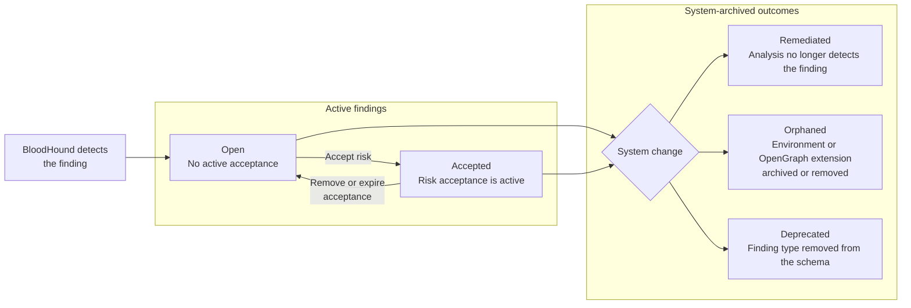

import EarlyAccessAccessNote from '/snippets/feature-flag-user-managed.mdx';

The **Findings Table** is an alternate view on the [Attack Paths](/analyze-data/findings/attack-paths) page. Use it to review many <Tooltip tip="A specific instance of an Attack Path that BloodHound Enterprise has identified as a high-value remediation point." cta="Learn more" href="/analyze-data/findings/attack-paths#findings">findings</Tooltip> at once, compare finding state across environments and zones, and triage high-volume result sets faster.

<Frame>
  
</Frame>

Each row in the table represents a single finding. The table displays the following columns:

| Column | Description |
| --- | --- |
| **Risk** | When [Findings Prioritization](#prioritize-findings) is enabled, displays the finding's rank. Rank **1** is the highest priority. The column uses severity-specific colors and replaces **Severity** in the table. |
| **Severity** | When Findings Prioritization is disabled, displays the severity of the finding:<ul><li>**Critical**</li><li>**High**</li><li>**Moderate**</li><li>**Low**</li></ul> Severity remains available as a filter when Findings Prioritization is enabled. |
| **Attack Path** | The name of the finding type that identifies the risk condition under review: an abusable relationship between principals for relationship-based findings, or a vulnerable configuration on a principal for list-based findings. |
| **Platform** | The platform associated with the finding, such as Active Directory, Azure, or OpenGraph extension-defined platform. |
| **Environment** | The environment associated with the finding, such as an Active Directory domain, Azure tenant, or OpenGraph extension-defined environment. |
| **Zone** | The privilege zone associated with the finding for relationship-based findings (or Hygiene for list-based findings) |
| **Source Principal** | The principal where the Attack Path originates. |
| **Target Principal** | The principal where the Attack Path ends. |
| **First Seen** | When BloodHound Enterprise first created the finding. |
| **Last Seen** | When BloodHound Enterprise last updated the finding. |
| **Status** | The current status of the finding:<ul><li>**Open**</li><li>**Accepted**</li><li>**Remediated**</li><li>**Deprecated**</li><li>**Orphaned**</li></ul> See [Finding status lifecycle](#finding-status-lifecycle) for definitions and the actions that move a finding between statuses. |

<Note>
  Some findings, typically called [list-based findings](/analyze-data/findings/attack-paths#list-based-finding), do not have a source principal.
</Note>

## Use cases

Use the **Findings Table** to focus an investigation on a set of findings:

- **Triage findings at scale:** Review a dense list of Attack Path findings and sort by Risk, date, status, or contextual columns. When Findings Prioritization is disabled, sort by severity instead.
- **Focus an investigation:** Filter by Attack Path, severity, platform, environment, zone, and status to move from a broad result set to a smaller set that matches your investigation goal.
- **Compare scope across environments or zones:** Select multiple environments or zones and review the matching findings together.
- **Review finding state and recency:** Use **Status**, **First Seen**, and **Last Seen** to understand whether findings are open, accepted, remediated, deprecated, or orphaned, and when BloodHound Enterprise last updated them.
- **Investigate or remediate a finding:** Select a finding to open it in **Explore** or review its remediation plan.
- **Preserve table context:** Use the page URL to return to or share the same view, filters, and sort order.

## Prerequisites

Before you can use the **Findings Table**, you must have the following:

- BloodHound Enterprise with the **Findings Table** Early Access feature enabled on the **Early Access Features** page.
- Access to the environments you want to analyze.

  <EarlyAccessAccessNote feature="Findings Table" />

  <Note>
    If [Environment Targeted Access Control (ETAC)](/manage-bloodhound/auth/environment-targeted-access-control) is enabled on your tenant, it can limit which findings and environments appear for your account. Two users can see different rows for the same filters depending on their access.
  </Note>

## Take action on a finding

Select a finding to open an action menu and continue your investigation or remediation workflow.

<Steps>
  <Step title="Select a finding">
    Click a row to highlight it and display the action menu at the bottom of the table.

    <Frame>
      
    </Frame>

    <Tip>
      To clear the selection, click the same row again or click outside the table.
    </Tip>
  </Step>

  <Step title="Choose an action">
    Select one of the following actions:

    - **Remediation Plan:** Opens the **Remediation** page filtered to the selected finding, environment, and privilege zone.
    - **Explore:** Opens the finding in **Explore**.
    
      - Relationship-based findings open in **Pathfinding** with the path between the source and target principals.
      - List-based findings open in **Search**.
    - **Copy:** Opens a submenu with **Copy Source** and **Copy Target** options to copy a principal's name to your clipboard.
  </Step>
</Steps>

## Filter findings

Use filters to narrow the result set:

| Filter | What it does |
| --- | --- |
| **Severity** | Select one or more severity levels: **Critical**, **High**, **Moderate**, and **Low**. |
| **Platform** | Search for and select one or more platforms to focus on findings from specific sources. |
| **Attack Paths** | Search for and select one or more Attack Path finding types. |
| **Environment** | Select one or more environments, such as an Active Directory domain, Azure tenant, or OpenGraph environment. |
| **Zone** | Select one or more privilege zones to focus on findings within those zones. |
| **Status** | Select one or more finding statuses: **Open**, **Accepted**, **Remediated**, **Deprecated**, and **Orphaned**. By default, the table shows **Open** and **Accepted** findings. |

The filters support multi-select. Selecting **All** for a filter removes that filter from the query. Clearing every value in a filter returns no rows until you select a value or return to **All**.

<Tip>
  Your filter and view selections are captured in the page URL. You can bookmark or share a link to return to the same table view.
</Tip>

## Sort findings

You can sort by each visible table column and resize column width. Sorting reorders the full result set for the current filters. For example:

- When Findings Prioritization is enabled, the table sorts by **Risk** by default, with the highest-priority findings first. The table uses zone and first-seen time as secondary sort fields.
- Sort by **First Seen** to distinguish newer findings from findings that have persisted across analysis runs.
- Sort by **Last Seen** to review the most recently updated findings for the current filters.

## Prioritize findings

**Findings Prioritization** helps you decide where to start when many findings compete for attention. It supplements severity with additional risk signals and provides a ranked starting queue for investigation and remediation.

<EarlyAccessAccessNote feature="Findings Prioritization" />

Use **Findings Prioritization** as guidance for triage and remediation. It does not replace severity or your organization's knowledge of business context, compensating controls, and remediation effort.

Once enabled, BloodHound Enterprise calculates a prioritization score for each finding during the next analysis run.

<Note>
  BloodHound Enterprise requests an analysis run when you enable the feature. Wait for analysis to complete before you use the new ranks.
</Note>

### How prioritization works

BloodHound Enterprise calculates a prioritization score during analysis, then converts that score into a ranked order using _competition ranking_.

Findings with the same score receive the same rank, and the next rank skips the positions occupied by the tie. For example, if two findings tie for second place, the ranks are 1, 2, 2, 4; not 1, 2, 2, 3.

A higher-ranked finding represents a stronger combination of:

- [Exposure](/analyze-data/findings/graph-view#exposure): The number of principals that can reach a privileged asset through one or more Attack Paths.

- [Impact](/analyze-data/findings/graph-view#impact): The number of principals that could be compromised through an Attack Path.

- **Starting objects:** The number of graph objects represented by the finding's target principal. A group, for example, can represent more starting objects than a single user or computer.

This approach helps distinguish findings that may have similar severity but differ in exposure, impact, and the number of starting objects.

The **Risk** column displays this rank. A lower number indicates a higher priority, so rank **1** appears first when the default sort is active. The rank is calculated across open and accepted findings, so filtering the table does not recalculate the rank for the remaining rows.

<Frame>
  
</Frame>

### Rank and operational context

A finding can rank above another finding with the same—or even higher—severity when its combined exposure, impact, and start-object breadth indicate a larger remediation opportunity.

Use the rank to create a starting queue, then apply operational context before you act, such as:

- Business importance of affected assets
- Existing compensating controls
- Ownership and change windows
- Remediation effort and potential disruption
- Current investigations or accepted risk

<Note>
  The color of the rank in the **Risk** column indicates the finding's severity. **Findings Prioritization** supplements severity; it does not redefine it.
</Note>

### When rank changes

BloodHound recalculates prioritization during analysis. The rank does not update dynamically between analysis runs.

A finding's rank can change after analysis when graph data, exposure, impact, starting objects, or the set of open and accepted findings changes. Review the latest analysis before using a rank to plan remediation.

<Note>
  If BloodHound has not calculated a rank for a finding, the **Risk** column displays `-`. For example, archived findings do not have a rank.
</Note>

## Finding status lifecycle

A finding moves through a lifecycle as BloodHound Enterprise detects it, as you act on it, and as your environment changes. The **Status** column reflects where a finding is in that lifecycle. The diagram separates active findings from system-archived outcomes.

### Status definitions

The following table describes the stored value and meaning of each finding status, and whether the status marks a finding as archived.

<Tip>
  Open findings use normal emphasis, while accepted and archived findings are dimmed so you can focus on findings that need attention without checking the **Status** column for every row.
</Tip>

| Status | Stored value | Meaning | Archived |
| --- | --- | --- | --- |
| **Open** | `active` | BloodHound currently detects the finding and no acceptance applies. This is the default state for a newly detected finding, and it needs attention. | No |
| **Accepted** | `accepted` | You accepted the finding as a known risk and the acceptance has not expired. Accepted findings remain in posture calculations. | No |
| **Remediated** | `remediated` | A later analysis run no longer detects the Attack Path, so BloodHound archived the finding. This reflects actual risk reduction. | Yes |
| **Orphaned** | `orphaned` | The environment or OpenGraph extension associated with the finding was archived or removed and is no longer collected, so BloodHound archived the finding. | Yes |
| **Deprecated** | `deprecated` | The finding type is no longer defined in the current schema, so BloodHound archived existing findings of that type. | Yes |

### User-driven transitions

You control the transition between **Open** and **Accepted**:

- **Open to Accepted:** Accept the finding and set an acceptance duration. BloodHound records an acceptance expiration for the finding. For steps, see [Risk Acceptance](/analyze-data/findings/risk-acceptance).
- **Accepted to Open:** Remove the acceptance manually, or wait for the acceptance period to expire. In both cases, the finding returns to **Open**.

### System-driven transitions

BloodHound sets the archived statuses automatically during analysis. You cannot set these statuses manually:

- **Remediated:** A subsequent analysis run no longer detects the Attack Path or vulnerable principal. Use this status to confirm that a risk was actually removed.
- **Orphaned:** The environment associated with the finding (such as an Active Directory domain or Azure tenant) is archived or removed and is no longer collected.
- **Deprecated:** The finding type is removed from (or deprecated in) the current schema, for example when an OpenGraph extension no longer defines it.

<Note>
  **Remediated**, **Orphaned**, and **Deprecated** are terminal, archived states. When BloodHound archives a finding, it records an archive time and updates the finding's last-updated time.

  **First Seen** reflects when the finding was first created, and **Last Seen** reflects the most recent update, including a status change. **Open** and **Accepted** findings are not archived and continue to count toward your posture.
</Note>
