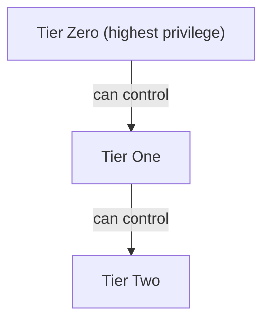
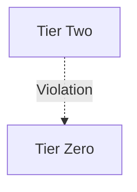

Privilege Zones help you organize objects in your environment into logical groups based on their privilege and risk levels. Using Privilege Zones, you can monitor and maintain the security posture of tiered isolation models.

## Key Concepts

Before diving into Privilege Zones, let's define some key concepts:

| Concept   | Description                                                                                                                                      | Used in Risk Analysis |
|-----------|--------------------------------------------------------------------------------------------------------------------------------------------------|----------------------|
| **Zone**  | A group of objects that represent the hierarchy of control across all domains in an environment based on access level                            | Yes                  |
| **Label** | A flexible way to categorize a group of objects in a single zone (or across multiple zones) for easier searching and filtering                   | No                   |
| **Selector** | A rule that associates objects with zones and labels based on object types, object relationships (expansion), or Cypher queries               | Yes                  |

Zones organize objects into a strict hierarchy. BloodHound analyzes how object privileges are assigned and where they can be escalated across your environment. If BloodHound detects an object in a lower-privileged zone controlling an object in a higher-privileged zone, it identifies it as a finding in the [Posture](/analyze-data/posture-page) page.

This analysis helps you identify and remediate privilege escalation paths and misconfigurations that violate your security model. For example:

### Expected control relationships

The following diagram illustrates allowed control relationships between zones (tiers):

### Violation relationships

The following diagram illustrates violation relationships that result in findings:

## Using Privilege Zones

Privilege Zones has two tabs: Tiers (Zones) and Labels. Zones allow the logical separation of objects into three unique hierarchical groups according to the structure of your environment. Labels are a flexible tool to categorically bucket different objects. Together, these tools enable further risk mitigation in your environments by highlighting the violations and misconfigurations to your customized network model.

Zones and Labels each offer two views: **Summary** and **Detail**. Use the view selector (drop-down) in the UI to toggle between them.
- **Summary** shows the zone/label name, selector count, object count, and, for Zones, their hierarchy (the top zone is most critical).
- **Detail** lists every selector and the objects that each selector pulls into the chosen zone or label.

Summary View:

Detail View:

