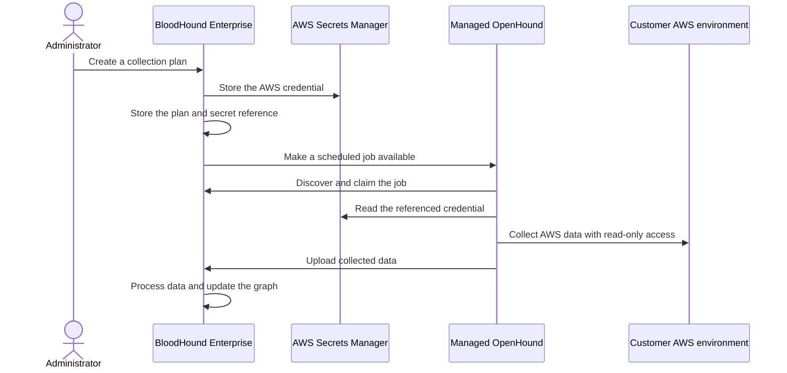

import ManagedCollectorsBetaNote from '/snippets/feature-beta.mdx';

<ManagedCollectorsBetaNote feature="Managed Collection"/>

**Managed Collection** is a cloud-hosted solution that lets you collect data without deploying or maintaining collector infrastructure in your environment. It reduces the time required to start a collection and the amount of daily validation and troubleshooting needed to keep it running.

You configure credentials, collection plans, and schedules in BloodHound Enterprise while SpecterOps operates the collector infrastructure.

<Note>
  Self-deployed collectors remain a fully supported option when you must operate collector infrastructure in your own environment. Managed collection is a cloud-hosted convenience, not a requirement for collecting a supported platform.

  See the [managed vs self-hosted collection](/collect-data/enterprise-collection/managed-collection/overview#managed-vs-self-hosted-collection) for more details.
</Note>

## Beta scope

The beta supports the following capabilities:

| Capability | Beta behavior |
| --- | --- |
| Collector | SpecterOps-managed OpenHound |
| Extension | AWS collection only |
| Authentication | AWS access key and secret access key (`auth_key`) |
| Collection plans | Multiple plans supported; each plan describes one AWS collection configuration |
| Schedule | One optional daily schedule per plan in the beta UI |
| Cross-account authentication | AWS role assumption through STS is not supported |

## Key concepts

Before diving into the workflow, it's important to understand the key concepts used in managed collection:

| Term | Definition |
| --- | --- |
| **Collector** | A piece of software designed to collect attack path data from your environment. Current collectors include SharpHound, AzureHound, and OpenHound. Managed Collection uses OpenHound.|
| **Managed collector** | A cloud-hosted collector service that SpecterOps deploys, operates, and maintains. |
| **Self-hosted collector** | A collector that you install, configure, deploy, operate, and maintain in your own infrastructure. SharpHound, AzureHound, and OpenHound can perform self-hosted collection. |
| **Collection plan** | A configuration that tells BloodHound Enterprise what to collect, which credential to use, and when to create collection jobs. You can use a plan to queue an on-demand job or create a schedule for daily automatic collection.  |
| **Job** | A unit of work for a collector to execute. A job defines what data should be collected and from where. |
| **On-demand collection** | A job execution mode in which a user manually queues a job instead of relying on a schedule. |
| **Schedule collection** (or schedule) | Defines when or how often a particular job should be queued. |

## Workflow

The following diagram shows the high-level managed collection workflow. BloodHound Enterprise stores credential references and job configuration separately from the credential material.

The collection plan is the reusable configuration. Each scheduled collection creates a job from the plan, so later edits affect future jobs rather than changing a job that is already in progress.

BloodHound Enterprise provides the profile, schedule, secret, queue, and job history. The collector does not run inside BloodHound Enterprise. The Managed Collection service claims and processes jobs, so collection results still depend on tenant enablement and managed-service availability.

{/*
<Note>
  Scheduler, ingest, and history-retention workers are still being completed. Publish operational timing or retention guarantees only after the target release is confirmed.
</Note>
*/}

## Collection credentials

Managed Collection uses an external secret store for AWS credentials. BloodHound Enterprise keeps a reference and an operator-visible key identifier, but does not return the secret value after it is saved. The Managed Collector service reads the credential when it needs to run a job.

Use an AWS principal with only the read permissions required for the resources you collect. Review [Configure AWS permissions](/openhound/collectors/aws/configure-permissions) before you create a plan.

## Managed vs self-hosted collection

The following table provides a comparison of managed versus self-hosted collection:

| Area | Managed collection | Self-hosted collection |
| --- | --- | --- |
| Deployment | SpecterOps deploys and operates the managed OpenHound service | You deploy and operate the collector in your environment |
| Maintenance | SpecterOps manages the collector runtime and upgrades | You manage the runtime, upgrades, and troubleshooting |
| Credentials | BloodHound Enterprise stores a reference to credentials held in the managed service's external secret store | You choose and operate the credential store for your collector |
| Network path | Collection traffic originates from the managed service | Collection traffic originates from your collector host |
| Best fit | You want collection without customer-managed infrastructure | Your network or governance policy requires customer-operated collection |

## Next steps

- [Configure a managed collection plan](/collect-data/enterprise-collection/managed-collection/configure)
- [Review managed collection security and compliance](/collect-data/enterprise-collection/managed-collection/security-and-compliance)
- [Troubleshoot managed collection](/collect-data/enterprise-collection/managed-collection/troubleshoot)
