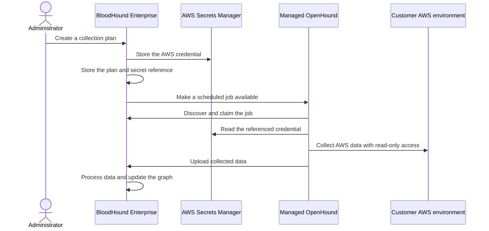

import ManagedCollectorsBetaNote from '/snippets/managed-collection-beta.mdx';

<ManagedCollectorsBetaNote />

**Managed Collection** is a cloud-hosted solution that lets you collect data without deploying or maintaining collector infrastructure in your environment. It reduces the time required to start a collection and the amount of daily validation and troubleshooting needed to keep it running.

You configure credentials, collection plans, and schedules in BloodHound Enterprise while SpecterOps operates the collector infrastructure.

<Note>
  Self-deployed collectors remain a fully supported option when you must operate collector infrastructure in your own environment. Use it instead of managed collection when your policy does not permit third-party custody of collection credentials. Managed collection is a cloud-hosted convenience, not a requirement for collecting a supported platform.
</Note>

## Understand the beta scope

The beta supports the following workflow:

| Capability | Beta behavior |
| --- | --- |
| Collector | SpecterOps-managed OpenHound |
| Runtime | Managed collection job processing is provided by the managed service; BHE does not run the collector locally |
| Extension | AWS collection only |
| Extension trust | SpecterOps-authored and approved extensions only |
| Authentication | AWS access key and secret access key (`auth_key`) |
| Collection plans | Multiple plans are supported by the collection-plan model; each plan describes one AWS collection configuration |
| Schedule | The create form supports one optional daily schedule per plan; the edit form preserves additional schedules linked through the underlying job API |
| Cross-account authentication | AWS role assumption through STS is not supported in the beta |
| Availability | Selected tenants with the `managed_openhound_collection` feature enabled |

Additional extensions, authentication methods, user-selectable schedule frequencies, cross-account role assumption, and user-managed feature access are not part of this beta.

## Learn the core concepts

A **collection plan** tells BloodHound Enterprise what to collect, which credential to use, and when to create collection jobs. When the beta is enabled for your tenant, you can use a plan to queue an on-demand job or create a schedule for automatic collection. A plan contains:

- A name and target service. The beta supports **AWS**.
- An AWS collection configuration and scope.
- A reference to the credential used for collection.
- An optional daily schedule.

The **managed OpenHound collector** is the service that SpecterOps deploys and operates for your tenant. You do not install or run the collector host. A **job** is a temporary unit of work created from a plan when you run it on demand or when its schedule is due.

## Follow the managed collection workflow

The following diagram shows the intended high-level flow. BloodHound Enterprise stores credential references and job configuration separately from the credential material.

The plan is the reusable configuration. Each scheduled execution creates a job from the plan, so later edits affect future jobs rather than changing a job that is already in progress.

The BHE implementation provides the profile, schedule, secret, queue, and history operations shown here. The collector does not run inside BHE; the managed service claims and processes jobs, so collection results still depend on tenant enablement and managed-service availability.

## Protect collection credentials

Managed Collection uses an external secret store for AWS credentials. BloodHound Enterprise keeps a reference and an operator-visible key identifier, but does not return the secret value after it is saved. The managed OpenHound collector reads the credential when it needs to run a job.

Use an AWS principal with only the read permissions required for the resources you collect. Review [Configure AWS permissions](/openhound/collectors/aws/configure-permissions) before you create a plan.

## Compare managed and self-deployed collection

| Area | Managed collection | Self-deployed collection |
| --- | --- | --- |
| Deployment | SpecterOps deploys and operates the managed OpenHound service | You deploy and operate the collector in your environment |
| Maintenance | SpecterOps manages the collector runtime and upgrades | You manage the runtime, upgrades, and troubleshooting |
| Credentials | BloodHound Enterprise stores a reference to credentials held in the managed service's external secret store | You choose and operate the credential store for your collector |
| Network path | Collection traffic originates from the managed service | Collection traffic originates from your collector host |
| Best fit | You want collection without customer-managed infrastructure | Your network or governance policy requires customer-operated collection |

Both paths remain supported. Choose the path that meets your network, governance, and credential-custody requirements.

## Next steps

- [Configure a managed collection plan](/collect-data/enterprise-collection/managed-collection/configure)
- [Review managed collection security and compliance](/collect-data/enterprise-collection/managed-collection/security-and-compliance)
- [Troubleshoot managed collection](/collect-data/enterprise-collection/managed-collection/troubleshoot)
