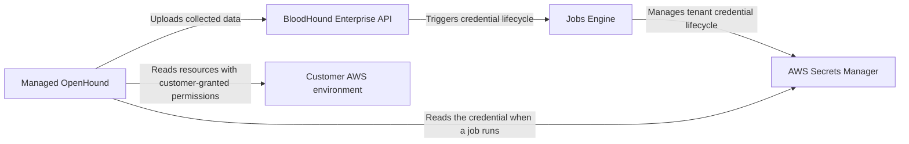

import ManagedCollectorsBetaNote from '/snippets/feature-beta.mdx';

<ManagedCollectorsBetaNote />

Managed Collection reduces the infrastructure you operate for AWS data collection, but your organization remains responsible for choosing the AWS scope, granting collection permissions, and protecting the credential you provide. This page describes the beta credential and data-handling model. The BHE UI submits the plan and its related records, while the managed service processes collection jobs outside the BHE UI.

## Understand the security model

The accepted Managed OpenHound design assigns separate responsibilities to BloodHound Enterprise, its Jobs Engine, the managed OpenHound collector, AWS Secrets Manager, and your AWS environment:

The managed OpenHound collector uses the AWS credential to read the configured AWS scope. The AWS collector is read-only and does not modify your AWS organization or account.

## Protect AWS credentials

The beta accepts one AWS access key pair for each collection plan:

- **Access Key ID** identifies the AWS credential.
- **Secret Access Key** authenticates the credential.

When you create a plan, the Jobs Engine sends the secret value to AWS Secrets Manager and stores a reference to it. The collector jobs database stores reference metadata, not the secret value. BloodHound Enterprise does not read the secret value back, and the edit form shows only the saved key identifier. The managed OpenHound collector reads the configured secret directly from AWS Secrets Manager when it performs collection.

The Jobs Engine writes and deletes customer secrets when those lifecycle operations are invoked. The managed OpenHound collector has read-only access to the secret. The design does not provide an in-place credential edit operation during the beta.

The **Configuration** field is for non-secret collection settings. Do not paste an AWS secret access key, BHE token, or other credential material into the JSON configuration. Use the separate **Authentication** section for the AWS access key pair.

<Warning>
  Treat the secret access key as a long-lived credential. Do not reuse it for unrelated workloads, commit it to source control, or include it in screenshots, logs, or support requests.
</Warning>

## Rotate or revoke a credential

The beta does not support editing a saved credential in place. To rotate a credential:

1. Create a new collection plan with the replacement AWS access key pair.
2. Confirm that the new plan can collect from the intended scope.
3. Disable or delete the old AWS access key in AWS according to your organization's credential policy.
4. Follow the SpecterOps-provided process for deleting the old secret reference.

Deleting the old plan removes its profile and schedule links; it does not automatically delete the secret reference or revoke the AWS key. Secret deletion is a separate operation that detaches referencing profiles. A job that BloodHound Enterprise already created keeps its captured key reference, but it can fail if the underlying AWS key is revoked.

## Apply least privilege in AWS

Create a dedicated collection principal and grant only the read-only permissions required by the AWS scope. For organization-wide collection, configure the management account and member-account roles described in [Configure AWS permissions](/openhound/collectors/aws/configure-permissions).

Review the scope whenever you change the AWS policy. A policy that is too narrow can produce failed or incomplete collection; a policy that is broader than necessary increases the impact of a compromised credential.

## Understand extension scope

The AWS extension is the first Managed OpenHound target. The architecture is designed for additional extensions, but the beta scope is limited to the AWS extension. Contact your SpecterOps account team for the current extension and capability details.

## Allow managed collection traffic

The related security ADRs do not define a published managed-collection egress range. If your AWS or network controls require source allowlisting, request the current managed-service network requirements and change-notification process from your SpecterOps account team. Do not infer the range from a self-deployed collector's address.

## Understand logs and diagnostics

BloodHound Enterprise displays basic collection errors and plan results. The accepted security design requires endpoint-level audit logging for secret creation and deletion. The related ADRs do not define customer-visible diagnostic retention or the complete managed-service log-access model; contact your SpecterOps account team for current support procedures.

## Protect collected data

Managed OpenHound uploads collected data to your BloodHound Enterprise tenant for processing and graph analysis. BloodHound Enterprise's normal data retention and deletion controls apply to the ingested graph data; review [Data reconciliation and retention](/collect-data/enterprise-collection/data-retention) for those controls.

Managed collection job history is separate from graph data and contains job metadata and outcome details, not the AWS secret value. The collector-job design treats outcome history as immutable and retains it for 90 days in phase 1. The retention period is not customer-configurable.

## Understand tenant isolation

Managed collection credentials use tenant-scoped secret paths and IAM resource keys. Each secret path is prefixed with the owning tenant's codename. This design separates responsibilities: BloodHound Enterprise and the Jobs Engine manage the credential lifecycle, while the collector reads the credential to perform collection. The security ADR identifies zero cross-tenant secret access and removal of orphaned secrets as operational success outcomes.

## Meet your responsibilities

Your organization is responsible for:

- Granting read-only AWS permissions that match the collection scope.
- Protecting and rotating the AWS access key pair according to your credential policy.
- Deleting unused collection plans and disabling unused AWS keys.
- Reviewing collection scope and results for unexpected access or missing resources.
- Sending only non-secret diagnostic information through approved support channels.

## Request security-review materials

Contact your SpecterOps account team for current security-review materials before completing an IT governance or risk assessment. The related ADRs define the credential-handling and tenant-isolation design, but they do not define a static export, penetration-test summary, egress packet, or subprocessor terms. Availability and contents of these artifacts can change during the beta.

## Next steps

- [Configure a managed collection plan](/collect-data/enterprise-collection/managed-collection/configure)
- [Troubleshoot managed collection](/collect-data/enterprise-collection/managed-collection/troubleshoot)
