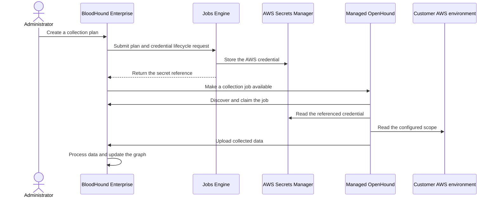

import ManagedCollectorsBetaNote from '/snippets/feature-beta.mdx';

<ManagedCollectorsBetaNote />

Managed Collection reduces the infrastructure you operate for AWS data collection, but your organization remains responsible for choosing the AWS scope, granting collection permissions, and protecting the credential you provide.

This page describes the beta credential and data-handling model. BloodHound Enterprise submits the collection plan and its related records, while the managed service processes collection jobs outside of BloodHound Enterprise.

## Understand the security model

The following sequence shows how BloodHound Enterprise, the jobs engine, the managed OpenHound collector, AWS Secrets Manager, and your AWS environment interact during collection:

<Note>
  The managed OpenHound collector uses the AWS credential to read the configured AWS scope. The collector is read-only and does not modify your AWS organization or account.
</Note>

## Protect AWS credentials

Managed Collection accepts one AWS access key pair for each collection plan:

- **Access Key ID** identifies the AWS credential
- **Secret Access Key** authenticates the credential

When you create a collection plan successfully, the jobs engine sends the secret value to AWS Secrets Manager and stores a reference to it. The collector jobs database stores reference metadata, not the secret value.

BloodHound Enterprise does not read the secret value back, and the edit form shows only the saved key identifier. The managed OpenHound collector reads the configured secret directly from AWS Secrets Manager when it performs collection.

The jobs engine is responsible for customer-secret lifecycle operations. The managed OpenHound collector has read-only access to the secret. The Managed Collection user interface in BloodHound Enterprise does not provide an in-place credential edit operation. Contact SpecterOps support to delete a secret.

{/* TODO:Customer-facing secret deletion and lifecycle cleanup are still in progress. Confirm the target release before publishing self-service deletion steps. */}

The **Configuration** field is for non-secret collection settings. Do not paste an AWS secret access key, BloodHound Enterprise token, or other credential material into the JSON configuration. Use the separate **Authentication** section for the AWS access key pair.

<Warning>
  Treat the secret access key as a long-lived credential. Do not reuse it for unrelated workloads, commit it to source control, or include it in screenshots, logs, or support requests.
</Warning>

## Rotate or revoke a credential

To rotate a credential, follow [Replace a credential](/collect-data/enterprise-collection/managed-collection/configure#replace-a-credential). That procedure covers creating and validating a replacement plan, revoking the old AWS key, and removing the old secret reference through the supported process.

Deleting the old plan removes its profile and schedule links; it does not automatically delete the secret reference or revoke the AWS key. Secret deletion is a separate operation that detaches referencing profiles. A job that BloodHound Enterprise already created keeps its captured key reference, but it can fail if the underlying AWS key is revoked.

## Apply least privilege in AWS

Create a dedicated collection principal and grant only the read-only permissions required by the AWS scope. For organization-wide collection, configure the management account and member-account roles described in [Configure AWS permissions](/openhound/collectors/aws/configure-permissions).

Review the scope whenever you change the AWS policy. A policy that is too narrow can produce failed or incomplete collection; a policy that is broader than necessary increases the impact of a compromised credential.

## Understand extension scope

The AWS extension is the first Managed Collection target. The architecture is designed for additional extensions, but the beta scope is limited to the AWS extension. Contact your SpecterOps account team for the current extension and capability details.

## Allow Managed Collection traffic

If your AWS or network controls require source allowlisting, request the current managed-service network requirements and change-notification process from your SpecterOps account team. Do not infer the range from a self-deployed collector's address.

{/* TODO: Document the managed-collection egress IP range and allowlisting requirements when available. */}

## Understand logs and diagnostics

BloodHound Enterprise displays basic collection errors and plan results. Secret creation and deletion are logged for operational auditing.

Diagnostic retention and access to managed-service logs vary by support arrangement. Contact your SpecterOps account team for current support procedures.

## Protect collected data

Managed Collection uploads collected data to your BloodHound Enterprise tenant for processing and graph analysis. BloodHound Enterprise's normal data retention and deletion controls apply to the ingested graph data. Review [Data reconciliation and retention](/collect-data/enterprise-collection/data-retention) for those controls.

Managed Collection job history is separate from graph data and contains job metadata and outcome details, not the AWS secret value. Job history is immutable and retained for 90 days. This retention period is not configurable.

## Understand tenant isolation

Managed Collection credentials use tenant-scoped secret storage and Identity and Access Management (IAM) controls according to the deployment configuration.

BloodHound Enterprise and the jobs engine manage the credential lifecycle, while the collector reads the credential to perform collection. The security design targets zero cross-tenant secret access and removal of orphaned secrets as operational outcomes.

## Customer responsibilities

Your organization is responsible for:

- Granting read-only AWS permissions that match the collection scope.
- Protecting and rotating the AWS access key pair according to your credential policy.
- Deleting unused collection plans and disabling unused AWS keys.
- Reviewing collection scope and results for unexpected access or missing resources.
- Sending only non-secret diagnostic information through approved support channels.

## Request security-review materials

Contact your SpecterOps account team for current security-review materials before completing an IT governance or risk assessment.

Available materials may include security architecture details, penetration-test summaries, egress requirements, and subprocessor information. The availability and contents of these materials can change during the beta.

## Next steps

- [Configure a collection plan](/collect-data/enterprise-collection/managed-collection/configure)
- [Troubleshoot Managed Collection](/collect-data/enterprise-collection/managed-collection/troubleshoot)
