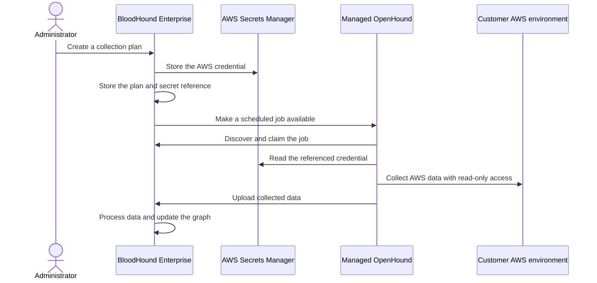

import ManagedCollectorsBetaNote from '/snippets/managed-collectors-beta.mdx';

<ManagedCollectorsBetaNote />

Managed Collectors lets BloodHound Enterprise run an OpenHound collector for you. You configure an AWS collection plan in BloodHound Enterprise, and SpecterOps operates the managed collector that reads your AWS environment and uploads the results for analysis.

Managed collection is a convenience layer. It does not replace [self-deployed OpenHound collection](/openhound/collectors/aws/overview) when you need to operate the collector in your own environment.

## Understand the beta scope

The beta supports the following workflow:

| Capability | Beta behavior |
| --- | --- |
| Collector | SpecterOps-managed OpenHound |
| Extension | AWS collection only |
| Authentication | AWS access key and secret access key (`auth_key`) |
| Collection plans | Multiple plans are supported; each plan describes one AWS collection configuration |
| Schedule | One daily schedule per collection plan |
| Availability | Selected tenants with the `managed_openhound_collection` feature enabled |

Additional extensions, authentication methods, schedule frequencies, and user-managed feature access are not part of this beta.

## Learn the core concepts

A **collection plan** tells BloodHound Enterprise what to collect, which credential to use, and when to create collection jobs. A plan contains:

- A name and target service. The beta supports **AWS**.
- An AWS collection configuration and scope.
- A reference to the credential used for collection.
- An optional daily schedule.

A **managed collector** is the OpenHound service that SpecterOps deploys and operates for your tenant. You do not install or run the collector host. A **job** is a temporary unit of work created from a plan when the plan's schedule is due.

## Follow the managed collection workflow

The following diagram shows the high-level flow. BloodHound Enterprise stores credential references and job configuration separately from the credential material.

The plan is the reusable configuration. Each scheduled execution creates a job from the plan, so later edits affect future jobs rather than changing a job that is already in progress.

## Protect collection credentials

Managed Collectors uses an external secret store for AWS credentials. BloodHound Enterprise keeps a reference and an operator-visible key identifier, but does not return the secret value after it is saved. The managed OpenHound collector reads the credential when it needs to run a job.

Use an AWS principal with only the read permissions required for the resources you collect. Review [Configure AWS permissions](/openhound/collectors/aws/configure-permissions) before you create a plan.

## Next steps

- [Configure a managed collection plan](/collect-data/enterprise-collection/managed-collectors/configure)
- [Review managed collection security and compliance](/collect-data/enterprise-collection/managed-collectors/security-and-compliance)
- [Troubleshoot managed collection](/collect-data/enterprise-collection/managed-collectors/troubleshoot)
