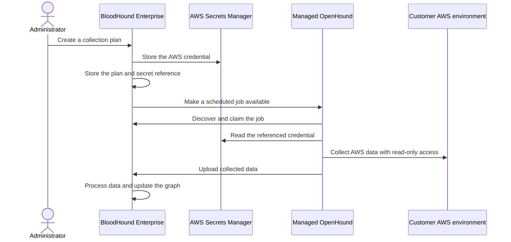

import ManagedCollectorsBetaNote from '/snippets/managed-collectors-beta.mdx';

<ManagedCollectorsBetaNote />

Managed Collectors is a planned BloodHound Enterprise workflow for running an OpenHound collector for you. You configure an AWS collection plan in BloodHound Enterprise, and SpecterOps operates the managed collector that reads your AWS environment and uploads the results for analysis.

The current beta build includes the Managed Collection navigation and early collection-plan UI, but collection-plan save and managed collector job processing are still being implemented. Keep this page hidden until your tenant has the complete workflow enabled.

Managed collection is a convenience layer. It does not replace [self-deployed OpenHound collection](/openhound/collectors/aws/overview) when you need to operate the collector in your own environment.

## Why use Managed Collectors

When available, Managed Collectors removes the customer-side collector infrastructure step. You do not deploy a container, maintain its host, or plan collector upgrades. Instead, you manage collection plans and schedules in BloodHound Enterprise and review the resulting collection activity in one place.

This model is intended to reduce the time required to start a collection and the amount of daily validation and troubleshooting required to keep it running.

Self-deployed collection remains a fully supported first-class option. Use it when your environment does not permit outbound-initiated connections, such as FedStart or FedRAMP environments, or when your policy does not permit third-party custody of collection credentials. Managed collection is a cloud-hosted convenience, not a requirement for collecting a supported platform. Feature parity between the two paths is not a goal, but the collected data should represent the same platform resources.

## Understand the beta scope

The beta supports the following workflow:

| Capability | Beta behavior |
| --- | --- |
| Collector | SpecterOps-managed OpenHound |
| Runtime | Managed collector job processing is provided by the managed service; processing is not available in the current BHE build |
| Extension | AWS collection only |
| Extension trust | SpecterOps-authored and approved extensions only |
| Authentication | AWS access key and secret access key (`auth_key`) |
| Collection plans | Multiple plans are supported by the collection-plan model; each plan describes one AWS collection configuration |
| Schedule | The beta form supports one daily schedule per plan; the underlying job API supports multiple schedules linked to a plan |
| Cross-account authentication | AWS role assumption through STS is not supported in the beta |
| Availability | Selected tenants with the `managed_openhound_collection` feature enabled |

Additional extensions, authentication methods, schedule frequencies, cross-account role assumption, and user-managed feature access are not part of this beta.

## Learn the core concepts

A **collection plan** tells BloodHound Enterprise what to collect, which credential to use, and when to create collection jobs. When the workflow is available, you can use a plan to queue an on-demand job or create a schedule for automatic collection. A plan contains:

- A name and target service. The beta supports **AWS**.
- An AWS collection configuration and scope.
- A reference to the credential used for collection.
- An optional daily schedule.

A **managed collector** is the OpenHound service that SpecterOps deploys and operates for your tenant. You do not install or run the collector host. A **job** is a temporary unit of work created from a plan when you run it on demand or when its schedule is due.

## Follow the managed collection workflow

The following diagram shows the intended high-level flow. BloodHound Enterprise stores credential references and job configuration separately from the credential material.

The plan is the reusable configuration. Each scheduled execution creates a job from the plan, so later edits affect future jobs rather than changing a job that is already in progress.

The current BHE implementation does not yet provide the complete profile, schedule, secret, queue, or history workflow shown here.

## Protect collection credentials

Managed Collectors uses an external secret store for AWS credentials. BloodHound Enterprise keeps a reference and an operator-visible key identifier, but does not return the secret value after it is saved. The managed OpenHound collector reads the credential when it needs to run a job.

Use an AWS principal with only the read permissions required for the resources you collect. Review [Configure AWS permissions](/openhound/collectors/aws/configure-permissions) before you create a plan.

## Compare managed and self-deployed collection

| Area | Managed collection | Self-deployed collection |
| --- | --- | --- |
| Deployment | SpecterOps deploys and operates the managed OpenHound service | You deploy and operate the collector in your environment |
| Maintenance | SpecterOps manages the collector runtime and upgrades | You manage the runtime, upgrades, and troubleshooting |
| Credentials | BloodHound Enterprise stores a reference to credentials held in the managed service's external secret store | You choose and operate the credential store for your collector |
| Network path | Collection traffic originates from the managed service | Collection traffic originates from your collector host |
| Best fit | You want collection without customer-managed infrastructure | Your network or governance policy requires customer-operated collection |

Both paths remain supported. Choose the path that meets your network, governance, and credential-custody requirements.

## Next steps

- [Configure a managed collection plan](/collect-data/enterprise-collection/managed-collectors/configure)
- [Review managed collection security and compliance](/collect-data/enterprise-collection/managed-collectors/security-and-compliance)
- [Troubleshoot managed collection](/collect-data/enterprise-collection/managed-collectors/troubleshoot)
