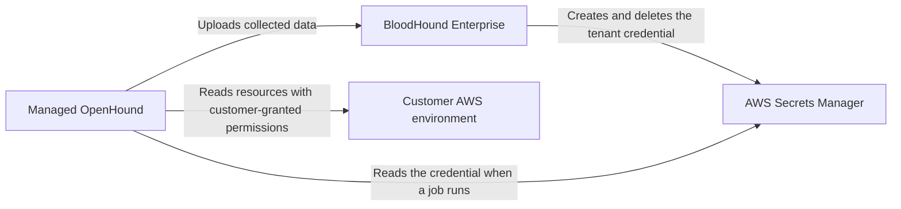

import ManagedCollectorsBetaNote from '/snippets/managed-collectors-beta.mdx';

<ManagedCollectorsBetaNote />

Managed Collectors reduces the infrastructure you operate for AWS data collection, but your organization remains responsible for choosing the AWS scope, granting collection permissions, and protecting the credential you provide. This page describes the beta credential and data-handling model.

## Understand the security model

Managed Collectors uses separate responsibilities for BloodHound Enterprise, the managed OpenHound collector, AWS Secrets Manager, and your AWS environment:

The managed collector uses the AWS credential to read the configured AWS scope. The AWS collector is read-only and does not modify your AWS organization or account.

## Protect AWS credentials

The beta accepts one AWS access key pair for each collection plan:

- **Access Key ID** identifies the AWS credential.
- **Secret Access Key** authenticates the credential.

When you create a plan, BloodHound Enterprise sends the secret value to AWS Secrets Manager and stores a reference to it. The collector jobs database stores the reference metadata, not the secret value. The API does not return the secret value, and the edit form shows only the saved key identifier.

<Warning>
  Treat the secret access key as a long-lived credential. Do not reuse it for unrelated workloads, commit it to source control, or include it in screenshots, logs, or support requests.
</Warning>

## Rotate or revoke a credential

The beta does not support editing a saved credential in place. To rotate a credential:

1. Create a new collection plan with the replacement AWS access key pair.
2. Confirm that the new plan can collect from the intended scope.
3. Delete the old collection plan.
4. Disable or delete the old AWS access key in AWS according to your organization's credential policy.

Deleting the old plan prevents future scheduled jobs from using it. A job that BloodHound Enterprise already created uses its captured configuration and may finish independently.

## Apply least privilege in AWS

Create a dedicated collection principal and grant only the read-only permissions required by the AWS scope. For organization-wide collection, configure the management account and member-account roles described in [Configure AWS permissions](/openhound/collectors/aws/configure-permissions).

Review the scope whenever you change the AWS policy. A policy that is too narrow can produce failed or incomplete collection; a policy that is broader than necessary increases the impact of a compromised credential.

## Protect collected data

Managed OpenHound uploads collected data to your BloodHound Enterprise tenant for processing and graph analysis. BloodHound Enterprise's normal data retention and deletion controls apply to the ingested graph data; review [Data reconciliation and retention](/collect-data/enterprise-collection/data-retention) for those controls.

Managed collector job history is separate from graph data. It contains job metadata and outcome details, not the AWS secret value. Retention and deletion behavior for beta job history can change as the service matures.

## Understand tenant isolation

Managed collector credentials are designed to be scoped to the tenant that owns the collection plan. The managed service uses tenant-scoped secret paths and access controls to isolate credential material. BloodHound Enterprise and the managed collector use different access responsibilities: BloodHound Enterprise manages the credential lifecycle, while the collector reads the credential to perform collection. Contact your SpecterOps account team for the current beta security controls.

## Meet your responsibilities

Your organization is responsible for:

- Granting read-only AWS permissions that match the collection scope.
- Protecting and rotating the AWS access key pair according to your credential policy.
- Deleting unused collection plans and disabling unused AWS keys.
- Reviewing collection scope and results for unexpected access or missing resources.
- Sending only non-secret diagnostic information through approved support channels.

Contact your SpecterOps account team for security-review materials or beta-specific compliance documentation.

## Next steps

- [Configure a managed collection plan](/collect-data/enterprise-collection/managed-collectors/configure)
- [Troubleshoot managed collection](/collect-data/enterprise-collection/managed-collectors/troubleshoot)
