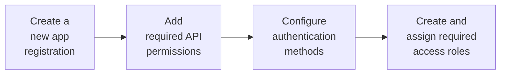

import ManagedIdentityRecommendation from '/snippets/hounds/managed-id-recommendation.mdx';
import EntraIdPermissions from '/snippets/hounds/azurehound-entra-id-permissions.mdx';


Creating a Microsoft Entra ID application registration is a prerequisite for AzureHound Enterprise data collection and involves the following steps:



Some steps are required before you can complete the [AzureHound configuration](/install-data-collector/install-azurehound/create-configuration). At minimum, you must create the application registration because AzureHound requires an Entra ID **Directory (tenant) ID** and **Application (client) ID**.

## Create a new app registration

This section guides you through the minimum steps to create a new application registration in Microsoft Entra ID for AzureHound Enterprise data collection.

<Note>See the Microsoft [documentation](https://learn.microsoft.com/en-us/entra/identity-platform/quickstart-register-app) for more information.</Note>

<Steps>
  <Step title="Navigate to Entra ID">

    Log into the [Microsoft Entra admin center](https://entra.microsoft.com/) as a user with the [Global Administrator] role, or the following less privileged roles:

    - [Privileged Role Administrator] AND
    - [Application Administrator] OR [Cloud Application Administrator]

      {/* Link definitions */}
      [Global Administrator]: https://learn.microsoft.com/en-us/entra/identity/role-based-access-control/permissions-reference#global-administrator
      [Privileged Role Administrator]: https://learn.microsoft.com/en-us/entra/identity/role-based-access-control/permissions-reference#privileged-role-administrator
      [Cloud Application Administrator]: https://learn.microsoft.com/en-us/entra/identity/role-based-access-control/permissions-reference#cloud-application-administrator
      [Application Administrator]: https://learn.microsoft.com/en-us/entra/identity/role-based-access-control/permissions-reference#application-administrator
 
  </Step>

  <Step title="Create a new app registration">
    
    1. In the left menu, click **Entra ID** > **App registrations** > **New registration**.

    1. In the **Name** field, enter a name for the application to identify it in your organization.

        Make sure the supported account type is set to the **Accounts in this organizational directory only (Single tenant)** option. A URI is not required.

        <Frame>
          
        </Frame>

    1. Click **Register** to create the application registration.

  </Step>

  <Step title="Retrieve details for AzureHound configuration">

    In the **Overview** menu, copy the **Application (client) ID** and **Directory (tenant) ID**.

    <Note>You will need this information later to configure [AzureHound Enterprise](/install-data-collector/install-azurehound/create-configuration).</Note>

      <Frame>
        
      </Frame>

  </Step>

</Steps>

## Add required API permissions

This section describes how to configure the required Microsoft Graph API permissions for the AzureHound Enterprise application registration.

<Note>See the [Microsoft documentation](https://learn.microsoft.com/en-us/entra/identity-platform/quickstart-configure-app-access-web-apis#add-permissions-to-access-microsoft-graph) for more information.</Note>

<Steps>
  <Step title="Navigate to API permissions">

    On the **Overview** page of the app registration, click **API Permissions**.

  </Step>

  <Step title="Remove default permission">

    Remove the default **User.Read** delegated permission. It is not required for AzureHound Enterprise data collection.

      <Frame>
        
      </Frame>

  </Step>

  <Step title="Add Microsoft Graph API permissions">

    1. Click **Add a permission** > **Microsoft Graph**.

    1. Select **Application permissions**.

        <Frame>
          
        </Frame>

    1. Search for and check the box next to each of the following Microsoft Graph **application** permissions. See [AzureHound Data and Permissions: Entra ID](/collect-data/azurehound-data-permissions#entra-id) for details on the least-privilege approach:

        <EntraIdPermissions />

    1. Click **Add permissions**.

  </Step>

  <Step title="Grant admin consent">

    After adding the required permissions, you must grant admin consent for the application to use them.

    1. Click **Grant admin consent for &lt;your\_tenant\_name&gt;**.

        <Frame>
          
        </Frame>

    1. Click **Yes** in the confirmation dialog.

    1. After being redirected to API Permissions again, you should see both permissions as **Granted**.

         <Frame>
          
        </Frame>

  </Step>

</Steps>

## Configure authentication

This section describes how to configure authentication methods for the AzureHound Enterprise application registration. AzureHound Enterprise supports the following authentication methods:

- Azure Managed Identity (<Badge color="green">recommended</Badge>)
- Certificate
- Client Secret
- Username and Password

<Note>This section provides instructions for configuring the **Azure Managed Identity** and **Certificate** authentication methods. For information on other methods, see the Microsoft [documentation](https://learn.microsoft.com/en-us/entra/identity-platform/how-to-add-credentials).</Note>

### Managed identity (<Badge color="green">recommended</Badge>)

Managed identities provide the most secure authentication method because they remove the need to manage credentials directly.

<ManagedIdentityRecommendation />

For this setup, create a user-assigned managed identity in Azure, assign it to the Azure resource where you plan to run AzureHound Enterprise, and configure the app registration to trust that identity.

<Note>To complete [AzureHound configuration](/install-data-collector/install-azurehound/create-configuration), you will need the user-assigned managed identity **Client ID**. AzureHound Enterprise must run on the Azure resource where that identity is assigned.</Note>

<Steps>
  <Step title="Navigate to Azure Managed Identities">

    Sign in to the [Azure portal](https://portal.azure.com/) and search for **Managed Identities** in the top search bar.

  </Step>
  <Step title="Create a user-assigned managed identity">

    Click **Create** and enter the required information to create a new user-assigned managed identity.

    <Note>See the Microsoft [documentation](https://learn.microsoft.com/en-us/entra/identity/managed-identities-azure-resources/manage-user-assigned-managed-identities-azure-portal) for more information.</Note>

  </Step>
  <Step title="Assign the managed identity to the AzureHound Enterprise host">

    Assign the user-assigned managed identity to the Azure resource where you plan to run AzureHound Enterprise, such as a virtual machine or app service.

    <Note>Azure Managed Identity authentication only works when AzureHound Enterprise runs on an Azure resource that has access to the managed identity. See the Microsoft [documentation](https://learn.microsoft.com/en-us/entra/identity/managed-identities-azure-resources/managed-identities-status) for more information.</Note>

  </Step>
  <Step title="Configure the app registration to trust the managed identity">

    1. Sign in to the [Microsoft Entra admin center](https://entra.microsoft.com/) and navigate to the previously created AzureHound Enterprise application registration.

    1. In the left menu, click **Certificates & secrets** > **Federated credentials** > **Add credential**.

    1. From the **Federated credential scenario** dropdown menu, select **Managed Identity**.

    1. Select the user-assigned managed identity that you created for AzureHound Enterprise.

    1. Review the default values and complete any remaining required fields.

        <Note>See the Microsoft [documentation](https://learn.microsoft.com/en-us/entra/workload-id/workload-identity-federation-config-app-trust-managed-identity) for more information.</Note>
    
    1. Click **Add**.

  </Step>
</Steps>

### Certificate

Certificates provide stronger authentication than client secrets or username and password combinations, but you must manage and rotate them properly.

For this setup, you must also upload the certificate to the app registration if you're using the AzureHound Enterprise CLI tool to create the certificate.

<Note>If you have not already created a certificate, see [Create an AzureHound Configuration](/install-data-collector/install-azurehound/create-configuration) before proceeding.</Note>

<Steps>
  <Step title="Navigate to Entra ID Certificates & secrets">

  1. On the **Overview** page of the app registration, click **Certificates & secrets**.

      <Frame>
        
      </Frame>

  1. Click **Certificates**.

      <Frame>
        
      </Frame>

  </Step>
  <Step title="Upload certificate">

  1.  Click **Upload certificate**.

       <Frame>
        
       </Frame>
  
  1. Locate the `cert.pem` file that you created during [AzureHound configuration](/install-data-collector/install-azurehound/create-configuration).

  1. Click the folder icon, select the `cert.pem` file, and add a description (optional).

      <Frame>
        
      </Frame>

  1. Click **Add**.
  </Step>
</Steps>

## Configure application branding

Optionally, add branding to help users identify the AzureHound Enterprise application in the Entra ID admin center. These steps do not affect collector functionality.

<Steps>
  <Step title="Download application logo">

    You can download the [AzureHound Enterprise icon](/assets/icons/entra-bhe-app-icon.png) from this site to use for the application logo in the Entra ID admin center.

  </Step>
  <Step title="Open the Branding & properties section">

    In the Entra ID admin center, navigate to the AzureHound Enterprise application and open the **Branding & properties** section.

    <Frame>
      
    </Frame>

  </Step>
  <Step title="Upload the application logo">

    Click **Select a file** and browse to the icon file you downloaded.

    <Frame>
      
    </Frame>

  </Step>
  <Step title="Set the application name and home page URL">

    1. In the **Name** field, enter a human-readable name for the application, for example, **BloodHound Enterprise Collector (AzureHound)**.

    1. In the **Home page URL** field, enter your BloodHound Enterprise tenant URL. This is for record keeping only.

  </Step>
  <Step title="Save the branding settings">

    Click **Save** and review the results.

    <Frame>
      
    </Frame>

  </Step>
</Steps>

## Create and assign required access roles

This section describes how to assign the required access roles to the AzureHound Enterprise application registration for data collection.

The AzureHound Reader role is a least-privilege custom role that grants AzureHound the minimum permissions required to collect data from Azure Resource Manager. Assigning this role at the Tenant Root Group scope ensures AzureHound can collect data across all current and future subscriptions in the tenant.

<Note>
  If you don't have any management groups, you can skip this section. However, AzureHound will log a warning during each collection indicating it cannot collect management group data.

  Alternatively, you can create your Tenant Root Group by following the prompts in the Azure portal. This ensures visibility if another administrator begins using subscriptions in the future.
</Note>

<Steps>
  <Step title="Navigate to the Tenant Root Group">

    1. Log into the [Azure portal](https://portal.azure.com/) as a user with the [User Access Administrator](https://learn.microsoft.com/en-us/azure/role-based-access-control/built-in-roles/privileged#user-access-administrator) role.

    1. Search for and select the **Management groups** item in the top search bar.

        <Frame>
          
        </Frame>

    1. Select **Tenant Root Group**.

        <Frame>
          
        </Frame>

  </Step>
  <Step title="Create the AzureHound Reader custom role">

    1. Select **Access control (IAM)**.

        <Frame>
          
        </Frame>

    1. Click **Add**, then **Add custom role**.

        <Frame>
          
        </Frame>

    1. Download <a href="/assets/azurehound-reader-role.json" download>azurehound-reader-role.json</a>, open it in a text editor, and replace `<tenantRootGroupId>` with your [Tenant Root Management Group ID](https://learn.microsoft.com/en-us/azure/governance/management-groups/overview#root-management-group-for-each-directory) (this is your Entra ID tenant ID).

        <Frame>
          
        </Frame>

    1. In **Basics** > **File**, upload the edited file and click **Review + create**.

        <Frame>
          
        </Frame>

        <Info>See [AzureHound Data Collection and Permissions: Azure Resource Manager](/collect-data/azurehound-data-permissions#azure-resource-manager) for details on each least-privilege permission in the AzureHound Reader role.</Info>

    1. Review the role and click **Create** at the bottom of the page.

        <Frame>
          
        </Frame>

  </Step>
  <Step title="Assign the AzureHound Reader role">

    1. Back in **Access control (IAM)**, click **Add**, then **Add role assignment**.

        <Frame>
          
        </Frame>

    1. Search for the **AzureHound Reader** role and select it.

        <Frame>
          
        </Frame>

    1. Click **Members**.

        <Frame>
          
        </Frame>

    1. Click **Select members**.

        <Frame>
          
        </Frame>

    1. Search for and click on your previously created service principal.

        <Frame>
          
        </Frame>

    1. Validate the principal selected, then click **Select**.

        <Frame>
          
        </Frame>

  </Step>
  <Step title="Review the role assignment">

    1. Click the tab **Review + Assign**.

        <Frame>
          
        </Frame>

    1. Click **Review + Assign** at the bottom of the page.

        <Frame>
          
        </Frame>

    1. Confirm the role is present by refreshing this view. You may need to alter the filter to see this role.

  </Step>
</Steps>

## Scripted configuration

As an alternative to the manual steps described in this document, you can use **PowerShell** to automate the entire configuration process.

The script below registers AzureHound in Entra ID, creates the least-privilege Azure Reader role, and assigns it to the service principal.
The script is **idempotent**—it safely handles re-runs by detecting existing resources and updating them as needed, preventing duplicate role definitions or assignments.

<Note>
  After running this script, follow the steps to [configure an authentication certificate](/install-data-collector/install-azurehound/azure-configuration#certificate) to complete the setup.
</Note>

```powershell
<#
.SYNOPSIS
Registers the Azure Data Exporter for BloodHound Enterprise (AzureHound)
as an application in Entra ID.

.DESCRIPTION
This script registers the Azure Data Exporter for BloodHound Enterprise (AzureHound)
as an application in Microsoft Entra ID and Azure, including all necessary read permissions
and a least-privilege custom Azure Reader role. The script is idempotent: on subsequent runs,
it detects existing role definitions and assignments, updates them if needed, and skips creation
to prevent duplicates.

The required PowerShell modules can be installed
from the PowerShell Gallery using the following command:

Install-Module -Scope AllUsers -Repository PSGallery -Force -Name @(
    Microsoft.Graph.Applications,
    Microsoft.Graph.Authentication,
    Az.Resources,
    Az.Accounts
)

.NOTES
Version: 1.1
#>

#Requires -Version 5
#Requires -Modules Microsoft.Graph.Applications,Microsoft.Graph.Authentication
#Requires -Modules Az.Resources,Az.Accounts

#region Entra ID

# Connect to Microsoft Entra ID through the Microsoft Graph API
# Note: The -TenantId parameter is also required when using an External ID.
Connect-MgGraph -NoWelcome -ContextScope Process -Scopes @(
   'User.Read',
   'Application.ReadWrite.All',
   'AppRoleAssignment.ReadWrite.All'
)

# Register the AzureHound application
[string] $appName = 'BloodHound Enterprise Collector'
[string] $appDescription =
  'Azure Data Exporter for BloodHound Enterprise (AzureHound)'
# TODO: Optionally provide the actual URL your BloodHound Enterprise tenant
[string] $homePage = 'https://specterops.io/bloodhound-enterprise'
[hashtable] $infoUrls = @{
    MarketingUrl      = 'https://specterops.io/bloodhound-enterprise'
    TermsOfServiceUrl = 'https://specterops.io/terms-of-service'
    PrivacyStatementUrl = 'https://specterops.io/privacy-policy'
    SupportUrl = 'https://bloodhound.specterops.io/'
}
[hashtable] $webUrls = @{
    HomePageUrl = $homePage
}

[Microsoft.Graph.PowerShell.Models.IMicrosoftGraphApplication] $registeredApp =
   New-MgApplication -DisplayName $appName `
                     -Description $appDescription `
                     -Info $infoUrls `
                     -Web $webUrls `
                     -SignInAudience 'AzureADMyOrg'

# Configure the application logo
[string] $logoUrl =
  'https://bloodhound.specterops.io/assets/icons/entra-bhe-app-icon.png'
[string] $tempLogoPath = New-TemporaryFile

Invoke-WebRequest -Uri $logoUrl `
                  -OutFile $tempLogoPath `
                  -UseBasicParsing `
                  -ErrorAction Stop
try {
    Set-MgApplicationLogo -ApplicationId $registeredApp.Id `
                          -ContentType 'image/png' `
                          -InFile $tempLogoPath
}
finally {
    # Delete the local copy of the logo from temp
    Remove-Item -Path $tempLogoPath
}

# Make sure the app instance property lock is enabled
Update-MgApplication `
  -ApplicationId $registeredApp.Id `
  -ServicePrincipalLockConfiguration @{
    IsEnabled = $true
    AllProperties = $true
}

# Create the associated service principal object
[Microsoft.Graph.PowerShell.Models.IMicrosoftGraphServicePrincipal] $servicePrincipal =
   New-MgServicePrincipal -DisplayName $appName `
                          -AppId $registeredApp.AppId `
                          -AccountEnabled `
                          -ServicePrincipalType Application `
                          -Notes $appDescription `
                          -Homepage $homePage `
                          -Tags 'WindowsAzureActiveDirectoryIntegratedApp','HideApp'

# Fetch the Microsoft Graph applicaton ID,
# which should be 00000003-0000-0000-c000-000000000000
[Microsoft.Graph.PowerShell.Models.IMicrosoftGraphServicePrincipal] $microsoftGraph =
    Get-MgServicePrincipal -Filter "DisplayName eq 'Microsoft Graph'"

# Define the least-privilege Microsoft Graph application permissions
# See: /collect-data/azurehound-data-permissions#entra-id
[string[]] $requiredPermissions = @(
    'User.Read.All'
    'GroupMember.Read.All'
    'Application.Read.All'
    'Device.Read.All'
    'Organization.Read.All'
    'RoleManagement.Read.Directory'
    'AdministrativeUnit.Read.All'
    'AuditLog.Read.All'  # Optional: for signInActivity on user objects
)

# Resolve each permission name to its AppRole definition
[Microsoft.Graph.PowerShell.Models.IMicrosoftGraphAppRole[]] $appRoles = $requiredPermissions | ForEach-Object {
    [Microsoft.Graph.PowerShell.Models.IMicrosoftGraphAppRole] $role =
        $microsoftGraph.AppRoles | Where-Object Value -eq $PSItem
    if (-not $role) { throw "Permission '$PSItem' not found in Microsoft Graph app roles" }
    $role
}

# Transform the app roles to the format required by Update-MgApplication
[hashtable[]] $resourceAccess = $appRoles | ForEach-Object {
    @{ id = $PSItem.Id; type = 'Role' }
}

# Delegate the required API permissions
Update-MgApplication -ApplicationId $registeredApp.Id -RequiredResourceAccess @{
    ResourceAppId = $microsoftGraph.AppId # 00000003-0000-0000-c000-000000000000
    ResourceAccess = $resourceAccess
}

# Admin-consent each permission
foreach ($access in $resourceAccess) {
    New-MgServicePrincipalAppRoleAssignment -ServicePrincipalId $servicePrincipal.Id `
                                            -PrincipalId $servicePrincipal.Id `
                                            -ResourceId $microsoftGraph.Id `
                                            -AppRoleId $access.id
}

# Get the environment-specific Microsoft Graph API endpoint
# Azure Global: https://graph.microsoft.com
# Azure USGov:  https://graph.microsoft.us
[string] $graphEndpoint =
    (Get-MgEnvironment -Name (Get-MgContext).Environment).GraphEndpoint

# Fetch the info about the current user
[Microsoft.Graph.PowerShell.Models.IMicrosoftGraphDirectoryObject] $currentUser =
    Invoke-MgGraphRequest -Method GET -Uri '/v1.0/me'

# OData IDs need to be used when assigning application ownership,
# e.g., https://graph.microsoft.com/v1.0/users/{bca3617a-4c54-45eb-9a32-744c1938242e}
[string] $currentUserOdataId = "$graphEndpoint/v1.0/users/{$($currentUser.Id)}"

# Assign the current user as the application object owner
New-MgApplicationOwnerByRef -ApplicationId $registeredApp.Id `
                            -OdataId $currentUserOdataId

# Assign the current user as the service principal owner
New-MgServicePrincipalOwnerByRef -ServicePrincipalId $servicePrincipal.Id `
                                 -OdataId $currentUserOdataId

# Sign out from Microsoft Graph
Disconnect-MgGraph | Out-Null

#endregion Entra ID

#region Azure

# Optionally enable browser-based login on Windows 10 and later
Update-AzConfig -EnableLoginByWam $false

# Authenticate against Azure Resource Manager
Connect-AzAccount -Environment AzureCloud -Scope Process

# Load the AzureHound Reader custom role definition
[string] $roleDefinitionJson = @'
{
    "properties": {
        "roleName": "AzureHound Reader",
        "description": "Least-privilege read-only role for AzureHound data collection from Azure Resource Manager.",
        "assignableScopes": [
            "/providers/Microsoft.Management/managementGroups/<tenantRootGroupId>"
        ],
        "permissions": [
            {
                "actions": [
                    "Microsoft.Resources/subscriptions/resourceGroups/read",
                    "Microsoft.Authorization/roleAssignments/read",
                    "Microsoft.Management/managementGroups/read",
                    "Microsoft.Management/managementGroups/descendants/read",
                    "Microsoft.Compute/virtualMachines/read",
                    "Microsoft.Compute/virtualMachineScaleSets/read",
                    "Microsoft.KeyVault/vaults/read",
                    "Microsoft.Web/sites/read",
                    "Microsoft.ContainerRegistry/registries/read",
                    "Microsoft.ContainerService/managedClusters/read",
                    "Microsoft.Automation/automationAccounts/read",
                    "Microsoft.Logic/workflows/read",
                    "Microsoft.Storage/storageAccounts/read",
                    "Microsoft.Storage/storageAccounts/blobServices/containers/read"
                ],
                "notActions": [],
                "dataActions": [],
                "notDataActions": []
            }
        ]
    }
}
'@

if (-not (Test-Path -Path 'variable:servicePrincipal')) {
    # Fetch the service principal if the Azure part of the script is executed independently
    [Microsoft.Azure.PowerShell.Cmdlets.Resources.MSGraph.Models.ApiV10.IMicrosoftGraphServicePrincipal] $servicePrincipal =
        Get-AzADServicePrincipal -DisplayName 'BloodHound Enterprise Collector'
}

# Fetch the Tenant Root Group
[guid] $currentTenantId = (Get-AzContext).Tenant.Id
[Microsoft.Azure.Commands.Resources.Models.ManagementGroups.PSManagementGroup] $rootManagementGroup =
    Get-AzManagementGroup -GroupName $currentTenantId

# New-AzRoleDefinition expects a flat structure, not the nested `properties` wrapper
# used by the ARM portal upload format, so we must flatten it before passing it in.
[PSCustomObject] $roleDefinition = $roleDefinitionJson | ConvertFrom-Json

$flatRole = [PSCustomObject]@{
    Name             = $roleDefinition.properties.roleName
    Description      = $roleDefinition.properties.description
    Actions          = $roleDefinition.properties.permissions[0].actions
    NotActions       = $roleDefinition.properties.permissions[0].notActions
    DataActions      = $roleDefinition.properties.permissions[0].dataActions
    NotDataActions   = $roleDefinition.properties.permissions[0].notDataActions
    AssignableScopes = @($roleDefinition.properties.assignableScopes |
                         ForEach-Object { $_ -replace '<tenantRootGroupId>', $currentTenantId })
}

[string] $flatRolePath = New-TemporaryFile
$flatRole | ConvertTo-Json -Depth 10 | Set-Content -Path $flatRolePath

# Create the custom AzureHound Reader role
try {
    $existingRole = Get-AzRoleDefinition -Name 'AzureHound Reader' -ErrorAction SilentlyContinue

    if ($existingRole) {
        $existingRole.Actions = $flatRole.Actions
        $existingRole.NotActions = $flatRole.NotActions
        $existingRole.DataActions = $flatRole.DataActions
        $existingRole.NotDataActions = $flatRole.NotDataActions
        $existingRole.Description = $flatRole.Description
        $existingRole.AssignableScopes = $flatRole.AssignableScopes
        [Microsoft.Azure.Commands.Resources.Models.Authorization.PSRoleDefinition] $azureHoundReaderRole =
            Set-AzRoleDefinition -Role $existingRole
    }
    else {
        [Microsoft.Azure.Commands.Resources.Models.Authorization.PSRoleDefinition] $azureHoundReaderRole =
            New-AzRoleDefinition -InputFile $flatRolePath
    }
}
finally {
    Remove-Item -Path $flatRolePath
}

# Assign the AzureHound Reader role at the Tenant Root Group
$existingRoleAssignment = Get-AzRoleAssignment -ObjectId $servicePrincipal.Id `
                                               -Scope $rootManagementGroup.Id `
                                               -RoleDefinitionId $azureHoundReaderRole.Id `
                                               -ErrorAction SilentlyContinue

if ($null -ne $existingRoleAssignment) {
    [Microsoft.Azure.Commands.Resources.Models.Authorization.PSRoleAssignment] $readerRoleAssignment = $existingRoleAssignment
}
else {
    [Microsoft.Azure.Commands.Resources.Models.Authorization.PSRoleAssignment] $readerRoleAssignment =
        New-AzRoleAssignment -ObjectId $servicePrincipal.Id `
                             -Scope $rootManagementGroup.Id `
                             -RoleDefinitionId $azureHoundReaderRole.Id
}

# Sign out from Azure Resource Manager
Disconnect-AzAccount -Scope Process

#endregion Azure

#region Summary

Write-Host ''
Write-Host '=== Configuration Summary ===' -ForegroundColor Cyan
Write-Host ''
Write-Host 'Entra ID app registration:' -ForegroundColor Green
Write-Host "  Application Name:  $appName"
Write-Host "  Application ID:    $($registeredApp.AppId)"
Write-Host "  Object ID:         $($registeredApp.Id)"
Write-Host "  Tenant ID:         $currentTenantId"
Write-Host "  Owner:             $($currentUser.UserPrincipalName)"
Write-Host ''
Write-Host 'Microsoft Graph permissions (admin-consented):' -ForegroundColor Green
$requiredPermissions | ForEach-Object { Write-Host "  - $_" }
Write-Host ''

Write-Host 'Azure Resource Manager:' -ForegroundColor Green
Write-Host "  Custom Role:       $($azureHoundReaderRole.Name)"
Write-Host "  Role ID:           $($azureHoundReaderRole.Id)"
Write-Host "  Assigned Scope:    $($rootManagementGroup.Id)"
Write-Host ''

Write-Host 'Remaining manual step:' -ForegroundColor Yellow
Write-Host '  Upload an authentication certificate to the app registration.'
Write-Host '  See: https://bloodhound.specterops.io/install-data-collector/install-azurehound/azure-configuration#certificate'
Write-Host ''

#endregion Summary
```
