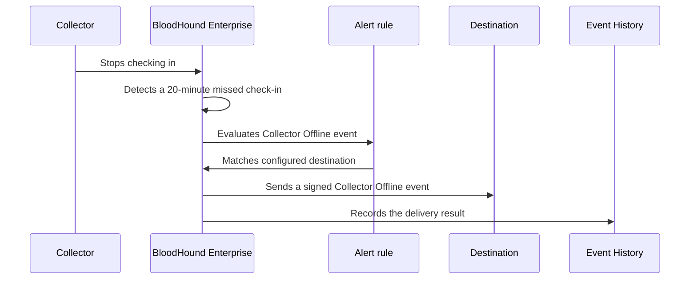

import EarlyAccessAccessNote from '/snippets/feature-flag-user-managed.mdx';

Alerts help you detect important events in your tenant or environments and send notifications to the operational tools your team already monitors. During Early Access, BloodHound Enterprise supports the **Collector Offline** event delivered through generic HTTPS webhooks.

<EarlyAccessAccessNote feature="Alerts" />

During Early Access, Alerts support the **Collector Offline** event and **Webhook** delivery method. You can configure multiple webhook destinations, including separate destinations for different Slack or Teams channels.

You configure where BloodHound Enterprise sends events in **Delivery**, configure which event triggers each alert in **Rules**, and review delivery results in **Event History**.

## Use cases

Use Alerts to keep collection interruptions visible to the people and systems responsible for resolving them:

- **Detect important events sooner:** Send an alert event to a monitored endpoint so an operations team can investigate an issue promptly.
- **Connect collector health to existing workflows:** Route signed events through a generic webhook receiver that creates an incident, posts a message to an approved internal system, or starts an automation workflow.
- **Investigate delivery problems:** Review alert event history alongside receiver logs to distinguish a collector outage from a webhook configuration or delivery failure.

## Key concepts

Alerts separate events from destinations, allowing you to manage alert webhook endpoints and the rules that use them independently.

Treat alert webhooks as reusable destinations, not as children of a rule. For example, multiple rules can send events to the same alert webhook.

| Page | Purpose | What you configure or review |
| --- | --- | --- |
| **Delivery** | Defines where BloodHound Enterprise sends alert events. | Create and manage generic HTTPS alert webhooks, including their HMAC secrets. |
| **Rules** | Connects an alert event type to a delivery destination. | Create a rule that sends matching alert events to a selected webhook destination. |
| **Event History** | Records webhook delivery activity. | Review attempts, delivery state, and errors when you investigate an event or a receiver. |

Each webhook destination has a [delivery-health signal](/manage-bloodhound/alerts/configure#webhook-health). BloodHound Enterprise updates this signal from dispatch outcomes so you can identify destinations that may not receive alerts. Health belongs to the delivery destination; it does not describe the alert event type or rule.

<Note>
  Your BloodHound Enterprise user role determines permissions on the **Alerts** pages.

  - Administrators can create and manage delivery destinations, rules, and view event history.
  - Auditors have read-only access to all pages.
</Note>

An example **Alerts** workflow involves the following high-level steps:

1. Create an alert webhook on the **Delivery** page.
1. Create a rule that links the webhook to an event, such as the **Collector Offline** event (`collector.status.offline`), on the **Rules** page.
1. When an alert event is triggered in BloodHound Enterprise, it finds enabled matching rules, queues a delivery attempt for each configured webhook, sends the signed alert event, and records the outcome on the **Event History** page.

<Tip>
  See [Configure alerts](/manage-bloodhound/alerts/configure) for detailed instructions.
</Tip>

## How alerts work

BloodHound Enterprise periodically evaluates alert conditions. During Early Access, it evaluates collector check-in status approximately every seven minutes. A collector that remains offline normally triggers an event about 20 to 27 minutes after its last check-in.

<Note>
  To avoid redundant alerts, BloodHound Enterprise does not send another alert for the same collector for seven days while the collector remains unavailable. BloodHound Enterprise does not send a recovery event when the collector checks in again.
</Note>

## Next steps

- [Configure alert webhooks](/manage-bloodhound/alerts/configure) to create a destination and an alert rule.
- [Review the alert webhook contract](/integrations/webhooks/collector-offline) before you connect a receiver.
- [Troubleshoot webhook delivery](/manage-bloodhound/alerts/troubleshoot) when Event History shows delivery failures.
