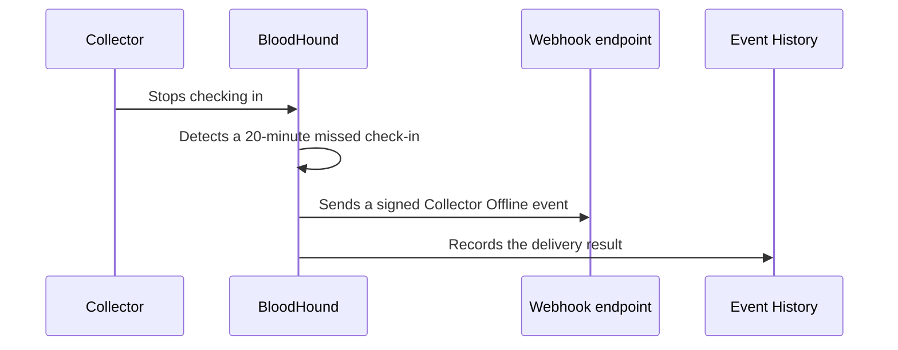

Alerts send a webhook when a collector stops checking in. This Early Access feature helps your operations team investigate collection interruptions without first opening BloodHound. Alerts currently support the **Collector Offline** event and generic HTTPS webhooks only.

## Enable Alerts

An administrator enables this Early Access feature before you can use it.

1. Go to **Administration** > **Early Access Features**.
1. Read and accept the Early Access warning.
1. Enable **Alerts**.

If you cannot change the setting, contact an administrator who can manage Early Access features. Early Access features are available for testing and may be incomplete.

## Understand the alert flow

BloodHound evaluates collector check-in status about every seven minutes. A collector that remains offline normally triggers an event about 20 to 27 minutes after its last check-in. BloodHound suppresses another Collector Offline event for the same collector for seven days. It does not send a recovery event when the collector checks in again.

## Know the current scope

| Capability | Current behavior |
| --- | --- |
| Event trigger | **Collector Offline** (`collector.status.offline`) |
| Delivery type | Generic HTTPS webhook |
| Event payload version | 1 |
| Email and in-app notifications | Not available |
| Slack and Microsoft Teams formatting | Not available |

## Check permissions

| Permission | Allows you to |
| --- | --- |
| `AlertsRead` | View Delivery, Rules, and Event History. |
| `AlertsManage` | Create, edit, enable, disable, delete, test, and rotate secrets for webhooks; create and change alert rules. |

## Next steps

- [Configure webhook notifications](/manage-bloodhound/alerts/configure-webhooks) to create a destination and a Collector Offline rule.
- [Review the Collector Offline webhook contract](/integrations/webhooks/collector-offline) before you connect a receiver.
- [Troubleshoot webhook delivery](/manage-bloodhound/alerts/troubleshoot-webhooks) when Event History shows delivery failures.
