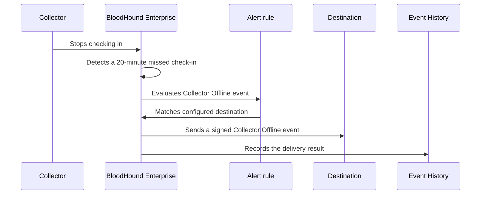

import BetaAccessNote from '/snippets/feature-flag-user-managed.mdx';

Alerts help you detect interruptions in data collection and send that information to the operational tools your team already monitors. When BloodHound Enterprise detects that a collector is offline, it can send a signed event to a generic HTTPS webhook so your team can begin investigating without first opening BloodHound Enterprise.

<BetaAccessNote feature="Alerts" />

Alerts currently support one event: **Collector Offline**. You configure where BloodHound Enterprise sends the event in **Delivery**, configure when it sends the event in **Rules**, and review the result in **Event History**.

## Use cases

Use Alerts to keep collection interruptions visible to the people and systems responsible for resolving them:

- **Detect collection interruptions sooner:** Send a Collector Offline event to a monitored endpoint so an operations team can investigate an unavailable collector promptly.
- **Connect collector health to existing workflows:** Route signed events through a generic webhook receiver that creates an incident, posts a message to an approved internal system, or starts an automation workflow.
- **Investigate delivery problems:** Review Event History alongside receiver logs to distinguish a collector outage from a webhook configuration or delivery failure.

## Key concepts

Alerts separate events (rules) from destinations (delivery). This lets you manage webhook endpoints and the rules that use them independently.

Treat webhooks as reusable destinations, not as children of a rule. For example, multiple rules can send notifications to the same webhook.

| Page | Purpose | What you configure or review |
| --- | --- | --- |
| **Delivery** | Defines where BloodHound Enterprise sends events. | Create and manage generic HTTPS webhook destinations, including their HMAC secrets. |
| **Rules** | Connects an event type to a delivery destination. | Create a rule that sends **Collector Offline** events to a selected webhook. |
| **Event History** | Records webhook delivery activity. | Review attempts, delivery state, and errors when you investigate an event or a receiver. |

Each webhook destination has a [delivery-health signal](/integrations/webhooks/collector-offline#webhook-health). BloodHound Enterprise updates this signal from dispatch outcomes so you can identify destinations that may not receive alerts. Health belongs to the delivery destination; it does not describe the event type or rule.

<Note>
  Your BloodHound Enterprise user role determines permissions on the **Alerts** pages.

  - Administrators can create and manage delivery destinations, rules, and view event history.
  - Auditors have view-only access to all pages.
</Note>

An example **Alerts** workflow involves the following high-level steps:

1. Create a webhook on the **Delivery** page.
1. Create a rule that links the webhook to the **Collector Offline** event (`collector.status.offline`) on the **Rules** page.
1. When BloodHound Enterprise publishes that event, it finds enabled matching rules, queues a delivery attempt for each configured webhook, sends the signed event, and records the outcome on the **Event History** page.

<Tip>
  See [Configure webhooks](/manage-bloodhound/alerts/configure) for detailed instructions.
</Tip>

## How alerts work

BloodHound Enterprise evaluates collector check-in status approximately every seven minutes. A collector that remains offline normally triggers an event about 20 to 27 minutes after its last check-in.

<Note>
  BloodHound Enterprise suppresses repeated `collector.status.offline` events when a matching event for the same `collector_id` was created within the seven-day cooldown. The collector-offline event has no corresponding recovery event when the collector checks in again.
</Note>

## Next steps

- [Configure webhook notifications](/manage-bloodhound/alerts/configure) to create a destination and a Collector Offline rule.
- [Review the Collector Offline webhook contract](/integrations/webhooks/collector-offline) before you connect a receiver.
- [Troubleshoot webhook delivery](/manage-bloodhound/alerts/troubleshoot) when Event History shows delivery failures.
