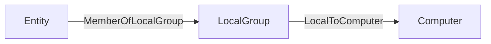

import DataValidationNote from '/snippets/opengraph/data-validation-note.mdx';


OpenGraph edges define relationships between nodes. Use this page to validate edge kinds, endpoint matching behavior, and post-processing outcomes before ingest.

<DataValidationNote dataType="edge" />

At minimum, each edge must include a `start` endpoint, an `end` endpoint, and a `kind` that describes the relationship type.

```json highlight={6,10,14}
{
  "graph": {
    "nodes": [],
    "edges": [
      {
        "start": {
          "match_by": "id",
          "value": "node-12345"
        },
        "end": {
          "match_by": "id",
          "value": "node-67890"
        },
        "kind": "RelationshipType"
      }
    ]
  }
}
```

<ResponseField name="start" type="object" required>
  An object that defines how to match the starting node of the edge. See [Endpoint Matching](#endpoint-matching).
</ResponseField>
<ResponseField name="end" type="object" required>
  An object that defines how to match the ending node of the edge. See [Endpoint Matching](#endpoint-matching).
</ResponseField>
<ResponseField name="kind" type="string" required>
  A string that describes the relationship type. Must contain only letters, numbers, and underscores. PascalCase is recommended for readability and consistency (for example, `Okta_ResetPassword`).

  Use a namespaced format with your extension prefix followed by an underscore and a descriptive name (for example, `Okta_ResetPassword`).

  Edge `kind` values must not overlap with [built-in edge](/resources/edges/overview) kinds. Use a unique prefix (for example, a namespace matching your extension) to avoid conflicts.

  See [Constraints](/opengraph/developer/edges#constraints) below for additional guidance.
</ResponseField>
<ResponseField name="properties" type="object">
  A key-value map of custom edge attributes. Values must be strings, numbers, booleans, or arrays of primitives. Nested objects and arrays of objects are not allowed.
</ResponseField>

<Note>
  Unless otherwise noted, examples below show edge objects only.
</Note>

## Constraints

Edges must adhere to the following constraints:

- Edge `kind` must match the regex pattern `^[A-Za-z0-9_]+$`. This means edge kinds can only contain uppercase letters, lowercase letters, numbers, and underscores. Spaces, dashes, backticks, and other special characters are not allowed in edge kinds.

  Neo4j Cypher allows many special characters in symbolic names when the name is enclosed in backticks. BloodHound OpenGraph ingest is more restrictive: edge `kind` values must match `^[A-Za-z0-9_]+$`, so upload validation rejects backtick-escaped names, spaces, dashes, and other special characters.

  See Neo4j [Escaping rules for symbolic names](https://neo4j.com/docs/cypher-manual/current/syntax/naming/#symbolic-names-escaping-rules) for additional naming guidance.

- The `lastseen` property is injected automatically by BloodHound during ingestion and overwrites any value provided in the payload.

## Endpoint Matching

Edges in OpenGraph data define relationships between nodes using a `start` endpoint object and an `end` endpoint object. You can control how BloodHound resolves each endpoint using one of two matching strategies in the `match_by` field.

- `id` (or legacy `name`) for direct identifier matching
- `property` for attribute-based matching

This flexibility allows you to link nodes based on their unique database identifiers or by dynamically finding them based on specific attribute values.

<Note>
  Use identifier matching when possible. Property matching is more flexible, but it is slower and should be used only when you cannot match by node ID.
</Note>

### Match by Identifier

This is the default and most common method. It resolves an endpoint by unique internal ID or by human-readable name.

To use this strategy, set the `match_by` property to `"id"`. You can also use legacy `"name"` matching.

<Note>
  `"name"` is deprecated and will be removed in future versions; using `"property"` with a single equality matcher is the recommended approach for name-based lookups.
</Note>

```json Linking a specific user to a server using their unique IDs
{
  "start": {
    "match_by": "id",
    "value": "user-12345"
  },
  "end": {
    "match_by": "id",
    "value": "server-98765"
  }
}
```

<ResponseField name="start" type="object" required>
  Starting endpoint definition for the edge.
</ResponseField>
<ResponseField name="start.match_by" type='"id" | "name"' required>
  Set to `id` to match the node's unique object identifier, or `name` to match the node's name string.
</ResponseField>
<ResponseField name="start.value" type="string" required>
  String containing the specific ID or name of the target node.
</ResponseField>
<ResponseField name="end" type="object" required>
  Ending endpoint definition for the edge.
</ResponseField>
<ResponseField name="end.match_by" type='"id" | "name"' required>
  Set to `id` to match the node's unique object identifier, or `name` to match the node's name string.
</ResponseField>
<ResponseField name="end.value" type="string" required>
  String containing the specific ID or name of the ending node.
</ResponseField>
<ResponseField name="start.kind" type="string">
  Optional kind filter used in `start` to constrain the lookup to a specific node kind.

  For example, setting `kind: "User"` ensures that even if a name exists across multiple entity types, only the one classified as a `User` is selected.
</ResponseField>
<ResponseField name="end.kind" type="string">
  Optional kind filter used in `end` to constrain the lookup to a specific node kind.

  For example, setting `kind: "Server"` limits endpoint resolution to nodes classified as `Server`.
</ResponseField>
<ResponseField name="start.property_matchers" type="object[]">
  Not used in this mode. If provided alongside `start.match_by: "id"`, validation fails.
</ResponseField>
<ResponseField name="end.property_matchers" type="object[]">
  Not used in this mode. If provided alongside `end.match_by: "id"`, validation fails.
</ResponseField>

### Match by Property

Use this strategy when you do not know the unique ID of the target node but can identify it using one or more known attributes (for example, username, email address, hostname, or custom property). This method allows for dynamic resolution based on data available at the time of ingestion.

To use this strategy, set the `match_by` property to `"property"`.

```json Linking a user to a server by matching the user's username property and the server's hostname property
{
  "start": {
    "match_by": "property",
    "property_matchers": [
      {
        "key": "username",
        "operator": "equals",
        "value": "alice.smith"
      },
      {
        "key": "active",
        "operator": "equals",
        "value": true
      }
    ],
    "kind": "User"
  },
  "end": {
    "match_by": "property",
    "property_matchers": [
      {
        "key": "hostname",
        "operator": "equals",
        "value": "db-prod-01"
      }
    ]
  }
}
```

<ResponseField name="start" type="object" required>
  Starting endpoint definition for the edge.
</ResponseField>
<ResponseField name="start.match_by" type='"property"' required>
  Must be set to `property`.
</ResponseField>
<ResponseField name="start.property_matchers" type="object[]" required>
  Array of matchers used to find the starting node. BloodHound attempts to find a node that satisfies all matchers.

  You can provide multiple matchers in the array. The system will attempt to find a node that satisfies all conditions simultaneously.
</ResponseField>
<ResponseField name="start.kind" type="string">
  Optional kind filter used to narrow node resolution for the starting node.
</ResponseField>
<ResponseField name="end" type="object" required>
  Ending endpoint definition for the edge.
</ResponseField>
<ResponseField name="end.match_by" type='"property"' required>
  Must be set to `property`.
</ResponseField>
<ResponseField name="end.property_matchers" type="object[]" required>
  Array of matchers used to find the ending node. BloodHound attempts to find a node that satisfies all matchers.
</ResponseField>
<ResponseField name="start.value" type="string | number | boolean">
  Not used in this mode. Providing `start.value` when `start.match_by` is `property` causes validation errors.
</ResponseField>
<ResponseField name="end.value" type="string | number | boolean">
  Not used in this mode. Providing `end.value` when `end.match_by` is `property` causes validation errors.
</ResponseField>
<ResponseField name="property_matchers[].key" type="string" required>
  Name of the node property to check.
</ResponseField>
<ResponseField name="property_matchers[].operator" type='"equals"' required>
  Matching operator. `equals` is currently the only supported value.
</ResponseField>
<ResponseField name="property_matchers[].value" type="string | number | boolean" required>
  Expected value for the property matcher.
</ResponseField>

## Post-processing

Post-processing in BloodHound runs during the analysis phase. During this phase, BloodHound generates specific edges to enrich the graph and reflect the evaluated graph state.

After ingest completes, BloodHound builds a complete graph, deletes existing post-processed edges, and regenerates them. As a result, post-processed edge kinds that you add directly in OpenGraph payloads do not persist.

<Accordion title="Show post-processed edges">
BloodHound creates the following edges during post-processing:

- [`ADCSESC1`](/resources/edges/adcs-esc1)
- [`ADCSESC3`](/resources/edges/adcs-esc3)
- [`ADCSESC4`](/resources/edges/adcs-esc4)
- [`ADCSESC6a`](/resources/edges/adcs-esc6a)
- [`ADCSESC6b`](/resources/edges/adcs-esc6b)
- [`ADCSESC9a`](/resources/edges/adcs-esc9a)
- [`ADCSESC9b`](/resources/edges/adcs-esc9b)
- [`ADCSESC10a`](/resources/edges/adcs-esc10a)
- [`ADCSESC10b`](/resources/edges/adcs-esc10b)
- [`ADCSESC13`](/resources/edges/adcs-esc13)
- [`AddMember`](/resources/edges/add-member)
- [`AdminTo`](/resources/edges/admin-to)
- [`AZAddOwner`](/resources/edges/az-add-owner)
- [`AZMGAddMember`](/resources/edges/az-mg-add-member)
- [`AZMGAddOwner`](/resources/edges/az-mg-add-owner)
- [`AZMGAddSecret`](/resources/edges/az-mg-add-secret)
- [`AZMGGrantAppRoles`](/resources/edges/az-mg-grant-app-roles)
- [`AZMGGrantRole`](/resources/edges/az-mg-grant-role)
- [`AZRoleApprover`](/resources/edges/az-role-approver)
- [`CanPSRemote`](/resources/edges/can-ps-remote)
- [`CanRDP`](/resources/edges/can-rdp)
- [`CoerceAndRelayNTLMToADCS`](/resources/edges/coerce-and-relay-ntlm-to-adcs)
- [`CoerceAndRelayNTLMToLDAP`](/resources/edges/coerce-and-relay-ntlm-to-ldap)
- [`CoerceAndRelayNTLMToLDAPS`](/resources/edges/coerce-and-relay-ntlm-to-ldaps)
- [`CoerceAndRelayNTLMToSMB`](/resources/edges/coerce-and-relay-ntlm-to-smb)
- [`DCSync`](/resources/edges/dc-sync)
- [`EnrollOnBehalfOf`](/resources/edges/enroll-on-behalf-of)
- [`EnterpriseCAFor`](/resources/edges/enterprise-ca-for)
- [`ExecuteDCOM`](/resources/edges/execute-dcom)
- [`ExtendedByPolicy`](/resources/edges/extended-by-policy)
- [`GoldenCert`](/resources/edges/golden-cert)
- [`HasTrustKeys`](/resources/edges/has-trust-keys)
- [`IssuedSignedBy`](/resources/edges/issued-signed-by)
- [`Owns`](/resources/edges/owns)
- [`OwnsLimitedRights`](/resources/edges/owns-limited-rights)
- [`ProtectAdminGroups`](/resources/edges/protect-admin-groups)
- [`SyncLAPSPassword`](/resources/edges/sync-laps-password)
- [`SyncedToADUser`](/resources/edges/synced-to-ad-user)
- [`SyncedToEntraUser`](/resources/edges/synced-to-entra-user)
- [`TrustedForNTAuth`](/resources/edges/trusted-for-nt-auth)
- [`WriteOwner`](/resources/edges/write-owner)
- [`WriteOwnerLimitedRights`](/resources/edges/write-owner-limited-rights)

</Accordion>

To achieve a post-processed relationship, include the supporting edges that cause BloodHound to generate that relationship during post-processing.

For example, if you include an `AdminTo` edge directly in your OpenGraph payload, BloodHound removes it during post-processing and the edge does not persist in the final graph as expected. Instead of adding `AdminTo` edges directly, include the supporting edges that cause the post-processor to generate the `AdminTo` edge. The common pattern that triggers the creation of the `AdminTo` edge is:



See the following example OpenGraph payload that produces the effect:

```json
{
  "graph": {
    "nodes": [
      {
        "id": "TESTNODE",
        "kinds": ["User"]
      }
    ],
    "edges": [
      {
        "start": {
          "match_by": "id",
          "value": "TESTNODE"
        },
        "end": {
          "match_by": "id",
          "value": "S-1-5-21-2697957641-2271029196-387917394-2171-544"
        },
        "kind": "MemberOfLocalGroup"
      }
    ]
  }
}
```

## Schema

Use the schema below as the source of truth for validation requirements. You can also download the same schema as a file: <a href="/assets/opengraph/opengraph-edge.json" download>opengraph-edge.json</a>.

```json
{
  "title": "Generic Ingest Edge",
  "description": "Defines an edge between two nodes in a generic graph ingestion system. Each edge specifies a start and end node using one of three matching strategies: by unique identifier (match_by: id), by name (match_by: name, deprecated), or by one or more property matchers (match_by: property). A kind is required to indicate the relationship type. Optional properties may include custom attributes. You may optionally constrain the start or end node to a specific kind using the kind field inside each reference.",
  "type": "object",
  "$defs": {
    "property_map": {
      "type": ["object", "null"],
      "description": "A key-value map of edge attributes. Values must not be objects. If a value is an array, it must contain only primitive types (e.g., strings, numbers, booleans) and must be homogeneous (all items must be of the same type).",
      "additionalProperties": {
        "anyOf": [
          { "type": "string" },
          { "type": "number" },
          { "type": "boolean" },
          {
            "type": "array",
            "anyOf": [
              { "items": { "type": "string" } },
              { "items": { "type": "number" } },
              { "items": { "type": "boolean" } }
            ]
          }
        ]
      }
    },
    "endpoint": {
      "type": "object",
      "properties": {
        "match_by": {
          "type": "string",
          "enum": ["id", "name", "property"],
          "default": "id",
          "description": "Whether to match the start node by its unique object ID or by a series of property matches. Note that the name value here is deprecated and will be removed in future versions. Users are advised to use the multi-property match strategy moving forward."
        },
        "property_matchers": {
          "type": "array",
          "minItems": 1,
          "items": {
            "type": "object",
            "properties": {
              "key": {
                "type": "string"
              },
              "operator": {
                "type": "string",
                "enum": ["equals"]
              },
              "value": {
                "type": ["string", "number", "boolean"]
              }
            },
            "required": ["key", "operator", "value"]
          }
        },
        "value": {
          "type": "string",
          "description": "The value used for matching — either an object ID or a name, depending on match_by."
        },
        "kind": {
          "type": "string",
          "description": "Optional kind filter; the referenced node must have this kind."
        }
      },
      "if": {
        "allOf": [
          {
            "properties": {
              "match_by": {
                "type": "string",
                "const": "property"
              }
            }
          },
          {
            "not": {
              "properties": {
                "match_by": {
                  "type": "null"
                }
              }
            }
          }
        ]
      },
      "then": {
        "required": ["property_matchers"],
        "not": {
          "required": ["value"]
        }
      },
      "else": {
        "required": ["value"],
        "not": {
          "required": ["property_matchers"]
        }
      }
    }
  },
  "properties": {
    "start": {
      "$ref": "#/$defs/endpoint"
    },
    "end": {
      "$ref": "#/$defs/endpoint"
    },
    "kind": {
      "type": "string",
      "description": "Edge kind name must contain only alphanumeric characters and underscores.",
      "pattern": "^[A-Za-z0-9_]+$"
    },
    "properties": {
      "$ref": "#/$defs/property_map"
    }
  },
  "required": ["start", "end", "kind"],
  "examples": [
    {
      "start": {
        "match_by": "id",
        "value": "user-1234"
      },
      "end": {
        "match_by": "id",
        "value": "server-5678"
      },
      "kind": "has_session",
      "properties": {
        "timestamp": "2025-04-16T12:00:00Z",
        "duration_minutes": 45
      }
    },
    {
      "start": {
        "match_by": "property",
        "property_matchers": [
          {
            "key": "prop_1",
            "operator": "equals",
            "value": "value"
          }
        ]
      },
      "end": {
        "match_by": "id",
        "value": "server-5678"
      },
      "kind": "has_session",
      "properties": {
        "timestamp": "2025-04-16T12:00:00Z",
        "duration_minutes": 45
      }
    },
    {
      "start": {
        "match_by": "name",
        "value": "alice",
        "kind": "User"
      },
      "end": {
        "match_by": "name",
        "value": "file-server-1",
        "kind": "Server"
      },
      "kind": "accessed_resource",
      "properties": {
        "via": "SMB",
        "sensitive": true
      }
    },
    {
      "start": {
        "value": "admin-1"
      },
      "end": {
        "value": "domain-controller-9"
      },
      "kind": "admin_to",
      "properties": {
        "reason": "elevated_permissions",
        "confirmed": false
      }
    },
    {
      "start": {
        "match_by": "name",
        "value": "Printer-007"
      },
      "end": {
        "match_by": "id",
        "value": "network-42"
      },
      "kind": "connected_to",
      "properties": null
    }
  ]
}
```

## Troubleshooting

- **Upload fails on edge kind pattern:** Ensure `kind` matches `^[A-Za-z0-9_]+$`.

- **Endpoint validation fails:** Use either `value` for `id`/`name` matching, or `property_matchers` for `property` matching, not both.

- **Expected edge disappears after ingest:** Check whether it is a post-processed edge kind.
