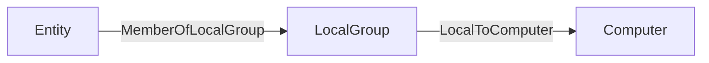

OpenGraph edges define relationships between nodes. Use this page to validate edge kinds, endpoint matching behavior, and post-processing outcomes before ingest.

<Note>
  Use this page to validate edge structure before ingestion. For a full data payload example, see [OpenGraph Data](/opengraph/developer/data-overview).
</Note>

At minimum, each edge must include a `start` endpoint, an `end` endpoint, and a `kind` that describes the relationship type.

```json
{
  "start": {
    "match_by": "id",
    "value": "node-12345"
  },
  "end": {
    "match_by": "id",
    "value": "node-67890"
  },
  "kind": "RelationshipType",
  "properties": {
    "key": "value"
  }
}
```

| Field | Required | Description |
| --- | --- | --- |
| `kind` | Yes | A string that describes the relationship type. Must contain only letters, numbers, and underscores. Recommended PascalCase for readability and consistency (e.g., `UserToServer`). |
| `start` | Yes | An object that defines how to match the starting node of the edge. See [Endpoint Matching](#endpoint-matching). |
| `end` | Yes | An object that defines how to match the ending node of the edge. See [Endpoint Matching](#endpoint-matching). |
| `properties` | No | A key-value map of custom edge attributes. Values must be strings, numbers, booleans, or arrays of primitives. Nested objects and arrays of objects are not allowed. |

## Constraints

Edges must adhere to the following constraints:

- Edge `kind` must match the regex pattern `^[A-Za-z0-9_]+$`. This means edge kinds can only contain uppercase letters, lowercase letters, numbers, and underscores. Spaces, dashes, backticks, and other special characters are not allowed in edge kinds.

  Neo4j Cypher allows many special characters in symbolic names when the name is enclosed in backticks. BloodHound OpenGraph ingest is more restrictive: edge `kind` values must match `^[A-Za-z0-9_]+$`, so upload validation rejects backtick-escaped names, spaces, dashes, and other special characters.

  See Neo4j [Escaping rules for symbolic names](https://neo4j.com/docs/cypher-manual/current/syntax/naming/#symbolic-names-escaping-rules) for additional naming guidance.

- The `lastseen` property is injected automatically by BloodHound during ingestion and overwrites any value provided in the payload.

## Traversability and analysis

Edge traversability is defined by `relationship_kinds` in an extension definition schema.

- Each relationship kind can set `is_traversable`.
- Edges that use that kind inherit the same traversability behavior.
- Only traversable edges are included in pathfinding and considered for findings and analysis.

For generic OpenGraph data without an extension definition schema, traversability is not defined for edge kinds. Generic edges are treated as non-traversable for pathfinding and findings/analysis.

<Note>
  See [Extension Definition Schema](/opengraph/developer/extension-definition-schema) for relationship kind definitions and structured graph behavior.
</Note>

## Metrics


To include the nodes connected by an edge in analysis and metrics (findings), set `properties.collected` to `true`.

```json
{
  "properties": {
    "collected": true
  }
}
```

<Note>
  To be included in metrics and analysis (findings), nodes must also have [`metadata.source_kind`](/opengraph/developer/metadata) defined at the payload level.
</Note>

## Endpoint Matching

Edges use a `start` endpoint and an `end` endpoint. BloodHound resolves each endpoint according to `match_by`.

Use one of two strategies:

- `id` (or legacy `name`) for direct identifier matching.
- `property` for attribute-based matching.

<Note>
  Use identifier matching when possible. Property matching is more flexible, but it is slower and should be used only when you cannot match by node ID.
</Note>

### Match by Identifier

This is the default and most common method. It resolves an endpoint by unique internal ID or by human-readable name.

To use this strategy, set the `match_by` property to either `"id"` or `"name"`.

<Note>
  `"name"` is deprecated and will be removed in future versions; using `"property"` with a single equality matcher is the recommended approach for name-based lookups.
</Note>

- **`match_by`:** Set to `"id"` to match the node's unique object identifier, or `"name"` to match the node's name string.
- **`value`:** A required string containing the specific ID or name of the target node.
- **`kind` (Optional):** Constrains the lookup to a specific node kind. For example, `kind: "User"` selects only a matching `User` node.
- **`property_matchers`:** Not used in this mode. If provided alongside `match_by: "id"`, validation will fail.

**Example:**
Linking a specific user to a server using their unique IDs:

```json
{
  "start": {
    "match_by": "id",
    "value": "user-12345"
  },
  "end": {
    "match_by": "id",
    "value": "server-98765"
  }
}
```

### Match by Property

Use this strategy when you do not know the unique ID but can identify the node using one or more attributes (for example, username, email address, or hostname).

To use this strategy, set the `match_by` property to `"property"`.

- **`match_by`:** Must be set to `"property"`.
- **`property_matchers`:** A required array of objects defining the criteria to find the node. Each object must include:
  - `key`: The name of the node property to check.
  - `operator`: Currently, only `"equals"` is supported.
  - `value`: The expected value for the property (string, number, or boolean).
  - _Note:_ You can provide multiple matchers in the array. The system will attempt to find a node that satisfies all conditions simultaneously.
- **`value`:** Not used in this mode. Providing a `value` field when `match_by` is `"property"` will cause validation errors.
- **`kind` (Optional):** Similar to identifier matching, you can restrict the search to nodes of a specific kind to avoid ambiguity.

**Example:**
Linking a user to a server by matching the user's `username` property and the server's `hostname` property:

```json
{
  "start": {
    "match_by": "property",
    "property_matchers": [
      {
        "key": "username",
        "operator": "equals",
        "value": "alice.smith"
      },
      {
        "key": "active",
        "operator": "equals",
        "value": true
      }
    ],
    "kind": "User"
  },
  "end": {
    "match_by": "property",
    "property_matchers": [
      {
        "key": "hostname",
        "operator": "equals",
        "value": "db-prod-01"
      }
    ]
  }
}
```

## Schema

Use the schema below as the source of truth for validation requirements. You can also download the same schema as a file: <a href="/assets/opengraph/opengraph-edge.json" download>opengraph-edge.json</a>.

```json
{
  "title": "Generic Ingest Edge",
  "description": "Defines an edge between two nodes in a generic graph ingestion system. Each edge specifies a start and end node using one of three matching strategies: by unique identifier (match_by: id), by name (match_by: name, deprecated), or by one or more property matchers (match_by: property). A kind is required to indicate the relationship type. Optional properties may include custom attributes. You may optionally constrain the start or end node to a specific kind using the kind field inside each reference.",
  "type": "object",
  "$defs": {
    "property_map": {
      "type": ["object", "null"],
      "description": "A key-value map of edge attributes. Values must not be objects. If a value is an array, it must contain only primitive types (e.g., strings, numbers, booleans) and must be homogeneous (all items must be of the same type).",
      "additionalProperties": {
        "anyOf": [
          { "type": "string" },
          { "type": "number" },
          { "type": "boolean" },
          {
            "type": "array",
            "anyOf": [
              { "items": { "type": "string" } },
              { "items": { "type": "number" } },
              { "items": { "type": "boolean" } }
            ]
          }
        ]
      }
    },
    "endpoint": {
      "type": "object",
      "properties": {
        "match_by": {
          "type": "string",
          "enum": ["id", "name", "property"],
          "default": "id",
          "description": "Whether to match the start node by its unique object ID or by a series of property matches. Note that the name value here is deprecated and will be removed in future versions. Users are advised to use the multi-property match strategy moving forward."
        },
        "property_matchers": {
          "type": "array",
          "minItems": 1,
          "items": {
            "type": "object",
            "properties": {
              "key": {
                "type": "string"
              },
              "operator": {
                "type": "string",
                "enum": ["equals"]
              },
              "value": {
                "type": ["string", "number", "boolean"]
              }
            },
            "required": ["key", "operator", "value"]
          }
        },
        "value": {
          "type": "string",
          "description": "The value used for matching — either an object ID or a name, depending on match_by."
        },
        "kind": {
          "type": "string",
          "description": "Optional kind filter; the referenced node must have this kind."
        }
      },
      "if": {
        "allOf": [
          {
            "properties": {
              "match_by": {
                "type": "string",
                "const": "property"
              }
            }
          },
          {
            "not": {
              "properties": {
                "match_by": {
                  "type": "null"
                }
              }
            }
          }
        ]
      },
      "then": {
        "required": ["property_matchers"],
        "not": {
          "required": ["value"]
        }
      },
      "else": {
        "required": ["value"],
        "not": {
          "required": ["property_matchers"]
        }
      }
    }
  },
  "properties": {
    "start": {
      "$ref": "#/$defs/endpoint"
    },
    "end": {
      "$ref": "#/$defs/endpoint"
    },
    "kind": {
      "type": "string",
      "description": "Edge kind name must contain only alphanumeric characters and underscores.",
      "pattern": "^[A-Za-z0-9_]+$"
    },
    "properties": {
      "$ref": "#/$defs/property_map"
    }
  },
  "required": ["start", "end", "kind"],
  "examples": [
    {
      "start": {
        "match_by": "id",
        "value": "user-1234"
      },
      "end": {
        "match_by": "id",
        "value": "server-5678"
      },
      "kind": "has_session",
      "properties": {
        "timestamp": "2025-04-16T12:00:00Z",
        "duration_minutes": 45
      }
    },
    {
      "start": {
        "match_by": "property",
        "property_matchers": [
          {
            "key": "prop_1",
            "operator": "equals",
            "value": "value"
          }
        ]
      },
      "end": {
        "match_by": "id",
        "value": "server-5678"
      },
      "kind": "has_session",
      "properties": {
        "timestamp": "2025-04-16T12:00:00Z",
        "duration_minutes": 45
      }
    },
    {
      "start": {
        "match_by": "name",
        "value": "alice",
        "kind": "User"
      },
      "end": {
        "match_by": "name",
        "value": "file-server-1",
        "kind": "Server"
      },
      "kind": "accessed_resource",
      "properties": {
        "via": "SMB",
        "sensitive": true
      }
    },
    {
      "start": {
        "value": "admin-1"
      },
      "end": {
        "value": "domain-controller-9"
      },
      "kind": "admin_to",
      "properties": {
        "reason": "elevated_permissions",
        "confirmed": false
      }
    },
    {
      "start": {
        "match_by": "name",
        "value": "Printer-007"
      },
      "end": {
        "match_by": "id",
        "value": "network-42"
      },
      "kind": "connected_to",
      "properties": null
    }
  ]
}
```

## Post-processing

Post-processing in BloodHound runs during the analysis phase. During this phase, BloodHound generates specific edges to enrich the graph and reflect the evaluated graph state.

After ingest completes, BloodHound builds a complete graph, deletes existing post-processed edges, and regenerates them. As a result, post-processed edge kinds that you add directly in OpenGraph payloads do not persist.

<Accordion title="Show post-processed edges">
BloodHound creates the following edges during post-processing:

- [`ADCSESC1`](/resources/edges/adcs-esc1)
- [`ADCSESC3`](/resources/edges/adcs-esc3)
- [`ADCSESC4`](/resources/edges/adcs-esc4)
- [`ADCSESC6a`](/resources/edges/adcs-esc6a)
- [`ADCSESC6b`](/resources/edges/adcs-esc6b)
- [`ADCSESC9a`](/resources/edges/adcs-esc9a)
- [`ADCSESC9b`](/resources/edges/adcs-esc9b)
- [`ADCSESC10a`](/resources/edges/adcs-esc10a)
- [`ADCSESC10b`](/resources/edges/adcs-esc10b)
- [`ADCSESC13`](/resources/edges/adcs-esc13)
- [`AddMember`](/resources/edges/add-member)
- [`AdminTo`](/resources/edges/admin-to)
- [`AZAddOwner`](/resources/edges/az-add-owner)
- [`AZMGAddMember`](/resources/edges/az-mg-add-member)
- [`AZMGAddOwner`](/resources/edges/az-mg-add-owner)
- [`AZMGAddSecret`](/resources/edges/az-mg-add-secret)
- [`AZMGGrantAppRoles`](/resources/edges/az-mg-grant-app-roles)
- [`AZMGGrantRole`](/resources/edges/az-mg-grant-role)
- [`AZRoleApprover`](/resources/edges/az-role-approver)
- [`CanPSRemote`](/resources/edges/can-ps-remote)
- [`CanRDP`](/resources/edges/can-rdp)
- [`CoerceAndRelayNTLMToADCS`](/resources/edges/coerce-and-relay-ntlm-to-adcs)
- [`CoerceAndRelayNTLMToLDAP`](/resources/edges/coerce-and-relay-ntlm-to-ldap)
- [`CoerceAndRelayNTLMToLDAPS`](/resources/edges/coerce-and-relay-ntlm-to-ldaps)
- [`CoerceAndRelayNTLMToSMB`](/resources/edges/coerce-and-relay-ntlm-to-smb)
- [`DCSync`](/resources/edges/dc-sync)
- [`EnrollOnBehalfOf`](/resources/edges/enroll-on-behalf-of)
- [`EnterpriseCAFor`](/resources/edges/enterprise-ca-for)
- [`ExecuteDCOM`](/resources/edges/execute-dcom)
- [`ExtendedByPolicy`](/resources/edges/extended-by-policy)
- [`GoldenCert`](/resources/edges/golden-cert)
- [`HasTrustKeys`](/resources/edges/has-trust-keys)
- [`IssuedSignedBy`](/resources/edges/issued-signed-by)
- [`Owns`](/resources/edges/owns)
- [`OwnsLimitedRights`](/resources/edges/owns-limited-rights)
- [`ProtectAdminGroups`](/resources/edges/protect-admin-groups)
- [`SyncLAPSPassword`](/resources/edges/sync-laps-password)
- [`SyncedToADUser`](/resources/edges/synced-to-ad-user)
- [`SyncedToEntraUser`](/resources/edges/synced-to-entra-user)
- [`TrustedForNTAuth`](/resources/edges/trusted-for-nt-auth)
- [`WriteOwner`](/resources/edges/write-owner)
- [`WriteOwnerLimitedRights`](/resources/edges/write-owner-limited-rights)

</Accordion>

To achieve a post-processed relationship, include the supporting edges that cause BloodHound to generate that relationship during post-processing.

For example, if you include an `AdminTo` edge directly in your OpenGraph payload, BloodHound removes it during post-processing and the edge does not persist in the final graph as expected. Instead of adding `AdminTo` edges directly, include the supporting edges that cause the post-processor to generate the `AdminTo` edge. The common pattern that triggers the creation of the `AdminTo` edge is:



See the following example OpenGraph payload that produces the effect:

```json
{
  "graph": {
    "nodes": [
      {
        "id": "TESTNODE",
        "kinds": ["User"]
      }
    ],
    "edges": [
      {
        "start": {
          "match_by": "id",
          "value": "TESTNODE"
        },
        "end": {
          "match_by": "id",
          "value": "S-1-5-21-2697957641-2271029196-387917394-2171-544"
        },
        "kind": "MemberOfLocalGroup"
      }
    ]
  }
}
```

## Troubleshooting

- **Upload fails on edge kind pattern:** Ensure `kind` matches `^[A-Za-z0-9_]+$`.

- **Endpoint validation fails:** Use either `value` for `id`/`name` matching, or `property_matchers` for `property` matching, not both.

- **Expected edge disappears after ingest:** Check whether it is a post-processed edge kind.
