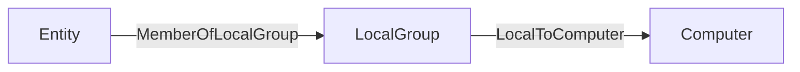

import { GitHubJsonCodeblock } from "/snippets/opengraph/github-json-codeblock.jsx";


This page explains the JSON payload structure and minimum JSON schema requirements that BloodHound uses to ingest OpenGraph nodes and edges.

Terms used on this page:

- **Generic graph data** is OpenGraph data that conforms only to the minimum required node and edge schemas used by data payloads, as described on this page.
- **Structured graph data** is OpenGraph data that relies on an extension definition schema outside the payload itself to enrich the raw data and provide enhanced functionality.

See [Graph Structure](/opengraph/extensions/manage) for more details on the differences between generic and structured graph data, as well as guidance on which type to use for your project.

This page focuses on the JSON requirements for OpenGraph data payloads.

## Ingesting OpenGraph Data

### File Requirements

Acceptable formats: `.json`, `.zip`

You can mix file types in a single upload (e.g. SharpHound + OpenGraph).

Compressed ZIP files are supported, including ZIP files with multiple payload files, but ZIP files inside ZIP files (nested ZIPs) are not supported.

### Data Payload Structure

The standard BloodHound UI upload screen accepts all OpenGraph payloads, including both generic and structured graph data.

At minimum, your JSON file should have these elements:

```json
{
  "graph": {
    "nodes": [],
    "edges": []
  }
}
```

The `nodes` and `edges` must conform to the minimum JSON schemas (see details below). BloodHound validates that the JSON is well-formed and that nodes and edges meet these schema requirements, but it does not enforce additional structure or constraints beyond them.

When ingest completes, you can [search](/analyze-data/explore/search) OpenGraph data.

**Entity Panels**: Clicking on an OpenGraph node or edge will currently display the full list of the entity's properties and their values. Future enhancements will enable OpenGraph extension authors to define structured and organized entity panel representations.

### Data Payload Validation

Before structuring your payload, you can optionally set up JSON schema validation in your editor to catch errors before ingestion. Add the following to the top level of your JSON document:

```json
{
  "$schema": "https://bloodhound.specterops.io/assets/opengraph/schema.json"
}
```

Most editors will ask you to allow-list external domains for JSON schemas. You'll need to add the schema URI as hosted that's hosted on this site and a reference to where these schemas are stored in GitHub to your editor's configuration:

```
https://bloodhound.specterops.io/assets/opengraph/schema.json
https://raw.githubusercontent.com/SpecterOps/chow/refs/heads/main/pkg/validator/jsonschema/
```

<Tip>
  This enables real-time validation as you author your OpenGraph data payload.
</Tip>

## Nodes

### Property Rules

- Properties must be primitive types or arrays of primitive types.

- Nested objects and arrays of objects are not allowed.

- Arrays must be homogeneous (e.g. all strings or all numbers).

- An array of kind labels for the node. The first element is treated as the node's primary kind and is used to determine which icon to display in the graph UI. This primary kind is only used for visual representation and has no semantic significance for data processing.

- Property names must be lowercase. Property names in BloodHound are case-sensitive, which means `exampleid` and `ExampleID` are treated as two distinct properties on the same node. This can cause issues when parsing API responses in languages that treat JSON keys as case-insensitive (for example, PowerShell and some .NET-based tools).

### Reserved Property: `objectid`

The property name `objectid` is reserved and **must not** be included in the `properties` object of a node definition.

In the BloodHound data model, the top-level `id` field serves as the unique identifier for the node.

Upon ingestion, this `id` value is automatically mapped and stored internally as the `objectid` property. Explicitly defining `objectid` within the `properties` map creates a redundant conflict that is unsupported. To ensure successful ingestion, remove any `objectid` keys from your node's `properties` object and rely solely on the root-level `id` field for identification.

### Node JSON

The following is the JSON schema that all nodes must conform to.

<GitHubJsonCodeblock
  sourceUrl="https://raw.githubusercontent.com/SpecterOps/chow/refs/heads/main/pkg/validator/jsonschema/node.json"
  language="json"
/>

## Edges

Edge `kind` values must contain only letters (`A-Z`, `a-z`), numbers (`0-9`), and underscores (`_`).

BloodHound validates edge kinds at upload time. If any edge kind includes spaces, dashes (`-`), backticks, or other special characters, the file upload fails.

We recommend using PascalCase (for example, `AdminTo`, `HasSession`) for readability and consistency.

Neo4j Cypher allows many special characters in symbolic names when the name is enclosed in backticks. BloodHound OpenGraph ingest is more restrictive: edge `kind` values must match `^[A-Za-z0-9_]+$`, so upload validation rejects backtick-escaped names, spaces, dashes, and other special characters.

See Neo4j [Escaping rules for symbolic names](https://neo4j.com/docs/cypher-manual/current/syntax/naming/#symbolic-names-escaping-rules) for additional naming guidance.

### Edge Kind Validation

BloodHound enforces this pattern for edge kinds:

```text
^[A-Za-z0-9_]+$
```

**Valid examples**

- `AdminTo`
- `HasSession`
- `AZMGGrantRole`
- `Edge_1`

**Invalid examples**

- `Admin-To`
- `Has Session`
- ``Has`Session``
- `Has$Session`

### Edge Endpoint Matching

Edges in OpenGraph data define relationships between nodes using a `start` endpoint and an `end` endpoint. You can control how BloodHound resolves each endpoint using one of two matching strategies in the `match_by` field. This flexibility allows you to link nodes based on their unique database identifiers or by dynamically finding them based on specific attribute values.

<Note>
  Use identifier matching when possible. Property matching is more flexible, but
  it is slower and should be used only when you cannot match by node ID.
</Note>

#### Match by Identifier

This is the default and most common method for defining edges. It resolves the endpoint by looking up a node using its unique internal ID or its human-readable name.

To use this strategy, set the `match_by` property to either `"id"` or `"name"`.

<Note>
  `"name"` is deprecated and will be removed in future versions; using
  `"property"` with a single equality matcher is the recommended approach for
  name-based lookups.
</Note>

- **`match_by`:** Set to `"id"` to match the node's unique object identifier, or `"name"` to match the node's name string.
- **`value`:** A required string containing the specific ID or name of the target node.
- **`kind` (Optional):** You may constrain the lookup to ensure the found node belongs to a specific type. For example, setting `kind: "User"` ensures that even if a name exists across multiple entity types, only the one classified as a `User` is selected.
- **`property_matchers`:** Not used in this mode. If provided alongside `match_by: "id"`, validation will fail.

**Example:**
Linking a specific user to a server using their unique IDs:

```json
{
  "start": {
    "match_by": "id",
    "value": "user-12345"
  },
  "end": {
    "match_by": "id",
    "value": "server-98765"
  }
}
```

#### Match by Property

Use this strategy when you do not know the unique ID of the target node but can identify it through one or more known attributes (e.g., a username, email address, hostname, or custom property). This method allows for dynamic resolution based on data available at ingestion time.

To use this strategy, set the `match_by` property to `"property"`.

- **`match_by`:** Must be set to `"property"`.
- **`property_matchers`:** A required array of objects defining the criteria to find the node. Each object must include:
  - `key`: The name of the node property to check.
  - `operator`: Currently, only `"equals"` is supported.
  - `value`: The expected value for the property (string, number, or boolean).
  - _Note:_ You can provide multiple matchers in the array. The system will attempt to find a node that satisfies all conditions simultaneously.
- **`value`:** Not used in this mode. Providing a `value` field when `match_by` is `"property"` will cause validation errors.
- **`kind` (Optional):** Similar to identifier matching, you can restrict the search to nodes of a specific kind to avoid ambiguity.

**Example:**
Linking a user to a server by matching the user's `username` property and the server's `hostname` property:

```json
{
  "start": {
    "match_by": "property",
    "property_matchers": [
      {
        "key": "username",
        "operator": "equals",
        "value": "alice.smith"
      },
      {
        "key": "active",
        "operator": "equals",
        "value": true
      }
    ],
    "kind": "User"
  },
  "end": {
    "match_by": "property",
    "property_matchers": [
      {
        "key": "hostname",
        "operator": "equals",
        "value": "db-prod-01"
      }
    ]
  }
}
```

### Edge JSON

The following is the JSON schema that all edges must conform to.

If an edge kind does not meet the allowed pattern, BloodHound returns a schema validation error and rejects the upload.

<GitHubJsonCodeblock
  sourceUrl="https://raw.githubusercontent.com/SpecterOps/chow/refs/heads/main/pkg/validator/jsonschema/edge.json"
  language="json"
/>

#### Post-processing

Post-processing in BloodHound refers to a series of steps during analysis phase where the system creates specific edges after ingesting data to enrich the graph and more accurately reflect the graph's state.

After ingesting data, BloodHound analyzes the graph state and adds edges that are essential to accurately represent the environment and support attack path analysis. BloodHound regenerates "post-processed" edges after it builds a complete graph. Before regenerating post-processed edges, BloodHound deletes any existing ones. As a result, BloodHound removes any post-processed edges that you add directly to an OpenGraph payload.

<Accordion title="Show post-processed edges">
BloodHound creates the following edges during post-processing:

- [`ADCSESC1`](/resources/edges/adcs-esc1)
- [`ADCSESC3`](/resources/edges/adcs-esc3)
- [`ADCSESC4`](/resources/edges/adcs-esc4)
- [`ADCSESC6a`](/resources/edges/adcs-esc6a)
- [`ADCSESC6b`](/resources/edges/adcs-esc6b)
- [`ADCSESC9a`](/resources/edges/adcs-esc9a)
- [`ADCSESC9b`](/resources/edges/adcs-esc9b)
- [`ADCSESC10a`](/resources/edges/adcs-esc10a)
- [`ADCSESC10b`](/resources/edges/adcs-esc10b)
- [`ADCSESC13`](/resources/edges/adcs-esc13)
- [`AddMember`](/resources/edges/add-member)
- [`AdminTo`](/resources/edges/admin-to)
- [`AZAddOwner`](/resources/edges/az-add-owner)
- [`AZMGAddMember`](/resources/edges/az-mg-add-member)
- [`AZMGAddOwner`](/resources/edges/az-mg-add-owner)
- [`AZMGAddSecret`](/resources/edges/az-mg-add-secret)
- [`AZMGGrantAppRoles`](/resources/edges/az-mg-grant-app-roles)
- [`AZMGGrantRole`](/resources/edges/az-mg-grant-role)
- [`AZRoleApprover`](/resources/edges/az-role-approver)
- [`CanPSRemote`](/resources/edges/can-ps-remote)
- [`CanRDP`](/resources/edges/can-rdp)
- [`CoerceAndRelayNTLMToADCS`](/resources/edges/coerce-and-relay-ntlm-to-adcs)
- [`CoerceAndRelayNTLMToLDAP`](/resources/edges/coerce-and-relay-ntlm-to-ldap)
- [`CoerceAndRelayNTLMToLDAPS`](/resources/edges/coerce-and-relay-ntlm-to-ldaps)
- [`CoerceAndRelayNTLMToSMB`](/resources/edges/coerce-and-relay-ntlm-to-smb)
- [`DCSync`](/resources/edges/dc-sync)
- [`EnrollOnBehalfOf`](/resources/edges/enroll-on-behalf-of)
- [`EnterpriseCAFor`](/resources/edges/enterprise-ca-for)
- [`ExecuteDCOM`](/resources/edges/execute-dcom)
- [`ExtendedByPolicy`](/resources/edges/extended-by-policy)
- [`GoldenCert`](/resources/edges/golden-cert)
- [`HasTrustKeys`](/resources/edges/has-trust-keys)
- [`IssuedSignedBy`](/resources/edges/issued-signed-by)
- [`Owns`](/resources/edges/owns)
- [`OwnsLimitedRights`](/resources/edges/owns-limited-rights)
- [`ProtectAdminGroups`](/resources/edges/protect-admin-groups)
- [`SyncLAPSPassword`](/resources/edges/sync-laps-password)
- [`SyncedToADUser`](/resources/edges/synced-to-ad-user)
- [`SyncedToEntraUser`](/resources/edges/synced-to-entra-user)
- [`TrustedForNTAuth`](/resources/edges/trusted-for-nt-auth)
- [`WriteOwner`](/resources/edges/write-owner)
- [`WriteOwnerLimitedRights`](/resources/edges/write-owner-limited-rights)

</Accordion>

You can work around this behavior by including the supporting edges that cause the post-processing step to generate the edge that you want.

For example, if you include an `AdminTo` edge directly in your OpenGraph payload, BloodHound removes it during post-processing and the edge does not persist in the final graph as expected. Instead of adding `AdminTo` edges directly, include the supporting edges that cause the post-processor to generate the `AdminTo` edge. The common pattern that triggers the creation of the `AdminTo` edge is:



See the following example OpenGraph payload that produces the effect:

```json
{
  "graph": {
    "nodes": [
      {
        "id": "TESTNODE",
        "kinds": ["User"]
      }
    ],
    "edges": [
      {
        "start": {
          "match_by": "id",
          "value": "TESTNODE"
        },
        "end": {
          "match_by": "id",
          "value": "S-1-5-21-2697957641-2271029196-387917394-2171-544"
        },
        "kind": "MemberOfLocalGroup"
      }
    ]
  }
}
```

## Optional Metadata Field

You can optionally include a metadata object at the top level of your data payload. This metadata currently supports a single field:

    - `source_kind`: a string that applies to all nodes in the file, used to attribute a source to ingested nodes (e.g.  Github, Snowflake, MSSQL). This is useful for tracking where a node originated. We internally use this concept already for AD/Azure, using the labels “Base” and “AZBase” respectively.

<GitHubJsonCodeblock
  sourceUrl="https://raw.githubusercontent.com/SpecterOps/chow/refs/heads/main/pkg/validator/jsonschema/metadata.json"
  language="json"
/>

If present, the `source_kind` will be added to the `kinds` list of all nodes in the file during ingest. This feature is optional.

## Minimal Viable Data Payload

The following is a minimal example payload that conforms to the node and edge schemas above. You can use this as a starting point to build your own OpenGraph. Copy and paste the following example into a new `.json` file or <a href="/assets/opengraph/opengraph-minimal.json" download>download this example file</a>.

<Tip>
  When working with JSON files, use a plain text editor and UTF-8 encoding to avoid unexpected, non-standard characters that can cause parsing errors. For proactive validation, set up the JSON schema validation described in [Data Payload Validation](#data-payload-validation). As a final check before uploading, you can also validate your JSON with a [linter](https://jsonlint.com/).
</Tip>

<GitHubJsonCodeblock
  sourceUrl="https://raw.githubusercontent.com/SpecterOps/bloodhound-docs/refs/heads/main/docs/assets/opengraph/opengraph-minimal.json"
  language="json"
/>

To test the ingestion in your BloodHound instance, navigate to **Explore** → **Cypher**. Enter the following query and hit `Run`:

```cypher
match p=()-[:Knows]-()
return p
```

You should get something that looks like this:

Knows->Alice" />
