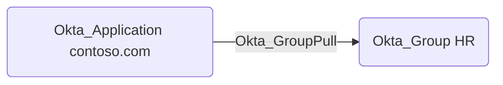

## Edge Schema

- Source: [Okta_Application](../nodes/Okta_Application)
- Destination: [Okta_Group](../nodes/Okta_Group)
- Traversable: ✅

## General Information

The traversable `Okta_GroupPull` edges represent the group synchronization relationships from applications to Okta:

