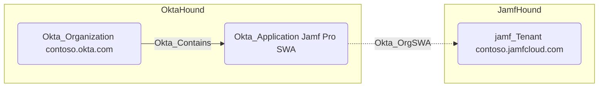

## Edge Schema

- Source: [Okta_Application](../nodes/Okta_Application)
- Destination: [GHOrganization](https://github.com/SpecterOps/GitHound), [jamf_Tenant](https://github.com/SpecterOps/JamfHound), [OPAccount](https://github.com/SpecterOps/1PassHound), [SNOWAccount](https://github.com/SpecterOps/SnowHound)
- Traversable: ❌

## General Information

The non-traversable `Okta_OrgSWA` edges represent the Secure Web Authentication (SWA) relationships between Okta applications and supported external organizations or tenants. SWA stores user credentials in Okta and automatically fills them in when users access the application, which is less secure than federated SSO protocols.

The respective BloodHound collectors, e.g., `GitHound` for GitHub organizations and `JamfHound` for Jamf Pro tenants,
must be used to gather the external node information.
