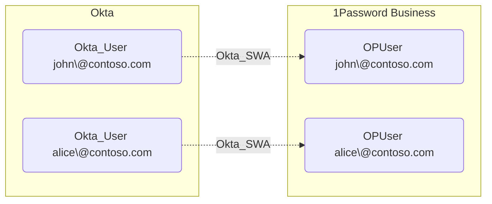

## Edge Schema

- Source: [Okta_User](../nodes/Okta_User)
- Destination: [GHUser](https://github.com/SpecterOps/GitHound), [jamf_Account](https://github.com/SpecterOps/JamfHound), [OPUser](https://github.com/SpecterOps/1PassHound), [SNOWUser](https://github.com/SpecterOps/SnowHound)
- Traversable: ❌

## General Information

The non-traversable hybrid `Okta_SWA` edges represent Secure Web Authentication relationships between Okta users and their linked accounts in external applications. SWA stores user credentials in Okta and automatically fills them in, which is less secure than federated SSO.

