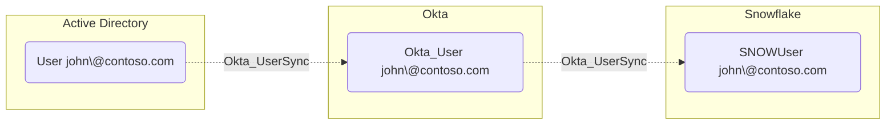

## Edge Schema

- Source: [User](https://bloodhound.specterops.io/resources/nodes/user), [Okta_User](../nodes/Okta_User), [SNOWUser](https://github.com/SpecterOps/SnowHound)
- Destination: [Okta_User](../nodes/Okta_User), [User](https://bloodhound.specterops.io/resources/nodes/user), [AZUser](https://bloodhound.specterops.io/resources/nodes/az-user), [OPUser](https://github.com/SpecterOps/1PassHound), [SNOWUser](https://github.com/SpecterOps/SnowHound)
- Traversable: ❌

## General Information

The non-traversable hybrid `Okta_UserSync` edges represent bidirectional user synchronization relationships between Okta and external directories or applications. These edges indicate that user accounts are linked and synchronized between systems.

