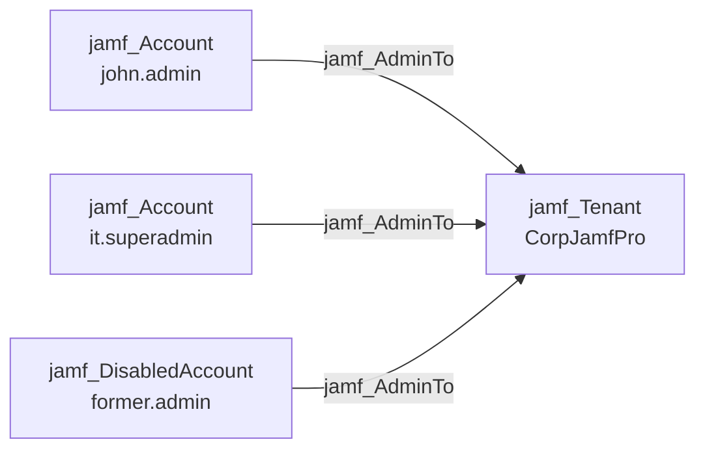

## Edge Schema

- Source: [jamf_Account](/opengraph/extensions/jamfhound/reference/nodes/jamf_account), [jamf_DisabledAccount](/opengraph/extensions/jamfhound/reference/nodes/jamf_disabledaccount) 
- Destination: [jamf_Tenant](/opengraph/extensions/jamfhound/reference/nodes/jamf_tenant)
- Traversable: ✅

## General Information

The traversable `jamf_AdminTo` edge represents full administrative control over the Jamf Pro tenant. This edge is created when an account has "Full Access" access level and "Administrator" privilege set, granting complete control over all resources in the tenant.

