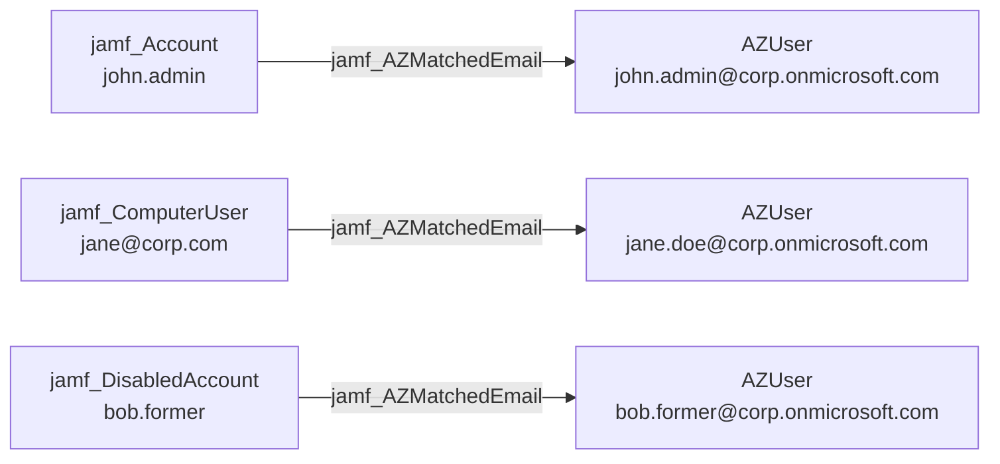

## Edge Schema

- Source: [jamf_Account](/opengraph/extensions/jamfhound/reference/nodes/jamf_account), [jamf_DisabledAccount](/opengraph/extensions/jamfhound/reference/nodes/jamf_disabledaccount), [jamf_ComputerUser](/opengraph/extensions/jamfhound/reference/nodes/jamf_computeruser) 
- Destination: [AZUser](https://bloodhound.specterops.io/resources/nodes/az-user)
- Traversable: ❌

## General Information

The non-traversable `jamf_AZMatchedEmail` edge represents a cross-platform identity correlation created during post-processing. When the Jamf principal's email attribute matches an Azure AD account's email, this edge is created to link the identities across environments. This edge is generated by the `checkAzureUsers` utility rather than the main collection flow.

