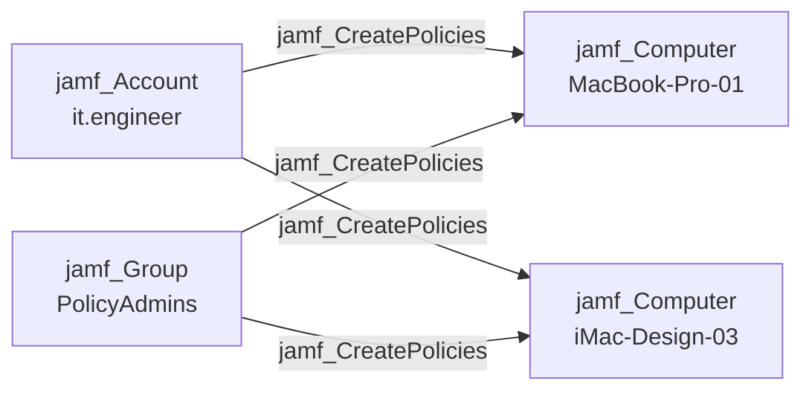

## Edge Schema

- Source: [jamf_Account](/opengraph/extensions/jamfhound/reference/nodes/jamf_account), [jamf_DisabledAccount](/opengraph/extensions/jamfhound/reference/nodes/jamf_disabledaccount), [jamf_Group](/opengraph/extensions/jamfhound/reference/nodes/jamf_group), [jamf_ApiClient](/opengraph/extensions/jamfhound/reference/nodes/jamf_apiclient), [jamf_DisabledApiClient](/opengraph/extensions/jamfhound/reference/nodes/jamf_disabledapiclient) 
- Destination: [jamf_Computer](/opengraph/extensions/jamfhound/reference/nodes/jamf_computer)
- Traversable: ✅

## General Information

The traversable `jamf_CreatePolicies` edge represents possession of the 'Create Policies' privilege allowing code execution on target computers. This is a critical attack path as policies can execute commands, run scripts, and deploy packages to managed computers.

