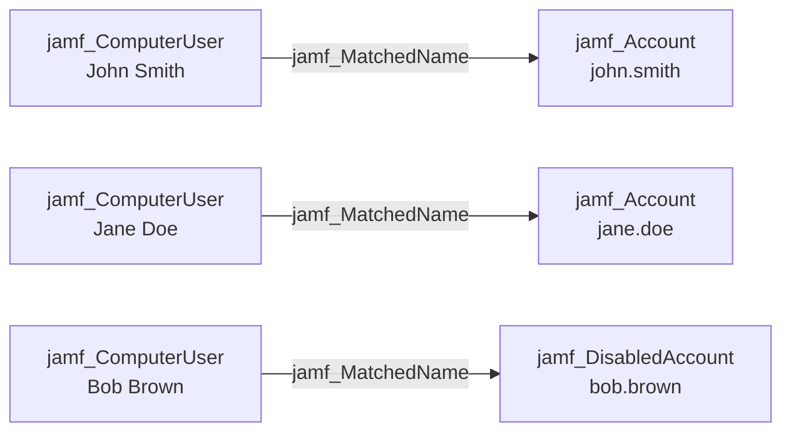

## Edge Schema

- Source: [jamf_ComputerUser](/opengraph/extensions/jamfhound/reference/nodes/jamf_computeruser) 
- Destination: [jamf_Account](/opengraph/extensions/jamfhound/reference/nodes/jamf_account), [jamf_DisabledAccount](/opengraph/extensions/jamfhound/reference/nodes/jamf_disabledaccount)
- Traversable: ✅

## General Information

The traversable `jamf_MatchedName` edge represents an identity correlation where the Jamf computer user's displayname matches the Jamf account's name or displayname. This links physical device access to Jamf administrative privileges.

