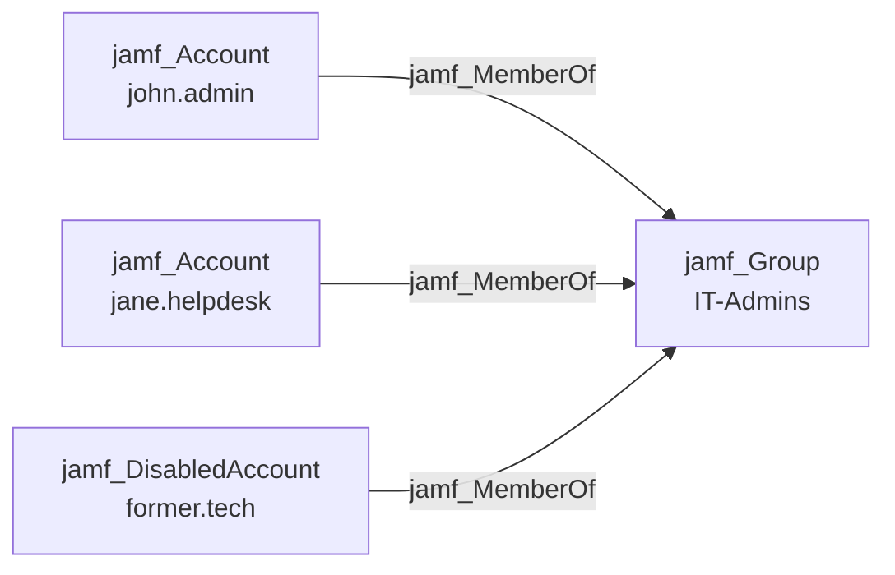

## Edge Schema

- Source: [jamf_Account](/opengraph/extensions/jamfhound/reference/nodes/jamf_account), [jamf_DisabledAccount](/opengraph/extensions/jamfhound/reference/nodes/jamf_disabledaccount) 
- Destination: [jamf_Group](/opengraph/extensions/jamfhound/reference/nodes/jamf_group)
- Traversable: ✅

## General Information

The traversable `jamf_MemberOf` edge represents group membership. The source account is a member of the destination group and inherits the group's permissions. This is a standard identity relationship edge.

