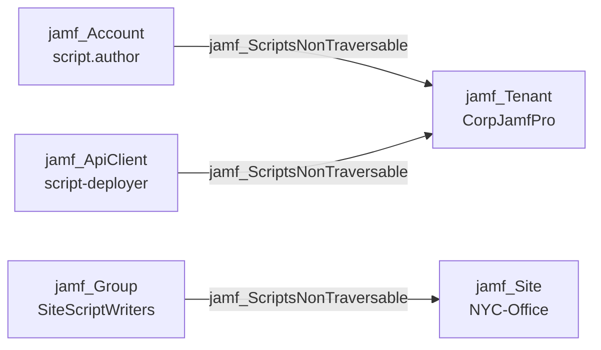

## Edge Schema

- Source: [jamf_Account](/opengraph/extensions/jamfhound/reference/nodes/jamf_account), [jamf_DisabledAccount](/opengraph/extensions/jamfhound/reference/nodes/jamf_disabledaccount), [jamf_Group](/opengraph/extensions/jamfhound/reference/nodes/jamf_group), [jamf_ApiClient](/opengraph/extensions/jamfhound/reference/nodes/jamf_apiclient), [jamf_DisabledApiClient](/opengraph/extensions/jamfhound/reference/nodes/jamf_disabledapiclient) 
- Destination: [jamf_Tenant](/opengraph/extensions/jamfhound/reference/nodes/jamf_tenant), [jamf_Site](/opengraph/extensions/jamfhound/reference/nodes/jamf_site)
- Traversable: ❌

## General Information

The non-traversable `jamf_ScriptsNonTraversable` edge represents the ability to create or update scripts on the target. This edge is non-traversable because script creation/modification alone does not enable code execution — a policy must also be configured to run the script. For accounts with Site Access, this edge targets the specific site; for Full Access accounts, it targets the tenant.

