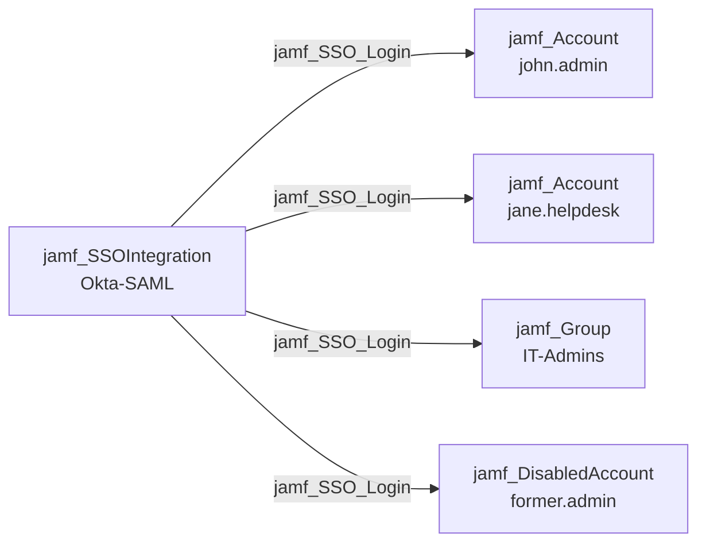

## Edge Schema

- Source: [jamf_SSOIntegration](/opengraph/extensions/jamfhound/reference/nodes/jamf_ssointegration) 
- Destination: [jamf_Account](/opengraph/extensions/jamfhound/reference/nodes/jamf_account), [jamf_DisabledAccount](/opengraph/extensions/jamfhound/reference/nodes/jamf_disabledaccount), [jamf_Group](/opengraph/extensions/jamfhound/reference/nodes/jamf_group)
- Traversable: ✅

## General Information

The traversable `jamf_SSO_Login` edge represents the ability of an SSO identity provider to authenticate as and inherit the privileges of Jamf accounts and groups. SSO sources can map attributes to authenticate as any target principal, making the SSO integration a high-value Tier 0 target.

