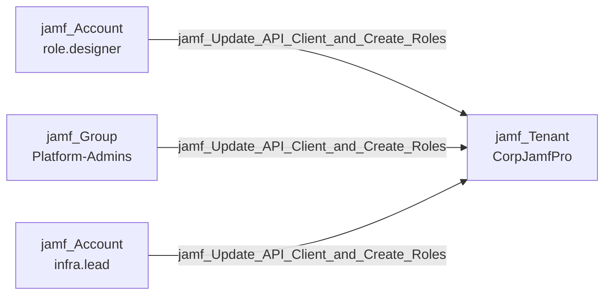

## Edge Schema

- Source: [jamf_Account](/opengraph/extensions/jamfhound/reference/nodes/jamf_account), [jamf_DisabledAccount](/opengraph/extensions/jamfhound/reference/nodes/jamf_disabledaccount), [jamf_Group](/opengraph/extensions/jamfhound/reference/nodes/jamf_group) 
- Destination: [jamf_Tenant](/opengraph/extensions/jamfhound/reference/nodes/jamf_tenant)
- Traversable: ❌

## General Information

The non-traversable `jamf_Update_API_Client_and_Create_Roles` edge represents a combined permission where the source can update existing API clients and create new API roles. This is non-traversable because Jamf accounts and groups cannot retrieve API client credentials without the 'Create API Integration' permission.

