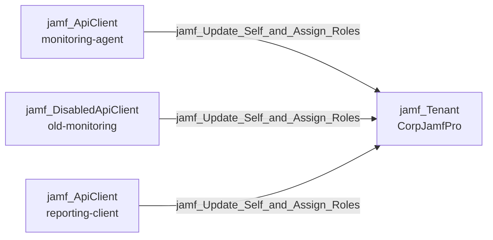

## Edge Schema

- Source: [jamf_ApiClient](/opengraph/extensions/jamfhound/reference/nodes/jamf_apiclient), [jamf_DisabledApiClient](/opengraph/extensions/jamfhound/reference/nodes/jamf_disabledapiclient) 
- Destination: [jamf_Tenant](/opengraph/extensions/jamfhound/reference/nodes/jamf_tenant)
- Traversable: ✅

## General Information

The traversable `jamf_Update_Self_and_Assign_Roles` edge represents an API client that possesses 'Update API Integrations' permission and at least one role exists. This allows the client to update itself to assume the permissions of existing roles. Traversable because the source is already an authenticated API client.

