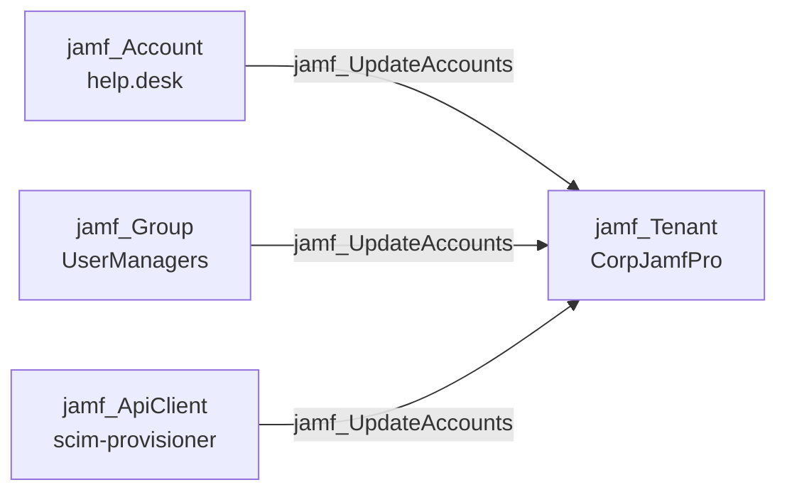

## Edge Schema

- Source: [jamf_Account](/opengraph/extensions/jamfhound/reference/nodes/jamf_account), [jamf_DisabledAccount](/opengraph/extensions/jamfhound/reference/nodes/jamf_disabledaccount), [jamf_Group](/opengraph/extensions/jamfhound/reference/nodes/jamf_group), [jamf_ApiClient](/opengraph/extensions/jamfhound/reference/nodes/jamf_apiclient), [jamf_DisabledApiClient](/opengraph/extensions/jamfhound/reference/nodes/jamf_disabledapiclient) 
- Destination: [jamf_Tenant](/opengraph/extensions/jamfhound/reference/nodes/jamf_tenant)
- Traversable: ✅

## General Information

The traversable `jamf_UpdateAccounts` edge represents possession of the 'Update Accounts' JSS Object permission which allows altering the permissions of existing accounts or groups. If the source is a local Jamf account, they can grant themselves additional permissions, grant permissions to other accounts, modify group memberships, enable disabled accounts, and reset passwords of any Jamf account.

