import AwsReferenceBetaNote from '/snippets/opengraph/extensions/aws-reference-beta-note.mdx';

<AwsReferenceBetaNote />

An IAM role that can be assumed by trusted principals via STS.

## Identifier

The node identifier is the resource ARN in `arn`.

## Properties

Types below describe collected values. `null` means the value can be unavailable; it does not make the AWS resource optional. Collection scope and API responses determine which metadata is available.

| Property | Type | Description |
| --- | --- | --- |
| `name` | `str` | Collector-generated name used to identify the resource in context. |
| `displayname` | `str` | Resource label shown in the graph. |
| `arn` | `str or null` | AWS Resource Name used as the node identifier. |
| `account_id` | `str or null` | AWS account associated with the resource; nullable in the shared model. |
| `region` | `str or null` | AWS region, or `global` for resources without a regional scope. |
| `environmentid` | `str` | Account root ARN identifying the OpenGraph environment. |
| `role_name` | `str` | Native IAM role name. |
| `role_id` | `str` | Native IAM role identifier. |
| `path` | `str` | IAM path assigned to the role. |
| `description` | `str or null` | Role description. |
| `assume_role_policy_document` | `str or null` | JSON-encoded role trust policy. |
| `max_session_duration` | `int or null` | Maximum role session duration in seconds. |
| `last_used_date` | `str or null` | Timestamp when the role was last used. |
| `last_used_region` | `str or null` | AWS region in which the role was last used. |
| `tags` | `list[str] or null` | IAM tags formatted as `key=value` strings. |
| `permissions_boundary_arn` | `str or null` | ARN of the permissions boundary applied to the role. |
| `inline_policies` | `list[str] or null` | Inline policy documents encoded as JSON strings on the principal. |

## Diagram

Solid arrows show traversable edges; dotted arrows show non-traversable edges. Each view shows the node in relation to the listed endpoint types.

### Inbound edges (1)

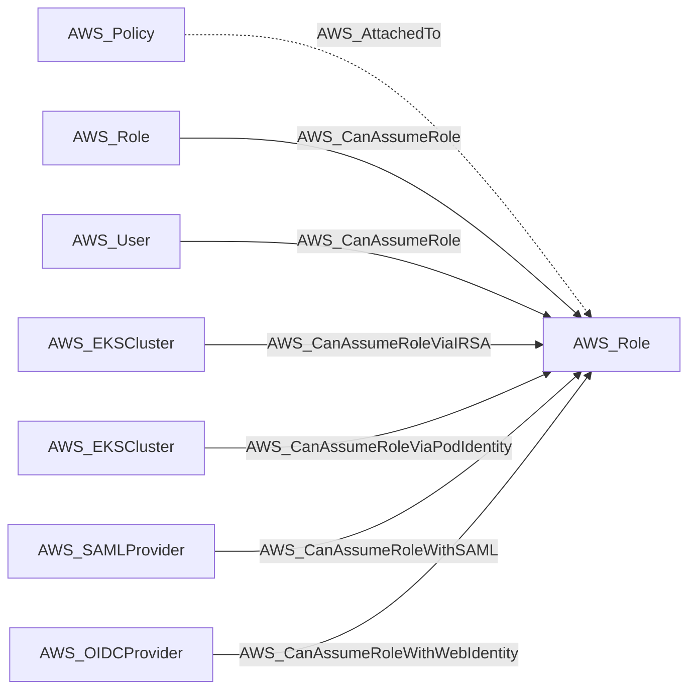
```mermaid
graph LR
    n["AWS_Role"]
    p0_0["AWS_Policy"]
    p0_0 -.->|AWS_AttachedTo| n
    p1_0["AWS_Role"]
    p1_0 -->|AWS_CanAssumeRole| n
    p1_1["AWS_User"]
    p1_1 -->|AWS_CanAssumeRole| n
    p2_0["AWS_EKSCluster"]
    p2_0 -->|AWS_CanAssumeRoleViaIRSA| n
    p3_0["AWS_EKSCluster"]
    p3_0 -->|AWS_CanAssumeRoleViaPodIdentity| n
    p4_0["AWS_SAMLProvider"]
    p4_0 -->|AWS_CanAssumeRoleWithSAML| n
    p5_0["AWS_OIDCProvider"]
    p5_0 -->|AWS_CanAssumeRoleWithWebIdentity| n
```

### Inbound edges (2)

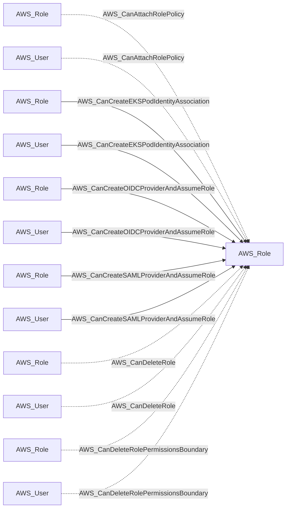
```mermaid
graph LR
    n["AWS_Role"]
    p0_0["AWS_Role"]
    p0_0 -.->|AWS_CanAttachRolePolicy| n
    p0_1["AWS_User"]
    p0_1 -.->|AWS_CanAttachRolePolicy| n
    p1_0["AWS_Role"]
    p1_0 -->|AWS_CanCreateEKSPodIdentityAssociation| n
    p1_1["AWS_User"]
    p1_1 -->|AWS_CanCreateEKSPodIdentityAssociation| n
    p2_0["AWS_Role"]
    p2_0 -->|AWS_CanCreateOIDCProviderAndAssumeRole| n
    p2_1["AWS_User"]
    p2_1 -->|AWS_CanCreateOIDCProviderAndAssumeRole| n
    p3_0["AWS_Role"]
    p3_0 -->|AWS_CanCreateSAMLProviderAndAssumeRole| n
    p3_1["AWS_User"]
    p3_1 -->|AWS_CanCreateSAMLProviderAndAssumeRole| n
    p4_0["AWS_Role"]
    p4_0 -.->|AWS_CanDeleteRole| n
    p4_1["AWS_User"]
    p4_1 -.->|AWS_CanDeleteRole| n
    p5_0["AWS_Role"]
    p5_0 -.->|AWS_CanDeleteRolePermissionsBoundary| n
    p5_1["AWS_User"]
    p5_1 -.->|AWS_CanDeleteRolePermissionsBoundary| n
```

### Inbound edges (3)

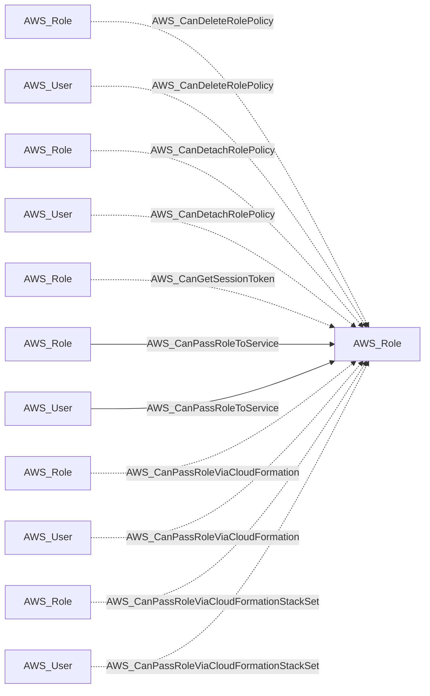
```mermaid
graph LR
    n["AWS_Role"]
    p0_0["AWS_Role"]
    p0_0 -.->|AWS_CanDeleteRolePolicy| n
    p0_1["AWS_User"]
    p0_1 -.->|AWS_CanDeleteRolePolicy| n
    p1_0["AWS_Role"]
    p1_0 -.->|AWS_CanDetachRolePolicy| n
    p1_1["AWS_User"]
    p1_1 -.->|AWS_CanDetachRolePolicy| n
    p2_0["AWS_Role"]
    p2_0 -.->|AWS_CanGetSessionToken| n
    p3_0["AWS_Role"]
    p3_0 -->|AWS_CanPassRoleToService| n
    p3_1["AWS_User"]
    p3_1 -->|AWS_CanPassRoleToService| n
    p4_0["AWS_Role"]
    p4_0 -.->|AWS_CanPassRoleViaCloudFormation| n
    p4_1["AWS_User"]
    p4_1 -.->|AWS_CanPassRoleViaCloudFormation| n
    p5_0["AWS_Role"]
    p5_0 -.->|AWS_CanPassRoleViaCloudFormationStackSet| n
    p5_1["AWS_User"]
    p5_1 -.->|AWS_CanPassRoleViaCloudFormationStackSet| n
```

### Inbound edges (4)

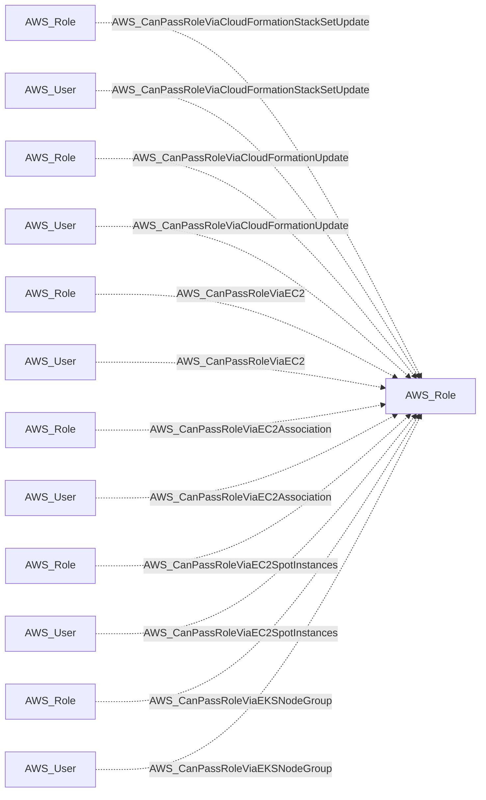
```mermaid
graph LR
    n["AWS_Role"]
    p0_0["AWS_Role"]
    p0_0 -.->|AWS_CanPassRoleViaCloudFormationStackSetUpdate| n
    p0_1["AWS_User"]
    p0_1 -.->|AWS_CanPassRoleViaCloudFormationStackSetUpdate| n
    p1_0["AWS_Role"]
    p1_0 -.->|AWS_CanPassRoleViaCloudFormationUpdate| n
    p1_1["AWS_User"]
    p1_1 -.->|AWS_CanPassRoleViaCloudFormationUpdate| n
    p2_0["AWS_Role"]
    p2_0 -.->|AWS_CanPassRoleViaEC2| n
    p2_1["AWS_User"]
    p2_1 -.->|AWS_CanPassRoleViaEC2| n
    p3_0["AWS_Role"]
    p3_0 -.->|AWS_CanPassRoleViaEC2Association| n
    p3_1["AWS_User"]
    p3_1 -.->|AWS_CanPassRoleViaEC2Association| n
    p4_0["AWS_Role"]
    p4_0 -.->|AWS_CanPassRoleViaEC2SpotInstances| n
    p4_1["AWS_User"]
    p4_1 -.->|AWS_CanPassRoleViaEC2SpotInstances| n
    p5_0["AWS_Role"]
    p5_0 -.->|AWS_CanPassRoleViaEKSNodeGroup| n
    p5_1["AWS_User"]
    p5_1 -.->|AWS_CanPassRoleViaEKSNodeGroup| n
```

### Inbound edges (5)

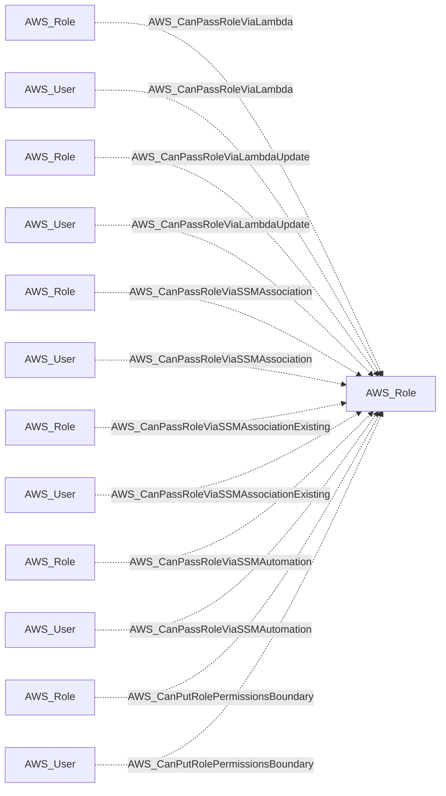
```mermaid
graph LR
    n["AWS_Role"]
    p0_0["AWS_Role"]
    p0_0 -.->|AWS_CanPassRoleViaLambda| n
    p0_1["AWS_User"]
    p0_1 -.->|AWS_CanPassRoleViaLambda| n
    p1_0["AWS_Role"]
    p1_0 -.->|AWS_CanPassRoleViaLambdaUpdate| n
    p1_1["AWS_User"]
    p1_1 -.->|AWS_CanPassRoleViaLambdaUpdate| n
    p2_0["AWS_Role"]
    p2_0 -.->|AWS_CanPassRoleViaSSMAssociation| n
    p2_1["AWS_User"]
    p2_1 -.->|AWS_CanPassRoleViaSSMAssociation| n
    p3_0["AWS_Role"]
    p3_0 -.->|AWS_CanPassRoleViaSSMAssociationExisting| n
    p3_1["AWS_User"]
    p3_1 -.->|AWS_CanPassRoleViaSSMAssociationExisting| n
    p4_0["AWS_Role"]
    p4_0 -.->|AWS_CanPassRoleViaSSMAutomation| n
    p4_1["AWS_User"]
    p4_1 -.->|AWS_CanPassRoleViaSSMAutomation| n
    p5_0["AWS_Role"]
    p5_0 -.->|AWS_CanPutRolePermissionsBoundary| n
    p5_1["AWS_User"]
    p5_1 -.->|AWS_CanPutRolePermissionsBoundary| n
```

### Inbound edges (6)

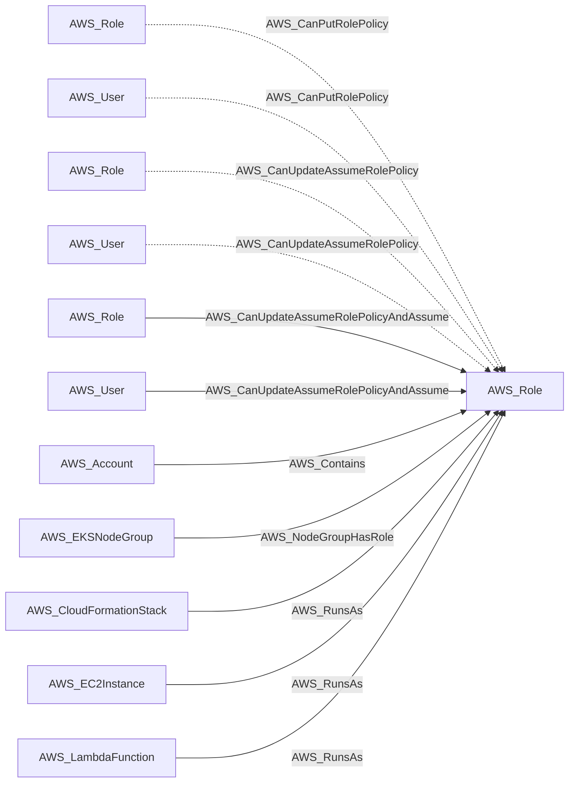
```mermaid
graph LR
    n["AWS_Role"]
    p0_0["AWS_Role"]
    p0_0 -.->|AWS_CanPutRolePolicy| n
    p0_1["AWS_User"]
    p0_1 -.->|AWS_CanPutRolePolicy| n
    p1_0["AWS_Role"]
    p1_0 -.->|AWS_CanUpdateAssumeRolePolicy| n
    p1_1["AWS_User"]
    p1_1 -.->|AWS_CanUpdateAssumeRolePolicy| n
    p2_0["AWS_Role"]
    p2_0 -->|AWS_CanUpdateAssumeRolePolicyAndAssume| n
    p2_1["AWS_User"]
    p2_1 -->|AWS_CanUpdateAssumeRolePolicyAndAssume| n
    p3_0["AWS_Account"]
    p3_0 -->|AWS_Contains| n
    p4_0["AWS_EKSNodeGroup"]
    p4_0 -->|AWS_NodeGroupHasRole| n
    p5_0["AWS_CloudFormationStack"]
    p5_0 -->|AWS_RunsAs| n
    p5_1["AWS_EC2Instance"]
    p5_1 -->|AWS_RunsAs| n
    p5_2["AWS_LambdaFunction"]
    p5_2 -->|AWS_RunsAs| n
```

### Inbound edges (7)

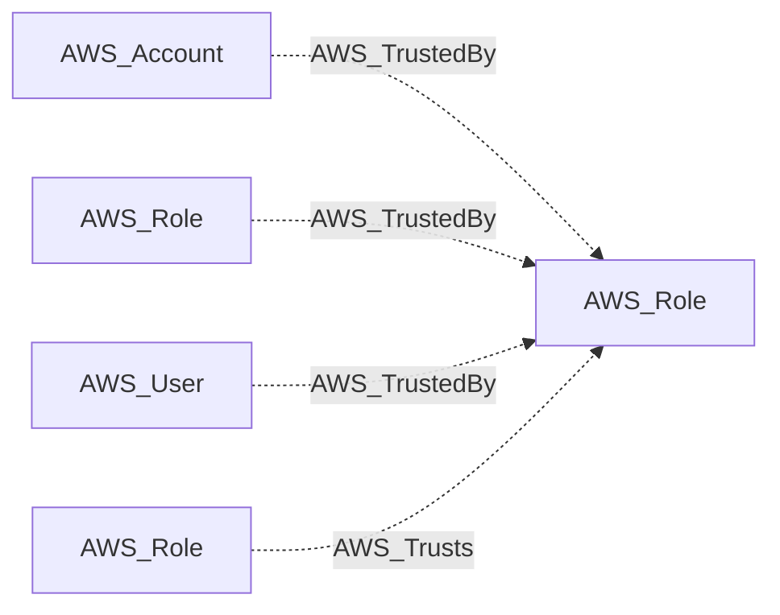
```mermaid
graph LR
    n["AWS_Role"]
    p0_0["AWS_Account"]
    p0_0 -.->|AWS_TrustedBy| n
    p0_1["AWS_Role"]
    p0_1 -.->|AWS_TrustedBy| n
    p0_2["AWS_User"]
    p0_2 -.->|AWS_TrustedBy| n
    p1_0["AWS_Role"]
    p1_0 -.->|AWS_Trusts| n
```

### Outbound edges (1)

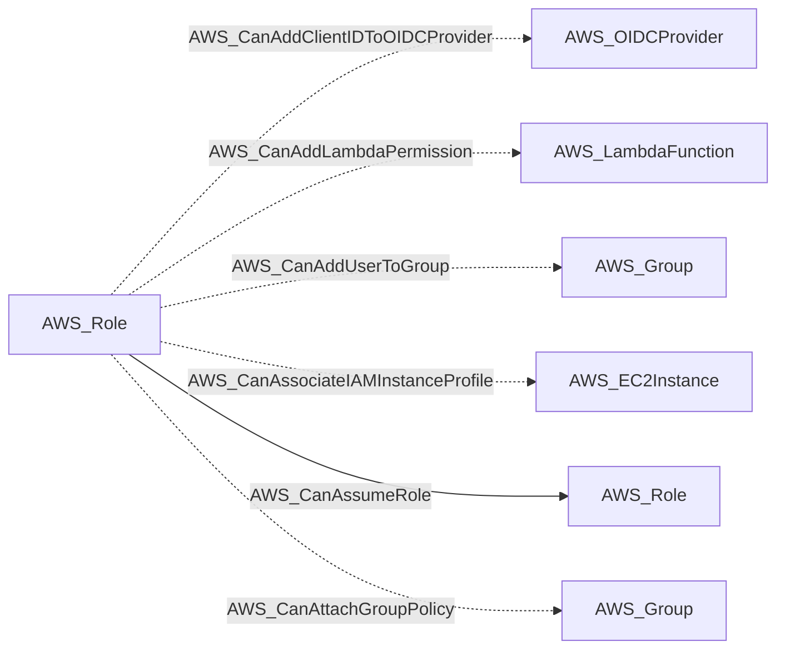
```mermaid
graph LR
    n["AWS_Role"]
    p0_0["AWS_OIDCProvider"]
    n -.->|AWS_CanAddClientIDToOIDCProvider| p0_0
    p1_0["AWS_LambdaFunction"]
    n -.->|AWS_CanAddLambdaPermission| p1_0
    p2_0["AWS_Group"]
    n -.->|AWS_CanAddUserToGroup| p2_0
    p3_0["AWS_EC2Instance"]
    n -.->|AWS_CanAssociateIAMInstanceProfile| p3_0
    p4_0["AWS_Role"]
    n -->|AWS_CanAssumeRole| p4_0
    p5_0["AWS_Group"]
    n -.->|AWS_CanAttachGroupPolicy| p5_0
```

### Outbound edges (2)

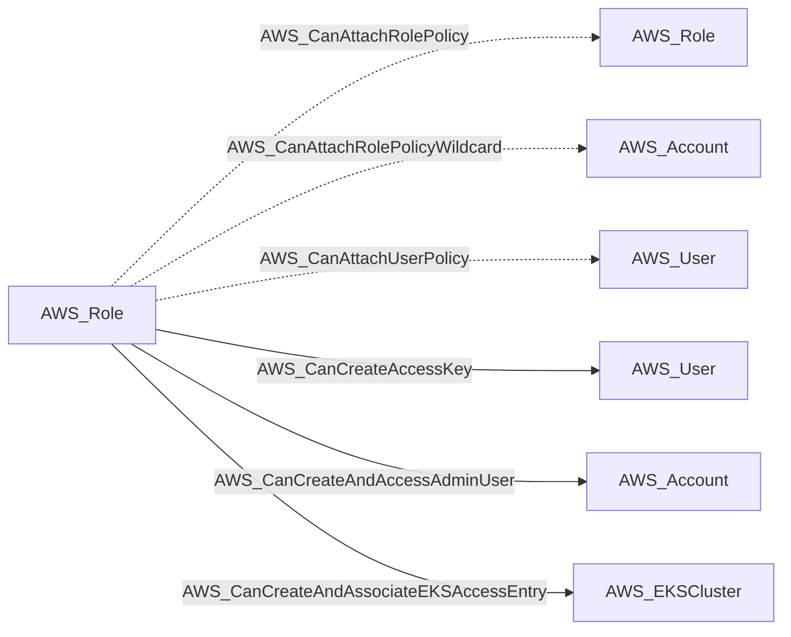
```mermaid
graph LR
    n["AWS_Role"]
    p0_0["AWS_Role"]
    n -.->|AWS_CanAttachRolePolicy| p0_0
    p1_0["AWS_Account"]
    n -.->|AWS_CanAttachRolePolicyWildcard| p1_0
    p2_0["AWS_User"]
    n -.->|AWS_CanAttachUserPolicy| p2_0
    p3_0["AWS_User"]
    n -->|AWS_CanCreateAccessKey| p3_0
    p4_0["AWS_Account"]
    n -->|AWS_CanCreateAndAccessAdminUser| p4_0
    p5_0["AWS_EKSCluster"]
    n -->|AWS_CanCreateAndAssociateEKSAccessEntry| p5_0
```

### Outbound edges (3)

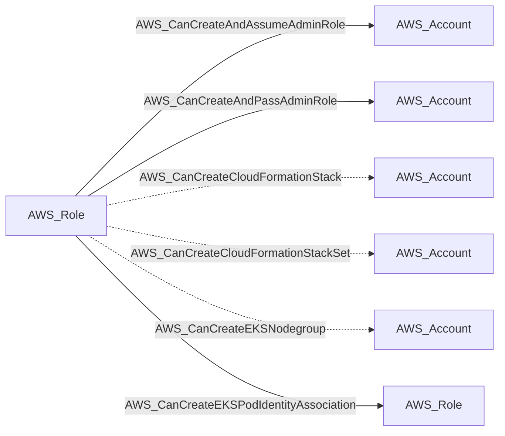
```mermaid
graph LR
    n["AWS_Role"]
    p0_0["AWS_Account"]
    n -->|AWS_CanCreateAndAssumeAdminRole| p0_0
    p1_0["AWS_Account"]
    n -->|AWS_CanCreateAndPassAdminRole| p1_0
    p2_0["AWS_Account"]
    n -.->|AWS_CanCreateCloudFormationStack| p2_0
    p3_0["AWS_Account"]
    n -.->|AWS_CanCreateCloudFormationStackSet| p3_0
    p4_0["AWS_Account"]
    n -.->|AWS_CanCreateEKSNodegroup| p4_0
    p5_0["AWS_Role"]
    n -->|AWS_CanCreateEKSPodIdentityAssociation| p5_0
```

### Outbound edges (4)

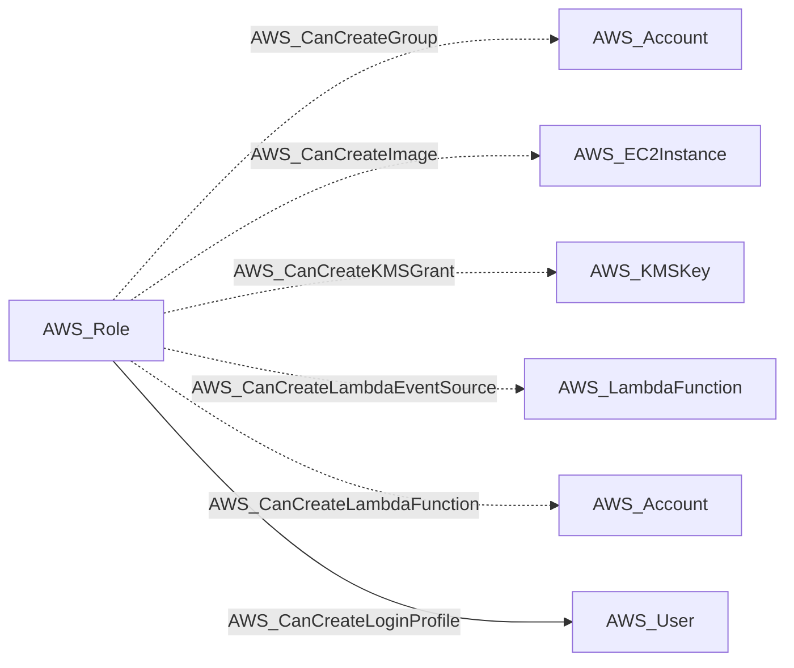
```mermaid
graph LR
    n["AWS_Role"]
    p0_0["AWS_Account"]
    n -.->|AWS_CanCreateGroup| p0_0
    p1_0["AWS_EC2Instance"]
    n -.->|AWS_CanCreateImage| p1_0
    p2_0["AWS_KMSKey"]
    n -.->|AWS_CanCreateKMSGrant| p2_0
    p3_0["AWS_LambdaFunction"]
    n -.->|AWS_CanCreateLambdaEventSource| p3_0
    p4_0["AWS_Account"]
    n -.->|AWS_CanCreateLambdaFunction| p4_0
    p5_0["AWS_User"]
    n -->|AWS_CanCreateLoginProfile| p5_0
```

### Outbound edges (5)

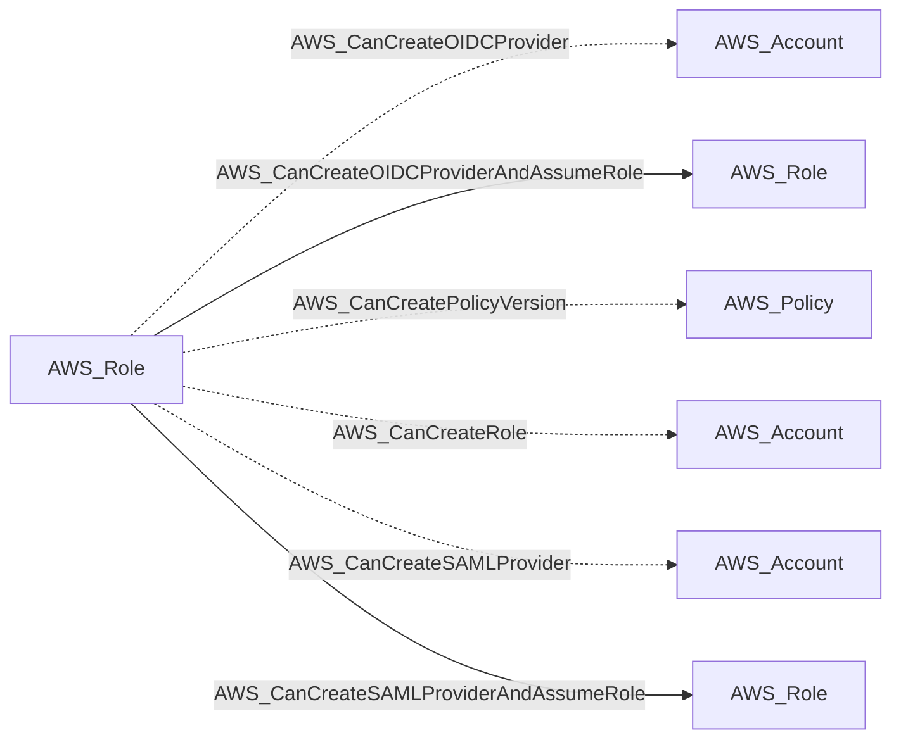
```mermaid
graph LR
    n["AWS_Role"]
    p0_0["AWS_Account"]
    n -.->|AWS_CanCreateOIDCProvider| p0_0
    p1_0["AWS_Role"]
    n -->|AWS_CanCreateOIDCProviderAndAssumeRole| p1_0
    p2_0["AWS_Policy"]
    n -.->|AWS_CanCreatePolicyVersion| p2_0
    p3_0["AWS_Account"]
    n -.->|AWS_CanCreateRole| p3_0
    p4_0["AWS_Account"]
    n -.->|AWS_CanCreateSAMLProvider| p4_0
    p5_0["AWS_Role"]
    n -->|AWS_CanCreateSAMLProviderAndAssumeRole| p5_0
```

### Outbound edges (6)

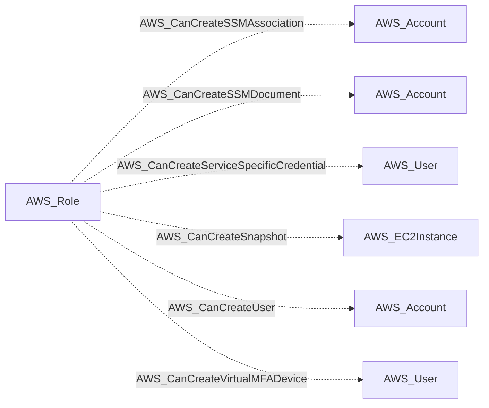
```mermaid
graph LR
    n["AWS_Role"]
    p0_0["AWS_Account"]
    n -.->|AWS_CanCreateSSMAssociation| p0_0
    p1_0["AWS_Account"]
    n -.->|AWS_CanCreateSSMDocument| p1_0
    p2_0["AWS_User"]
    n -.->|AWS_CanCreateServiceSpecificCredential| p2_0
    p3_0["AWS_EC2Instance"]
    n -.->|AWS_CanCreateSnapshot| p3_0
    p4_0["AWS_Account"]
    n -.->|AWS_CanCreateUser| p4_0
    p5_0["AWS_User"]
    n -.->|AWS_CanCreateVirtualMFADevice| p5_0
```

### Outbound edges (7)

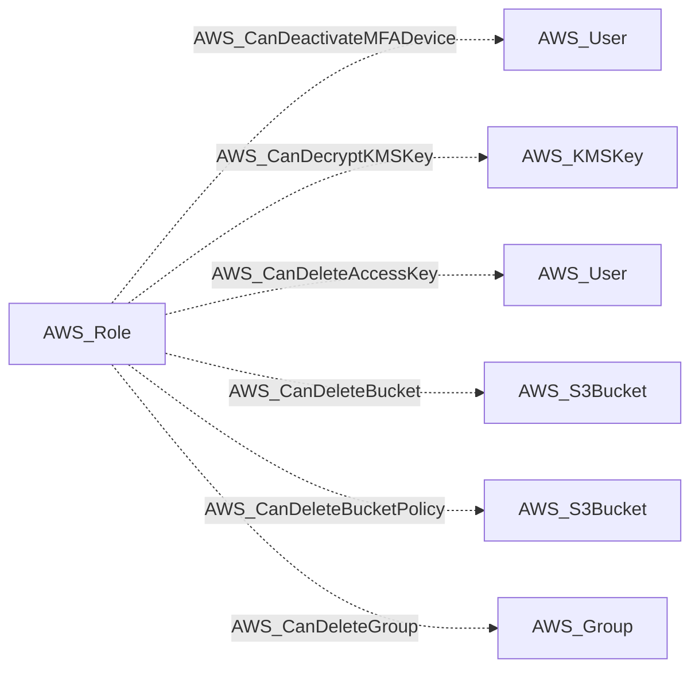
```mermaid
graph LR
    n["AWS_Role"]
    p0_0["AWS_User"]
    n -.->|AWS_CanDeactivateMFADevice| p0_0
    p1_0["AWS_KMSKey"]
    n -.->|AWS_CanDecryptKMSKey| p1_0
    p2_0["AWS_User"]
    n -.->|AWS_CanDeleteAccessKey| p2_0
    p3_0["AWS_S3Bucket"]
    n -.->|AWS_CanDeleteBucket| p3_0
    p4_0["AWS_S3Bucket"]
    n -.->|AWS_CanDeleteBucketPolicy| p4_0
    p5_0["AWS_Group"]
    n -.->|AWS_CanDeleteGroup| p5_0
```

### Outbound edges (8)

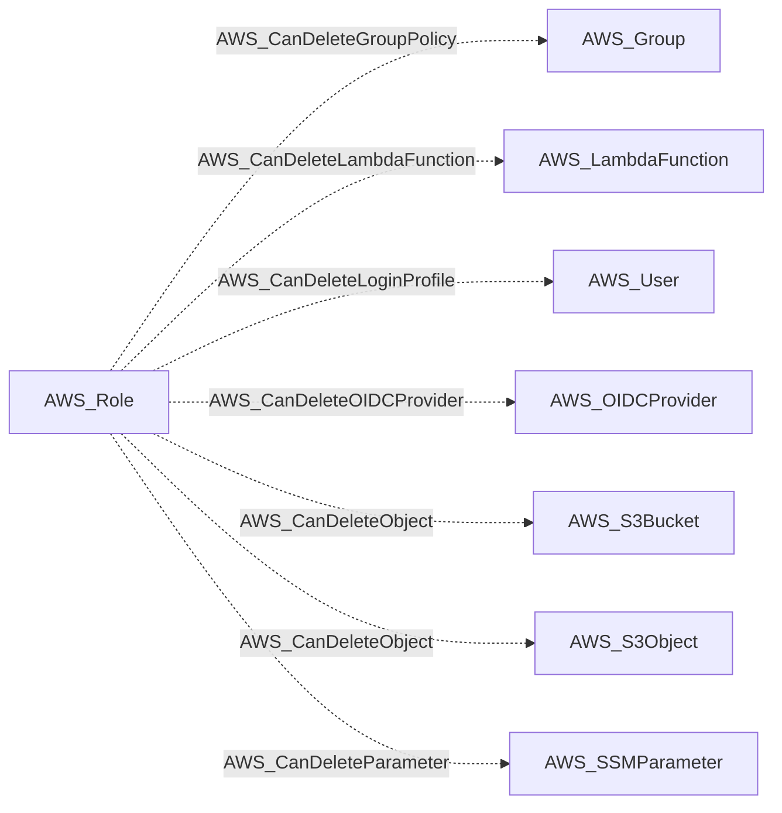
```mermaid
graph LR
    n["AWS_Role"]
    p0_0["AWS_Group"]
    n -.->|AWS_CanDeleteGroupPolicy| p0_0
    p1_0["AWS_LambdaFunction"]
    n -.->|AWS_CanDeleteLambdaFunction| p1_0
    p2_0["AWS_User"]
    n -.->|AWS_CanDeleteLoginProfile| p2_0
    p3_0["AWS_OIDCProvider"]
    n -.->|AWS_CanDeleteOIDCProvider| p3_0
    p4_0["AWS_S3Bucket"]
    n -.->|AWS_CanDeleteObject| p4_0
    p4_1["AWS_S3Object"]
    n -.->|AWS_CanDeleteObject| p4_1
    p5_0["AWS_SSMParameter"]
    n -.->|AWS_CanDeleteParameter| p5_0
```

### Outbound edges (9)

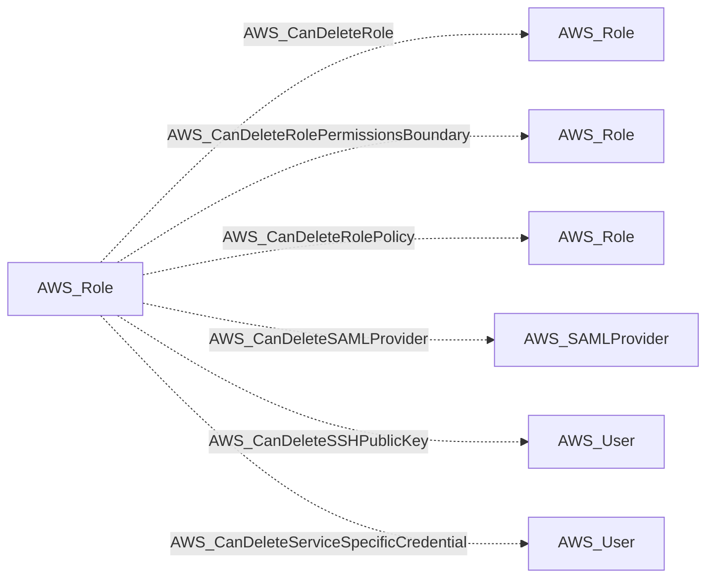
```mermaid
graph LR
    n["AWS_Role"]
    p0_0["AWS_Role"]
    n -.->|AWS_CanDeleteRole| p0_0
    p1_0["AWS_Role"]
    n -.->|AWS_CanDeleteRolePermissionsBoundary| p1_0
    p2_0["AWS_Role"]
    n -.->|AWS_CanDeleteRolePolicy| p2_0
    p3_0["AWS_SAMLProvider"]
    n -.->|AWS_CanDeleteSAMLProvider| p3_0
    p4_0["AWS_User"]
    n -.->|AWS_CanDeleteSSHPublicKey| p4_0
    p5_0["AWS_User"]
    n -.->|AWS_CanDeleteServiceSpecificCredential| p5_0
```

### Outbound edges (10)

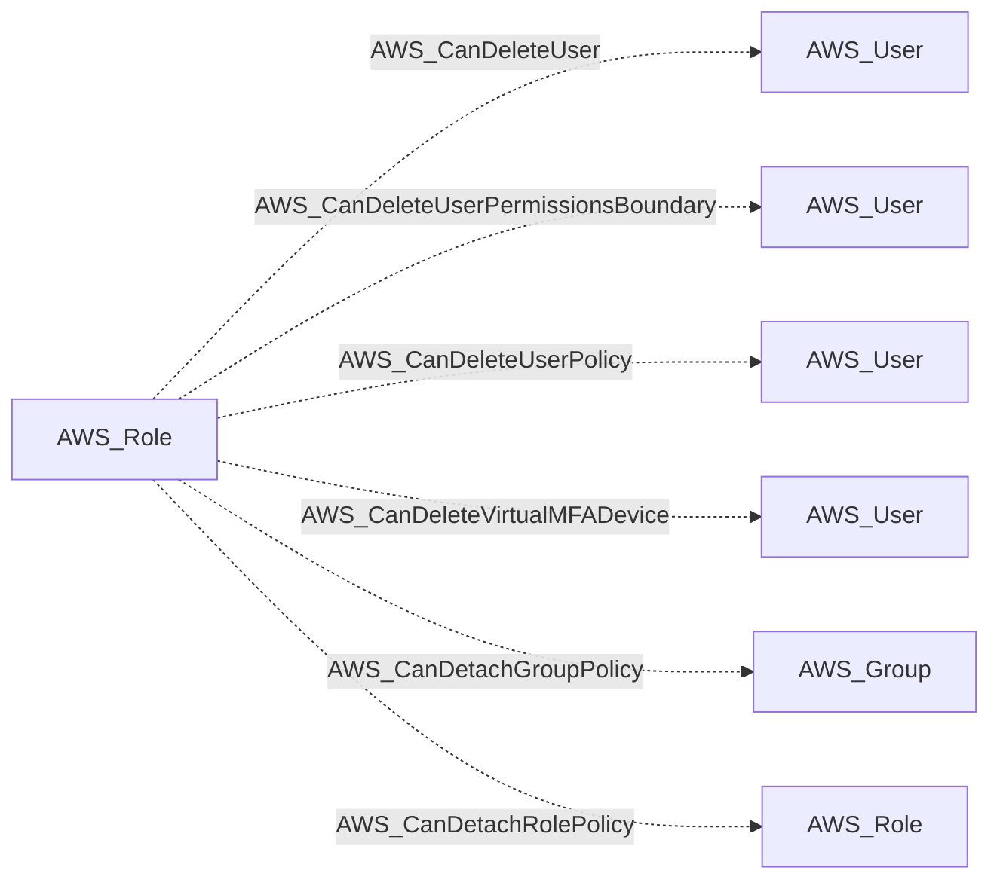
```mermaid
graph LR
    n["AWS_Role"]
    p0_0["AWS_User"]
    n -.->|AWS_CanDeleteUser| p0_0
    p1_0["AWS_User"]
    n -.->|AWS_CanDeleteUserPermissionsBoundary| p1_0
    p2_0["AWS_User"]
    n -.->|AWS_CanDeleteUserPolicy| p2_0
    p3_0["AWS_User"]
    n -.->|AWS_CanDeleteVirtualMFADevice| p3_0
    p4_0["AWS_Group"]
    n -.->|AWS_CanDetachGroupPolicy| p4_0
    p5_0["AWS_Role"]
    n -.->|AWS_CanDetachRolePolicy| p5_0
```

### Outbound edges (11)

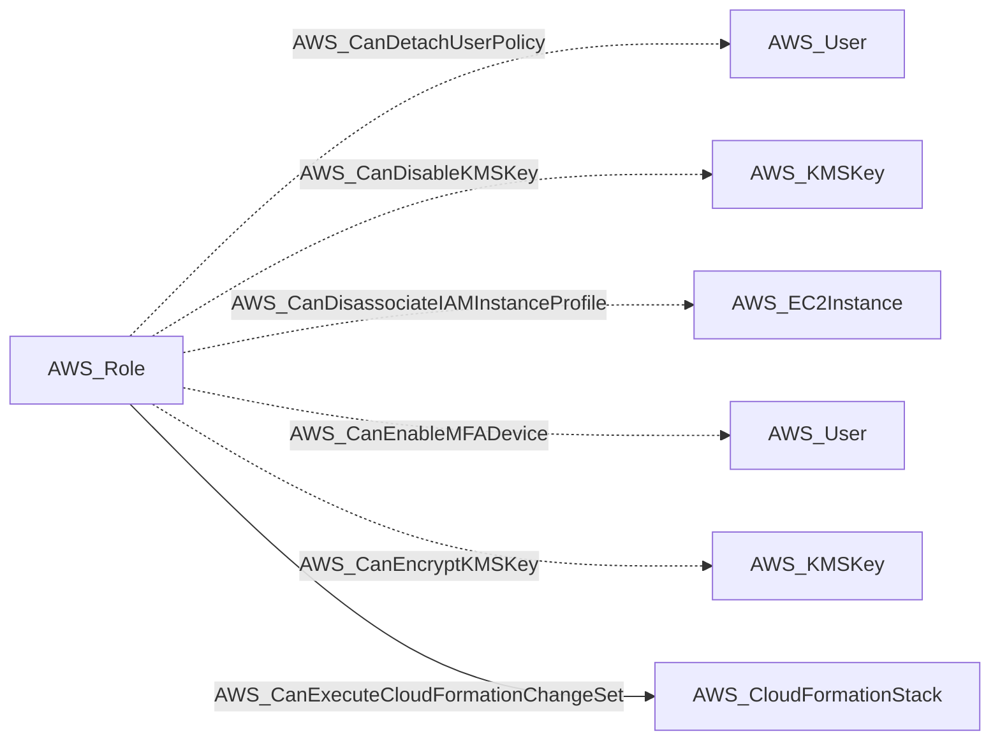
```mermaid
graph LR
    n["AWS_Role"]
    p0_0["AWS_User"]
    n -.->|AWS_CanDetachUserPolicy| p0_0
    p1_0["AWS_KMSKey"]
    n -.->|AWS_CanDisableKMSKey| p1_0
    p2_0["AWS_EC2Instance"]
    n -.->|AWS_CanDisassociateIAMInstanceProfile| p2_0
    p3_0["AWS_User"]
    n -.->|AWS_CanEnableMFADevice| p3_0
    p4_0["AWS_KMSKey"]
    n -.->|AWS_CanEncryptKMSKey| p4_0
    p5_0["AWS_CloudFormationStack"]
    n -->|AWS_CanExecuteCloudFormationChangeSet| p5_0
```

### Outbound edges (12)

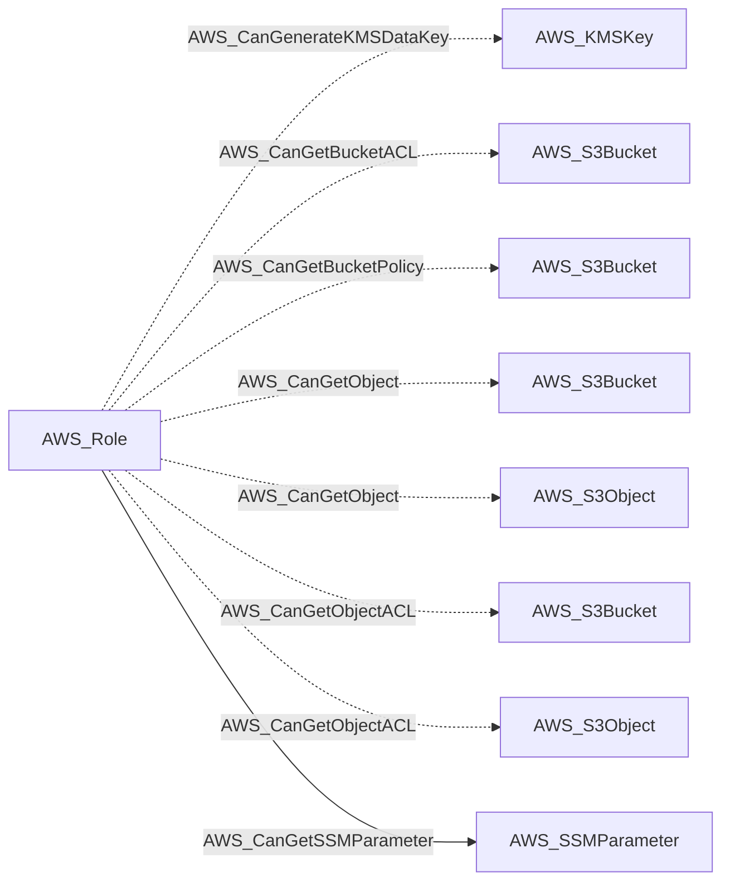
```mermaid
graph LR
    n["AWS_Role"]
    p0_0["AWS_KMSKey"]
    n -.->|AWS_CanGenerateKMSDataKey| p0_0
    p1_0["AWS_S3Bucket"]
    n -.->|AWS_CanGetBucketACL| p1_0
    p2_0["AWS_S3Bucket"]
    n -.->|AWS_CanGetBucketPolicy| p2_0
    p3_0["AWS_S3Bucket"]
    n -.->|AWS_CanGetObject| p3_0
    p3_1["AWS_S3Object"]
    n -.->|AWS_CanGetObject| p3_1
    p4_0["AWS_S3Bucket"]
    n -.->|AWS_CanGetObjectACL| p4_0
    p4_1["AWS_S3Object"]
    n -.->|AWS_CanGetObjectACL| p4_1
    p5_0["AWS_SSMParameter"]
    n -->|AWS_CanGetSSMParameter| p5_0
```

### Outbound edges (13)

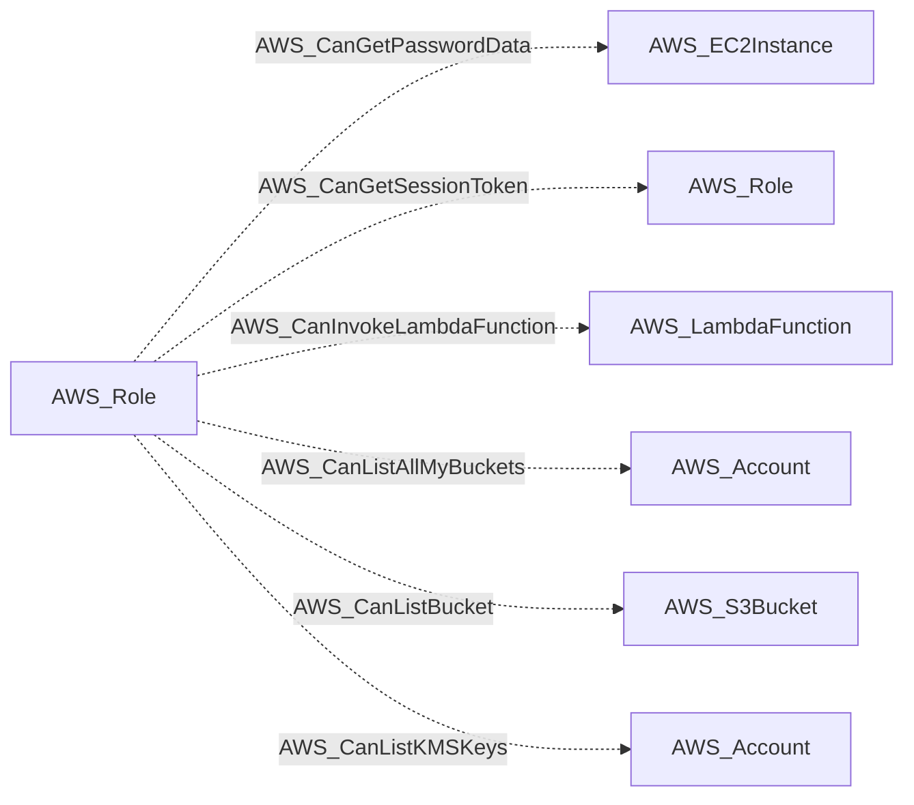
```mermaid
graph LR
    n["AWS_Role"]
    p0_0["AWS_EC2Instance"]
    n -.->|AWS_CanGetPasswordData| p0_0
    p1_0["AWS_Role"]
    n -.->|AWS_CanGetSessionToken| p1_0
    p2_0["AWS_LambdaFunction"]
    n -.->|AWS_CanInvokeLambdaFunction| p2_0
    p3_0["AWS_Account"]
    n -.->|AWS_CanListAllMyBuckets| p3_0
    p4_0["AWS_S3Bucket"]
    n -.->|AWS_CanListBucket| p4_0
    p5_0["AWS_Account"]
    n -.->|AWS_CanListKMSKeys| p5_0
```

### Outbound edges (14)

```mermaid
graph LR
    n["AWS_Role"]
    p0_0["AWS_EC2Instance"]
    n -->|AWS_CanModifyEC2InstanceAttribute| p0_0
    p1_0["AWS_KMSKey"]
    n -.->|AWS_CanModifyKMSKeyPolicy| p1_0
    p2_0["AWS_Role"]
    n -->|AWS_CanPassRoleToService| p2_0
    p3_0["AWS_Role"]
    n -.->|AWS_CanPassRoleViaCloudFormation| p3_0
    p4_0["AWS_Role"]
    n -.->|AWS_CanPassRoleViaCloudFormationStackSet| p4_0
    p5_0["AWS_Role"]
    n -.->|AWS_CanPassRoleViaCloudFormationStackSetUpdate| p5_0
```

### Outbound edges (15)

```mermaid
graph LR
    n["AWS_Role"]
    p0_0["AWS_Role"]
    n -.->|AWS_CanPassRoleViaCloudFormationUpdate| p0_0
    p1_0["AWS_Role"]
    n -.->|AWS_CanPassRoleViaEC2| p1_0
    p2_0["AWS_Role"]
    n -.->|AWS_CanPassRoleViaEC2Association| p2_0
    p3_0["AWS_Role"]
    n -.->|AWS_CanPassRoleViaEC2SpotInstances| p3_0
    p4_0["AWS_Role"]
    n -.->|AWS_CanPassRoleViaEKSNodeGroup| p4_0
    p5_0["AWS_Role"]
    n -.->|AWS_CanPassRoleViaLambda| p5_0
```

### Outbound edges (16)

```mermaid
graph LR
    n["AWS_Role"]
    p0_0["AWS_Role"]
    n -.->|AWS_CanPassRoleViaLambdaUpdate| p0_0
    p1_0["AWS_Role"]
    n -.->|AWS_CanPassRoleViaSSMAssociation| p1_0
    p2_0["AWS_Role"]
    n -.->|AWS_CanPassRoleViaSSMAssociationExisting| p2_0
    p3_0["AWS_Role"]
    n -.->|AWS_CanPassRoleViaSSMAutomation| p3_0
    p4_0["AWS_Account"]
    n -.->|AWS_CanPutAccountPublicAccessBlock| p4_0
    p5_0["AWS_S3Bucket"]
    n -.->|AWS_CanPutBucketACL| p5_0
```

### Outbound edges (17)

```mermaid
graph LR
    n["AWS_Role"]
    p0_0["AWS_S3Bucket"]
    n -.->|AWS_CanPutBucketOwnershipControls| p0_0
    p1_0["AWS_S3Bucket"]
    n -.->|AWS_CanPutBucketPolicy| p1_0
    p2_0["AWS_S3Bucket"]
    n -.->|AWS_CanPutBucketPublicAccessBlock| p2_0
    p3_0["AWS_Group"]
    n -.->|AWS_CanPutGroupPolicy| p3_0
    p4_0["AWS_S3Bucket"]
    n -.->|AWS_CanPutObject| p4_0
    p4_1["AWS_S3Object"]
    n -.->|AWS_CanPutObject| p4_1
    p5_0["AWS_S3Bucket"]
    n -.->|AWS_CanPutObjectACL| p5_0
    p5_1["AWS_S3Object"]
    n -.->|AWS_CanPutObjectACL| p5_1
```

### Outbound edges (18)

```mermaid
graph LR
    n["AWS_Role"]
    p0_0["AWS_SSMParameter"]
    n -.->|AWS_CanPutParameter| p0_0
    p1_0["AWS_Role"]
    n -.->|AWS_CanPutRolePermissionsBoundary| p1_0
    p2_0["AWS_Role"]
    n -.->|AWS_CanPutRolePolicy| p2_0
    p3_0["AWS_Account"]
    n -.->|AWS_CanPutRolePolicyWildcard| p3_0
    p4_0["AWS_User"]
    n -.->|AWS_CanPutUserPermissionsBoundary| p4_0
    p5_0["AWS_User"]
    n -.->|AWS_CanPutUserPolicy| p5_0
```

### Outbound edges (19)

```mermaid
graph LR
    n["AWS_Role"]
    p0_0["AWS_OIDCProvider"]
    n -.->|AWS_CanRemoveClientIDFromOIDCProvider| p0_0
    p1_0["AWS_LambdaFunction"]
    n -.->|AWS_CanRemoveLambdaPermission| p1_0
    p2_0["AWS_Group"]
    n -.->|AWS_CanRemoveUserFromGroup| p2_0
    p3_0["AWS_EC2Instance"]
    n -.->|AWS_CanReplaceIAMInstanceProfileAssociation| p3_0
    p4_0["AWS_Account"]
    n -.->|AWS_CanRequestSpotInstances| p4_0
    p5_0["AWS_User"]
    n -.->|AWS_CanResetServiceSpecificCredential| p5_0
```

### Outbound edges (20)

```mermaid
graph LR
    n["AWS_Role"]
    p0_0["AWS_User"]
    n -.->|AWS_CanResyncMFADevice| p0_0
    p1_0["AWS_Account"]
    n -.->|AWS_CanRunInstances| p1_0
    p2_0["AWS_KMSKey"]
    n -.->|AWS_CanScheduleKMSKeyDeletion| p2_0
    p3_0["AWS_KMSKey"]
    n -.->|AWS_CanSelfGrantKMSOps| p3_0
    p4_0["AWS_Policy"]
    n -.->|AWS_CanSetDefaultPolicyVersion| p4_0
    p5_0["AWS_Account"]
    n -.->|AWS_CanStartSSMAutomationExecution| p5_0
```

### Outbound edges (21)

```mermaid
graph LR
    n["AWS_Role"]
    p0_0["AWS_EC2Instance"]
    n -.->|AWS_CanTerminateInstances| p0_0
    p1_0["AWS_User"]
    n -.->|AWS_CanUpdateAccessKey| p1_0
    p2_0["AWS_Role"]
    n -.->|AWS_CanUpdateAssumeRolePolicy| p2_0
    p3_0["AWS_Role"]
    n -->|AWS_CanUpdateAssumeRolePolicyAndAssume| p3_0
    p4_0["AWS_CloudFormationStack"]
    n -->|AWS_CanUpdateCloudFormationStack| p4_0
    p5_0["AWS_CloudFormationStackSet"]
    n -.->|AWS_CanUpdateCloudFormationStackSet| p5_0
```

### Outbound edges (22)

```mermaid
graph LR
    n["AWS_Role"]
    p0_0["AWS_LambdaFunction"]
    n -->|AWS_CanUpdateLambdaCode| p0_0
    p1_0["AWS_LambdaFunction"]
    n -->|AWS_CanUpdateLambdaConfiguration| p1_0
    p2_0["AWS_LambdaFunction"]
    n -.->|AWS_CanUpdateLambdaURLConfig| p2_0
    p3_0["AWS_User"]
    n -->|AWS_CanUpdateLoginProfile| p3_0
    p4_0["AWS_OIDCProvider"]
    n -->|AWS_CanUpdateOIDCProviderThumbprint| p4_0
    p5_0["AWS_Account"]
    n -->|AWS_CanUpdateOtherPolicy| p5_0
```

### Outbound edges (23)

```mermaid
graph LR
    n["AWS_Role"]
    p0_0["AWS_SAMLProvider"]
    n -->|AWS_CanUpdateSAMLProvider| p0_0
    p1_0["AWS_User"]
    n -.->|AWS_CanUpdateSSHPublicKey| p1_0
    p2_0["AWS_Account"]
    n -->|AWS_CanUpdateSelfPolicy| p2_0
    p3_0["AWS_User"]
    n -.->|AWS_CanUploadSSHPublicKey| p3_0
    p4_0["AWS_EC2Instance"]
    n -->|AWS_EC2CanVolumeSwap| p4_0
    p5_0["AWS_Policy"]
    n -.->|AWS_HasPolicy| p5_0
```

### Outbound edges (24)

```mermaid
graph LR
    n["AWS_Role"]
    p0_0["AWS_KMSKey"]
    n -.->|AWS_KMSKeyAll| p0_0
    p1_0["AWS_KMSKey"]
    n -.->|AWS_KMSKeyRead| p1_0
    p2_0["AWS_LambdaFunction"]
    n -->|AWS_LambdaFunctionAll| p2_0
    p3_0["AWS_LambdaFunction"]
    n -->|AWS_LambdaFunctionWrite| p3_0
    p4_0["AWS_S3Bucket"]
    n -->|AWS_S3BucketAll| p4_0
    p5_0["AWS_S3Bucket"]
    n -.->|AWS_S3BucketRead| p5_0
```

### Outbound edges (25)

```mermaid
graph LR
    n["AWS_Role"]
    p0_0["AWS_S3Bucket"]
    n -.->|AWS_S3BucketWrite| p0_0
    p1_0["AWS_S3Bucket"]
    n -.->|AWS_S3ObjectAll| p1_0
    p1_1["AWS_S3Object"]
    n -.->|AWS_S3ObjectAll| p1_1
    p2_0["AWS_S3Bucket"]
    n -.->|AWS_S3ObjectRead| p2_0
    p2_1["AWS_S3Object"]
    n -.->|AWS_S3ObjectRead| p2_1
    p3_0["AWS_S3Bucket"]
    n -.->|AWS_S3ObjectWrite| p3_0
    p3_1["AWS_S3Object"]
    n -.->|AWS_S3ObjectWrite| p3_1
    p4_0["AWS_EC2Instance"]
    n -->|AWS_SSMCanSendCommand| p4_0
    p5_0["AWS_EC2Instance"]
    n -->|AWS_SSMCanStartSession| p5_0
```

### Outbound edges (26)

```mermaid
graph LR
    n["AWS_Role"]
    p0_0["AWS_Role"]
    n -.->|AWS_TrustedBy| p0_0
    p1_0["AWS_Account"]
    n -.->|AWS_Trusts| p1_0
    p1_1["AWS_Role"]
    n -.->|AWS_Trusts| p1_1
    p1_2["AWS_User"]
    n -.->|AWS_Trusts| p1_2
    p2_0["AWS_OIDCProvider"]
    n -.->|AWS_TrustsOIDCProvider| p2_0
    p3_0["AWS_SAMLProvider"]
    n -.->|AWS_TrustsSAMLProvider| p3_0
```

## Edges

These tables cover relationships emitted for this kind by the AWS collector. Other extensions can define additional relationships.

### Inbound Edges

| Edge Type | Source Node Types | Traversable |
| --- | --- | --- |
| [AWS_AttachedTo](/opengraph/extensions/aws/edges/aws_attachedto) | [AWS_Policy](/opengraph/extensions/aws/nodes/aws_policy) | ❌ |
| [AWS_CanAssumeRole](/opengraph/extensions/aws/edges/aws_canassumerole) | [AWS_Role](/opengraph/extensions/aws/nodes/aws_role), [AWS_User](/opengraph/extensions/aws/nodes/aws_user) | ✅ |
| [AWS_CanAssumeRoleViaIRSA](/opengraph/extensions/aws/edges/aws_canassumeroleviairsa) | [AWS_EKSCluster](/opengraph/extensions/aws/nodes/aws_ekscluster) | ✅ |
| [AWS_CanAssumeRoleViaPodIdentity](/opengraph/extensions/aws/edges/aws_canassumeroleviapodidentity) | [AWS_EKSCluster](/opengraph/extensions/aws/nodes/aws_ekscluster) | ✅ |
| [AWS_CanAssumeRoleWithSAML](/opengraph/extensions/aws/edges/aws_canassumerolewithsaml) | [AWS_SAMLProvider](/opengraph/extensions/aws/nodes/aws_samlprovider) | ✅ |
| [AWS_CanAssumeRoleWithWebIdentity](/opengraph/extensions/aws/edges/aws_canassumerolewithwebidentity) | [AWS_OIDCProvider](/opengraph/extensions/aws/nodes/aws_oidcprovider) | ✅ |
| [AWS_CanAttachRolePolicy](/opengraph/extensions/aws/edges/aws_canattachrolepolicy) | [AWS_Role](/opengraph/extensions/aws/nodes/aws_role), [AWS_User](/opengraph/extensions/aws/nodes/aws_user) | ❌ |
| [AWS_CanCreateEKSPodIdentityAssociation](/opengraph/extensions/aws/edges/aws_cancreateekspodidentityassociation) | [AWS_Role](/opengraph/extensions/aws/nodes/aws_role), [AWS_User](/opengraph/extensions/aws/nodes/aws_user) | ✅ |
| [AWS_CanCreateOIDCProviderAndAssumeRole](/opengraph/extensions/aws/edges/aws_cancreateoidcproviderandassumerole) | [AWS_Role](/opengraph/extensions/aws/nodes/aws_role), [AWS_User](/opengraph/extensions/aws/nodes/aws_user) | ✅ |
| [AWS_CanCreateSAMLProviderAndAssumeRole](/opengraph/extensions/aws/edges/aws_cancreatesamlproviderandassumerole) | [AWS_Role](/opengraph/extensions/aws/nodes/aws_role), [AWS_User](/opengraph/extensions/aws/nodes/aws_user) | ✅ |
| [AWS_CanDeleteRole](/opengraph/extensions/aws/edges/aws_candeleterole) | [AWS_Role](/opengraph/extensions/aws/nodes/aws_role), [AWS_User](/opengraph/extensions/aws/nodes/aws_user) | ❌ |
| [AWS_CanDeleteRolePermissionsBoundary](/opengraph/extensions/aws/edges/aws_candeleterolepermissionsboundary) | [AWS_Role](/opengraph/extensions/aws/nodes/aws_role), [AWS_User](/opengraph/extensions/aws/nodes/aws_user) | ❌ |
| [AWS_CanDeleteRolePolicy](/opengraph/extensions/aws/edges/aws_candeleterolepolicy) | [AWS_Role](/opengraph/extensions/aws/nodes/aws_role), [AWS_User](/opengraph/extensions/aws/nodes/aws_user) | ❌ |
| [AWS_CanDetachRolePolicy](/opengraph/extensions/aws/edges/aws_candetachrolepolicy) | [AWS_Role](/opengraph/extensions/aws/nodes/aws_role), [AWS_User](/opengraph/extensions/aws/nodes/aws_user) | ❌ |
| [AWS_CanGetSessionToken](/opengraph/extensions/aws/edges/aws_cangetsessiontoken) | [AWS_Role](/opengraph/extensions/aws/nodes/aws_role) | ❌ |
| [AWS_CanPassRoleToService](/opengraph/extensions/aws/edges/aws_canpassroletoservice) | [AWS_Role](/opengraph/extensions/aws/nodes/aws_role), [AWS_User](/opengraph/extensions/aws/nodes/aws_user) | ✅ |
| [AWS_CanPassRoleViaCloudFormation](/opengraph/extensions/aws/edges/aws_canpassroleviacloudformation) | [AWS_Role](/opengraph/extensions/aws/nodes/aws_role), [AWS_User](/opengraph/extensions/aws/nodes/aws_user) | ❌ |
| [AWS_CanPassRoleViaCloudFormationStackSet](/opengraph/extensions/aws/edges/aws_canpassroleviacloudformationstackset) | [AWS_Role](/opengraph/extensions/aws/nodes/aws_role), [AWS_User](/opengraph/extensions/aws/nodes/aws_user) | ❌ |
| [AWS_CanPassRoleViaCloudFormationStackSetUpdate](/opengraph/extensions/aws/edges/aws_canpassroleviacloudformationstacksetupdate) | [AWS_Role](/opengraph/extensions/aws/nodes/aws_role), [AWS_User](/opengraph/extensions/aws/nodes/aws_user) | ❌ |
| [AWS_CanPassRoleViaCloudFormationUpdate](/opengraph/extensions/aws/edges/aws_canpassroleviacloudformationupdate) | [AWS_Role](/opengraph/extensions/aws/nodes/aws_role), [AWS_User](/opengraph/extensions/aws/nodes/aws_user) | ❌ |
| [AWS_CanPassRoleViaEC2](/opengraph/extensions/aws/edges/aws_canpassroleviaec2) | [AWS_Role](/opengraph/extensions/aws/nodes/aws_role), [AWS_User](/opengraph/extensions/aws/nodes/aws_user) | ❌ |
| [AWS_CanPassRoleViaEC2Association](/opengraph/extensions/aws/edges/aws_canpassroleviaec2association) | [AWS_Role](/opengraph/extensions/aws/nodes/aws_role), [AWS_User](/opengraph/extensions/aws/nodes/aws_user) | ❌ |
| [AWS_CanPassRoleViaEC2SpotInstances](/opengraph/extensions/aws/edges/aws_canpassroleviaec2spotinstances) | [AWS_Role](/opengraph/extensions/aws/nodes/aws_role), [AWS_User](/opengraph/extensions/aws/nodes/aws_user) | ❌ |
| [AWS_CanPassRoleViaEKSNodeGroup](/opengraph/extensions/aws/edges/aws_canpassroleviaeksnodegroup) | [AWS_Role](/opengraph/extensions/aws/nodes/aws_role), [AWS_User](/opengraph/extensions/aws/nodes/aws_user) | ❌ |
| [AWS_CanPassRoleViaLambda](/opengraph/extensions/aws/edges/aws_canpassrolevialambda) | [AWS_Role](/opengraph/extensions/aws/nodes/aws_role), [AWS_User](/opengraph/extensions/aws/nodes/aws_user) | ❌ |
| [AWS_CanPassRoleViaLambdaUpdate](/opengraph/extensions/aws/edges/aws_canpassrolevialambdaupdate) | [AWS_Role](/opengraph/extensions/aws/nodes/aws_role), [AWS_User](/opengraph/extensions/aws/nodes/aws_user) | ❌ |
| [AWS_CanPassRoleViaSSMAssociation](/opengraph/extensions/aws/edges/aws_canpassroleviassmassociation) | [AWS_Role](/opengraph/extensions/aws/nodes/aws_role), [AWS_User](/opengraph/extensions/aws/nodes/aws_user) | ❌ |
| [AWS_CanPassRoleViaSSMAssociationExisting](/opengraph/extensions/aws/edges/aws_canpassroleviassmassociationexisting) | [AWS_Role](/opengraph/extensions/aws/nodes/aws_role), [AWS_User](/opengraph/extensions/aws/nodes/aws_user) | ❌ |
| [AWS_CanPassRoleViaSSMAutomation](/opengraph/extensions/aws/edges/aws_canpassroleviassmautomation) | [AWS_Role](/opengraph/extensions/aws/nodes/aws_role), [AWS_User](/opengraph/extensions/aws/nodes/aws_user) | ❌ |
| [AWS_CanPutRolePermissionsBoundary](/opengraph/extensions/aws/edges/aws_canputrolepermissionsboundary) | [AWS_Role](/opengraph/extensions/aws/nodes/aws_role), [AWS_User](/opengraph/extensions/aws/nodes/aws_user) | ❌ |
| [AWS_CanPutRolePolicy](/opengraph/extensions/aws/edges/aws_canputrolepolicy) | [AWS_Role](/opengraph/extensions/aws/nodes/aws_role), [AWS_User](/opengraph/extensions/aws/nodes/aws_user) | ❌ |
| [AWS_CanUpdateAssumeRolePolicy](/opengraph/extensions/aws/edges/aws_canupdateassumerolepolicy) | [AWS_Role](/opengraph/extensions/aws/nodes/aws_role), [AWS_User](/opengraph/extensions/aws/nodes/aws_user) | ❌ |
| [AWS_CanUpdateAssumeRolePolicyAndAssume](/opengraph/extensions/aws/edges/aws_canupdateassumerolepolicyandassume) | [AWS_Role](/opengraph/extensions/aws/nodes/aws_role), [AWS_User](/opengraph/extensions/aws/nodes/aws_user) | ✅ |
| [AWS_Contains](/opengraph/extensions/aws/edges/aws_contains) | [AWS_Account](/opengraph/extensions/aws/nodes/aws_account) | ✅ |
| [AWS_NodeGroupHasRole](/opengraph/extensions/aws/edges/aws_nodegrouphasrole) | [AWS_EKSNodeGroup](/opengraph/extensions/aws/nodes/aws_eksnodegroup) | ✅ |
| [AWS_RunsAs](/opengraph/extensions/aws/edges/aws_runsas) | [AWS_CloudFormationStack](/opengraph/extensions/aws/nodes/aws_cloudformationstack), [AWS_EC2Instance](/opengraph/extensions/aws/nodes/aws_ec2instance), [AWS_LambdaFunction](/opengraph/extensions/aws/nodes/aws_lambdafunction) | ✅ |
| [AWS_TrustedBy](/opengraph/extensions/aws/edges/aws_trustedby) | [AWS_Account](/opengraph/extensions/aws/nodes/aws_account), [AWS_Role](/opengraph/extensions/aws/nodes/aws_role), [AWS_User](/opengraph/extensions/aws/nodes/aws_user) | ❌ |
| [AWS_Trusts](/opengraph/extensions/aws/edges/aws_trusts) | [AWS_Role](/opengraph/extensions/aws/nodes/aws_role) | ❌ |

### Outbound Edges

| Edge Type | Destination Node Types | Traversable |
| --- | --- | --- |
| [AWS_CanAddClientIDToOIDCProvider](/opengraph/extensions/aws/edges/aws_canaddclientidtooidcprovider) | [AWS_OIDCProvider](/opengraph/extensions/aws/nodes/aws_oidcprovider) | ❌ |
| [AWS_CanAddLambdaPermission](/opengraph/extensions/aws/edges/aws_canaddlambdapermission) | [AWS_LambdaFunction](/opengraph/extensions/aws/nodes/aws_lambdafunction) | ❌ |
| [AWS_CanAddUserToGroup](/opengraph/extensions/aws/edges/aws_canaddusertogroup) | [AWS_Group](/opengraph/extensions/aws/nodes/aws_group) | ❌ |
| [AWS_CanAssociateIAMInstanceProfile](/opengraph/extensions/aws/edges/aws_canassociateiaminstanceprofile) | [AWS_EC2Instance](/opengraph/extensions/aws/nodes/aws_ec2instance) | ❌ |
| [AWS_CanAssumeRole](/opengraph/extensions/aws/edges/aws_canassumerole) | [AWS_Role](/opengraph/extensions/aws/nodes/aws_role) | ✅ |
| [AWS_CanAttachGroupPolicy](/opengraph/extensions/aws/edges/aws_canattachgrouppolicy) | [AWS_Group](/opengraph/extensions/aws/nodes/aws_group) | ❌ |
| [AWS_CanAttachRolePolicy](/opengraph/extensions/aws/edges/aws_canattachrolepolicy) | [AWS_Role](/opengraph/extensions/aws/nodes/aws_role) | ❌ |
| [AWS_CanAttachRolePolicyWildcard](/opengraph/extensions/aws/edges/aws_canattachrolepolicywildcard) | [AWS_Account](/opengraph/extensions/aws/nodes/aws_account) | ❌ |
| [AWS_CanAttachUserPolicy](/opengraph/extensions/aws/edges/aws_canattachuserpolicy) | [AWS_User](/opengraph/extensions/aws/nodes/aws_user) | ❌ |
| [AWS_CanCreateAccessKey](/opengraph/extensions/aws/edges/aws_cancreateaccesskey) | [AWS_User](/opengraph/extensions/aws/nodes/aws_user) | ✅ |
| [AWS_CanCreateAndAccessAdminUser](/opengraph/extensions/aws/edges/aws_cancreateandaccessadminuser) | [AWS_Account](/opengraph/extensions/aws/nodes/aws_account) | ✅ |
| [AWS_CanCreateAndAssociateEKSAccessEntry](/opengraph/extensions/aws/edges/aws_cancreateandassociateeksaccessentry) | [AWS_EKSCluster](/opengraph/extensions/aws/nodes/aws_ekscluster) | ✅ |
| [AWS_CanCreateAndAssumeAdminRole](/opengraph/extensions/aws/edges/aws_cancreateandassumeadminrole) | [AWS_Account](/opengraph/extensions/aws/nodes/aws_account) | ✅ |
| [AWS_CanCreateAndPassAdminRole](/opengraph/extensions/aws/edges/aws_cancreateandpassadminrole) | [AWS_Account](/opengraph/extensions/aws/nodes/aws_account) | ✅ |
| [AWS_CanCreateCloudFormationStack](/opengraph/extensions/aws/edges/aws_cancreatecloudformationstack) | [AWS_Account](/opengraph/extensions/aws/nodes/aws_account) | ❌ |
| [AWS_CanCreateCloudFormationStackSet](/opengraph/extensions/aws/edges/aws_cancreatecloudformationstackset) | [AWS_Account](/opengraph/extensions/aws/nodes/aws_account) | ❌ |
| [AWS_CanCreateEKSNodegroup](/opengraph/extensions/aws/edges/aws_cancreateeksnodegroup) | [AWS_Account](/opengraph/extensions/aws/nodes/aws_account) | ❌ |
| [AWS_CanCreateEKSPodIdentityAssociation](/opengraph/extensions/aws/edges/aws_cancreateekspodidentityassociation) | [AWS_Role](/opengraph/extensions/aws/nodes/aws_role) | ✅ |
| [AWS_CanCreateGroup](/opengraph/extensions/aws/edges/aws_cancreategroup) | [AWS_Account](/opengraph/extensions/aws/nodes/aws_account) | ❌ |
| [AWS_CanCreateImage](/opengraph/extensions/aws/edges/aws_cancreateimage) | [AWS_EC2Instance](/opengraph/extensions/aws/nodes/aws_ec2instance) | ❌ |
| [AWS_CanCreateKMSGrant](/opengraph/extensions/aws/edges/aws_cancreatekmsgrant) | [AWS_KMSKey](/opengraph/extensions/aws/nodes/aws_kmskey) | ❌ |
| [AWS_CanCreateLambdaEventSource](/opengraph/extensions/aws/edges/aws_cancreatelambdaeventsource) | [AWS_LambdaFunction](/opengraph/extensions/aws/nodes/aws_lambdafunction) | ❌ |
| [AWS_CanCreateLambdaFunction](/opengraph/extensions/aws/edges/aws_cancreatelambdafunction) | [AWS_Account](/opengraph/extensions/aws/nodes/aws_account) | ❌ |
| [AWS_CanCreateLoginProfile](/opengraph/extensions/aws/edges/aws_cancreateloginprofile) | [AWS_User](/opengraph/extensions/aws/nodes/aws_user) | ✅ |
| [AWS_CanCreateOIDCProvider](/opengraph/extensions/aws/edges/aws_cancreateoidcprovider) | [AWS_Account](/opengraph/extensions/aws/nodes/aws_account) | ❌ |
| [AWS_CanCreateOIDCProviderAndAssumeRole](/opengraph/extensions/aws/edges/aws_cancreateoidcproviderandassumerole) | [AWS_Role](/opengraph/extensions/aws/nodes/aws_role) | ✅ |
| [AWS_CanCreatePolicyVersion](/opengraph/extensions/aws/edges/aws_cancreatepolicyversion) | [AWS_Policy](/opengraph/extensions/aws/nodes/aws_policy) | ❌ |
| [AWS_CanCreateRole](/opengraph/extensions/aws/edges/aws_cancreaterole) | [AWS_Account](/opengraph/extensions/aws/nodes/aws_account) | ❌ |
| [AWS_CanCreateSAMLProvider](/opengraph/extensions/aws/edges/aws_cancreatesamlprovider) | [AWS_Account](/opengraph/extensions/aws/nodes/aws_account) | ❌ |
| [AWS_CanCreateSAMLProviderAndAssumeRole](/opengraph/extensions/aws/edges/aws_cancreatesamlproviderandassumerole) | [AWS_Role](/opengraph/extensions/aws/nodes/aws_role) | ✅ |
| [AWS_CanCreateSSMAssociation](/opengraph/extensions/aws/edges/aws_cancreatessmassociation) | [AWS_Account](/opengraph/extensions/aws/nodes/aws_account) | ❌ |
| [AWS_CanCreateSSMDocument](/opengraph/extensions/aws/edges/aws_cancreatessmdocument) | [AWS_Account](/opengraph/extensions/aws/nodes/aws_account) | ❌ |
| [AWS_CanCreateServiceSpecificCredential](/opengraph/extensions/aws/edges/aws_cancreateservicespecificcredential) | [AWS_User](/opengraph/extensions/aws/nodes/aws_user) | ❌ |
| [AWS_CanCreateSnapshot](/opengraph/extensions/aws/edges/aws_cancreatesnapshot) | [AWS_EC2Instance](/opengraph/extensions/aws/nodes/aws_ec2instance) | ❌ |
| [AWS_CanCreateUser](/opengraph/extensions/aws/edges/aws_cancreateuser) | [AWS_Account](/opengraph/extensions/aws/nodes/aws_account) | ❌ |
| [AWS_CanCreateVirtualMFADevice](/opengraph/extensions/aws/edges/aws_cancreatevirtualmfadevice) | [AWS_User](/opengraph/extensions/aws/nodes/aws_user) | ❌ |
| [AWS_CanDeactivateMFADevice](/opengraph/extensions/aws/edges/aws_candeactivatemfadevice) | [AWS_User](/opengraph/extensions/aws/nodes/aws_user) | ❌ |
| [AWS_CanDecryptKMSKey](/opengraph/extensions/aws/edges/aws_candecryptkmskey) | [AWS_KMSKey](/opengraph/extensions/aws/nodes/aws_kmskey) | ❌ |
| [AWS_CanDeleteAccessKey](/opengraph/extensions/aws/edges/aws_candeleteaccesskey) | [AWS_User](/opengraph/extensions/aws/nodes/aws_user) | ❌ |
| [AWS_CanDeleteBucket](/opengraph/extensions/aws/edges/aws_candeletebucket) | [AWS_S3Bucket](/opengraph/extensions/aws/nodes/aws_s3bucket) | ❌ |
| [AWS_CanDeleteBucketPolicy](/opengraph/extensions/aws/edges/aws_candeletebucketpolicy) | [AWS_S3Bucket](/opengraph/extensions/aws/nodes/aws_s3bucket) | ❌ |
| [AWS_CanDeleteGroup](/opengraph/extensions/aws/edges/aws_candeletegroup) | [AWS_Group](/opengraph/extensions/aws/nodes/aws_group) | ❌ |
| [AWS_CanDeleteGroupPolicy](/opengraph/extensions/aws/edges/aws_candeletegrouppolicy) | [AWS_Group](/opengraph/extensions/aws/nodes/aws_group) | ❌ |
| [AWS_CanDeleteLambdaFunction](/opengraph/extensions/aws/edges/aws_candeletelambdafunction) | [AWS_LambdaFunction](/opengraph/extensions/aws/nodes/aws_lambdafunction) | ❌ |
| [AWS_CanDeleteLoginProfile](/opengraph/extensions/aws/edges/aws_candeleteloginprofile) | [AWS_User](/opengraph/extensions/aws/nodes/aws_user) | ❌ |
| [AWS_CanDeleteOIDCProvider](/opengraph/extensions/aws/edges/aws_candeleteoidcprovider) | [AWS_OIDCProvider](/opengraph/extensions/aws/nodes/aws_oidcprovider) | ❌ |
| [AWS_CanDeleteObject](/opengraph/extensions/aws/edges/aws_candeleteobject) | [AWS_S3Bucket](/opengraph/extensions/aws/nodes/aws_s3bucket), [AWS_S3Object](/opengraph/extensions/aws/nodes/aws_s3object) | ❌ |
| [AWS_CanDeleteParameter](/opengraph/extensions/aws/edges/aws_candeleteparameter) | [AWS_SSMParameter](/opengraph/extensions/aws/nodes/aws_ssmparameter) | ❌ |
| [AWS_CanDeleteRole](/opengraph/extensions/aws/edges/aws_candeleterole) | [AWS_Role](/opengraph/extensions/aws/nodes/aws_role) | ❌ |
| [AWS_CanDeleteRolePermissionsBoundary](/opengraph/extensions/aws/edges/aws_candeleterolepermissionsboundary) | [AWS_Role](/opengraph/extensions/aws/nodes/aws_role) | ❌ |
| [AWS_CanDeleteRolePolicy](/opengraph/extensions/aws/edges/aws_candeleterolepolicy) | [AWS_Role](/opengraph/extensions/aws/nodes/aws_role) | ❌ |
| [AWS_CanDeleteSAMLProvider](/opengraph/extensions/aws/edges/aws_candeletesamlprovider) | [AWS_SAMLProvider](/opengraph/extensions/aws/nodes/aws_samlprovider) | ❌ |
| [AWS_CanDeleteSSHPublicKey](/opengraph/extensions/aws/edges/aws_candeletesshpublickey) | [AWS_User](/opengraph/extensions/aws/nodes/aws_user) | ❌ |
| [AWS_CanDeleteServiceSpecificCredential](/opengraph/extensions/aws/edges/aws_candeleteservicespecificcredential) | [AWS_User](/opengraph/extensions/aws/nodes/aws_user) | ❌ |
| [AWS_CanDeleteUser](/opengraph/extensions/aws/edges/aws_candeleteuser) | [AWS_User](/opengraph/extensions/aws/nodes/aws_user) | ❌ |
| [AWS_CanDeleteUserPermissionsBoundary](/opengraph/extensions/aws/edges/aws_candeleteuserpermissionsboundary) | [AWS_User](/opengraph/extensions/aws/nodes/aws_user) | ❌ |
| [AWS_CanDeleteUserPolicy](/opengraph/extensions/aws/edges/aws_candeleteuserpolicy) | [AWS_User](/opengraph/extensions/aws/nodes/aws_user) | ❌ |
| [AWS_CanDeleteVirtualMFADevice](/opengraph/extensions/aws/edges/aws_candeletevirtualmfadevice) | [AWS_User](/opengraph/extensions/aws/nodes/aws_user) | ❌ |
| [AWS_CanDetachGroupPolicy](/opengraph/extensions/aws/edges/aws_candetachgrouppolicy) | [AWS_Group](/opengraph/extensions/aws/nodes/aws_group) | ❌ |
| [AWS_CanDetachRolePolicy](/opengraph/extensions/aws/edges/aws_candetachrolepolicy) | [AWS_Role](/opengraph/extensions/aws/nodes/aws_role) | ❌ |
| [AWS_CanDetachUserPolicy](/opengraph/extensions/aws/edges/aws_candetachuserpolicy) | [AWS_User](/opengraph/extensions/aws/nodes/aws_user) | ❌ |
| [AWS_CanDisableKMSKey](/opengraph/extensions/aws/edges/aws_candisablekmskey) | [AWS_KMSKey](/opengraph/extensions/aws/nodes/aws_kmskey) | ❌ |
| [AWS_CanDisassociateIAMInstanceProfile](/opengraph/extensions/aws/edges/aws_candisassociateiaminstanceprofile) | [AWS_EC2Instance](/opengraph/extensions/aws/nodes/aws_ec2instance) | ❌ |
| [AWS_CanEnableMFADevice](/opengraph/extensions/aws/edges/aws_canenablemfadevice) | [AWS_User](/opengraph/extensions/aws/nodes/aws_user) | ❌ |
| [AWS_CanEncryptKMSKey](/opengraph/extensions/aws/edges/aws_canencryptkmskey) | [AWS_KMSKey](/opengraph/extensions/aws/nodes/aws_kmskey) | ❌ |
| [AWS_CanExecuteCloudFormationChangeSet](/opengraph/extensions/aws/edges/aws_canexecutecloudformationchangeset) | [AWS_CloudFormationStack](/opengraph/extensions/aws/nodes/aws_cloudformationstack) | ✅ |
| [AWS_CanGenerateKMSDataKey](/opengraph/extensions/aws/edges/aws_cangeneratekmsdatakey) | [AWS_KMSKey](/opengraph/extensions/aws/nodes/aws_kmskey) | ❌ |
| [AWS_CanGetBucketACL](/opengraph/extensions/aws/edges/aws_cangetbucketacl) | [AWS_S3Bucket](/opengraph/extensions/aws/nodes/aws_s3bucket) | ❌ |
| [AWS_CanGetBucketPolicy](/opengraph/extensions/aws/edges/aws_cangetbucketpolicy) | [AWS_S3Bucket](/opengraph/extensions/aws/nodes/aws_s3bucket) | ❌ |
| [AWS_CanGetObject](/opengraph/extensions/aws/edges/aws_cangetobject) | [AWS_S3Bucket](/opengraph/extensions/aws/nodes/aws_s3bucket), [AWS_S3Object](/opengraph/extensions/aws/nodes/aws_s3object) | ❌ |
| [AWS_CanGetObjectACL](/opengraph/extensions/aws/edges/aws_cangetobjectacl) | [AWS_S3Bucket](/opengraph/extensions/aws/nodes/aws_s3bucket), [AWS_S3Object](/opengraph/extensions/aws/nodes/aws_s3object) | ❌ |
| [AWS_CanGetSSMParameter](/opengraph/extensions/aws/edges/aws_cangetssmparameter) | [AWS_SSMParameter](/opengraph/extensions/aws/nodes/aws_ssmparameter) | ✅ |
| [AWS_CanGetPasswordData](/opengraph/extensions/aws/edges/aws_cangetpassworddata) | [AWS_EC2Instance](/opengraph/extensions/aws/nodes/aws_ec2instance) | ❌ |
| [AWS_CanGetSessionToken](/opengraph/extensions/aws/edges/aws_cangetsessiontoken) | [AWS_Role](/opengraph/extensions/aws/nodes/aws_role) | ❌ |
| [AWS_CanInvokeLambdaFunction](/opengraph/extensions/aws/edges/aws_caninvokelambdafunction) | [AWS_LambdaFunction](/opengraph/extensions/aws/nodes/aws_lambdafunction) | ❌ |
| [AWS_CanListAllMyBuckets](/opengraph/extensions/aws/edges/aws_canlistallmybuckets) | [AWS_Account](/opengraph/extensions/aws/nodes/aws_account) | ❌ |
| [AWS_CanListBucket](/opengraph/extensions/aws/edges/aws_canlistbucket) | [AWS_S3Bucket](/opengraph/extensions/aws/nodes/aws_s3bucket) | ❌ |
| [AWS_CanListKMSKeys](/opengraph/extensions/aws/edges/aws_canlistkmskeys) | [AWS_Account](/opengraph/extensions/aws/nodes/aws_account) | ❌ |
| [AWS_CanModifyEC2InstanceAttribute](/opengraph/extensions/aws/edges/aws_canmodifyec2instanceattribute) | [AWS_EC2Instance](/opengraph/extensions/aws/nodes/aws_ec2instance) | ✅ |
| [AWS_CanModifyKMSKeyPolicy](/opengraph/extensions/aws/edges/aws_canmodifykmskeypolicy) | [AWS_KMSKey](/opengraph/extensions/aws/nodes/aws_kmskey) | ❌ |
| [AWS_CanPassRoleToService](/opengraph/extensions/aws/edges/aws_canpassroletoservice) | [AWS_Role](/opengraph/extensions/aws/nodes/aws_role) | ✅ |
| [AWS_CanPassRoleViaCloudFormation](/opengraph/extensions/aws/edges/aws_canpassroleviacloudformation) | [AWS_Role](/opengraph/extensions/aws/nodes/aws_role) | ❌ |
| [AWS_CanPassRoleViaCloudFormationStackSet](/opengraph/extensions/aws/edges/aws_canpassroleviacloudformationstackset) | [AWS_Role](/opengraph/extensions/aws/nodes/aws_role) | ❌ |
| [AWS_CanPassRoleViaCloudFormationStackSetUpdate](/opengraph/extensions/aws/edges/aws_canpassroleviacloudformationstacksetupdate) | [AWS_Role](/opengraph/extensions/aws/nodes/aws_role) | ❌ |
| [AWS_CanPassRoleViaCloudFormationUpdate](/opengraph/extensions/aws/edges/aws_canpassroleviacloudformationupdate) | [AWS_Role](/opengraph/extensions/aws/nodes/aws_role) | ❌ |
| [AWS_CanPassRoleViaEC2](/opengraph/extensions/aws/edges/aws_canpassroleviaec2) | [AWS_Role](/opengraph/extensions/aws/nodes/aws_role) | ❌ |
| [AWS_CanPassRoleViaEC2Association](/opengraph/extensions/aws/edges/aws_canpassroleviaec2association) | [AWS_Role](/opengraph/extensions/aws/nodes/aws_role) | ❌ |
| [AWS_CanPassRoleViaEC2SpotInstances](/opengraph/extensions/aws/edges/aws_canpassroleviaec2spotinstances) | [AWS_Role](/opengraph/extensions/aws/nodes/aws_role) | ❌ |
| [AWS_CanPassRoleViaEKSNodeGroup](/opengraph/extensions/aws/edges/aws_canpassroleviaeksnodegroup) | [AWS_Role](/opengraph/extensions/aws/nodes/aws_role) | ❌ |
| [AWS_CanPassRoleViaLambda](/opengraph/extensions/aws/edges/aws_canpassrolevialambda) | [AWS_Role](/opengraph/extensions/aws/nodes/aws_role) | ❌ |
| [AWS_CanPassRoleViaLambdaUpdate](/opengraph/extensions/aws/edges/aws_canpassrolevialambdaupdate) | [AWS_Role](/opengraph/extensions/aws/nodes/aws_role) | ❌ |
| [AWS_CanPassRoleViaSSMAssociation](/opengraph/extensions/aws/edges/aws_canpassroleviassmassociation) | [AWS_Role](/opengraph/extensions/aws/nodes/aws_role) | ❌ |
| [AWS_CanPassRoleViaSSMAssociationExisting](/opengraph/extensions/aws/edges/aws_canpassroleviassmassociationexisting) | [AWS_Role](/opengraph/extensions/aws/nodes/aws_role) | ❌ |
| [AWS_CanPassRoleViaSSMAutomation](/opengraph/extensions/aws/edges/aws_canpassroleviassmautomation) | [AWS_Role](/opengraph/extensions/aws/nodes/aws_role) | ❌ |
| [AWS_CanPutAccountPublicAccessBlock](/opengraph/extensions/aws/edges/aws_canputaccountpublicaccessblock) | [AWS_Account](/opengraph/extensions/aws/nodes/aws_account) | ❌ |
| [AWS_CanPutBucketACL](/opengraph/extensions/aws/edges/aws_canputbucketacl) | [AWS_S3Bucket](/opengraph/extensions/aws/nodes/aws_s3bucket) | ❌ |
| [AWS_CanPutBucketOwnershipControls](/opengraph/extensions/aws/edges/aws_canputbucketownershipcontrols) | [AWS_S3Bucket](/opengraph/extensions/aws/nodes/aws_s3bucket) | ❌ |
| [AWS_CanPutBucketPolicy](/opengraph/extensions/aws/edges/aws_canputbucketpolicy) | [AWS_S3Bucket](/opengraph/extensions/aws/nodes/aws_s3bucket) | ❌ |
| [AWS_CanPutBucketPublicAccessBlock](/opengraph/extensions/aws/edges/aws_canputbucketpublicaccessblock) | [AWS_S3Bucket](/opengraph/extensions/aws/nodes/aws_s3bucket) | ❌ |
| [AWS_CanPutGroupPolicy](/opengraph/extensions/aws/edges/aws_canputgrouppolicy) | [AWS_Group](/opengraph/extensions/aws/nodes/aws_group) | ❌ |
| [AWS_CanPutObject](/opengraph/extensions/aws/edges/aws_canputobject) | [AWS_S3Bucket](/opengraph/extensions/aws/nodes/aws_s3bucket), [AWS_S3Object](/opengraph/extensions/aws/nodes/aws_s3object) | ❌ |
| [AWS_CanPutObjectACL](/opengraph/extensions/aws/edges/aws_canputobjectacl) | [AWS_S3Bucket](/opengraph/extensions/aws/nodes/aws_s3bucket), [AWS_S3Object](/opengraph/extensions/aws/nodes/aws_s3object) | ❌ |
| [AWS_CanPutParameter](/opengraph/extensions/aws/edges/aws_canputparameter) | [AWS_SSMParameter](/opengraph/extensions/aws/nodes/aws_ssmparameter) | ❌ |
| [AWS_CanPutRolePermissionsBoundary](/opengraph/extensions/aws/edges/aws_canputrolepermissionsboundary) | [AWS_Role](/opengraph/extensions/aws/nodes/aws_role) | ❌ |
| [AWS_CanPutRolePolicy](/opengraph/extensions/aws/edges/aws_canputrolepolicy) | [AWS_Role](/opengraph/extensions/aws/nodes/aws_role) | ❌ |
| [AWS_CanPutRolePolicyWildcard](/opengraph/extensions/aws/edges/aws_canputrolepolicywildcard) | [AWS_Account](/opengraph/extensions/aws/nodes/aws_account) | ❌ |
| [AWS_CanPutUserPermissionsBoundary](/opengraph/extensions/aws/edges/aws_canputuserpermissionsboundary) | [AWS_User](/opengraph/extensions/aws/nodes/aws_user) | ❌ |
| [AWS_CanPutUserPolicy](/opengraph/extensions/aws/edges/aws_canputuserpolicy) | [AWS_User](/opengraph/extensions/aws/nodes/aws_user) | ❌ |
| [AWS_CanRemoveClientIDFromOIDCProvider](/opengraph/extensions/aws/edges/aws_canremoveclientidfromoidcprovider) | [AWS_OIDCProvider](/opengraph/extensions/aws/nodes/aws_oidcprovider) | ❌ |
| [AWS_CanRemoveLambdaPermission](/opengraph/extensions/aws/edges/aws_canremovelambdapermission) | [AWS_LambdaFunction](/opengraph/extensions/aws/nodes/aws_lambdafunction) | ❌ |
| [AWS_CanRemoveUserFromGroup](/opengraph/extensions/aws/edges/aws_canremoveuserfromgroup) | [AWS_Group](/opengraph/extensions/aws/nodes/aws_group) | ❌ |
| [AWS_CanReplaceIAMInstanceProfileAssociation](/opengraph/extensions/aws/edges/aws_canreplaceiaminstanceprofileassociation) | [AWS_EC2Instance](/opengraph/extensions/aws/nodes/aws_ec2instance) | ❌ |
| [AWS_CanRequestSpotInstances](/opengraph/extensions/aws/edges/aws_canrequestspotinstances) | [AWS_Account](/opengraph/extensions/aws/nodes/aws_account) | ❌ |
| [AWS_CanResetServiceSpecificCredential](/opengraph/extensions/aws/edges/aws_canresetservicespecificcredential) | [AWS_User](/opengraph/extensions/aws/nodes/aws_user) | ❌ |
| [AWS_CanResyncMFADevice](/opengraph/extensions/aws/edges/aws_canresyncmfadevice) | [AWS_User](/opengraph/extensions/aws/nodes/aws_user) | ❌ |
| [AWS_CanRunInstances](/opengraph/extensions/aws/edges/aws_canruninstances) | [AWS_Account](/opengraph/extensions/aws/nodes/aws_account) | ❌ |
| [AWS_CanScheduleKMSKeyDeletion](/opengraph/extensions/aws/edges/aws_canschedulekmskeydeletion) | [AWS_KMSKey](/opengraph/extensions/aws/nodes/aws_kmskey) | ❌ |
| [AWS_CanSelfGrantKMSOps](/opengraph/extensions/aws/edges/aws_canselfgrantkmsops) | [AWS_KMSKey](/opengraph/extensions/aws/nodes/aws_kmskey) | ❌ |
| [AWS_CanSetDefaultPolicyVersion](/opengraph/extensions/aws/edges/aws_cansetdefaultpolicyversion) | [AWS_Policy](/opengraph/extensions/aws/nodes/aws_policy) | ❌ |
| [AWS_CanStartSSMAutomationExecution](/opengraph/extensions/aws/edges/aws_canstartssmautomationexecution) | [AWS_Account](/opengraph/extensions/aws/nodes/aws_account) | ❌ |
| [AWS_CanTerminateInstances](/opengraph/extensions/aws/edges/aws_canterminateinstances) | [AWS_EC2Instance](/opengraph/extensions/aws/nodes/aws_ec2instance) | ❌ |
| [AWS_CanUpdateAccessKey](/opengraph/extensions/aws/edges/aws_canupdateaccesskey) | [AWS_User](/opengraph/extensions/aws/nodes/aws_user) | ❌ |
| [AWS_CanUpdateAssumeRolePolicy](/opengraph/extensions/aws/edges/aws_canupdateassumerolepolicy) | [AWS_Role](/opengraph/extensions/aws/nodes/aws_role) | ❌ |
| [AWS_CanUpdateAssumeRolePolicyAndAssume](/opengraph/extensions/aws/edges/aws_canupdateassumerolepolicyandassume) | [AWS_Role](/opengraph/extensions/aws/nodes/aws_role) | ✅ |
| [AWS_CanUpdateCloudFormationStack](/opengraph/extensions/aws/edges/aws_canupdatecloudformationstack) | [AWS_CloudFormationStack](/opengraph/extensions/aws/nodes/aws_cloudformationstack) | ✅ |
| [AWS_CanUpdateCloudFormationStackSet](/opengraph/extensions/aws/edges/aws_canupdatecloudformationstackset) | [AWS_CloudFormationStackSet](/opengraph/extensions/aws/nodes/aws_cloudformationstackset) | ❌ |
| [AWS_CanUpdateLambdaCode](/opengraph/extensions/aws/edges/aws_canupdatelambdacode) | [AWS_LambdaFunction](/opengraph/extensions/aws/nodes/aws_lambdafunction) | ✅ |
| [AWS_CanUpdateLambdaConfiguration](/opengraph/extensions/aws/edges/aws_canupdatelambdaconfiguration) | [AWS_LambdaFunction](/opengraph/extensions/aws/nodes/aws_lambdafunction) | ✅ |
| [AWS_CanUpdateLambdaURLConfig](/opengraph/extensions/aws/edges/aws_canupdatelambdaurlconfig) | [AWS_LambdaFunction](/opengraph/extensions/aws/nodes/aws_lambdafunction) | ❌ |
| [AWS_CanUpdateLoginProfile](/opengraph/extensions/aws/edges/aws_canupdateloginprofile) | [AWS_User](/opengraph/extensions/aws/nodes/aws_user) | ✅ |
| [AWS_CanUpdateOIDCProviderThumbprint](/opengraph/extensions/aws/edges/aws_canupdateoidcproviderthumbprint) | [AWS_OIDCProvider](/opengraph/extensions/aws/nodes/aws_oidcprovider) | ✅ |
| [AWS_CanUpdateOtherPolicy](/opengraph/extensions/aws/edges/aws_canupdateotherpolicy) | [AWS_Account](/opengraph/extensions/aws/nodes/aws_account) | ✅ |
| [AWS_CanUpdateSAMLProvider](/opengraph/extensions/aws/edges/aws_canupdatesamlprovider) | [AWS_SAMLProvider](/opengraph/extensions/aws/nodes/aws_samlprovider) | ✅ |
| [AWS_CanUpdateSSHPublicKey](/opengraph/extensions/aws/edges/aws_canupdatesshpublickey) | [AWS_User](/opengraph/extensions/aws/nodes/aws_user) | ❌ |
| [AWS_CanUpdateSelfPolicy](/opengraph/extensions/aws/edges/aws_canupdateselfpolicy) | [AWS_Account](/opengraph/extensions/aws/nodes/aws_account) | ✅ |
| [AWS_CanUploadSSHPublicKey](/opengraph/extensions/aws/edges/aws_canuploadsshpublickey) | [AWS_User](/opengraph/extensions/aws/nodes/aws_user) | ❌ |
| [AWS_EC2CanVolumeSwap](/opengraph/extensions/aws/edges/aws_ec2canvolumeswap) | [AWS_EC2Instance](/opengraph/extensions/aws/nodes/aws_ec2instance) | ✅ |
| [AWS_HasPolicy](/opengraph/extensions/aws/edges/aws_haspolicy) | [AWS_Policy](/opengraph/extensions/aws/nodes/aws_policy) | ❌ |
| [AWS_KMSKeyAll](/opengraph/extensions/aws/edges/aws_kmskeyall) | [AWS_KMSKey](/opengraph/extensions/aws/nodes/aws_kmskey) | ❌ |
| [AWS_KMSKeyRead](/opengraph/extensions/aws/edges/aws_kmskeyread) | [AWS_KMSKey](/opengraph/extensions/aws/nodes/aws_kmskey) | ❌ |
| [AWS_LambdaFunctionAll](/opengraph/extensions/aws/edges/aws_lambdafunctionall) | [AWS_LambdaFunction](/opengraph/extensions/aws/nodes/aws_lambdafunction) | ✅ |
| [AWS_LambdaFunctionWrite](/opengraph/extensions/aws/edges/aws_lambdafunctionwrite) | [AWS_LambdaFunction](/opengraph/extensions/aws/nodes/aws_lambdafunction) | ✅ |
| [AWS_S3BucketAll](/opengraph/extensions/aws/edges/aws_s3bucketall) | [AWS_S3Bucket](/opengraph/extensions/aws/nodes/aws_s3bucket) | ✅ |
| [AWS_S3BucketRead](/opengraph/extensions/aws/edges/aws_s3bucketread) | [AWS_S3Bucket](/opengraph/extensions/aws/nodes/aws_s3bucket) | ❌ |
| [AWS_S3BucketWrite](/opengraph/extensions/aws/edges/aws_s3bucketwrite) | [AWS_S3Bucket](/opengraph/extensions/aws/nodes/aws_s3bucket) | ❌ |
| [AWS_S3ObjectAll](/opengraph/extensions/aws/edges/aws_s3objectall) | [AWS_S3Bucket](/opengraph/extensions/aws/nodes/aws_s3bucket), [AWS_S3Object](/opengraph/extensions/aws/nodes/aws_s3object) | ❌ |
| [AWS_S3ObjectRead](/opengraph/extensions/aws/edges/aws_s3objectread) | [AWS_S3Bucket](/opengraph/extensions/aws/nodes/aws_s3bucket), [AWS_S3Object](/opengraph/extensions/aws/nodes/aws_s3object) | ❌ |
| [AWS_S3ObjectWrite](/opengraph/extensions/aws/edges/aws_s3objectwrite) | [AWS_S3Bucket](/opengraph/extensions/aws/nodes/aws_s3bucket), [AWS_S3Object](/opengraph/extensions/aws/nodes/aws_s3object) | ❌ |
| [AWS_SSMCanSendCommand](/opengraph/extensions/aws/edges/aws_ssmcansendcommand) | [AWS_EC2Instance](/opengraph/extensions/aws/nodes/aws_ec2instance) | ✅ |
| [AWS_SSMCanStartSession](/opengraph/extensions/aws/edges/aws_ssmcanstartsession) | [AWS_EC2Instance](/opengraph/extensions/aws/nodes/aws_ec2instance) | ✅ |
| [AWS_TrustedBy](/opengraph/extensions/aws/edges/aws_trustedby) | [AWS_Role](/opengraph/extensions/aws/nodes/aws_role) | ❌ |
| [AWS_Trusts](/opengraph/extensions/aws/edges/aws_trusts) | [AWS_Account](/opengraph/extensions/aws/nodes/aws_account), [AWS_Role](/opengraph/extensions/aws/nodes/aws_role), [AWS_User](/opengraph/extensions/aws/nodes/aws_user) | ❌ |
| [AWS_TrustsOIDCProvider](/opengraph/extensions/aws/edges/aws_trustsoidcprovider) | [AWS_OIDCProvider](/opengraph/extensions/aws/nodes/aws_oidcprovider) | ❌ |
| [AWS_TrustsSAMLProvider](/opengraph/extensions/aws/edges/aws_trustssamlprovider) | [AWS_SAMLProvider](/opengraph/extensions/aws/nodes/aws_samlprovider) | ❌ |

[AWS schema](/opengraph/extensions/aws/schema)
