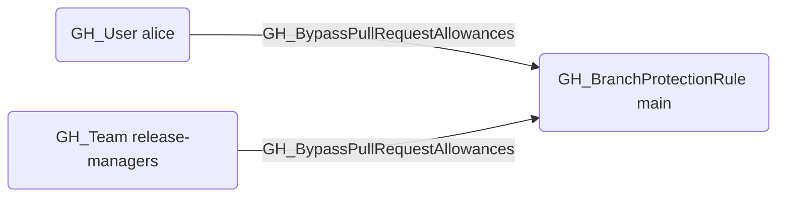

---
kind: GH_BypassPullRequestAllowances
is_traversable: false
---

## Edge Schema

- Source: [GH_User](/opengraph/extensions/githound/reference/nodes/gh_user), [GH_Team](/opengraph/extensions/githound/reference/nodes/gh_team)
- Destination: [GH_BranchProtectionRule](/opengraph/extensions/githound/reference/nodes/gh_branchprotectionrule)
- Traversable: ❌

## General Information

The non-traversable [GH_BypassPullRequestAllowances](/opengraph/extensions/githound/reference/edges/gh_bypasspullrequestallowances) edge represents a per-actor allowance that bypasses the pull request review requirement on a branch protection rule. Created by `Git-HoundBranch` when collecting BPR bypass allowances, this edge identifies specific users or teams that can merge code without going through the normal PR review process. This is a significant security concern because these actors can push or merge changes directly, circumventing code review controls that protect branch integrity. Note that this bypass is suppressed when `enforce_admins` is enabled on the branch protection rule, meaning even listed actors must follow the PR review requirement.

