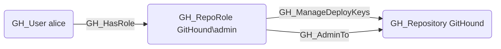

---
kind: GH_ManageDeployKeys
is_traversable: false
---

## Edge Schema

- Source: [GH_RepoRole](/opengraph/extensions/githound/reference/nodes/gh_reporole)
- Destination: [GH_Repository](/opengraph/extensions/githound/reference/nodes/gh_repository)
- Traversable: ❌

## General Information

The non-traversable [GH_ManageDeployKeys](/opengraph/extensions/githound/reference/edges/gh_managedeploykeys) edge represents a role's ability to create, modify, and delete deploy keys for the repository. This permission is available to Admin roles and custom roles that have been granted this specific permission. Deploy keys provide SSH-based access to the repository, and a deploy key with write access can push commits directly without going through the GitHub web interface or API authentication. Managing deploy keys is security-significant because it enables the creation of persistent, credential-based access that operates outside the normal user authentication flow.

