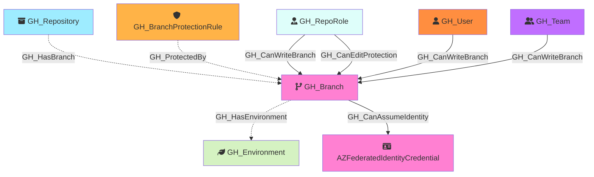

Represents a Git branch within a repository. Branch nodes capture basic branch information and whether the branch is protected. Protection rule details are stored in separate [GH_BranchProtectionRule](/opengraph/extensions/githound/reference/nodes/gh_branchprotectionrule) nodes, linked via [GH_ProtectedBy](../edgedescriptions/gh_protectedby) edges.

Created by: `Git-HoundBranch`

## Edges

<Note>
The tables below list edges defined by the GitHound extension only. Additional edges to or from this node may be created by other extensions.
</Note>

### Inbound Edges

| Edge Type | Source Node Types |
| --------- | ----------------- |
| [GH_CanEditProtection](/opengraph/extensions/githound/reference/edges/gh_caneditprotection) | [GH_RepoRole](/opengraph/extensions/githound/reference/nodes/gh_reporole) |
| [GH_CanWriteBranch](/opengraph/extensions/githound/reference/edges/gh_canwritebranch) | [GH_RepoRole](/opengraph/extensions/githound/reference/nodes/gh_reporole), [GH_User](/opengraph/extensions/githound/reference/nodes/gh_user), [GH_Team](/opengraph/extensions/githound/reference/nodes/gh_team) |
| [GH_HasBranch](/opengraph/extensions/githound/reference/edges/gh_hasbranch) | [GH_Repository](/opengraph/extensions/githound/reference/nodes/gh_repository) |
| [GH_ProtectedBy](/opengraph/extensions/githound/reference/edges/gh_protectedby) | [GH_BranchProtectionRule](/opengraph/extensions/githound/reference/nodes/gh_branchprotectionrule) |

### Outbound Edges

| Edge Type | Destination Node Types |
| --------- | ---------------------- |
| [GH_CanAssumeIdentity](/opengraph/extensions/githound/reference/edges/gh_canassumeidentity) | [AZFederatedIdentityCredential](https://bloodhound.specterops.io/resources/nodes/az-federated-identity-credential), [AWSRole](https://bloodhound.specterops.io/resources/nodes/aws-role) |
| [GH_HasEnvironment](/opengraph/extensions/githound/reference/edges/gh_hasenvironment) | [GH_Environment](/opengraph/extensions/githound/reference/nodes/gh_environment) |

## Properties

| Property Name    | Data Type | Description                                                                    |
| ---------------- | --------- | ------------------------------------------------------------------------------ |
| objectid         | string    | A unique identifier for the branch: `REF_kwDOMuFnXLNyZWZzL2hlYWRzL0NhblB1c2gz` |
| name             | string    | The fully qualified branch name (e.g., `repo\main`).                           |
| short_name       | string    | The branch reference name (e.g., `main`).                                      |
| node_id          | string    | Same as objectid.                                                              |
| environment_name | string    | The name of the environment (GitHub organization).                             |
| environmentid    | string    | The node_id of the environment (GitHub organization).                          |
| protected        | boolean   | Whether the branch has a protection rule.                                      |

## Edges

### Outbound Edges

| Edge Kind                                                           | Target Node                                                                                                        | Traversable | Description                                                                                  |
| ------------------------------------------------------------------- | ------------------------------------------------------------------------------------------------------------------ | ----------- | -------------------------------------------------------------------------------------------- |
| [GH_HasEnvironment](../edgedescriptions/gh_hasenvironment)       | [GH_Environment](/opengraph/extensions/githound/reference/nodes/gh_environment)                                                                                | No          | Branch has a deployment environment via custom branch policy (from Git-HoundEnvironment).    |
| [GH_CanAssumeIdentity](../edgedescriptions/gh_canassumeidentity) | [AZFederatedIdentityCredential](https://bloodhound.specterops.io/resources/nodes/az-federated-identity-credential) | Yes         | Branch can assume an Azure federated identity via OIDC (subject: `ref:refs/heads/{branch}`). |

### Inbound Edges

| Edge Kind                                                           | Source Node                                           | Traversable | Description                                                                        |
| ------------------------------------------------------------------- | ----------------------------------------------------- | ----------- | ---------------------------------------------------------------------------------- |
| [GH_HasBranch](../edgedescriptions/gh_hasbranch)                 | [GH_Repository](/opengraph/extensions/githound/reference/nodes/gh_repository)                     | No          | Repository has this branch.                                                        |
| [GH_ProtectedBy](../edgedescriptions/gh_protectedby)             | [GH_BranchProtectionRule](/opengraph/extensions/githound/reference/nodes/gh_branchprotectionrule) | No          | Branch protection rule protects this branch.                                       |
| [GH_CanEditProtection](../edgedescriptions/gh_caneditprotection) | [GH_RepoRole](/opengraph/extensions/githound/reference/nodes/gh_reporole)                         | Yes         | Repo role can modify/remove the protection rules governing this branch (computed). |
| [GH_CanWriteBranch](../edgedescriptions/gh_canwritebranch)       | [GH_RepoRole](/opengraph/extensions/githound/reference/nodes/gh_reporole)                         | Yes         | Repo role can push to this branch (computed from permissions + BPR state).         |
| [GH_CanWriteBranch](../edgedescriptions/gh_canwritebranch)       | [GH_User](/opengraph/extensions/githound/reference/nodes/gh_user) or [GH_Team](/opengraph/extensions/githound/reference/nodes/gh_team)        | Yes         | User or team can push to this branch (computed — per-actor allowance delta).       |

## Diagram

