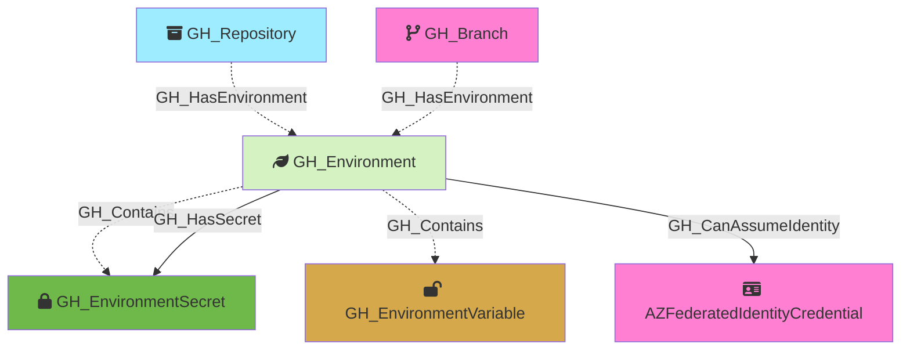

Represents a GitHub Actions deployment environment configured on a repository. Environments can have protection rules including required reviewers, wait timers, and deployment branch policies. When custom branch policies are configured, the environment is connected to specific branches; otherwise, it is connected directly to the repository.

Created by: `Git-HoundEnvironment`

## Edges

<Note>
The tables below list edges defined by the GitHound extension only. Additional edges to or from this node may be created by other extensions.
</Note>

### Inbound Edges

| Edge Type | Source Node Types |
| --------- | ----------------- |
| [GH_HasEnvironment](/opengraph/extensions/githound/reference/edges/gh_hasenvironment) | [GH_Repository](/opengraph/extensions/githound/reference/nodes/gh_repository), [GH_Branch](/opengraph/extensions/githound/reference/nodes/gh_branch) |

### Outbound Edges

| Edge Type | Destination Node Types |
| --------- | ---------------------- |
| [GH_CanAssumeIdentity](/opengraph/extensions/githound/reference/edges/gh_canassumeidentity) | [AZFederatedIdentityCredential](https://bloodhound.specterops.io/resources/nodes/az-federated-identity-credential), [AWSRole](https://bloodhound.specterops.io/resources/nodes/aws-role) |
| [GH_Contains](/opengraph/extensions/githound/reference/edges/gh_contains) | [GH_User](/opengraph/extensions/githound/reference/nodes/gh_user), [GH_Team](/opengraph/extensions/githound/reference/nodes/gh_team), [GH_Repository](/opengraph/extensions/githound/reference/nodes/gh_repository), [GH_OrgRole](/opengraph/extensions/githound/reference/nodes/gh_orgrole), [GH_RepoRole](/opengraph/extensions/githound/reference/nodes/gh_reporole), [GH_TeamRole](/opengraph/extensions/githound/reference/nodes/gh_teamrole), [GH_OrgSecret](/opengraph/extensions/githound/reference/nodes/gh_orgsecret), [GH_AppInstallation](/opengraph/extensions/githound/reference/nodes/gh_appinstallation), [GH_PersonalAccessToken](/opengraph/extensions/githound/reference/nodes/gh_personalaccesstoken), [GH_PersonalAccessTokenRequest](/opengraph/extensions/githound/reference/nodes/gh_personalaccesstokenrequest), [GH_RepoSecret](/opengraph/extensions/githound/reference/nodes/gh_reposecret), [GH_EnvironmentSecret](/opengraph/extensions/githound/reference/nodes/gh_environmentsecret), [GH_SecretScanningAlert](/opengraph/extensions/githound/reference/nodes/gh_secretscanningalert) |
| [GH_HasSecret](/opengraph/extensions/githound/reference/edges/gh_hassecret) | [GH_OrgSecret](/opengraph/extensions/githound/reference/nodes/gh_orgsecret), [GH_RepoSecret](/opengraph/extensions/githound/reference/nodes/gh_reposecret), [GH_EnvironmentSecret](/opengraph/extensions/githound/reference/nodes/gh_environmentsecret) |

## Properties

| Property Name     | Data Type | Description                                                                   |
| ----------------- | --------- | ----------------------------------------------------------------------------- |
| objectid          | string    | The GitHub `node_id` of the environment, used as the unique graph identifier. |
| id                | integer   | The numeric GitHub ID of the environment.                                     |
| node_id           | string    | The GitHub node ID. Redundant with objectid.                                  |
| name              | string    | The fully qualified environment name (e.g., `repoName\production`).           |
| short_name        | string    | The environment's display name (e.g., `production`, `staging`).               |
| can_admins_bypass | boolean   | Whether repository administrators can bypass environment protection rules.    |
| environment_name  | string    | The name of the environment (GitHub organization)                             |
| environmentid     | string    | The node_id of the environment (GitHub organization)                          |
| repository_name   | string    | The full name of the containing repository.                                   |
| repository_id     | string    | The ID of the containing repository.                                          |

## Edges

### Outbound Edges

| Edge Kind                                                           | Target Node                                                                                                        | Traversable | Description                                                                                                |
| ------------------------------------------------------------------- | ------------------------------------------------------------------------------------------------------------------ | ----------- | ---------------------------------------------------------------------------------------------------------- |
| [GH_Contains](../edgedescriptions/gh_contains)                   | [GH_EnvironmentSecret](/opengraph/extensions/githound/reference/nodes/gh_environmentsecret)                                                                    | No          | Environment contains an environment-level secret.                                                          |
| [GH_Contains](../edgedescriptions/gh_contains)                   | [GH_EnvironmentVariable](/opengraph/extensions/githound/reference/nodes/gh_environmentvariable)                                                                | No          | Environment contains an environment-level variable.                                                        |
| [GH_HasSecret](../edgedescriptions/gh_hassecret)                 | [GH_EnvironmentSecret](/opengraph/extensions/githound/reference/nodes/gh_environmentsecret)                                                                    | Yes         | Environment has this secret. Traversable because write access enables secret access via workflow creation. |
| [GH_CanAssumeIdentity](../edgedescriptions/gh_canassumeidentity) | [AZFederatedIdentityCredential](https://bloodhound.specterops.io/resources/nodes/az-federated-identity-credential) | Yes         | Environment can assume an Azure federated identity via OIDC (subject: environment:{envName}).              |

### Inbound Edges

| Edge Kind                                                     | Source Node                       | Traversable | Description                                                                 |
| ------------------------------------------------------------- | --------------------------------- | ----------- | --------------------------------------------------------------------------- |
| [GH_HasEnvironment](../edgedescriptions/gh_hasenvironment) | [GH_Repository](/opengraph/extensions/githound/reference/nodes/gh_repository) | No          | Repository has this environment (when no custom branch policies).           |
| [GH_HasEnvironment](../edgedescriptions/gh_hasenvironment) | [GH_Branch](/opengraph/extensions/githound/reference/nodes/gh_branch)         | No          | Branch is allowed to deploy to this environment (via custom branch policy). |

## Diagram

