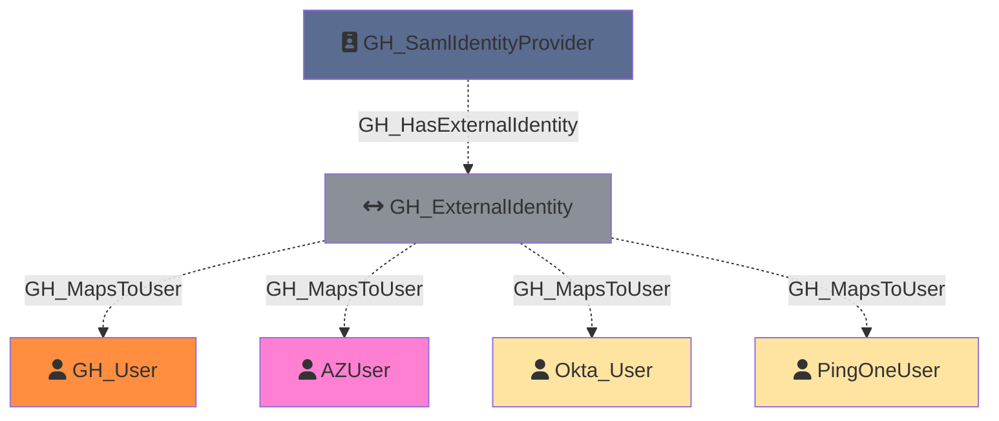

Represents an external identity from a SAML or SCIM identity provider that is linked to a GitHub user. External identities map corporate user accounts (from providers like Okta, Azure AD, etc.) to GitHub user accounts, enabling single sign-on authentication. Each external identity can have both SAML and SCIM identity attributes.

Created by: `Git-HoundGraphQlSamlProvider`

## Edges

<Note>
The tables below list edges defined by the GitHound extension only. Additional edges to or from this node may be created by other extensions.
</Note>

### Inbound Edges

| Edge Type | Source Node Types |
| --------- | ----------------- |
| [GH_HasExternalIdentity](/opengraph/extensions/githound/reference/edges/gh_hasexternalidentity) | [GH_SamlIdentityProvider](/opengraph/extensions/githound/reference/nodes/gh_samlidentityprovider) |

### Outbound Edges

| Edge Type | Destination Node Types |
| --------- | ---------------------- |
| [GH_MapsToUser](/opengraph/extensions/githound/reference/edges/gh_mapstouser) | [GH_User](/opengraph/extensions/githound/reference/nodes/gh_user) |

## Properties

| Property Name             | Data Type | Description                                              |
| ------------------------- | --------- | -------------------------------------------------------- |
| objectid                  | string    | The GraphQL ID of the external identity.                 |
| node_id                   | string    | The GraphQL ID of the external identity.                 |
| name                      | string    | Same as objectid.                                        |
| guid                      | string    | The GUID of the external identity.                       |
| environmentid             | string    | The GraphQL ID of the environment (GitHub organization). |
| environment_name          | string    | The name of the environment (GitHub organization).       |
| saml_identity_family_name | string    | The family name from the SAML identity.                  |
| saml_identity_given_name  | string    | The given name from the SAML identity.                   |
| saml_identity_name_id     | string    | The SAML NameID attribute.                               |
| saml_identity_username    | string    | The username from the SAML identity.                     |
| scim_identity_family_name | string    | The family name from the SCIM identity.                  |
| scim_identity_given_name  | string    | The given name from the SCIM identity.                   |
| scim_identity_username    | string    | The username from the SCIM identity.                     |
| github_username           | string    | The GitHub login of the linked user.                     |
| github_user_id            | string    | The GraphQL ID of the linked GitHub user.                |

## Edges

### Outbound Edges

| Edge Kind                                             | Target Node           | Traversable | Description                                                                         |
| ----------------------------------------------------- | --------------------- | ----------- | ----------------------------------------------------------------------------------- |
| [GH_MapsToUser](../edgedescriptions/gh_mapstouser) | [GH_User](/opengraph/extensions/githound/reference/nodes/gh_user) | No          | External identity maps to a GitHub user (via GitHub user ID).                       |
| [GH_MapsToUser](../edgedescriptions/gh_mapstouser) | Foreign User Node     | No          | External identity maps to a user in a foreign environment (via SAML/SCIM username). |

### Inbound Edges

| Edge Kind                                                               | Source Node                                           | Traversable | Description                                        |
| ----------------------------------------------------------------------- | ----------------------------------------------------- | ----------- | -------------------------------------------------- |
| [GH_HasExternalIdentity](../edgedescriptions/gh_hasexternalidentity) | [GH_SamlIdentityProvider](/opengraph/extensions/githound/reference/nodes/gh_samlidentityprovider) | No          | SAML identity provider has this external identity. |

## Diagram

