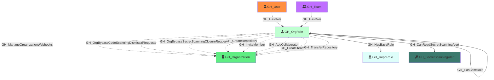

Represents an organization-level role such as Owner, Member, or a custom organization role. Org roles define what permissions a user or team has at the organization level. The Owner and Member roles are default (built-in), while custom roles inherit from a base role and can have additional permissions.

Created by: `Git-HoundOrganization`

## Edges

<Note>
The tables below list edges defined by the GitHound extension only. Additional edges to or from this node may be created by other extensions.
</Note>

### Inbound Edges

| Edge Type | Source Node Types | Traversable |
| --------- | ----------------- | ----------- |
| [GH_Contains](/opengraph/extensions/githound/reference/edges/gh_contains) | [GH_Organization](/opengraph/extensions/githound/reference/nodes/gh_organization), [GH_Repository](/opengraph/extensions/githound/reference/nodes/gh_repository), [GH_Environment](/opengraph/extensions/githound/reference/nodes/gh_environment) | ❌ |
| [GH_HasBaseRole](/opengraph/extensions/githound/reference/edges/gh_hasbaserole) | [GH_OrgRole](/opengraph/extensions/githound/reference/nodes/gh_orgrole), [GH_RepoRole](/opengraph/extensions/githound/reference/nodes/gh_reporole) | ✅ |
| [GH_HasRole](/opengraph/extensions/githound/reference/edges/gh_hasrole) | [GH_User](/opengraph/extensions/githound/reference/nodes/gh_user), [GH_Team](/opengraph/extensions/githound/reference/nodes/gh_team) | ✅ |

### Outbound Edges

| Edge Type | Destination Node Types | Traversable |
| --------- | ---------------------- | ----------- |
| [GH_AddCollaborator](/opengraph/extensions/githound/reference/edges/gh_addcollaborator) | [GH_Organization](/opengraph/extensions/githound/reference/nodes/gh_organization) | ❌ |
| [GH_CanReadSecretScanningAlert](/opengraph/extensions/githound/reference/edges/gh_canreadsecretscanningalert) | [GH_SecretScanningAlert](/opengraph/extensions/githound/reference/nodes/gh_secretscanningalert) | ✅ |
| [GH_CreateRepository](/opengraph/extensions/githound/reference/edges/gh_createrepository) | [GH_Organization](/opengraph/extensions/githound/reference/nodes/gh_organization) | ❌ |
| [GH_CreateTeam](/opengraph/extensions/githound/reference/edges/gh_createteam) | [GH_Organization](/opengraph/extensions/githound/reference/nodes/gh_organization) | ❌ |
| [GH_HasBaseRole](/opengraph/extensions/githound/reference/edges/gh_hasbaserole) | [GH_OrgRole](/opengraph/extensions/githound/reference/nodes/gh_orgrole), [GH_RepoRole](/opengraph/extensions/githound/reference/nodes/gh_reporole) | ✅ |
| [GH_InviteMember](/opengraph/extensions/githound/reference/edges/gh_invitemember) | [GH_Organization](/opengraph/extensions/githound/reference/nodes/gh_organization) | ❌ |
| [GH_ManageOrganizationWebhooks](/opengraph/extensions/githound/reference/edges/gh_manageorganizationwebhooks) | [GH_Organization](/opengraph/extensions/githound/reference/nodes/gh_organization) | ❌ |
| [GH_OrgBypassCodeScanningDismissalRequests](/opengraph/extensions/githound/reference/edges/gh_orgbypasscodescanningdismissalrequests) | [GH_Organization](/opengraph/extensions/githound/reference/nodes/gh_organization) | ❌ |
| [GH_OrgBypassSecretScanningClosureRequests](/opengraph/extensions/githound/reference/edges/gh_orgbypasssecretscanningclosurerequests) | [GH_Organization](/opengraph/extensions/githound/reference/nodes/gh_organization) | ❌ |
| [GH_OrgReviewAndManageSecretScanningBypassRequests](/opengraph/extensions/githound/reference/edges/gh_orgreviewandmanagesecretscanningbypassrequests) | [GH_Organization](/opengraph/extensions/githound/reference/nodes/gh_organization) | ❌ |
| [GH_OrgReviewAndManageSecretScanningClosureRequests](/opengraph/extensions/githound/reference/edges/gh_orgreviewandmanagesecretscanningclosurerequests) | [GH_Organization](/opengraph/extensions/githound/reference/nodes/gh_organization) | ❌ |
| [GH_ReadOrganizationActionsUsageMetrics](/opengraph/extensions/githound/reference/edges/gh_readorganizationactionsusagemetrics) | [GH_Organization](/opengraph/extensions/githound/reference/nodes/gh_organization) | ❌ |
| [GH_ReadOrganizationCustomOrgRole](/opengraph/extensions/githound/reference/edges/gh_readorganizationcustomorgrole) | [GH_Organization](/opengraph/extensions/githound/reference/nodes/gh_organization) | ❌ |
| [GH_ReadOrganizationCustomRepoRole](/opengraph/extensions/githound/reference/edges/gh_readorganizationcustomreporole) | [GH_Organization](/opengraph/extensions/githound/reference/nodes/gh_organization) | ❌ |
| [GH_ResolveSecretScanningAlerts](/opengraph/extensions/githound/reference/edges/gh_resolvesecretscanningalerts) | [GH_Organization](/opengraph/extensions/githound/reference/nodes/gh_organization) | ❌ |
| [GH_TransferRepository](/opengraph/extensions/githound/reference/edges/gh_transferrepository) | [GH_Organization](/opengraph/extensions/githound/reference/nodes/gh_organization) | ❌ |
| [GH_ViewSecretScanningAlerts](/opengraph/extensions/githound/reference/edges/gh_viewsecretscanningalerts) | [GH_Organization](/opengraph/extensions/githound/reference/nodes/gh_organization), [GH_Repository](/opengraph/extensions/githound/reference/nodes/gh_repository) | ❌ |
| [GH_WriteOrganizationActionsSecrets](/opengraph/extensions/githound/reference/edges/gh_writeorganizationactionssecrets) | [GH_Organization](/opengraph/extensions/githound/reference/nodes/gh_organization) | ❌ |
| [GH_WriteOrganizationActionsSettings](/opengraph/extensions/githound/reference/edges/gh_writeorganizationactionssettings) | [GH_Organization](/opengraph/extensions/githound/reference/nodes/gh_organization) | ❌ |
| [GH_WriteOrganizationActionsVariables](/opengraph/extensions/githound/reference/edges/gh_writeorganizationactionsvariables) | [GH_Organization](/opengraph/extensions/githound/reference/nodes/gh_organization) | ❌ |
| [GH_WriteOrganizationCustomOrgRole](/opengraph/extensions/githound/reference/edges/gh_writeorganizationcustomorgrole) | [GH_Organization](/opengraph/extensions/githound/reference/nodes/gh_organization) | ✅ |
| [GH_WriteOrganizationCustomRepoRole](/opengraph/extensions/githound/reference/edges/gh_writeorganizationcustomreporole) | [GH_Organization](/opengraph/extensions/githound/reference/nodes/gh_organization) | ❌ |
| [GH_WriteOrganizationNetworkConfigurations](/opengraph/extensions/githound/reference/edges/gh_writeorganizationnetworkconfigurations) | [GH_Organization](/opengraph/extensions/githound/reference/nodes/gh_organization) | ❌ |

## Properties

| Property Name    | Data Type | Description                                                                              |
| ---------------- | --------- | ---------------------------------------------------------------------------------------- |
| objectid         | string    | A deterministic ID derived from the organization ID and role name.                       |
| name             | string    | The fully qualified role name (e.g., `OrgName\Owners`).                                  |
| id               | string    | Same as objectid.                                                                        |
| short_name       | string    | The short display name of the role (e.g., `Owners`, `Members`, or the custom role name). |
| type             | string    | `default` for built-in roles (Owner, Member) or `custom` for custom organization roles.  |
| environment_name | string    | The name of the environment (GitHub organization).                                       |
| environmentid    | string    | The node_id of the environment (GitHub organization).                                    |

## Edges

### Outbound Edges

| Edge Kind                                                                                                                       | Target Node                                         | Traversable | Description                                                                                        |
| ------------------------------------------------------------------------------------------------------------------------------- | --------------------------------------------------- | ----------- | -------------------------------------------------------------------------------------------------- |
| [GH_CreateRepository](/opengraph/extensions/githound/reference/edges/gh_createrepository)                                                               | [GH_Organization](/opengraph/extensions/githound/reference/nodes/gh_organization)               | No          | Role can create repositories in the organization.                                                  |
| [GH_InviteMember](/opengraph/extensions/githound/reference/edges/gh_invitemember)                                                                       | [GH_Organization](/opengraph/extensions/githound/reference/nodes/gh_organization)               | No          | Role can invite members (Owners only).                                                             |
| [GH_AddCollaborator](/opengraph/extensions/githound/reference/edges/gh_addcollaborator)                                                                 | [GH_Organization](/opengraph/extensions/githound/reference/nodes/gh_organization)               | No          | Role can add outside collaborators (Owners only).                                                  |
| [GH_CreateTeam](/opengraph/extensions/githound/reference/edges/gh_createteam)                                                                           | [GH_Organization](/opengraph/extensions/githound/reference/nodes/gh_organization)               | No          | Role can create teams.                                                                             |
| [GH_TransferRepository](/opengraph/extensions/githound/reference/edges/gh_transferrepository)                                                           | [GH_Organization](/opengraph/extensions/githound/reference/nodes/gh_organization)               | No          | Role can transfer repositories (Owners only).                                                      |
| [GH_HasBaseRole](/opengraph/extensions/githound/reference/edges/gh_hasbaserole)                                                                         | [GH_RepoRole](/opengraph/extensions/githound/reference/nodes/gh_reporole)                       | Yes         | Role inherits access to all repositories via an `all_repo_*` role (e.g., Owners → all_repo_admin). |
| [GH_HasBaseRole](/opengraph/extensions/githound/reference/edges/gh_hasbaserole)                                                                         | [GH_OrgRole](/opengraph/extensions/githound/reference/nodes/gh_orgrole)                         | Yes         | Custom role inherits from a base org role.                                                         |
| [GH_ManageOrganizationWebhooks](/opengraph/extensions/githound/reference/edges/gh_manageorganizationwebhooks)                                           | [GH_Organization](/opengraph/extensions/githound/reference/nodes/gh_organization)               | No          | Custom role permission.                                                                            |
| [GH_WriteOrganizationActionsSecrets](/opengraph/extensions/githound/reference/edges/gh_writeorganizationactionssecrets)                                 | [GH_Organization](/opengraph/extensions/githound/reference/nodes/gh_organization)               | No          | Custom role permission.                                                                            |
| [GH_WriteOrganizationActionsSettings](/opengraph/extensions/githound/reference/edges/gh_writeorganizationactionssettings)                               | [GH_Organization](/opengraph/extensions/githound/reference/nodes/gh_organization)               | No          | Custom role permission.                                                                            |
| [GH_ViewSecretScanningAlerts](/opengraph/extensions/githound/reference/edges/gh_viewsecretscanningalerts)                                               | [GH_Organization](/opengraph/extensions/githound/reference/nodes/gh_organization)               | No          | Custom role permission.                                                                            |
| [GH_ResolveSecretScanningAlerts](/opengraph/extensions/githound/reference/edges/gh_resolvesecretscanningalerts)                                         | [GH_Organization](/opengraph/extensions/githound/reference/nodes/gh_organization)               | No          | Custom role permission.                                                                            |
| [GH_ReadOrganizationActionsUsageMetrics](/opengraph/extensions/githound/reference/edges/gh_readorganizationactionsusagemetrics)                         | [GH_Organization](/opengraph/extensions/githound/reference/nodes/gh_organization)               | No          | Custom role permission.                                                                            |
| [GH_ReadOrganizationCustomOrgRole](/opengraph/extensions/githound/reference/edges/gh_readorganizationcustomorgrole)                                     | [GH_Organization](/opengraph/extensions/githound/reference/nodes/gh_organization)               | No          | Custom role permission.                                                                            |
| [GH_ReadOrganizationCustomRepoRole](/opengraph/extensions/githound/reference/edges/gh_readorganizationcustomreporole)                                   | [GH_Organization](/opengraph/extensions/githound/reference/nodes/gh_organization)               | No          | Custom role permission.                                                                            |
| [GH_WriteOrganizationCustomOrgRole](/opengraph/extensions/githound/reference/edges/gh_writeorganizationcustomorgrole)                                   | [GH_Organization](/opengraph/extensions/githound/reference/nodes/gh_organization)               | No          | Custom role permission.                                                                            |
| [GH_WriteOrganizationCustomRepoRole](/opengraph/extensions/githound/reference/edges/gh_writeorganizationcustomreporole)                                 | [GH_Organization](/opengraph/extensions/githound/reference/nodes/gh_organization)               | No          | Custom role permission.                                                                            |
| [GH_WriteOrganizationNetworkConfigurations](/opengraph/extensions/githound/reference/edges/gh_writeorganizationnetworkconfigurations)                   | [GH_Organization](/opengraph/extensions/githound/reference/nodes/gh_organization)               | No          | Custom role permission.                                                                            |
| [GH_OrgBypassCodeScanningDismissalRequests](/opengraph/extensions/githound/reference/edges/gh_orgbypasscodescanningdismissalrequests)                   | [GH_Organization](/opengraph/extensions/githound/reference/nodes/gh_organization)               | No          | Custom role permission.                                                                            |
| [GH_OrgBypassSecretScanningClosureRequests](/opengraph/extensions/githound/reference/edges/gh_orgbypasssecretscanningclosurerequests)                   | [GH_Organization](/opengraph/extensions/githound/reference/nodes/gh_organization)               | No          | Custom role permission.                                                                            |
| [GH_OrgReviewAndManageSecretScanningBypassRequests](/opengraph/extensions/githound/reference/edges/gh_orgreviewandmanagesecretscanningbypassrequests)   | [GH_Organization](/opengraph/extensions/githound/reference/nodes/gh_organization)               | No          | Custom role permission.                                                                            |
| [GH_OrgReviewAndManageSecretScanningClosureRequests](/opengraph/extensions/githound/reference/edges/gh_orgreviewandmanagesecretscanningclosurerequests) | [GH_Organization](/opengraph/extensions/githound/reference/nodes/gh_organization)               | No          | Custom role permission.                                                                            |
| [GH_CanReadSecretScanningAlert](/opengraph/extensions/githound/reference/edges/gh_canreadsecretscanningalert)                                           | [GH_SecretScanningAlert](/opengraph/extensions/githound/reference/nodes/gh_secretscanningalert) | Yes         | Org role can read secret scanning alerts in the organization (computed).                           |

### Inbound Edges

| Edge Kind                                       | Source Node           | Traversable | Description                                          |
| ----------------------------------------------- | --------------------- | ----------- | ---------------------------------------------------- |
| [GH_HasRole](/opengraph/extensions/githound/reference/edges/gh_hasrole) | [GH_User](/opengraph/extensions/githound/reference/nodes/gh_user) | Yes         | A user is assigned to this organization role.        |
| [GH_HasRole](/opengraph/extensions/githound/reference/edges/gh_hasrole) | [GH_Team](/opengraph/extensions/githound/reference/nodes/gh_team) | Yes         | A team is assigned to this custom organization role. |

## Diagram

