Represents a repository-level permission role. Each repository has five default roles (Read, Write, Admin, Triage, Maintain) plus any custom repository roles defined at the organization level. Repo roles define what actions a user or team can perform on a specific repository. Default roles form an inheritance hierarchy (Triage → Read, Maintain → Write, Admin includes all), and custom roles inherit from one of the base roles.

Created by: `Git-HoundRepository`

## Edges

<Note>
The tables below list edges defined by the GitHound extension only. Additional edges to or from this node may be created by other extensions.
</Note>

### Inbound Edges

| Edge Type | Source Node Types | Traversable | Description |
| --------- | ----------------- | ----------- | ----------- |
| [GH_Contains](/opengraph/extensions/githound/reference/edges/gh_contains) | [GH_Organization](/opengraph/extensions/githound/reference/nodes/gh_organization), [GH_Repository](/opengraph/extensions/githound/reference/nodes/gh_repository), [GH_Environment](/opengraph/extensions/githound/reference/nodes/gh_environment) | ❌ | Container relationship for organizational hierarchy (org contains secrets/variables, repo contains secrets/variables, environment contains secrets/variables) |
| [GH_HasBaseRole](/opengraph/extensions/githound/reference/edges/gh_hasbaserole) | [GH_OrgRole](/opengraph/extensions/githound/reference/nodes/gh_orgrole), [GH_RepoRole](/opengraph/extensions/githound/reference/nodes/gh_reporole) | ✅ | Role inherits permissions from another role |
| [GH_HasRole](/opengraph/extensions/githound/reference/edges/gh_hasrole) | [GH_User](/opengraph/extensions/githound/reference/nodes/gh_user), [GH_Team](/opengraph/extensions/githound/reference/nodes/gh_team) | ✅ | User or team has a role assignment (org role, team role, or repo role) |

### Outbound Edges

| Edge Type | Destination Node Types | Traversable | Description |
| --------- | ---------------------- | ----------- | ----------- |
| [GH_AddAssignee](/opengraph/extensions/githound/reference/edges/gh_addassignee) | [GH_Repository](/opengraph/extensions/githound/reference/nodes/gh_repository) | ❌ | [Repository] Repo role can assign users to issues and pull requests |
| [GH_AddLabel](/opengraph/extensions/githound/reference/edges/gh_addlabel) | [GH_Repository](/opengraph/extensions/githound/reference/nodes/gh_repository) | ❌ | [Repository] Repo role can add labels to issues and pull requests |
| [GH_AdminTo](/opengraph/extensions/githound/reference/edges/gh_adminto) | [GH_Repository](/opengraph/extensions/githound/reference/nodes/gh_repository) | ❌ | [Repository] Repo role has admin access to the repository. |
| [GH_BypassBranchProtection](/opengraph/extensions/githound/reference/edges/gh_bypassbranchprotection) | [GH_Repository](/opengraph/extensions/githound/reference/nodes/gh_repository) | ❌ | [Repository] Repo role can bypass merge-gate branch protections (PR reviews, lock branch). Suppressed by enforce_admins. |
| [GH_CanCreateBranch](/opengraph/extensions/githound/reference/edges/gh_cancreatebranch) | [GH_Repository](/opengraph/extensions/githound/reference/nodes/gh_repository) | ✅ | [Repository - Computed] Role can create new branches in this repository (unprotected branches that bypass the merge gate) |
| [GH_CanEditProtection](/opengraph/extensions/githound/reference/edges/gh_caneditprotection) | [GH_Branch](/opengraph/extensions/githound/reference/nodes/gh_branch) | ✅ | [Repository - Computed] Repo role can modify or remove the branch protection rules governing this branch (computed from GH_EditRepoProtections + GH_ProtectedBy) |
| [GH_CanReadSecretScanningAlert](/opengraph/extensions/githound/reference/edges/gh_canreadsecretscanningalert) | [GH_SecretScanningAlert](/opengraph/extensions/githound/reference/nodes/gh_secretscanningalert) | ✅ | [Computed] Role can read secret scanning alerts (computed from GH_ViewSecretScanningAlerts permission + GH_Contains) |
| [GH_CanWriteBranch](/opengraph/extensions/githound/reference/edges/gh_canwritebranch) | [GH_Branch](/opengraph/extensions/githound/reference/nodes/gh_branch) | ✅ | [Repository - Computed] Role can push to this branch after evaluating branch protection rules, push restrictions, and bypass allowances |
| [GH_CloseDiscussion](/opengraph/extensions/githound/reference/edges/gh_closediscussion) | [GH_Repository](/opengraph/extensions/githound/reference/nodes/gh_repository) | ❌ | [Repository] Repo role can close discussions |
| [GH_CloseIssue](/opengraph/extensions/githound/reference/edges/gh_closeissue) | [GH_Repository](/opengraph/extensions/githound/reference/nodes/gh_repository) | ❌ | [Repository] Repo role can close issues |
| [GH_ClosePullRequest](/opengraph/extensions/githound/reference/edges/gh_closepullrequest) | [GH_Repository](/opengraph/extensions/githound/reference/nodes/gh_repository) | ❌ | [Repository] Repo role can close pull requests |
| [GH_ConvertIssuesToDiscussions](/opengraph/extensions/githound/reference/edges/gh_convertissuestodiscussions) | [GH_Repository](/opengraph/extensions/githound/reference/nodes/gh_repository) | ❌ | [Repository] Repo role can convert issues to discussions |
| [GH_CreateDiscussionCategory](/opengraph/extensions/githound/reference/edges/gh_creatediscussioncategory) | [GH_Repository](/opengraph/extensions/githound/reference/nodes/gh_repository) | ❌ | [Repository] Repo role can create discussion categories |
| [GH_CreateSoloMergeQueueEntry](/opengraph/extensions/githound/reference/edges/gh_createsolomergequeueentry) | [GH_Repository](/opengraph/extensions/githound/reference/nodes/gh_repository) | ❌ | Repo role can create solo merge queue entries |
| [GH_CreateTag](/opengraph/extensions/githound/reference/edges/gh_createtag) | [GH_Repository](/opengraph/extensions/githound/reference/nodes/gh_repository) | ❌ | [Repository] Repo role can create tags and releases |
| [GH_DeleteAlertsCodeScanning](/opengraph/extensions/githound/reference/edges/gh_deletealertscodescanning) | [GH_Repository](/opengraph/extensions/githound/reference/nodes/gh_repository) | ❌ | [Repository] Repo role can delete code scanning alerts |
| [GH_DeleteDiscussion](/opengraph/extensions/githound/reference/edges/gh_deletediscussion) | [GH_Repository](/opengraph/extensions/githound/reference/nodes/gh_repository) | ❌ | [Repository] Repo role can delete discussions |
| [GH_DeleteDiscussionComment](/opengraph/extensions/githound/reference/edges/gh_deletediscussioncomment) | [GH_Repository](/opengraph/extensions/githound/reference/nodes/gh_repository) | ❌ | [Repository] Repo role can delete discussion comments |
| [GH_DeleteIssue](/opengraph/extensions/githound/reference/edges/gh_deleteissue) | [GH_Repository](/opengraph/extensions/githound/reference/nodes/gh_repository) | ❌ | [Repository] Repo role can delete issues |
| [GH_DeleteTag](/opengraph/extensions/githound/reference/edges/gh_deletetag) | [GH_Repository](/opengraph/extensions/githound/reference/nodes/gh_repository) | ❌ | [Repository] Repo role can delete tags and releases |
| [GH_EditCategoryOnDiscussion](/opengraph/extensions/githound/reference/edges/gh_editcategoryondiscussion) | [GH_Repository](/opengraph/extensions/githound/reference/nodes/gh_repository) | ❌ | [Repository] Repo role can change the category of a discussion |
| [GH_EditDiscussionCategory](/opengraph/extensions/githound/reference/edges/gh_editdiscussioncategory) | [GH_Repository](/opengraph/extensions/githound/reference/nodes/gh_repository) | ❌ | [Repository] Repo role can edit discussion categories |
| [GH_EditDiscussionComment](/opengraph/extensions/githound/reference/edges/gh_editdiscussioncomment) | [GH_Repository](/opengraph/extensions/githound/reference/nodes/gh_repository) | ❌ | [Repository] Repo role can edit discussion comments |
| [GH_EditRepoAnnouncementBanners](/opengraph/extensions/githound/reference/edges/gh_editrepoannouncementbanners) | [GH_Repository](/opengraph/extensions/githound/reference/nodes/gh_repository) | ❌ | [Repository] Repo role can edit repository announcement banners |
| [GH_EditRepoCustomPropertiesValues](/opengraph/extensions/githound/reference/edges/gh_editrepocustompropertiesvalues) | [GH_Repository](/opengraph/extensions/githound/reference/nodes/gh_repository) | ❌ | [Repository] Repo role can edit custom property values on the repository |
| [GH_EditRepoMetadata](/opengraph/extensions/githound/reference/edges/gh_editrepometadata) | [GH_Repository](/opengraph/extensions/githound/reference/nodes/gh_repository) | ❌ | [Repository] Repo role can edit repository metadata |
| [GH_EditRepoProtections](/opengraph/extensions/githound/reference/edges/gh_editrepoprotections) | [GH_Repository](/opengraph/extensions/githound/reference/nodes/gh_repository) | ❌ | Repo role can edit branch protection rules |
| [GH_HasBaseRole](/opengraph/extensions/githound/reference/edges/gh_hasbaserole) | [GH_OrgRole](/opengraph/extensions/githound/reference/nodes/gh_orgrole), [GH_RepoRole](/opengraph/extensions/githound/reference/nodes/gh_reporole) | ✅ | Role inherits permissions from another role |
| [GH_JumpMergeQueue](/opengraph/extensions/githound/reference/edges/gh_jumpmergequeue) | [GH_Repository](/opengraph/extensions/githound/reference/nodes/gh_repository) | ❌ | Repo role can jump the merge queue |
| [GH_ManageDeployKeys](/opengraph/extensions/githound/reference/edges/gh_managedeploykeys) | [GH_Repository](/opengraph/extensions/githound/reference/nodes/gh_repository) | ❌ | [Repository] Repo role can manage deploy keys |
| [GH_ManageDiscussionBadges](/opengraph/extensions/githound/reference/edges/gh_managediscussionbadges) | [GH_Repository](/opengraph/extensions/githound/reference/nodes/gh_repository) | ❌ | [Repository] Repo role can manage discussion badges |
| [GH_ManageRepoSecurityProducts](/opengraph/extensions/githound/reference/edges/gh_managereposecurityproducts) | [GH_Repository](/opengraph/extensions/githound/reference/nodes/gh_repository) | ❌ | Repo role can manage repo-level security products |
| [GH_ManageSecurityProducts](/opengraph/extensions/githound/reference/edges/gh_managesecurityproducts) | [GH_Repository](/opengraph/extensions/githound/reference/nodes/gh_repository) | ❌ | Repo role can manage security products |
| [GH_ManageSettingsMergeTypes](/opengraph/extensions/githound/reference/edges/gh_managesettingsmergetypes) | [GH_Repository](/opengraph/extensions/githound/reference/nodes/gh_repository) | ❌ | [Repository] Repo role can manage allowed merge types |
| [GH_ManageSettingsPages](/opengraph/extensions/githound/reference/edges/gh_managesettingspages) | [GH_Repository](/opengraph/extensions/githound/reference/nodes/gh_repository) | ❌ | [Repository] Repo role can manage GitHub Pages settings |
| [GH_ManageSettingsProjects](/opengraph/extensions/githound/reference/edges/gh_managesettingsprojects) | [GH_Repository](/opengraph/extensions/githound/reference/nodes/gh_repository) | ❌ | [Repository] Repo role can manage project settings |
| [GH_ManageSettingsWiki](/opengraph/extensions/githound/reference/edges/gh_managesettingswiki) | [GH_Repository](/opengraph/extensions/githound/reference/nodes/gh_repository) | ❌ | [Repository] Repo role can manage wiki settings |
| [GH_ManageTopics](/opengraph/extensions/githound/reference/edges/gh_managetopics) | [GH_Repository](/opengraph/extensions/githound/reference/nodes/gh_repository) | ❌ | [Repository] Repo role can manage repository topics |
| [GH_ManageWebhooks](/opengraph/extensions/githound/reference/edges/gh_managewebhooks) | [GH_Repository](/opengraph/extensions/githound/reference/nodes/gh_repository) | ❌ | [Repository] Repo role can manage repository webhooks |
| [GH_MarkAsDuplicate](/opengraph/extensions/githound/reference/edges/gh_markasduplicate) | [GH_Repository](/opengraph/extensions/githound/reference/nodes/gh_repository) | ❌ | [Repository] Repo role can mark issues or pull requests as duplicates |
| [GH_PushProtectedBranch](/opengraph/extensions/githound/reference/edges/gh_pushprotectedbranch) | [GH_Repository](/opengraph/extensions/githound/reference/nodes/gh_repository) | ❌ | [Repository] Repo role can push to branches with push restrictions. Not affected by enforce_admins. |
| [GH_ReadCodeScanning](/opengraph/extensions/githound/reference/edges/gh_readcodescanning) | [GH_Repository](/opengraph/extensions/githound/reference/nodes/gh_repository) | ❌ | [Repository] Repo role can read code scanning results |
| [GH_ReadRepoContents](/opengraph/extensions/githound/reference/edges/gh_readrepocontents) | [GH_Repository](/opengraph/extensions/githound/reference/nodes/gh_repository) | ❌ | [Repository] Repo role can read repository contents |
| [GH_RemoveAssignee](/opengraph/extensions/githound/reference/edges/gh_removeassignee) | [GH_Repository](/opengraph/extensions/githound/reference/nodes/gh_repository) | ❌ | [Repository] Repo role can remove assignees from issues and pull requests |
| [GH_RemoveLabel](/opengraph/extensions/githound/reference/edges/gh_removelabel) | [GH_Repository](/opengraph/extensions/githound/reference/nodes/gh_repository) | ❌ | [Repository] Repo role can remove labels from issues and pull requests |
| [GH_ReopenDiscussion](/opengraph/extensions/githound/reference/edges/gh_reopendiscussion) | [GH_Repository](/opengraph/extensions/githound/reference/nodes/gh_repository) | ❌ | [Repository] Repo role can reopen discussions |
| [GH_ReopenIssue](/opengraph/extensions/githound/reference/edges/gh_reopenissue) | [GH_Repository](/opengraph/extensions/githound/reference/nodes/gh_repository) | ❌ | [Repository] Repo role can reopen closed issues |
| [GH_ReopenPullRequest](/opengraph/extensions/githound/reference/edges/gh_reopenpullrequest) | [GH_Repository](/opengraph/extensions/githound/reference/nodes/gh_repository) | ❌ | [Repository] Repo role can reopen closed pull requests |
| [GH_RequestPrReview](/opengraph/extensions/githound/reference/edges/gh_requestprreview) | [GH_Repository](/opengraph/extensions/githound/reference/nodes/gh_repository) | ❌ | [Repository] Repo role can request pull request reviews |
| [GH_ResolveDependabotAlerts](/opengraph/extensions/githound/reference/edges/gh_resolvedependabotalerts) | [GH_Repository](/opengraph/extensions/githound/reference/nodes/gh_repository) | ❌ | [Repository] Repo role can resolve Dependabot alerts |
| [GH_RunOrgMigration](/opengraph/extensions/githound/reference/edges/gh_runorgmigration) | [GH_Repository](/opengraph/extensions/githound/reference/nodes/gh_repository) | ❌ | [Repository] Repo role can run organization migrations |
| [GH_SetInteractionLimits](/opengraph/extensions/githound/reference/edges/gh_setinteractionlimits) | [GH_Repository](/opengraph/extensions/githound/reference/nodes/gh_repository) | ❌ | [Repository] Repo role can set interaction limits on the repository |
| [GH_SetIssueType](/opengraph/extensions/githound/reference/edges/gh_setissuetype) | [GH_Repository](/opengraph/extensions/githound/reference/nodes/gh_repository) | ❌ | [Repository] Repo role can set issue types |
| [GH_SetMilestone](/opengraph/extensions/githound/reference/edges/gh_setmilestone) | [GH_Repository](/opengraph/extensions/githound/reference/nodes/gh_repository) | ❌ | [Repository] Repo role can set milestones on issues and pull requests |
| [GH_SetSocialPreview](/opengraph/extensions/githound/reference/edges/gh_setsocialpreview) | [GH_Repository](/opengraph/extensions/githound/reference/nodes/gh_repository) | ❌ | [Repository] Repo role can set the repository social preview image |
| [GH_ToggleDiscussionAnswer](/opengraph/extensions/githound/reference/edges/gh_togglediscussionanswer) | [GH_Repository](/opengraph/extensions/githound/reference/nodes/gh_repository) | ❌ | [Repository] Repo role can toggle discussion answers |
| [GH_ToggleDiscussionCommentMinimize](/opengraph/extensions/githound/reference/edges/gh_togglediscussioncommentminimize) | [GH_Repository](/opengraph/extensions/githound/reference/nodes/gh_repository) | ❌ | [Repository] Repo role can minimize discussion comments |
| [GH_ViewDependabotAlerts](/opengraph/extensions/githound/reference/edges/gh_viewdependabotalerts) | [GH_Repository](/opengraph/extensions/githound/reference/nodes/gh_repository) | ❌ | [Repository] Repo role can view Dependabot alerts |
| [GH_ViewSecretScanningAlerts](/opengraph/extensions/githound/reference/edges/gh_viewsecretscanningalerts) | [GH_Organization](/opengraph/extensions/githound/reference/nodes/gh_organization), [GH_Repository](/opengraph/extensions/githound/reference/nodes/gh_repository) | ❌ | [Repository] Role can view secret scanning alerts |
| [GH_WriteCodeScanning](/opengraph/extensions/githound/reference/edges/gh_writecodescanning) | [GH_Repository](/opengraph/extensions/githound/reference/nodes/gh_repository) | ❌ | [Repository] Repo role can upload code scanning results |
| [GH_WriteRepoContents](/opengraph/extensions/githound/reference/edges/gh_writerepocontents) | [GH_Repository](/opengraph/extensions/githound/reference/nodes/gh_repository) | ❌ | [Repository] Repo role can write repository contents |
| [GH_WriteRepoPullRequests](/opengraph/extensions/githound/reference/edges/gh_writerepopullrequests) | [GH_Repository](/opengraph/extensions/githound/reference/nodes/gh_repository) | ❌ | [Repository] Repo role can create and merge pull requests |

## Properties

| Property Name    | Data Type | Description                                                                                      |
| ---------------- | --------- | ------------------------------------------------------------------------------------------------ |
| objectid         | string    | A deterministic ID derived from the repo node_id and role name.                                  |
| name             | string    | The fully qualified role name (e.g., `repoName\read`).                                           |
| id               | string    | Same as objectid.                                                                                |
| short_name       | string    | The short role name (e.g., `read`, `write`, `admin`, `triage`, `maintain`, or custom role name). |
| type             | string    | `default` for built-in roles or `custom` for custom repository roles.                            |
| environment_name | string    | The name of the environment (GitHub organization).                                               |
| environmentid    | string    | The node_id of the environment (GitHub organization).                                            |
| repository_name  | string    | The name of the repository this role belongs to.                                                 |
| repository_id    | string    | The node_id of the repository this role belongs to.                                              |

## Diagram

```mermaid
flowchart TD
    GH_RepoRole[fa:fa-user-tie GH_RepoRole]
    GH_Repository[fa:fa-box-archive GH_Repository]
    GH_Branch[fa:fa-code-branch GH_Branch]
    GH_BranchProtectionRule[fa:fa-shield GH_BranchProtectionRule]
    GH_User[fa:fa-user GH_User]
    GH_Team[fa:fa-user-group GH_Team]
    GH_OrgRole[fa:fa-user-tie GH_OrgRole]
    GH_SecretScanningAlert[fa:fa-key GH_SecretScanningAlert]


    GH_RepoRole -.->|GH_ReadRepoContents| GH_Repository
    GH_RepoRole -.->|GH_WriteRepoContents| GH_Repository
    GH_RepoRole -.->|GH_AdminTo| GH_Repository
    GH_RepoRole -.->|GH_ViewSecretScanningAlerts| GH_Repository
    GH_RepoRole -.->|GH_BypassBranchProtection| GH_Repository
    GH_RepoRole -.->|GH_EditRepoProtections| GH_Repository
    %% Note: Additional non-traversable permission edges (issue triage, discussions, settings) omitted for readability.
    GH_RepoRole -.->|GH_ReadCodeScanning| GH_Repository
    GH_RepoRole -.->|GH_WriteCodeScanning| GH_Repository
    GH_RepoRole -.->|GH_ViewDependabotAlerts| GH_Repository
    GH_RepoRole -.->|GH_ResolveDependabotAlerts| GH_Repository
    GH_RepoRole -.->|GH_DeleteIssue| GH_Repository
    GH_RepoRole -.->|GH_CreateTag| GH_Repository
    GH_RepoRole -.->|GH_DeleteTag| GH_Repository
    GH_RepoRole -->|GH_HasBaseRole| GH_RepoRole
    GH_RepoRole -->|GH_CanEditProtection| GH_Branch
    GH_RepoRole -->|GH_CanWriteBranch| GH_Branch
    GH_RepoRole -->|GH_CanCreateBranch| GH_Repository
    GH_RepoRole -->|GH_CanReadSecretScanningAlert| GH_SecretScanningAlert
    GH_User -->|GH_HasRole| GH_RepoRole
    GH_Team -->|GH_HasRole| GH_RepoRole
    GH_OrgRole -->|GH_HasBaseRole| GH_RepoRole
```

