Represents a repository-level permission role. Each repository has five default roles (Read, Write, Admin, Triage, Maintain) plus any custom repository roles defined at the organization level. Repo roles define what actions a user or team can perform on a specific repository. Default roles form an inheritance hierarchy (Triage → Read, Maintain → Write, Admin includes all), and custom roles inherit from one of the base roles.

Created by: `Git-HoundRepository`

## Edges

<Note>
The tables below list edges defined by the GitHound extension only. Additional edges to or from this node may be created by other extensions.
</Note>

### Inbound Edges

| Edge Type | Source Node Types | Traversable |
| --------- | ----------------- | ----------- |
| [GH_Contains](/opengraph/extensions/githound/reference/edges/gh_contains) | [GH_Organization](/opengraph/extensions/githound/reference/nodes/gh_organization), [GH_Repository](/opengraph/extensions/githound/reference/nodes/gh_repository), [GH_Environment](/opengraph/extensions/githound/reference/nodes/gh_environment) | ❌ |
| [GH_HasBaseRole](/opengraph/extensions/githound/reference/edges/gh_hasbaserole) | [GH_OrgRole](/opengraph/extensions/githound/reference/nodes/gh_orgrole), [GH_RepoRole](/opengraph/extensions/githound/reference/nodes/gh_reporole) | ✅ |
| [GH_HasRole](/opengraph/extensions/githound/reference/edges/gh_hasrole) | [GH_User](/opengraph/extensions/githound/reference/nodes/gh_user), [GH_Team](/opengraph/extensions/githound/reference/nodes/gh_team) | ✅ |

### Outbound Edges

| Edge Type | Destination Node Types | Traversable |
| --------- | ---------------------- | ----------- |
| [GH_AddAssignee](/opengraph/extensions/githound/reference/edges/gh_addassignee) | [GH_Repository](/opengraph/extensions/githound/reference/nodes/gh_repository) | ❌ |
| [GH_AddLabel](/opengraph/extensions/githound/reference/edges/gh_addlabel) | [GH_Repository](/opengraph/extensions/githound/reference/nodes/gh_repository) | ❌ |
| [GH_AdminTo](/opengraph/extensions/githound/reference/edges/gh_adminto) | [GH_Repository](/opengraph/extensions/githound/reference/nodes/gh_repository) | ❌ |
| [GH_BypassBranchProtection](/opengraph/extensions/githound/reference/edges/gh_bypassbranchprotection) | [GH_Repository](/opengraph/extensions/githound/reference/nodes/gh_repository) | ❌ |
| [GH_CanCreateBranch](/opengraph/extensions/githound/reference/edges/gh_cancreatebranch) | [GH_Repository](/opengraph/extensions/githound/reference/nodes/gh_repository) | ✅ |
| [GH_CanEditProtection](/opengraph/extensions/githound/reference/edges/gh_caneditprotection) | [GH_Branch](/opengraph/extensions/githound/reference/nodes/gh_branch) | ✅ |
| [GH_CanReadSecretScanningAlert](/opengraph/extensions/githound/reference/edges/gh_canreadsecretscanningalert) | [GH_SecretScanningAlert](/opengraph/extensions/githound/reference/nodes/gh_secretscanningalert) | ✅ |
| [GH_CanWriteBranch](/opengraph/extensions/githound/reference/edges/gh_canwritebranch) | [GH_Branch](/opengraph/extensions/githound/reference/nodes/gh_branch) | ✅ |
| [GH_CloseDiscussion](/opengraph/extensions/githound/reference/edges/gh_closediscussion) | [GH_Repository](/opengraph/extensions/githound/reference/nodes/gh_repository) | ❌ |
| [GH_CloseIssue](/opengraph/extensions/githound/reference/edges/gh_closeissue) | [GH_Repository](/opengraph/extensions/githound/reference/nodes/gh_repository) | ❌ |
| [GH_ClosePullRequest](/opengraph/extensions/githound/reference/edges/gh_closepullrequest) | [GH_Repository](/opengraph/extensions/githound/reference/nodes/gh_repository) | ❌ |
| [GH_ConvertIssuesToDiscussions](/opengraph/extensions/githound/reference/edges/gh_convertissuestodiscussions) | [GH_Repository](/opengraph/extensions/githound/reference/nodes/gh_repository) | ❌ |
| [GH_CreateDiscussionCategory](/opengraph/extensions/githound/reference/edges/gh_creatediscussioncategory) | [GH_Repository](/opengraph/extensions/githound/reference/nodes/gh_repository) | ❌ |
| [GH_CreateSoloMergeQueueEntry](/opengraph/extensions/githound/reference/edges/gh_createsolomergequeueentry) | [GH_Repository](/opengraph/extensions/githound/reference/nodes/gh_repository) | ❌ |
| [GH_CreateTag](/opengraph/extensions/githound/reference/edges/gh_createtag) | [GH_Repository](/opengraph/extensions/githound/reference/nodes/gh_repository) | ❌ |
| [GH_DeleteAlertsCodeScanning](/opengraph/extensions/githound/reference/edges/gh_deletealertscodescanning) | [GH_Repository](/opengraph/extensions/githound/reference/nodes/gh_repository) | ❌ |
| [GH_DeleteDiscussion](/opengraph/extensions/githound/reference/edges/gh_deletediscussion) | [GH_Repository](/opengraph/extensions/githound/reference/nodes/gh_repository) | ❌ |
| [GH_DeleteDiscussionComment](/opengraph/extensions/githound/reference/edges/gh_deletediscussioncomment) | [GH_Repository](/opengraph/extensions/githound/reference/nodes/gh_repository) | ❌ |
| [GH_DeleteIssue](/opengraph/extensions/githound/reference/edges/gh_deleteissue) | [GH_Repository](/opengraph/extensions/githound/reference/nodes/gh_repository) | ❌ |
| [GH_DeleteTag](/opengraph/extensions/githound/reference/edges/gh_deletetag) | [GH_Repository](/opengraph/extensions/githound/reference/nodes/gh_repository) | ❌ |
| [GH_EditCategoryOnDiscussion](/opengraph/extensions/githound/reference/edges/gh_editcategoryondiscussion) | [GH_Repository](/opengraph/extensions/githound/reference/nodes/gh_repository) | ❌ |
| [GH_EditDiscussionCategory](/opengraph/extensions/githound/reference/edges/gh_editdiscussioncategory) | [GH_Repository](/opengraph/extensions/githound/reference/nodes/gh_repository) | ❌ |
| [GH_EditDiscussionComment](/opengraph/extensions/githound/reference/edges/gh_editdiscussioncomment) | [GH_Repository](/opengraph/extensions/githound/reference/nodes/gh_repository) | ❌ |
| [GH_EditRepoAnnouncementBanners](/opengraph/extensions/githound/reference/edges/gh_editrepoannouncementbanners) | [GH_Repository](/opengraph/extensions/githound/reference/nodes/gh_repository) | ❌ |
| [GH_EditRepoCustomPropertiesValues](/opengraph/extensions/githound/reference/edges/gh_editrepocustompropertiesvalues) | [GH_Repository](/opengraph/extensions/githound/reference/nodes/gh_repository) | ❌ |
| [GH_EditRepoMetadata](/opengraph/extensions/githound/reference/edges/gh_editrepometadata) | [GH_Repository](/opengraph/extensions/githound/reference/nodes/gh_repository) | ❌ |
| [GH_EditRepoProtections](/opengraph/extensions/githound/reference/edges/gh_editrepoprotections) | [GH_Repository](/opengraph/extensions/githound/reference/nodes/gh_repository) | ❌ |
| [GH_HasBaseRole](/opengraph/extensions/githound/reference/edges/gh_hasbaserole) | [GH_OrgRole](/opengraph/extensions/githound/reference/nodes/gh_orgrole), [GH_RepoRole](/opengraph/extensions/githound/reference/nodes/gh_reporole) | ✅ |
| [GH_JumpMergeQueue](/opengraph/extensions/githound/reference/edges/gh_jumpmergequeue) | [GH_Repository](/opengraph/extensions/githound/reference/nodes/gh_repository) | ❌ |
| [GH_ManageDeployKeys](/opengraph/extensions/githound/reference/edges/gh_managedeploykeys) | [GH_Repository](/opengraph/extensions/githound/reference/nodes/gh_repository) | ❌ |
| [GH_ManageDiscussionBadges](/opengraph/extensions/githound/reference/edges/gh_managediscussionbadges) | [GH_Repository](/opengraph/extensions/githound/reference/nodes/gh_repository) | ❌ |
| [GH_ManageRepoSecurityProducts](/opengraph/extensions/githound/reference/edges/gh_managereposecurityproducts) | [GH_Repository](/opengraph/extensions/githound/reference/nodes/gh_repository) | ❌ |
| [GH_ManageSecurityProducts](/opengraph/extensions/githound/reference/edges/gh_managesecurityproducts) | [GH_Repository](/opengraph/extensions/githound/reference/nodes/gh_repository) | ❌ |
| [GH_ManageSettingsMergeTypes](/opengraph/extensions/githound/reference/edges/gh_managesettingsmergetypes) | [GH_Repository](/opengraph/extensions/githound/reference/nodes/gh_repository) | ❌ |
| [GH_ManageSettingsPages](/opengraph/extensions/githound/reference/edges/gh_managesettingspages) | [GH_Repository](/opengraph/extensions/githound/reference/nodes/gh_repository) | ❌ |
| [GH_ManageSettingsProjects](/opengraph/extensions/githound/reference/edges/gh_managesettingsprojects) | [GH_Repository](/opengraph/extensions/githound/reference/nodes/gh_repository) | ❌ |
| [GH_ManageSettingsWiki](/opengraph/extensions/githound/reference/edges/gh_managesettingswiki) | [GH_Repository](/opengraph/extensions/githound/reference/nodes/gh_repository) | ❌ |
| [GH_ManageTopics](/opengraph/extensions/githound/reference/edges/gh_managetopics) | [GH_Repository](/opengraph/extensions/githound/reference/nodes/gh_repository) | ❌ |
| [GH_ManageWebhooks](/opengraph/extensions/githound/reference/edges/gh_managewebhooks) | [GH_Repository](/opengraph/extensions/githound/reference/nodes/gh_repository) | ❌ |
| [GH_MarkAsDuplicate](/opengraph/extensions/githound/reference/edges/gh_markasduplicate) | [GH_Repository](/opengraph/extensions/githound/reference/nodes/gh_repository) | ❌ |
| [GH_PushProtectedBranch](/opengraph/extensions/githound/reference/edges/gh_pushprotectedbranch) | [GH_Repository](/opengraph/extensions/githound/reference/nodes/gh_repository) | ❌ |
| [GH_ReadCodeScanning](/opengraph/extensions/githound/reference/edges/gh_readcodescanning) | [GH_Repository](/opengraph/extensions/githound/reference/nodes/gh_repository) | ❌ |
| [GH_ReadRepoContents](/opengraph/extensions/githound/reference/edges/gh_readrepocontents) | [GH_Repository](/opengraph/extensions/githound/reference/nodes/gh_repository) | ❌ |
| [GH_RemoveAssignee](/opengraph/extensions/githound/reference/edges/gh_removeassignee) | [GH_Repository](/opengraph/extensions/githound/reference/nodes/gh_repository) | ❌ |
| [GH_RemoveLabel](/opengraph/extensions/githound/reference/edges/gh_removelabel) | [GH_Repository](/opengraph/extensions/githound/reference/nodes/gh_repository) | ❌ |
| [GH_ReopenDiscussion](/opengraph/extensions/githound/reference/edges/gh_reopendiscussion) | [GH_Repository](/opengraph/extensions/githound/reference/nodes/gh_repository) | ❌ |
| [GH_ReopenIssue](/opengraph/extensions/githound/reference/edges/gh_reopenissue) | [GH_Repository](/opengraph/extensions/githound/reference/nodes/gh_repository) | ❌ |
| [GH_ReopenPullRequest](/opengraph/extensions/githound/reference/edges/gh_reopenpullrequest) | [GH_Repository](/opengraph/extensions/githound/reference/nodes/gh_repository) | ❌ |
| [GH_RequestPrReview](/opengraph/extensions/githound/reference/edges/gh_requestprreview) | [GH_Repository](/opengraph/extensions/githound/reference/nodes/gh_repository) | ❌ |
| [GH_ResolveDependabotAlerts](/opengraph/extensions/githound/reference/edges/gh_resolvedependabotalerts) | [GH_Repository](/opengraph/extensions/githound/reference/nodes/gh_repository) | ❌ |
| [GH_RunOrgMigration](/opengraph/extensions/githound/reference/edges/gh_runorgmigration) | [GH_Repository](/opengraph/extensions/githound/reference/nodes/gh_repository) | ❌ |
| [GH_SetInteractionLimits](/opengraph/extensions/githound/reference/edges/gh_setinteractionlimits) | [GH_Repository](/opengraph/extensions/githound/reference/nodes/gh_repository) | ❌ |
| [GH_SetIssueType](/opengraph/extensions/githound/reference/edges/gh_setissuetype) | [GH_Repository](/opengraph/extensions/githound/reference/nodes/gh_repository) | ❌ |
| [GH_SetMilestone](/opengraph/extensions/githound/reference/edges/gh_setmilestone) | [GH_Repository](/opengraph/extensions/githound/reference/nodes/gh_repository) | ❌ |
| [GH_SetSocialPreview](/opengraph/extensions/githound/reference/edges/gh_setsocialpreview) | [GH_Repository](/opengraph/extensions/githound/reference/nodes/gh_repository) | ❌ |
| [GH_ToggleDiscussionAnswer](/opengraph/extensions/githound/reference/edges/gh_togglediscussionanswer) | [GH_Repository](/opengraph/extensions/githound/reference/nodes/gh_repository) | ❌ |
| [GH_ToggleDiscussionCommentMinimize](/opengraph/extensions/githound/reference/edges/gh_togglediscussioncommentminimize) | [GH_Repository](/opengraph/extensions/githound/reference/nodes/gh_repository) | ❌ |
| [GH_ViewDependabotAlerts](/opengraph/extensions/githound/reference/edges/gh_viewdependabotalerts) | [GH_Repository](/opengraph/extensions/githound/reference/nodes/gh_repository) | ❌ |
| [GH_ViewSecretScanningAlerts](/opengraph/extensions/githound/reference/edges/gh_viewsecretscanningalerts) | [GH_Organization](/opengraph/extensions/githound/reference/nodes/gh_organization), [GH_Repository](/opengraph/extensions/githound/reference/nodes/gh_repository) | ❌ |
| [GH_WriteCodeScanning](/opengraph/extensions/githound/reference/edges/gh_writecodescanning) | [GH_Repository](/opengraph/extensions/githound/reference/nodes/gh_repository) | ❌ |
| [GH_WriteRepoContents](/opengraph/extensions/githound/reference/edges/gh_writerepocontents) | [GH_Repository](/opengraph/extensions/githound/reference/nodes/gh_repository) | ❌ |
| [GH_WriteRepoPullRequests](/opengraph/extensions/githound/reference/edges/gh_writerepopullrequests) | [GH_Repository](/opengraph/extensions/githound/reference/nodes/gh_repository) | ❌ |

## Properties

| Property Name    | Data Type | Description                                                                                      |
| ---------------- | --------- | ------------------------------------------------------------------------------------------------ |
| objectid         | string    | A deterministic ID derived from the repo node_id and role name.                                  |
| name             | string    | The fully qualified role name (e.g., `repoName\read`).                                           |
| id               | string    | Same as objectid.                                                                                |
| short_name       | string    | The short role name (e.g., `read`, `write`, `admin`, `triage`, `maintain`, or custom role name). |
| type             | string    | `default` for built-in roles or `custom` for custom repository roles.                            |
| environment_name | string    | The name of the environment (GitHub organization).                                               |
| environmentid    | string    | The node_id of the environment (GitHub organization).                                            |
| repository_name  | string    | The name of the repository this role belongs to.                                                 |
| repository_id    | string    | The node_id of the repository this role belongs to.                                              |

## Edges

### Outbound Edges

| Edge Kind                                                                                       | Target Node                                         | Traversable | Description                                                                      |
| ----------------------------------------------------------------------------------------------- | --------------------------------------------------- | ----------- | -------------------------------------------------------------------------------- |
| [GH_CanEditProtection](/opengraph/extensions/githound/reference/edges/gh_caneditprotection)                             | [GH_Branch](/opengraph/extensions/githound/reference/nodes/gh_branch)                           | Yes         | Role can modify or remove the protection rules governing this branch (computed). |
| [GH_ReadRepoContents](/opengraph/extensions/githound/reference/edges/gh_readrepocontents)                               | [GH_Repository](/opengraph/extensions/githound/reference/nodes/gh_repository)                   | No          | Read role can read repository contents.                                          |
| [GH_WriteRepoContents](/opengraph/extensions/githound/reference/edges/gh_writerepocontents)                             | [GH_Repository](/opengraph/extensions/githound/reference/nodes/gh_repository)                   | No          | Write/Admin role can push to the repository.                                     |
| [GH_WriteRepoPullRequests](/opengraph/extensions/githound/reference/edges/gh_writerepopullrequests)                     | [GH_Repository](/opengraph/extensions/githound/reference/nodes/gh_repository)                   | No          | Write/Admin role can create and merge pull requests.                             |
| [GH_AdminTo](/opengraph/extensions/githound/reference/edges/gh_adminto)                                                 | [GH_Repository](/opengraph/extensions/githound/reference/nodes/gh_repository)                   | No          | Admin role has full administrative access.                                       |
| [GH_ManageWebhooks](/opengraph/extensions/githound/reference/edges/gh_managewebhooks)                                   | [GH_Repository](/opengraph/extensions/githound/reference/nodes/gh_repository)                   | No          | Admin role can manage webhooks.                                                  |
| [GH_ManageDeployKeys](/opengraph/extensions/githound/reference/edges/gh_managedeploykeys)                               | [GH_Repository](/opengraph/extensions/githound/reference/nodes/gh_repository)                   | No          | Admin role can manage deploy keys.                                               |
| [GH_PushProtectedBranch](/opengraph/extensions/githound/reference/edges/gh_pushprotectedbranch)                         | [GH_Repository](/opengraph/extensions/githound/reference/nodes/gh_repository)                   | No          | Admin/Maintain role can push to protected branches.                              |
| [GH_DeleteAlertsCodeScanning](/opengraph/extensions/githound/reference/edges/gh_deletealertscodescanning)               | [GH_Repository](/opengraph/extensions/githound/reference/nodes/gh_repository)                   | No          | Admin role can delete code scanning alerts.                                      |
| [GH_ViewSecretScanningAlerts](/opengraph/extensions/githound/reference/edges/gh_viewsecretscanningalerts)               | [GH_Repository](/opengraph/extensions/githound/reference/nodes/gh_repository)                   | No          | Admin role can view secret scanning alerts.                                      |
| [GH_RunOrgMigration](/opengraph/extensions/githound/reference/edges/gh_runorgmigration)                                 | [GH_Repository](/opengraph/extensions/githound/reference/nodes/gh_repository)                   | No          | Admin role can run organization migrations.                                      |
| [GH_BypassBranchProtection](/opengraph/extensions/githound/reference/edges/gh_bypassbranchprotection)                   | [GH_Repository](/opengraph/extensions/githound/reference/nodes/gh_repository)                   | No          | Admin role can bypass branch protection rules.                                   |
| [GH_ManageSecurityProducts](/opengraph/extensions/githound/reference/edges/gh_managesecurityproducts)                   | [GH_Repository](/opengraph/extensions/githound/reference/nodes/gh_repository)                   | No          | Admin role can manage security products.                                         |
| [GH_ManageRepoSecurityProducts](/opengraph/extensions/githound/reference/edges/gh_managereposecurityproducts)           | [GH_Repository](/opengraph/extensions/githound/reference/nodes/gh_repository)                   | No          | Admin role can manage repo security products.                                    |
| [GH_EditRepoProtections](/opengraph/extensions/githound/reference/edges/gh_editrepoprotections)                         | [GH_Repository](/opengraph/extensions/githound/reference/nodes/gh_repository)                   | No          | Admin role can edit branch protection rules.                                     |
| [GH_JumpMergeQueue](/opengraph/extensions/githound/reference/edges/gh_jumpmergequeue)                                   | [GH_Repository](/opengraph/extensions/githound/reference/nodes/gh_repository)                   | No          | Admin role can jump the merge queue.                                             |
| [GH_CreateSoloMergeQueueEntry](/opengraph/extensions/githound/reference/edges/gh_createsolomergequeueentry)             | [GH_Repository](/opengraph/extensions/githound/reference/nodes/gh_repository)                   | No          | Admin role can create solo merge queue entries.                                  |
| [GH_EditRepoCustomPropertiesValues](/opengraph/extensions/githound/reference/edges/gh_editrepocustompropertiesvalues)   | [GH_Repository](/opengraph/extensions/githound/reference/nodes/gh_repository)                   | No          | Admin role can edit custom property values.                                      |
| [GH_AddLabel](/opengraph/extensions/githound/reference/edges/gh_addlabel)                                               | [GH_Repository](/opengraph/extensions/githound/reference/nodes/gh_repository)                   | No          | Triage/Write/Maintain/Admin role can add labels.                                 |
| [GH_RemoveLabel](/opengraph/extensions/githound/reference/edges/gh_removelabel)                                         | [GH_Repository](/opengraph/extensions/githound/reference/nodes/gh_repository)                   | No          | Triage/Write/Maintain/Admin role can remove labels.                              |
| [GH_CloseIssue](/opengraph/extensions/githound/reference/edges/gh_closeissue)                                           | [GH_Repository](/opengraph/extensions/githound/reference/nodes/gh_repository)                   | No          | Triage/Write/Maintain/Admin role can close issues.                               |
| [GH_ReopenIssue](/opengraph/extensions/githound/reference/edges/gh_reopenissue)                                         | [GH_Repository](/opengraph/extensions/githound/reference/nodes/gh_repository)                   | No          | Triage/Write/Maintain/Admin role can reopen issues.                              |
| [GH_ClosePullRequest](/opengraph/extensions/githound/reference/edges/gh_closepullrequest)                               | [GH_Repository](/opengraph/extensions/githound/reference/nodes/gh_repository)                   | No          | Triage/Write/Maintain/Admin role can close pull requests.                        |
| [GH_ReopenPullRequest](/opengraph/extensions/githound/reference/edges/gh_reopenpullrequest)                             | [GH_Repository](/opengraph/extensions/githound/reference/nodes/gh_repository)                   | No          | Triage/Write/Maintain/Admin role can reopen pull requests.                       |
| [GH_AddAssignee](/opengraph/extensions/githound/reference/edges/gh_addassignee)                                         | [GH_Repository](/opengraph/extensions/githound/reference/nodes/gh_repository)                   | No          | Triage/Write/Maintain/Admin role can assign users.                               |
| [GH_DeleteIssue](/opengraph/extensions/githound/reference/edges/gh_deleteissue)                                         | [GH_Repository](/opengraph/extensions/githound/reference/nodes/gh_repository)                   | No          | Admin role can delete issues.                                                    |
| [GH_RemoveAssignee](/opengraph/extensions/githound/reference/edges/gh_removeassignee)                                   | [GH_Repository](/opengraph/extensions/githound/reference/nodes/gh_repository)                   | No          | Triage/Write/Maintain/Admin role can remove assignees.                           |
| [GH_RequestPrReview](/opengraph/extensions/githound/reference/edges/gh_requestprreview)                                 | [GH_Repository](/opengraph/extensions/githound/reference/nodes/gh_repository)                   | No          | Triage/Write/Maintain/Admin role can request PR reviews.                         |
| [GH_MarkAsDuplicate](/opengraph/extensions/githound/reference/edges/gh_markasduplicate)                                 | [GH_Repository](/opengraph/extensions/githound/reference/nodes/gh_repository)                   | No          | Triage/Write/Maintain/Admin role can mark as duplicate.                          |
| [GH_SetMilestone](/opengraph/extensions/githound/reference/edges/gh_setmilestone)                                       | [GH_Repository](/opengraph/extensions/githound/reference/nodes/gh_repository)                   | No          | Triage/Write/Maintain/Admin role can set milestones.                             |
| [GH_SetIssueType](/opengraph/extensions/githound/reference/edges/gh_setissuetype)                                       | [GH_Repository](/opengraph/extensions/githound/reference/nodes/gh_repository)                   | No          | Triage/Write/Maintain/Admin role can set issue types.                            |
| [GH_ManageTopics](/opengraph/extensions/githound/reference/edges/gh_managetopics)                                       | [GH_Repository](/opengraph/extensions/githound/reference/nodes/gh_repository)                   | No          | Maintain/Admin role can manage topics.                                           |
| [GH_ManageSettingsWiki](/opengraph/extensions/githound/reference/edges/gh_managesettingswiki)                           | [GH_Repository](/opengraph/extensions/githound/reference/nodes/gh_repository)                   | No          | Maintain/Admin role can manage wiki settings.                                    |
| [GH_ManageSettingsProjects](/opengraph/extensions/githound/reference/edges/gh_managesettingsprojects)                   | [GH_Repository](/opengraph/extensions/githound/reference/nodes/gh_repository)                   | No          | Maintain/Admin role can manage project settings.                                 |
| [GH_ManageSettingsMergeTypes](/opengraph/extensions/githound/reference/edges/gh_managesettingsmergetypes)               | [GH_Repository](/opengraph/extensions/githound/reference/nodes/gh_repository)                   | No          | Maintain/Admin role can manage merge type settings.                              |
| [GH_ManageSettingsPages](/opengraph/extensions/githound/reference/edges/gh_managesettingspages)                         | [GH_Repository](/opengraph/extensions/githound/reference/nodes/gh_repository)                   | No          | Maintain/Admin role can manage Pages settings.                                   |
| [GH_EditRepoMetadata](/opengraph/extensions/githound/reference/edges/gh_editrepometadata)                               | [GH_Repository](/opengraph/extensions/githound/reference/nodes/gh_repository)                   | No          | Maintain/Admin role can edit repository metadata.                                |
| [GH_SetInteractionLimits](/opengraph/extensions/githound/reference/edges/gh_setinteractionlimits)                       | [GH_Repository](/opengraph/extensions/githound/reference/nodes/gh_repository)                   | No          | Maintain/Admin role can set interaction limits.                                  |
| [GH_SetSocialPreview](/opengraph/extensions/githound/reference/edges/gh_setsocialpreview)                               | [GH_Repository](/opengraph/extensions/githound/reference/nodes/gh_repository)                   | No          | Maintain/Admin role can set social preview.                                      |
| [GH_EditRepoAnnouncementBanners](/opengraph/extensions/githound/reference/edges/gh_editrepoannouncementbanners)         | [GH_Repository](/opengraph/extensions/githound/reference/nodes/gh_repository)                   | No          | Maintain/Admin role can edit announcement banners.                               |
| [GH_ReadCodeScanning](/opengraph/extensions/githound/reference/edges/gh_readcodescanning)                               | [GH_Repository](/opengraph/extensions/githound/reference/nodes/gh_repository)                   | No          | Write/Maintain/Admin role can read code scanning results.                        |
| [GH_WriteCodeScanning](/opengraph/extensions/githound/reference/edges/gh_writecodescanning)                             | [GH_Repository](/opengraph/extensions/githound/reference/nodes/gh_repository)                   | No          | Write/Maintain/Admin role can upload code scanning results.                      |
| [GH_ViewDependabotAlerts](/opengraph/extensions/githound/reference/edges/gh_viewdependabotalerts)                       | [GH_Repository](/opengraph/extensions/githound/reference/nodes/gh_repository)                   | No          | Write/Maintain/Admin role can view Dependabot alerts.                            |
| [GH_ResolveDependabotAlerts](/opengraph/extensions/githound/reference/edges/gh_resolvedependabotalerts)                 | [GH_Repository](/opengraph/extensions/githound/reference/nodes/gh_repository)                   | No          | Write/Maintain/Admin role can resolve Dependabot alerts.                         |
| [GH_DeleteDiscussion](/opengraph/extensions/githound/reference/edges/gh_deletediscussion)                               | [GH_Repository](/opengraph/extensions/githound/reference/nodes/gh_repository)                   | No          | Triage/Write/Maintain/Admin role can delete discussions.                         |
| [GH_ToggleDiscussionAnswer](/opengraph/extensions/githound/reference/edges/gh_togglediscussionanswer)                   | [GH_Repository](/opengraph/extensions/githound/reference/nodes/gh_repository)                   | No          | Triage/Write/Maintain/Admin role can toggle discussion answers.                  |
| [GH_ToggleDiscussionCommentMinimize](/opengraph/extensions/githound/reference/edges/gh_togglediscussioncommentminimize) | [GH_Repository](/opengraph/extensions/githound/reference/nodes/gh_repository)                   | No          | Triage/Write/Maintain/Admin role can minimize discussion comments.               |
| [GH_EditDiscussionCategory](/opengraph/extensions/githound/reference/edges/gh_editdiscussioncategory)                   | [GH_Repository](/opengraph/extensions/githound/reference/nodes/gh_repository)                   | No          | Triage/Write/Maintain/Admin role can edit discussion categories.                 |
| [GH_CreateDiscussionCategory](/opengraph/extensions/githound/reference/edges/gh_creatediscussioncategory)               | [GH_Repository](/opengraph/extensions/githound/reference/nodes/gh_repository)                   | No          | Triage/Write/Maintain/Admin role can create discussion categories.               |
| [GH_ConvertIssuesToDiscussions](/opengraph/extensions/githound/reference/edges/gh_convertissuestodiscussions)           | [GH_Repository](/opengraph/extensions/githound/reference/nodes/gh_repository)                   | No          | Triage/Write/Maintain/Admin role can convert issues to discussions.              |
| [GH_CloseDiscussion](/opengraph/extensions/githound/reference/edges/gh_closediscussion)                                 | [GH_Repository](/opengraph/extensions/githound/reference/nodes/gh_repository)                   | No          | Triage/Write/Maintain/Admin role can close discussions.                          |
| [GH_ReopenDiscussion](/opengraph/extensions/githound/reference/edges/gh_reopendiscussion)                               | [GH_Repository](/opengraph/extensions/githound/reference/nodes/gh_repository)                   | No          | Triage/Write/Maintain/Admin role can reopen discussions.                         |
| [GH_EditCategoryOnDiscussion](/opengraph/extensions/githound/reference/edges/gh_editcategoryondiscussion)               | [GH_Repository](/opengraph/extensions/githound/reference/nodes/gh_repository)                   | No          | Triage/Write/Maintain/Admin role can change discussion category.                 |
| [GH_ManageDiscussionBadges](/opengraph/extensions/githound/reference/edges/gh_managediscussionbadges)                   | [GH_Repository](/opengraph/extensions/githound/reference/nodes/gh_repository)                   | No          | Write/Maintain/Admin role can manage discussion badges.                          |
| [GH_EditDiscussionComment](/opengraph/extensions/githound/reference/edges/gh_editdiscussioncomment)                     | [GH_Repository](/opengraph/extensions/githound/reference/nodes/gh_repository)                   | No          | Triage/Write/Maintain/Admin role can edit discussion comments.                   |
| [GH_DeleteDiscussionComment](/opengraph/extensions/githound/reference/edges/gh_deletediscussioncomment)                 | [GH_Repository](/opengraph/extensions/githound/reference/nodes/gh_repository)                   | No          | Triage/Write/Maintain/Admin role can delete discussion comments.                 |
| [GH_CreateTag](/opengraph/extensions/githound/reference/edges/gh_createtag)                                             | [GH_Repository](/opengraph/extensions/githound/reference/nodes/gh_repository)                   | No          | Maintain/Admin role can create tags and releases.                                |
| [GH_DeleteTag](/opengraph/extensions/githound/reference/edges/gh_deletetag)                                             | [GH_Repository](/opengraph/extensions/githound/reference/nodes/gh_repository)                   | No          | Admin role can delete tags and releases.                                         |
| [GH_HasBaseRole](/opengraph/extensions/githound/reference/edges/gh_hasbaserole)                                         | [GH_RepoRole](/opengraph/extensions/githound/reference/nodes/gh_reporole)                       | Yes         | Role inherits from a base role (e.g., Triage → Read, Maintain → Write).          |
| [GH_CanCreateBranch](/opengraph/extensions/githound/reference/edges/gh_cancreatebranch)                                 | [GH_Repository](/opengraph/extensions/githound/reference/nodes/gh_repository)                   | Yes         | Role can create new branches (computed from permissions + BPR state).            |
| [GH_CanWriteBranch](/opengraph/extensions/githound/reference/edges/gh_canwritebranch)                                   | [GH_Branch](/opengraph/extensions/githound/reference/nodes/gh_branch)                           | Yes         | Role can push to this branch (computed from permissions + BPR state).            |
| [GH_CanReadSecretScanningAlert](/opengraph/extensions/githound/reference/edges/gh_canreadsecretscanningalert)           | [GH_SecretScanningAlert](/opengraph/extensions/githound/reference/nodes/gh_secretscanningalert) | Yes         | Role can read secret scanning alerts in the repository (computed).               |

### Inbound Edges

| Edge Kind                                               | Source Node                   | Traversable | Description                                                                       |
| ------------------------------------------------------- | ----------------------------- | ----------- | --------------------------------------------------------------------------------- |
| [GH_HasRole](/opengraph/extensions/githound/reference/edges/gh_hasrole)         | [GH_User](/opengraph/extensions/githound/reference/nodes/gh_user)         | Yes         | A user is directly assigned to this repository role.                              |
| [GH_HasRole](/opengraph/extensions/githound/reference/edges/gh_hasrole)         | [GH_Team](/opengraph/extensions/githound/reference/nodes/gh_team)         | Yes         | A team is assigned to this repository role.                                       |
| [GH_HasBaseRole](/opengraph/extensions/githound/reference/edges/gh_hasbaserole) | [GH_OrgRole](/opengraph/extensions/githound/reference/nodes/gh_orgrole)   | Yes         | An org-level `all_repo_*` role inherits to this repo role.                        |
| [GH_HasBaseRole](/opengraph/extensions/githound/reference/edges/gh_hasbaserole) | [GH_RepoRole](/opengraph/extensions/githound/reference/nodes/gh_reporole) | Yes         | A higher-level repo role inherits from this role (e.g., custom role → base role). |

## Diagram

```mermaid
flowchart TD
    GH_RepoRole[fa:fa-user-tie GH_RepoRole]
    GH_Repository[fa:fa-box-archive GH_Repository]
    GH_Branch[fa:fa-code-branch GH_Branch]
    GH_BranchProtectionRule[fa:fa-shield GH_BranchProtectionRule]
    GH_User[fa:fa-user GH_User]
    GH_Team[fa:fa-user-group GH_Team]
    GH_OrgRole[fa:fa-user-tie GH_OrgRole]
    GH_SecretScanningAlert[fa:fa-key GH_SecretScanningAlert]

    style GH_RepoRole fill:#DEFEFA
    style GH_Repository fill:#9EECFF
    style GH_User fill:#FF8E40
    style GH_Team fill:#C06EFF
    style GH_OrgRole fill:#BFFFD1
    style GH_SecretScanningAlert fill:#3C7A6E

    GH_RepoRole -.->|GH_ReadRepoContents| GH_Repository
    GH_RepoRole -.->|GH_WriteRepoContents| GH_Repository
    GH_RepoRole -.->|GH_AdminTo| GH_Repository
    GH_RepoRole -.->|GH_ViewSecretScanningAlerts| GH_Repository
    GH_RepoRole -.->|GH_BypassBranchProtection| GH_Repository
    GH_RepoRole -.->|GH_EditRepoProtections| GH_Repository
    %% Note: Additional non-traversable permission edges (issue triage, discussions, settings) omitted for readability.
    GH_RepoRole -.->|GH_ReadCodeScanning| GH_Repository
    GH_RepoRole -.->|GH_WriteCodeScanning| GH_Repository
    GH_RepoRole -.->|GH_ViewDependabotAlerts| GH_Repository
    GH_RepoRole -.->|GH_ResolveDependabotAlerts| GH_Repository
    GH_RepoRole -.->|GH_DeleteIssue| GH_Repository
    GH_RepoRole -.->|GH_CreateTag| GH_Repository
    GH_RepoRole -.->|GH_DeleteTag| GH_Repository
    GH_RepoRole -->|GH_HasBaseRole| GH_RepoRole
    GH_RepoRole -->|GH_CanEditProtection| GH_Branch
    GH_RepoRole -->|GH_CanWriteBranch| GH_Branch
    GH_RepoRole -->|GH_CanCreateBranch| GH_Repository
    GH_RepoRole -->|GH_CanReadSecretScanningAlert| GH_SecretScanningAlert
    GH_User -->|GH_HasRole| GH_RepoRole
    GH_Team -->|GH_HasRole| GH_RepoRole
    GH_OrgRole -->|GH_HasBaseRole| GH_RepoRole
```

