Represents a GitHub repository within the organization. Repository nodes capture metadata about the repo including visibility, Actions enablement status, and security configuration. Repository role nodes (GH_RepoRole) are created alongside each repository to represent the permission levels available.

Created by: `Git-HoundRepository`

## Edges

<Note>
The tables below list edges defined by the GitHound extension only. Additional edges to or from this node may be created by other extensions.
</Note>

### Inbound Edges

| Edge Type | Source Node Types | Traversable |
| --------- | ----------------- | ----------- |
| [GH_AddAssignee](/opengraph/extensions/githound/reference/edges/gh_addassignee) | [GH_RepoRole](/opengraph/extensions/githound/reference/nodes/gh_reporole) | ❌ |
| [GH_AddLabel](/opengraph/extensions/githound/reference/edges/gh_addlabel) | [GH_RepoRole](/opengraph/extensions/githound/reference/nodes/gh_reporole) | ❌ |
| [GH_AdminTo](/opengraph/extensions/githound/reference/edges/gh_adminto) | [GH_RepoRole](/opengraph/extensions/githound/reference/nodes/gh_reporole) | ❌ |
| [GH_BypassBranchProtection](/opengraph/extensions/githound/reference/edges/gh_bypassbranchprotection) | [GH_RepoRole](/opengraph/extensions/githound/reference/nodes/gh_reporole) | ❌ |
| [GH_CanAccess](/opengraph/extensions/githound/reference/edges/gh_canaccess) | [GH_PersonalAccessToken](/opengraph/extensions/githound/reference/nodes/gh_personalaccesstoken), [GH_AppInstallation](/opengraph/extensions/githound/reference/nodes/gh_appinstallation) | ❌ |
| [GH_CanCreateBranch](/opengraph/extensions/githound/reference/edges/gh_cancreatebranch) | [GH_RepoRole](/opengraph/extensions/githound/reference/nodes/gh_reporole), [GH_User](/opengraph/extensions/githound/reference/nodes/gh_user), [GH_Team](/opengraph/extensions/githound/reference/nodes/gh_team) | ✅ |
| [GH_CloseDiscussion](/opengraph/extensions/githound/reference/edges/gh_closediscussion) | [GH_RepoRole](/opengraph/extensions/githound/reference/nodes/gh_reporole) | ❌ |
| [GH_CloseIssue](/opengraph/extensions/githound/reference/edges/gh_closeissue) | [GH_RepoRole](/opengraph/extensions/githound/reference/nodes/gh_reporole) | ❌ |
| [GH_ClosePullRequest](/opengraph/extensions/githound/reference/edges/gh_closepullrequest) | [GH_RepoRole](/opengraph/extensions/githound/reference/nodes/gh_reporole) | ❌ |
| [GH_Contains](/opengraph/extensions/githound/reference/edges/gh_contains) | [GH_Organization](/opengraph/extensions/githound/reference/nodes/gh_organization), [GH_Repository](/opengraph/extensions/githound/reference/nodes/gh_repository), [GH_Environment](/opengraph/extensions/githound/reference/nodes/gh_environment) | ❌ |
| [GH_ConvertIssuesToDiscussions](/opengraph/extensions/githound/reference/edges/gh_convertissuestodiscussions) | [GH_RepoRole](/opengraph/extensions/githound/reference/nodes/gh_reporole) | ❌ |
| [GH_CreateDiscussionCategory](/opengraph/extensions/githound/reference/edges/gh_creatediscussioncategory) | [GH_RepoRole](/opengraph/extensions/githound/reference/nodes/gh_reporole) | ❌ |
| [GH_CreateSoloMergeQueueEntry](/opengraph/extensions/githound/reference/edges/gh_createsolomergequeueentry) | [GH_RepoRole](/opengraph/extensions/githound/reference/nodes/gh_reporole) | ❌ |
| [GH_CreateTag](/opengraph/extensions/githound/reference/edges/gh_createtag) | [GH_RepoRole](/opengraph/extensions/githound/reference/nodes/gh_reporole) | ❌ |
| [GH_DeleteAlertsCodeScanning](/opengraph/extensions/githound/reference/edges/gh_deletealertscodescanning) | [GH_RepoRole](/opengraph/extensions/githound/reference/nodes/gh_reporole) | ❌ |
| [GH_DeleteDiscussion](/opengraph/extensions/githound/reference/edges/gh_deletediscussion) | [GH_RepoRole](/opengraph/extensions/githound/reference/nodes/gh_reporole) | ❌ |
| [GH_DeleteDiscussionComment](/opengraph/extensions/githound/reference/edges/gh_deletediscussioncomment) | [GH_RepoRole](/opengraph/extensions/githound/reference/nodes/gh_reporole) | ❌ |
| [GH_DeleteIssue](/opengraph/extensions/githound/reference/edges/gh_deleteissue) | [GH_RepoRole](/opengraph/extensions/githound/reference/nodes/gh_reporole) | ❌ |
| [GH_DeleteTag](/opengraph/extensions/githound/reference/edges/gh_deletetag) | [GH_RepoRole](/opengraph/extensions/githound/reference/nodes/gh_reporole) | ❌ |
| [GH_EditCategoryOnDiscussion](/opengraph/extensions/githound/reference/edges/gh_editcategoryondiscussion) | [GH_RepoRole](/opengraph/extensions/githound/reference/nodes/gh_reporole) | ❌ |
| [GH_EditDiscussionCategory](/opengraph/extensions/githound/reference/edges/gh_editdiscussioncategory) | [GH_RepoRole](/opengraph/extensions/githound/reference/nodes/gh_reporole) | ❌ |
| [GH_EditDiscussionComment](/opengraph/extensions/githound/reference/edges/gh_editdiscussioncomment) | [GH_RepoRole](/opengraph/extensions/githound/reference/nodes/gh_reporole) | ❌ |
| [GH_EditRepoAnnouncementBanners](/opengraph/extensions/githound/reference/edges/gh_editrepoannouncementbanners) | [GH_RepoRole](/opengraph/extensions/githound/reference/nodes/gh_reporole) | ❌ |
| [GH_EditRepoCustomPropertiesValues](/opengraph/extensions/githound/reference/edges/gh_editrepocustompropertiesvalues) | [GH_RepoRole](/opengraph/extensions/githound/reference/nodes/gh_reporole) | ❌ |
| [GH_EditRepoMetadata](/opengraph/extensions/githound/reference/edges/gh_editrepometadata) | [GH_RepoRole](/opengraph/extensions/githound/reference/nodes/gh_reporole) | ❌ |
| [GH_EditRepoProtections](/opengraph/extensions/githound/reference/edges/gh_editrepoprotections) | [GH_RepoRole](/opengraph/extensions/githound/reference/nodes/gh_reporole) | ❌ |
| [GH_JumpMergeQueue](/opengraph/extensions/githound/reference/edges/gh_jumpmergequeue) | [GH_RepoRole](/opengraph/extensions/githound/reference/nodes/gh_reporole) | ❌ |
| [GH_ManageDeployKeys](/opengraph/extensions/githound/reference/edges/gh_managedeploykeys) | [GH_RepoRole](/opengraph/extensions/githound/reference/nodes/gh_reporole) | ❌ |
| [GH_ManageDiscussionBadges](/opengraph/extensions/githound/reference/edges/gh_managediscussionbadges) | [GH_RepoRole](/opengraph/extensions/githound/reference/nodes/gh_reporole) | ❌ |
| [GH_ManageRepoSecurityProducts](/opengraph/extensions/githound/reference/edges/gh_managereposecurityproducts) | [GH_RepoRole](/opengraph/extensions/githound/reference/nodes/gh_reporole) | ❌ |
| [GH_ManageSecurityProducts](/opengraph/extensions/githound/reference/edges/gh_managesecurityproducts) | [GH_RepoRole](/opengraph/extensions/githound/reference/nodes/gh_reporole) | ❌ |
| [GH_ManageSettingsMergeTypes](/opengraph/extensions/githound/reference/edges/gh_managesettingsmergetypes) | [GH_RepoRole](/opengraph/extensions/githound/reference/nodes/gh_reporole) | ❌ |
| [GH_ManageSettingsPages](/opengraph/extensions/githound/reference/edges/gh_managesettingspages) | [GH_RepoRole](/opengraph/extensions/githound/reference/nodes/gh_reporole) | ❌ |
| [GH_ManageSettingsProjects](/opengraph/extensions/githound/reference/edges/gh_managesettingsprojects) | [GH_RepoRole](/opengraph/extensions/githound/reference/nodes/gh_reporole) | ❌ |
| [GH_ManageSettingsWiki](/opengraph/extensions/githound/reference/edges/gh_managesettingswiki) | [GH_RepoRole](/opengraph/extensions/githound/reference/nodes/gh_reporole) | ❌ |
| [GH_ManageTopics](/opengraph/extensions/githound/reference/edges/gh_managetopics) | [GH_RepoRole](/opengraph/extensions/githound/reference/nodes/gh_reporole) | ❌ |
| [GH_ManageWebhooks](/opengraph/extensions/githound/reference/edges/gh_managewebhooks) | [GH_RepoRole](/opengraph/extensions/githound/reference/nodes/gh_reporole) | ❌ |
| [GH_MarkAsDuplicate](/opengraph/extensions/githound/reference/edges/gh_markasduplicate) | [GH_RepoRole](/opengraph/extensions/githound/reference/nodes/gh_reporole) | ❌ |
| [GH_Owns](/opengraph/extensions/githound/reference/edges/gh_owns) | [GH_Organization](/opengraph/extensions/githound/reference/nodes/gh_organization) | ✅ |
| [GH_PushProtectedBranch](/opengraph/extensions/githound/reference/edges/gh_pushprotectedbranch) | [GH_RepoRole](/opengraph/extensions/githound/reference/nodes/gh_reporole) | ❌ |
| [GH_ReadCodeScanning](/opengraph/extensions/githound/reference/edges/gh_readcodescanning) | [GH_RepoRole](/opengraph/extensions/githound/reference/nodes/gh_reporole) | ❌ |
| [GH_ReadRepoContents](/opengraph/extensions/githound/reference/edges/gh_readrepocontents) | [GH_RepoRole](/opengraph/extensions/githound/reference/nodes/gh_reporole) | ❌ |
| [GH_RemoveAssignee](/opengraph/extensions/githound/reference/edges/gh_removeassignee) | [GH_RepoRole](/opengraph/extensions/githound/reference/nodes/gh_reporole) | ❌ |
| [GH_RemoveLabel](/opengraph/extensions/githound/reference/edges/gh_removelabel) | [GH_RepoRole](/opengraph/extensions/githound/reference/nodes/gh_reporole) | ❌ |
| [GH_ReopenDiscussion](/opengraph/extensions/githound/reference/edges/gh_reopendiscussion) | [GH_RepoRole](/opengraph/extensions/githound/reference/nodes/gh_reporole) | ❌ |
| [GH_ReopenIssue](/opengraph/extensions/githound/reference/edges/gh_reopenissue) | [GH_RepoRole](/opengraph/extensions/githound/reference/nodes/gh_reporole) | ❌ |
| [GH_ReopenPullRequest](/opengraph/extensions/githound/reference/edges/gh_reopenpullrequest) | [GH_RepoRole](/opengraph/extensions/githound/reference/nodes/gh_reporole) | ❌ |
| [GH_RequestPrReview](/opengraph/extensions/githound/reference/edges/gh_requestprreview) | [GH_RepoRole](/opengraph/extensions/githound/reference/nodes/gh_reporole) | ❌ |
| [GH_ResolveDependabotAlerts](/opengraph/extensions/githound/reference/edges/gh_resolvedependabotalerts) | [GH_RepoRole](/opengraph/extensions/githound/reference/nodes/gh_reporole) | ❌ |
| [GH_RunOrgMigration](/opengraph/extensions/githound/reference/edges/gh_runorgmigration) | [GH_RepoRole](/opengraph/extensions/githound/reference/nodes/gh_reporole) | ❌ |
| [GH_SetInteractionLimits](/opengraph/extensions/githound/reference/edges/gh_setinteractionlimits) | [GH_RepoRole](/opengraph/extensions/githound/reference/nodes/gh_reporole) | ❌ |
| [GH_SetIssueType](/opengraph/extensions/githound/reference/edges/gh_setissuetype) | [GH_RepoRole](/opengraph/extensions/githound/reference/nodes/gh_reporole) | ❌ |
| [GH_SetMilestone](/opengraph/extensions/githound/reference/edges/gh_setmilestone) | [GH_RepoRole](/opengraph/extensions/githound/reference/nodes/gh_reporole) | ❌ |
| [GH_SetSocialPreview](/opengraph/extensions/githound/reference/edges/gh_setsocialpreview) | [GH_RepoRole](/opengraph/extensions/githound/reference/nodes/gh_reporole) | ❌ |
| [GH_ToggleDiscussionAnswer](/opengraph/extensions/githound/reference/edges/gh_togglediscussionanswer) | [GH_RepoRole](/opengraph/extensions/githound/reference/nodes/gh_reporole) | ❌ |
| [GH_ToggleDiscussionCommentMinimize](/opengraph/extensions/githound/reference/edges/gh_togglediscussioncommentminimize) | [GH_RepoRole](/opengraph/extensions/githound/reference/nodes/gh_reporole) | ❌ |
| [GH_ViewDependabotAlerts](/opengraph/extensions/githound/reference/edges/gh_viewdependabotalerts) | [GH_RepoRole](/opengraph/extensions/githound/reference/nodes/gh_reporole) | ❌ |
| [GH_ViewSecretScanningAlerts](/opengraph/extensions/githound/reference/edges/gh_viewsecretscanningalerts) | [GH_OrgRole](/opengraph/extensions/githound/reference/nodes/gh_orgrole), [GH_RepoRole](/opengraph/extensions/githound/reference/nodes/gh_reporole) | ❌ |
| [GH_WriteCodeScanning](/opengraph/extensions/githound/reference/edges/gh_writecodescanning) | [GH_RepoRole](/opengraph/extensions/githound/reference/nodes/gh_reporole) | ❌ |
| [GH_WriteRepoContents](/opengraph/extensions/githound/reference/edges/gh_writerepocontents) | [GH_RepoRole](/opengraph/extensions/githound/reference/nodes/gh_reporole) | ❌ |
| [GH_WriteRepoPullRequests](/opengraph/extensions/githound/reference/edges/gh_writerepopullrequests) | [GH_RepoRole](/opengraph/extensions/githound/reference/nodes/gh_reporole) | ❌ |

### Outbound Edges

| Edge Type | Destination Node Types | Traversable |
| --------- | ---------------------- | ----------- |
| [GH_CanAssumeIdentity](/opengraph/extensions/githound/reference/edges/gh_canassumeidentity) | [AZFederatedIdentityCredential](/resources/nodes/az-federated-identity-credential), `AWSRole` | ✅ |
| [GH_Contains](/opengraph/extensions/githound/reference/edges/gh_contains) | [GH_User](/opengraph/extensions/githound/reference/nodes/gh_user), [GH_Team](/opengraph/extensions/githound/reference/nodes/gh_team), [GH_Repository](/opengraph/extensions/githound/reference/nodes/gh_repository), [GH_OrgRole](/opengraph/extensions/githound/reference/nodes/gh_orgrole), [GH_RepoRole](/opengraph/extensions/githound/reference/nodes/gh_reporole), [GH_TeamRole](/opengraph/extensions/githound/reference/nodes/gh_teamrole), [GH_OrgSecret](/opengraph/extensions/githound/reference/nodes/gh_orgsecret), [GH_AppInstallation](/opengraph/extensions/githound/reference/nodes/gh_appinstallation), [GH_PersonalAccessToken](/opengraph/extensions/githound/reference/nodes/gh_personalaccesstoken), [GH_PersonalAccessTokenRequest](/opengraph/extensions/githound/reference/nodes/gh_personalaccesstokenrequest), [GH_RepoSecret](/opengraph/extensions/githound/reference/nodes/gh_reposecret), [GH_EnvironmentSecret](/opengraph/extensions/githound/reference/nodes/gh_environmentsecret), [GH_SecretScanningAlert](/opengraph/extensions/githound/reference/nodes/gh_secretscanningalert) | ❌ |
| [GH_HasBranch](/opengraph/extensions/githound/reference/edges/gh_hasbranch) | [GH_Branch](/opengraph/extensions/githound/reference/nodes/gh_branch) | ❌ |
| [GH_HasEnvironment](/opengraph/extensions/githound/reference/edges/gh_hasenvironment) | [GH_Environment](/opengraph/extensions/githound/reference/nodes/gh_environment) | ❌ |
| [GH_HasSecret](/opengraph/extensions/githound/reference/edges/gh_hassecret) | [GH_OrgSecret](/opengraph/extensions/githound/reference/nodes/gh_orgsecret), [GH_RepoSecret](/opengraph/extensions/githound/reference/nodes/gh_reposecret), [GH_EnvironmentSecret](/opengraph/extensions/githound/reference/nodes/gh_environmentsecret) | ✅ |
| [GH_HasVariable](/opengraph/extensions/githound/reference/edges/gh_hasvariable) | [GH_OrgVariable](/opengraph/extensions/githound/reference/nodes/gh_orgvariable), [GH_RepoVariable](/opengraph/extensions/githound/reference/nodes/gh_repovariable) | ✅ |
| [GH_HasWorkflow](/opengraph/extensions/githound/reference/edges/gh_hasworkflow) | [GH_Workflow](/opengraph/extensions/githound/reference/nodes/gh_workflow) | ❌ |

## Properties

| Property Name               | Data Type | Description                                                                  |
| --------------------------- | --------- | ---------------------------------------------------------------------------- |
| objectid                    | string    | The GitHub `node_id` of the repository, used as the unique graph identifier. |
| id                          | integer   | The numeric GitHub ID of the repository.                                     |
| node_id                     | string    | The GitHub GraphQL node ID. Redundant with objectid.                         |
| name                        | string    | The repository name.                                                         |
| full_name                   | string    | The fully qualified name (e.g., `org/repo`).                                 |
| environment_name            | string    | The name of the environment (GitHub organization).                           |
| environmentid               | string    | The node_id of the environment (GitHub organization).                        |
| owner_id                    | integer   | The numeric ID of the repository owner.                                      |
| owner_node_id               | string    | The node_id of the repository owner.                                         |
| owner_name                  | string    | The login of the repository owner.                                           |
| private                     | boolean   | Whether the repository is private.                                           |
| visibility                  | string    | The visibility level: `public`, `private`, or `internal`.                    |
| html_url                    | string    | URL to the repository on GitHub.                                             |
| description                 | string    | The repository description.                                                  |
| created_at                  | datetime  | When the repository was created.                                             |
| updated_at                  | datetime  | When the repository was last updated.                                        |
| pushed_at                   | datetime  | When the repository last had a push.                                         |
| archived                    | boolean   | Whether the repository is archived.                                          |
| disabled                    | boolean   | Whether the repository is disabled.                                          |
| open_issues_count           | integer   | Number of open issues.                                                       |
| allow_forking               | boolean   | Whether forking is allowed.                                                  |
| web_commit_signoff_required | boolean   | Whether web-based commits require sign-off.                                  |
| forks                       | integer   | Number of forks.                                                             |
| open_issues                 | integer   | Number of open issues (includes pull requests).                              |
| watchers                    | integer   | Number of watchers.                                                          |
| default_branch              | string    | The name of the default branch (e.g., `main`).                               |
| actions_enabled             | boolean   | Whether GitHub Actions is enabled for this repository.                       |
| secret_scanning             | string    | Status of secret scanning (e.g., `enabled`, `disabled`).                     |

## Diagram

```mermaid
flowchart TD
    GH_Repository[fa:fa-box-archive GH_Repository]
    GH_Organization[fa:fa-building GH_Organization]
    GH_Branch[fa:fa-code-branch GH_Branch]
    GH_Workflow[fa:fa-cogs GH_Workflow]
    GH_Environment[fa:fa-leaf GH_Environment]
    GH_OrgSecret[fa:fa-lock GH_OrgSecret]
    GH_RepoSecret[fa:fa-lock GH_RepoSecret]
    GH_OrgVariable[fa:fa-lock-open GH_OrgVariable]
    GH_RepoVariable[fa:fa-lock-open GH_RepoVariable]
    GH_SecretScanningAlert[fa:fa-key GH_SecretScanningAlert]
    GH_RepoRole[fa:fa-user-tie GH_RepoRole]
    AZFederatedIdentityCredential[fa:fa-id-card AZFederatedIdentityCredential]


    GH_PersonalAccessToken[fa:fa-key GH_PersonalAccessToken]


    GH_Organization -->|GH_Owns| GH_Repository
    GH_Repository -.->|GH_HasBranch| GH_Branch
    GH_Repository -.->|GH_HasWorkflow| GH_Workflow
    GH_Repository -.->|GH_HasEnvironment| GH_Environment
    GH_Repository -->|GH_HasSecret| GH_OrgSecret
    GH_Repository -->|GH_HasSecret| GH_RepoSecret
    GH_Repository -->|GH_HasVariable| GH_OrgVariable
    GH_Repository -->|GH_HasVariable| GH_RepoVariable
    GH_Repository -.->|GH_Contains| GH_RepoSecret
    GH_Repository -.->|GH_Contains| GH_RepoVariable
    GH_Repository -.->|GH_Contains| GH_SecretScanningAlert
    GH_RepoRole -.->|GH_ReadRepoContents| GH_Repository
    GH_RepoRole -.->|GH_WriteRepoContents| GH_Repository
    GH_RepoRole -.->|GH_AdminTo| GH_Repository
    GH_RepoRole -.->|GH_BypassBranchProtection| GH_Repository
    GH_RepoRole -.->|GH_EditRepoProtections| GH_Repository
    GH_RepoRole -.->|GH_ViewSecretScanningAlerts| GH_Repository
    %% Note: Additional non-traversable permission edges (issue triage, discussions, settings) omitted for readability.
    GH_RepoRole -.->|GH_ReadCodeScanning| GH_Repository
    GH_RepoRole -.->|GH_WriteCodeScanning| GH_Repository
    GH_RepoRole -.->|GH_ViewDependabotAlerts| GH_Repository
    GH_RepoRole -.->|GH_ResolveDependabotAlerts| GH_Repository
    GH_RepoRole -.->|GH_DeleteIssue| GH_Repository
    GH_RepoRole -.->|GH_CreateTag| GH_Repository
    GH_RepoRole -.->|GH_DeleteTag| GH_Repository
    GH_RepoRole -->|GH_CanCreateBranch| GH_Repository
    GH_Repository -->|GH_CanAssumeIdentity| AZFederatedIdentityCredential
```

