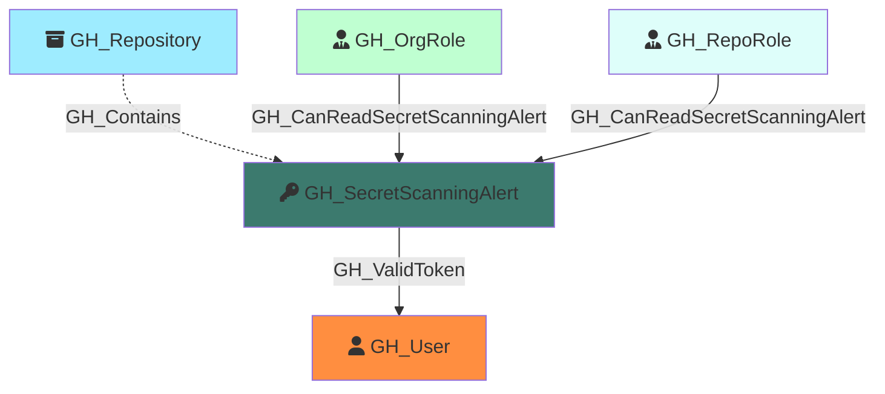

Represents a GitHub secret scanning alert detected in a repository. Secret scanning alerts are raised when GitHub detects a known secret pattern (such as an API key, token, or credential) committed to a repository. The alert captures the secret type, validity status, and current resolution state.

Created by: `Git-HoundSecretScanningAlert`

## Edges

<Note>
The tables below list edges defined by the GitHound extension only. Additional edges to or from this node may be created by other extensions.
</Note>

### Inbound Edges

| Edge Type | Source Node Types |
| --------- | ----------------- |
| [GH_CanReadSecretScanningAlert](/opengraph/extensions/githound/reference/edges/gh_canreadsecretscanningalert) | [GH_OrgRole](/opengraph/extensions/githound/reference/nodes/gh_orgrole), [GH_RepoRole](/opengraph/extensions/githound/reference/nodes/gh_reporole) |
| [GH_Contains](/opengraph/extensions/githound/reference/edges/gh_contains) | [GH_Organization](/opengraph/extensions/githound/reference/nodes/gh_organization), [GH_Repository](/opengraph/extensions/githound/reference/nodes/gh_repository), [GH_Environment](/opengraph/extensions/githound/reference/nodes/gh_environment) |

### Outbound Edges

| Edge Type | Destination Node Types |
| --------- | ---------------------- |
| [GH_ValidToken](/opengraph/extensions/githound/reference/edges/gh_validtoken) | [GH_User](/opengraph/extensions/githound/reference/nodes/gh_user) |

## Properties

| Property Name            | Data Type | Description                                                                                    |
| ------------------------ | --------- | ---------------------------------------------------------------------------------------------- |
| objectid                 | string    | A deterministic Base64-encoded ID derived from the organization, repository, and alert number. |
| id                       | string    | Same as objectid.                                                                              |
| name                     | string    | The alert number.                                                                              |
| repository_name          | string    | The name of the repository where the secret was detected.                                      |
| repository_id            | string    | The node_id of the repository.                                                                 |
| repository_url           | string    | The HTML URL of the repository.                                                                |
| secret_type              | string    | The type of secret detected (e.g., `github_personal_access_token`, `aws_access_key_id`).       |
| secret_type_display_name | string    | A human-readable name for the secret type.                                                     |
| validity                 | string    | The validity status of the detected secret (e.g., `active`, `inactive`, `unknown`).            |
| state                    | string    | The alert state (e.g., `open`, `resolved`).                                                    |
| created_at               | datetime  | When the alert was created.                                                                    |
| updated_at               | datetime  | When the alert was last updated.                                                               |
| url                      | string    | The HTML URL to view the alert on GitHub.                                                      |

## Edges

### Outbound Edges

| Edge Kind                                             | Target Node           | Traversable | Description                                                                                                                      |
| ----------------------------------------------------- | --------------------- | ----------- | -------------------------------------------------------------------------------------------------------------------------------- |
| [GH_ValidToken](../edgedescriptions/gh_validtoken) | [GH_User](/opengraph/extensions/githound/reference/nodes/gh_user) | Yes         | Alert contains a valid, active PAT belonging to this user. Only emitted when the alert is open and the token is confirmed valid. |

### Inbound Edges

| Edge Kind                                                                             | Source Node                                                | Traversable | Description                                                                                                                            |
| ------------------------------------------------------------------------------------- | ---------------------------------------------------------- | ----------- | -------------------------------------------------------------------------------------------------------------------------------------- |
| [GH_Contains](../edgedescriptions/gh_contains)                                     | [GH_Repository](/opengraph/extensions/githound/reference/nodes/gh_repository)                          | No          | Repository contains this secret scanning alert.                                                                                        |
| [GH_CanReadSecretScanningAlert](../edgedescriptions/gh_canreadsecretscanningalert) | [GH_OrgRole](/opengraph/extensions/githound/reference/nodes/gh_orgrole), [GH_RepoRole](/opengraph/extensions/githound/reference/nodes/gh_reporole) | Yes         | Role can read this alert (computed from [GH_ViewSecretScanningAlerts](../edgedescriptions/gh_viewsecretscanningalerts) permission). |

## Diagram

