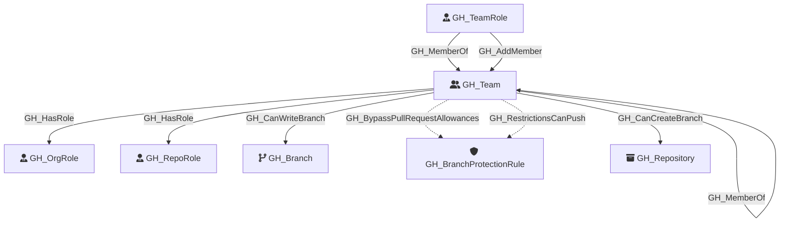

Represents a GitHub team within the organization. Teams can have parent-child relationships, contain members with different roles (Member, Maintainer), and be assigned to repository roles.

Created by: `Git-HoundTeam`

## Edges

<Note>
The tables below list edges defined by the GitHound extension only. Additional edges to or from this node may be created by other extensions.
</Note>

### Inbound Edges

| Edge Type | Source Node Types | Traversable | Description |
| --------- | ----------------- | ----------- | ----------- |
| [GH_AddMember](/opengraph/extensions/githound/reference/edges/gh_addmember) | [GH_TeamRole](/opengraph/extensions/githound/reference/nodes/gh_teamrole) | ✅ | Team role can add members to the team (maintainer privilege) |
| [GH_Contains](/opengraph/extensions/githound/reference/edges/gh_contains) | [GH_Organization](/opengraph/extensions/githound/reference/nodes/gh_organization), [GH_Repository](/opengraph/extensions/githound/reference/nodes/gh_repository), [GH_Environment](/opengraph/extensions/githound/reference/nodes/gh_environment) | ❌ | Container relationship for organizational hierarchy (org contains secrets/variables, repo contains secrets/variables, environment contains secrets/variables) |
| [GH_MemberOf](/opengraph/extensions/githound/reference/edges/gh_memberof) | [GH_TeamRole](/opengraph/extensions/githound/reference/nodes/gh_teamrole), [GH_Team](/opengraph/extensions/githound/reference/nodes/gh_team) | ✅ | Team role is a member of a team, or team is a nested member of a parent team |

### Outbound Edges

| Edge Type | Destination Node Types | Traversable | Description |
| --------- | ---------------------- | ----------- | ----------- |
| [GH_BypassPullRequestAllowances](/opengraph/extensions/githound/reference/edges/gh_bypasspullrequestallowances) | [GH_BranchProtectionRule](/opengraph/extensions/githound/reference/nodes/gh_branchprotectionrule) | ❌ | User or team can bypass pull request requirements on a branch protection rule |
| [GH_CanCreateBranch](/opengraph/extensions/githound/reference/edges/gh_cancreatebranch) | [GH_Repository](/opengraph/extensions/githound/reference/nodes/gh_repository) | ✅ | [Repository - Computed] Role can create new branches in this repository (unprotected branches that bypass the merge gate) |
| [GH_CanWriteBranch](/opengraph/extensions/githound/reference/edges/gh_canwritebranch) | [GH_Branch](/opengraph/extensions/githound/reference/nodes/gh_branch) | ✅ | [Repository - Computed] Role can push to this branch after evaluating branch protection rules, push restrictions, and bypass allowances |
| [GH_HasRole](/opengraph/extensions/githound/reference/edges/gh_hasrole) | [GH_OrgRole](/opengraph/extensions/githound/reference/nodes/gh_orgrole), [GH_RepoRole](/opengraph/extensions/githound/reference/nodes/gh_reporole), [GH_TeamRole](/opengraph/extensions/githound/reference/nodes/gh_teamrole) | ✅ | User or team has a role assignment (org role, team role, or repo role) |
| [GH_MemberOf](/opengraph/extensions/githound/reference/edges/gh_memberof) | [GH_Team](/opengraph/extensions/githound/reference/nodes/gh_team) | ✅ | Team role is a member of a team, or team is a nested member of a parent team |
| [GH_RestrictionsCanPush](/opengraph/extensions/githound/reference/edges/gh_restrictionscanpush) | [GH_BranchProtectionRule](/opengraph/extensions/githound/reference/nodes/gh_branchprotectionrule) | ❌ | User or team is allowed to push to branches protected by this rule |

## Properties

| Property Name    | Data Type | Description                                                               |
| ---------------- | --------- | ------------------------------------------------------------------------- |
| objectid         | string    | The GitHub GraphQL `id` of the team, used as the unique graph identifier. |
| name             | string    | The team's display name, derived from the slug property.                  |
| id               | string    | The GraphQL ID of the team.                                               |
| node_id          | string    | The GitHub node ID. Redundant with objectid.                              |
| slug             | string    | The team's URL-safe slug identifier.                                      |
| description      | string    | The team's description.                                                   |
| privacy          | string    | The team's privacy level (e.g., `visible`, `secret`).                     |
| permission       | string    | The team's default permission on repositories.                            |
| environment_name | string    | The name of the environment (GitHub organization).                        |
| environmentid    | string    | The node_id of the environment (GitHub organization).                     |

## Diagram

