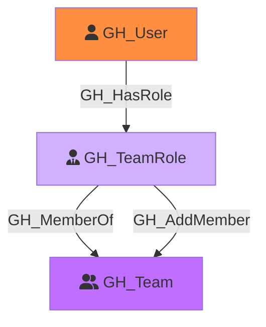

Represents a role within a GitHub team. Each team has two built-in roles: Member and Maintainer. Maintainers can add and remove team members. Team roles connect users to teams and transitively to any repository roles assigned to the team.

Created by: `Git-HoundTeam`

## Edges

<Note>
The tables below list edges defined by the GitHound extension only. Additional edges to or from this node may be created by other extensions.
</Note>

### Inbound Edges

| Edge Type | Source Node Types | Traversable |
| --------- | ----------------- | ----------- |
| [GH_Contains](/opengraph/extensions/githound/reference/edges/gh_contains) | [GH_Organization](/opengraph/extensions/githound/reference/nodes/gh_organization), [GH_Repository](/opengraph/extensions/githound/reference/nodes/gh_repository), [GH_Environment](/opengraph/extensions/githound/reference/nodes/gh_environment) | ❌ |
| [GH_HasRole](/opengraph/extensions/githound/reference/edges/gh_hasrole) | [GH_User](/opengraph/extensions/githound/reference/nodes/gh_user), [GH_Team](/opengraph/extensions/githound/reference/nodes/gh_team) | ✅ |

### Outbound Edges

| Edge Type | Destination Node Types | Traversable |
| --------- | ---------------------- | ----------- |
| [GH_AddMember](/opengraph/extensions/githound/reference/edges/gh_addmember) | [GH_Team](/opengraph/extensions/githound/reference/nodes/gh_team) | ✅ |
| [GH_MemberOf](/opengraph/extensions/githound/reference/edges/gh_memberof) | [GH_Team](/opengraph/extensions/githound/reference/nodes/gh_team) | ✅ |

## Properties

| Property Name    | Data Type | Description                                                                          |
| ---------------- | --------- | ------------------------------------------------------------------------------------ |
| objectid         | string    | A deterministic ID derived from the team ID and role name (e.g., `{teamId}_member`). |
| name             | string    | The fully qualified role name (e.g., `TeamSlug\member`).                             |
| id               | string    | Same as objectid.                                                                    |
| short_name       | string    | The short role name: `member` or `maintainer`.                                       |
| type             | string    | Always `default` for team roles.                                                     |
| environment_name | string    | The name of the environment (GitHub organization).                                   |
| environmentid    | string    | The node_id of the environment (GitHub organization).                                |

## Edges

### Outbound Edges

| Edge Kind                                           | Target Node           | Traversable | Description                                                    |
| --------------------------------------------------- | --------------------- | ----------- | -------------------------------------------------------------- |
| [GH_MemberOf](/opengraph/extensions/githound/reference/edges/gh_memberof)   | [GH_Team](/opengraph/extensions/githound/reference/nodes/gh_team) | Yes         | This role belongs to a team.                                   |
| [GH_AddMember](/opengraph/extensions/githound/reference/edges/gh_addmember) | [GH_Team](/opengraph/extensions/githound/reference/nodes/gh_team) | Yes         | Maintainer role can add members to the team (Maintainer only). |

### Inbound Edges

| Edge Kind                                       | Source Node           | Traversable | Description                           |
| ----------------------------------------------- | --------------------- | ----------- | ------------------------------------- |
| [GH_HasRole](/opengraph/extensions/githound/reference/edges/gh_hasrole) | [GH_User](/opengraph/extensions/githound/reference/nodes/gh_user) | Yes         | A user is assigned to this team role. |

## Diagram

