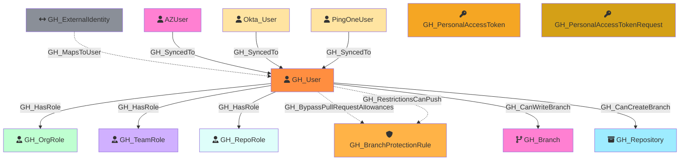

Represents a GitHub user who is a member of the organization. Users are associated with organization roles (Owner or Member) and can be assigned to repository roles and team roles.

Created by: `Git-HoundUser`

## Edges

<Note>
The tables below list edges defined by the GitHound extension only. Additional edges to or from this node may be created by other extensions.
</Note>

### Inbound Edges

| Edge Type | Source Node Types |
| --------- | ----------------- |
| [GH_Contains](/opengraph/extensions/githound/reference/edges/gh_contains) | [GH_Organization](/opengraph/extensions/githound/reference/nodes/gh_organization), [GH_Repository](/opengraph/extensions/githound/reference/nodes/gh_repository), [GH_Environment](/opengraph/extensions/githound/reference/nodes/gh_environment) |
| [GH_MapsToUser](/opengraph/extensions/githound/reference/edges/gh_mapstouser) | [GH_ExternalIdentity](/opengraph/extensions/githound/reference/nodes/gh_externalidentity) |
| [GH_SyncedTo](/opengraph/extensions/githound/reference/edges/gh_syncedto) | [AZUser](https://bloodhound.specterops.io/resources/nodes/az-user), [Okta_User](https://bloodhound.specterops.io/opengraph/extensions/oktahound/references/schema), [PingOneUser](https://github.com/andyrobbins/PingOneHound?tab=readme-ov-file#schema) |
| [GH_ValidToken](/opengraph/extensions/githound/reference/edges/gh_validtoken) | [GH_SecretScanningAlert](/opengraph/extensions/githound/reference/nodes/gh_secretscanningalert) |

### Outbound Edges

| Edge Type | Destination Node Types |
| --------- | ---------------------- |
| [GH_BypassPullRequestAllowances](/opengraph/extensions/githound/reference/edges/gh_bypasspullrequestallowances) | [GH_BranchProtectionRule](/opengraph/extensions/githound/reference/nodes/gh_branchprotectionrule) |
| [GH_CanCreateBranch](/opengraph/extensions/githound/reference/edges/gh_cancreatebranch) | [GH_Repository](/opengraph/extensions/githound/reference/nodes/gh_repository) |
| [GH_CanWriteBranch](/opengraph/extensions/githound/reference/edges/gh_canwritebranch) | [GH_Branch](/opengraph/extensions/githound/reference/nodes/gh_branch) |
| [GH_HasPersonalAccessToken](/opengraph/extensions/githound/reference/edges/gh_haspersonalaccesstoken) | [GH_PersonalAccessToken](/opengraph/extensions/githound/reference/nodes/gh_personalaccesstoken) |
| [GH_HasPersonalAccessTokenRequest](/opengraph/extensions/githound/reference/edges/gh_haspersonalaccesstokenrequest) | [GH_PersonalAccessTokenRequest](/opengraph/extensions/githound/reference/nodes/gh_personalaccesstokenrequest) |
| [GH_HasRole](/opengraph/extensions/githound/reference/edges/gh_hasrole) | [GH_OrgRole](/opengraph/extensions/githound/reference/nodes/gh_orgrole), [GH_RepoRole](/opengraph/extensions/githound/reference/nodes/gh_reporole), [GH_TeamRole](/opengraph/extensions/githound/reference/nodes/gh_teamrole) |
| [GH_RestrictionsCanPush](/opengraph/extensions/githound/reference/edges/gh_restrictionscanpush) | [GH_BranchProtectionRule](/opengraph/extensions/githound/reference/nodes/gh_branchprotectionrule) |

## Properties

| Property Name    | Data Type | Description                                                            |
| ---------------- | --------- | ---------------------------------------------------------------------- |
| objectid         | string    | The GitHub `node_id` of the user, used as the unique graph identifier. |
| name             | string    | The user's display name, derived from the login property.              |
| login            | string    | The user's GitHub login handle.                                        |
| company          | string    | The company listed on the user's profile.                              |
| email            | string    | The user's public email address.                                       |
| full_name        | string    | The user's full name from their profile.                               |
| id               | integer   | The numeric GitHub ID of the user.                                     |
| node_id          | string    | The GitHub GraphQL node ID. Redundant with objectid.                   |
| environment_name | string    | The name of the environment (GitHub organization) the user belongs to. |
| environmentid    | string    | The node_id of the environment (GitHub organization).                  |

## Edges

### Outbound Edges

| Edge Kind                                                                               | Target Node                                           | Traversable | Description                                                                    |
| --------------------------------------------------------------------------------------- | ----------------------------------------------------- | ----------- | ------------------------------------------------------------------------------ |
| [GH_HasRole](../edgedescriptions/gh_hasrole)                                         | [GH_OrgRole](/opengraph/extensions/githound/reference/nodes/gh_orgrole)                           | Yes         | User is assigned to an organization role (Owner or Member).                    |
| [GH_HasRole](../edgedescriptions/gh_hasrole)                                         | [GH_RepoRole](/opengraph/extensions/githound/reference/nodes/gh_reporole)                         | Yes         | User is directly assigned to a repository role (from Git-HoundRepositoryRole). |
| [GH_HasRole](../edgedescriptions/gh_hasrole)                                         | [GH_TeamRole](/opengraph/extensions/githound/reference/nodes/gh_teamrole)                         | Yes         | User has a team role (Member or Maintainer).                                   |
| [GH_BypassPullRequestAllowances](../edgedescriptions/gh_bypasspullrequestallowances) | [GH_BranchProtectionRule](/opengraph/extensions/githound/reference/nodes/gh_branchprotectionrule) | No          | User can bypass PR requirements on this protection rule.                       |
| [GH_RestrictionsCanPush](../edgedescriptions/gh_restrictionscanpush)                 | [GH_BranchProtectionRule](/opengraph/extensions/githound/reference/nodes/gh_branchprotectionrule) | No          | User is allowed to push to branches protected by this rule.                    |
| [GH_CanWriteBranch](../edgedescriptions/gh_canwritebranch)                           | [GH_Branch](/opengraph/extensions/githound/reference/nodes/gh_branch)                             | Yes         | User can push to this branch (computed — per-actor allowance delta).           |
| [GH_CanCreateBranch](../edgedescriptions/gh_cancreatebranch)                         | [GH_Repository](/opengraph/extensions/githound/reference/nodes/gh_repository)                     | Yes         | User can create new branches (computed — per-actor allowance delta).           |

### Inbound Edges

| Edge Kind                                             | Source Node                                   | Traversable | Description                                              |
| ----------------------------------------------------- | --------------------------------------------- | ----------- | -------------------------------------------------------- |
| [GH_MapsToUser](../edgedescriptions/gh_mapstouser) | [GH_ExternalIdentity](/opengraph/extensions/githound/reference/nodes/gh_externalidentity) | No          | An external SAML/SCIM identity maps to this GitHub user. |

> **Note:** The following outbound edges are also created from GH_User when PAT/PAT Request collection is enabled (`-CollectAll`):

| Edge Kind                                                                                   | Target Node                                                       | Traversable | Description                                               |
| ------------------------------------------------------------------------------------------- | ----------------------------------------------------------------- | ----------- | --------------------------------------------------------- |
| [GH_HasPersonalAccessToken](../edgedescriptions/gh_haspersonalaccesstoken)               | [GH_PersonalAccessToken](/opengraph/extensions/githound/reference/nodes/gh_personalaccesstoken)               | No          | User owns a fine-grained PAT granted to the organization. |
| [GH_HasPersonalAccessTokenRequest](../edgedescriptions/gh_haspersonalaccesstokenrequest) | [GH_PersonalAccessTokenRequest](/opengraph/extensions/githound/reference/nodes/gh_personalaccesstokenrequest) | No          | User has a pending PAT request for the organization.      |

## Diagram

