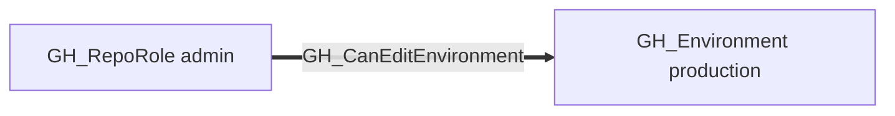

## Edge Schema

Traversable: true

## General Information

The traversable GH_CanEditEnvironment edge indicates that a repository role can modify the configuration of a GitHub environment. In the current model, this edge is emitted for the repository's built-in `admin` role to every environment contained in that repository.

Editing an environment is security-relevant because environment configuration controls deployment protections such as required reviewers, self-review restrictions, wait timers, deployment branch policies, and the "allow administrators to bypass configured protection rules" setting. An attacker who can edit an environment may be able to weaken or remove those controls, making later deployment and secret access paths possible.

This edge is distinct from [GH_CanDeployToEnvironment](/opengraph/extensions/github/edges/gh_candeploytoenvironment):

- **GH_CanEditEnvironment** means the role can manage the environment's settings.
- **[GH_CanDeployToEnvironment](/opengraph/extensions/github/edges/gh_candeploytoenvironment)** means the source satisfies the modeled deployment policy, reviewer gate, or administrator bypass condition for the environment.

