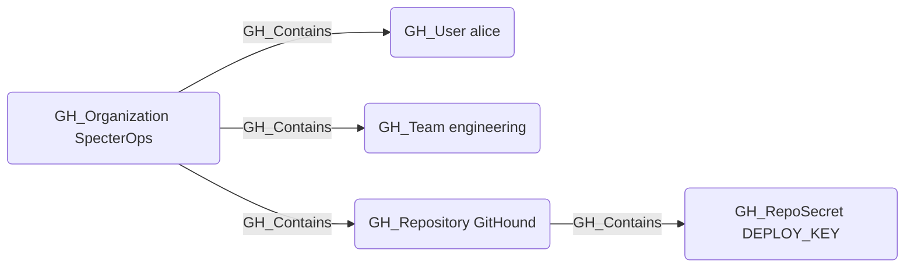

## Edge Schema

- Source: [GH_Organization](/opengraph/extensions/github/nodes/gh_organization), [GH_Repository](/opengraph/extensions/github/nodes/gh_repository), [GH_Environment](/opengraph/extensions/github/nodes/gh_environment)
- Destination: [GH_User](/opengraph/extensions/github/nodes/gh_user), [GH_Team](/opengraph/extensions/github/nodes/gh_team), [GH_Repository](/opengraph/extensions/github/nodes/gh_repository), [GH_OrgRole](/opengraph/extensions/github/nodes/gh_orgrole), [GH_RepoRole](/opengraph/extensions/github/nodes/gh_reporole), [GH_TeamRole](/opengraph/extensions/github/nodes/gh_teamrole), [GH_OrgSecret](/opengraph/extensions/github/nodes/gh_orgsecret), [GH_AppInstallation](/opengraph/extensions/github/nodes/gh_appinstallation), [GH_PersonalAccessToken](/opengraph/extensions/github/nodes/gh_personalaccesstoken), [GH_PersonalAccessTokenRequest](/opengraph/extensions/github/nodes/gh_personalaccesstokenrequest), [GH_RepoSecret](/opengraph/extensions/github/nodes/gh_reposecret), [GH_EnvironmentSecret](/opengraph/extensions/github/nodes/gh_environmentsecret), [GH_SecretScanningAlert](/opengraph/extensions/github/nodes/gh_secretscanningalert)
- Traversable: ❌

## General Information

The non-traversable GH_Contains edge represents structural containment within the GitHub resource hierarchy. The organization serves as the top-level container for users, teams, repositories, roles, secrets, app installations, and personal access tokens. Repositories contain their own repo-level secrets, and environments contain environment-scoped secrets. This edge is created by the collector to establish the organizational hierarchy of GitHub resources and is not traversable because containment alone does not imply privilege escalation.

