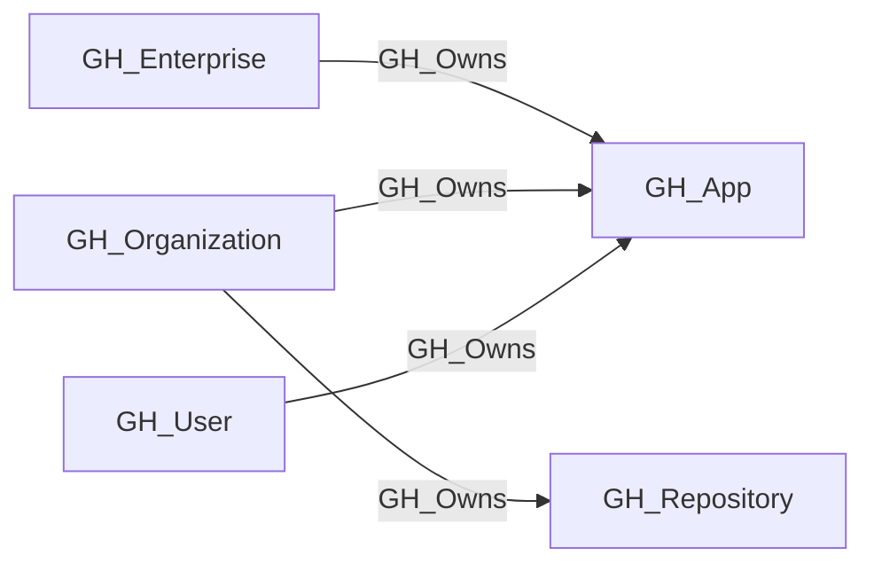

## Edge Schema

- Traversable: ✅

| Source | Destination |
| --- | --- |
| [GH_Enterprise](/opengraph/extensions/github/nodes/gh_enterprise) | [GH_App](/opengraph/extensions/github/nodes/gh_app) |
| [GH_Organization](/opengraph/extensions/github/nodes/gh_organization) | [GH_App](/opengraph/extensions/github/nodes/gh_app) |
| [GH_Organization](/opengraph/extensions/github/nodes/gh_organization) | [GH_Repository](/opengraph/extensions/github/nodes/gh_repository) |
| [GH_User](/opengraph/extensions/github/nodes/gh_user) | [GH_App](/opengraph/extensions/github/nodes/gh_app) |

## General Information

The traversable GH_Owns edge represents that a GitHub account owns an application or repository. For GitHub Apps, ownership identifies the account whose authorized administrators can manage the App registration and credentials. For repositories, ownership links the repository to its organization. These control relationships are traversable for attack-path analysis.

## Diagram

```mermaid
graph LR
    n0["GH_Enterprise"]
    n1["GH_App"]
    n2["GH_Organization"]
    n3["GH_Repository"]
    n4["GH_User"]
    n0 -->|GH_Owns| n1
    n2 -->|GH_Owns| n1
    n2 -->|GH_Owns| n3
    n4 -->|GH_Owns| n1
```
