---
kind: "jamf_ApiClient"
display_name: "API Client"
is_display_kind: true
icon: "user-gear"
color: "#8803FC"
---

Represents an enabled Jamf Pro API client integration. API clients authenticate via OAuth client credentials and hold permissions through assigned API roles. They can perform programmatic actions including policy management, script operations, and self-modification.

## Created by

`process_api_client_nodes` in `lib/preprocess.py`

## Edges

<Note>
The tables below list edges defined by the JamfHound extension only. Additional edges to or from this node may be created by other extensions.
</Note>

### Inbound Edges

| Edge Type | Source Node Types |
| --------- | ----------------- |
| [jamf_Contains](/opengraph/extensions/jamfhound/reference/edges/jamf_contains) | [jamf_Tenant](/opengraph/extensions/jamfhound/reference/nodes/jamf_tenant), [jamf_Site](/opengraph/extensions/jamfhound/reference/nodes/jamf_site) |

### Outbound Edges

| Edge Type | Destination Node Types |
| --------- | ---------------------- |
| [jamf_Create_API_Client_and_Assign_Role](/opengraph/extensions/jamfhound/reference/edges/jamf_create_api_client_and_assign_role) | [jamf_Tenant](/opengraph/extensions/jamfhound/reference/nodes/jamf_tenant) |
| [jamf_Create_API_Client_and_Create_Role](/opengraph/extensions/jamfhound/reference/edges/jamf_create_api_client_and_create_role) | [jamf_Tenant](/opengraph/extensions/jamfhound/reference/nodes/jamf_tenant) |
| [jamf_Create_API_Client_and_Update_Role](/opengraph/extensions/jamfhound/reference/edges/jamf_create_api_client_and_update_role) | [jamf_Tenant](/opengraph/extensions/jamfhound/reference/nodes/jamf_tenant) |
| [jamf_CreateAccounts](/opengraph/extensions/jamfhound/reference/edges/jamf_createaccounts) | [jamf_Tenant](/opengraph/extensions/jamfhound/reference/nodes/jamf_tenant) |
| [jamf_CreateAPIRoles](/opengraph/extensions/jamfhound/reference/edges/jamf_createapiroles) | [jamf_Tenant](/opengraph/extensions/jamfhound/reference/nodes/jamf_tenant) |
| [jamf_CreateComputerExtensions](/opengraph/extensions/jamfhound/reference/edges/jamf_createcomputerextensions) | [jamf_Computer](/opengraph/extensions/jamfhound/reference/nodes/jamf_computer) |
| [jamf_CreatePolicies](/opengraph/extensions/jamfhound/reference/edges/jamf_createpolicies) | [jamf_Computer](/opengraph/extensions/jamfhound/reference/nodes/jamf_computer) |
| [jamf_ScriptsNonTraversable](/opengraph/extensions/jamfhound/reference/edges/jamf_scriptsnontraversable) | [jamf_Tenant](/opengraph/extensions/jamfhound/reference/nodes/jamf_tenant) |
| [jamf_Update_Recurring_Scripts](/opengraph/extensions/jamfhound/reference/edges/jamf_update_recurring_scripts) | [jamf_Computer](/opengraph/extensions/jamfhound/reference/nodes/jamf_computer) |
| [jamf_Update_Roles_Assigned_To_Self](/opengraph/extensions/jamfhound/reference/edges/jamf_update_roles_assigned_to_self) | [jamf_Tenant](/opengraph/extensions/jamfhound/reference/nodes/jamf_tenant) |
| [jamf_Update_Self_and_Assign_Roles](/opengraph/extensions/jamfhound/reference/edges/jamf_update_self_and_assign_roles) | [jamf_Tenant](/opengraph/extensions/jamfhound/reference/nodes/jamf_tenant) |
| [jamf_Update_Self_and_Create_Roles](/opengraph/extensions/jamfhound/reference/edges/jamf_update_self_and_create_roles) | [jamf_Tenant](/opengraph/extensions/jamfhound/reference/nodes/jamf_tenant) |
| [jamf_Update_Self_and_Update_Roles](/opengraph/extensions/jamfhound/reference/edges/jamf_update_self_and_update_roles) | [jamf_Tenant](/opengraph/extensions/jamfhound/reference/nodes/jamf_tenant) |
| [jamf_UpdateAccounts](/opengraph/extensions/jamfhound/reference/edges/jamf_updateaccounts) | [jamf_Tenant](/opengraph/extensions/jamfhound/reference/nodes/jamf_tenant) |
| [jamf_UpdateComputerExtensions](/opengraph/extensions/jamfhound/reference/edges/jamf_updatecomputerextensions) | [jamf_Computer](/opengraph/extensions/jamfhound/reference/nodes/jamf_computer) |
| [jamf_UpdatePolicies](/opengraph/extensions/jamfhound/reference/edges/jamf_updatepolicies) | [jamf_Computer](/opengraph/extensions/jamfhound/reference/nodes/jamf_computer) |

## Properties

| Property Name | Data Type | Description |
|---|---|---|
| displayName | string | Display name of the API client |
| name | string | Name of the API client |
| enabled | boolean | Whether the API client is enabled |
| authorizationScopes | string[] | API roles assigned to this client |
| privileges | string[] | Resolved list of all privileges from assigned roles |
| Tier | integer | Security tier classification |

## Edges

### Outbound Edges

| Edge Kind | Target Node | Traversable | Description |
|---|---|---|---|
| jamf_UpdateAccounts | jamf_Tenant | Yes | Can update accounts |
| jamf_CreateAccounts | jamf_Tenant | Yes | Can create accounts |
| jamf_CreatePolicies | jamf_Computer | Yes | Can create policies for code execution |
| jamf_UpdatePolicies | jamf_Computer | Yes | Can update existing policies |
| jamf_CreateComputerExtensions | jamf_Computer | Yes | Can create computer extension attributes |
| jamf_UpdateComputerExtensions | jamf_Computer | Yes | Can update computer extension attributes |
| jamf_Create_API_Client_and_Create_Role | jamf_Tenant | Yes | Create new client + create role |
| jamf_Create_API_Client_and_Update_Role | jamf_Tenant | Yes | Create new client + update role |
| jamf_Create_API_Client_and_Assign_Role | jamf_Tenant | Yes | Create new client + assign existing role |
| jamf_Update_Self_and_Update_Roles | jamf_Tenant | Yes | Update self + update roles |
| jamf_Update_Self_and_Create_Roles | jamf_Tenant | Yes | Update self + create roles |
| jamf_Update_Self_and_Assign_Roles | jamf_Tenant | Yes | Update self + assign existing roles |
| jamf_CreateAPIRoles | jamf_Tenant | No | Create API roles |
| jamf_Update_Roles_Assigned_To_Self | jamf_Tenant | Yes | Update roles assigned to self |
| jamf_Update_Recurring_Scripts | jamf_Computer | Yes | Update recurring scripts |
| jamf_ScriptsNonTraversable | jamf_Tenant | No | Can create/update scripts |

### Inbound Edges

| Edge Kind | Source Node | Traversable | Description |
|---|---|---|---|
| jamf_Contains | jamf_Tenant | Yes | Contained by tenant |

## Relationship Diagram

> **Note:** Some non-traversable edges have been omitted for clarity. The diagram shows all traversable edges and structurally important non-traversable edges.

```mermaid
flowchart TD
    ApiClient[fa:fa-user-gear jamf_ApiClient]
    Tenant[fa:fa-cloud jamf_Tenant]
    Computer[fa:fa-display jamf_Computer]

    ApiClient -->|jamf_UpdateAccounts| Tenant
    ApiClient -->|jamf_CreateAccounts| Tenant
    ApiClient -->|jamf_CreatePolicies| Computer
    ApiClient -->|jamf_UpdatePolicies| Computer
    ApiClient -->|jamf_CreateComputerExtensions| Computer
    ApiClient -->|jamf_UpdateComputerExtensions| Computer
    ApiClient -->|jamf_Create_API_Client_and_Create_Role| Tenant
    ApiClient -->|jamf_Create_API_Client_and_Update_Role| Tenant
    ApiClient -->|jamf_Create_API_Client_and_Assign_Role| Tenant
    ApiClient -->|jamf_Update_Self_and_Update_Roles| Tenant
    ApiClient -->|jamf_Update_Self_and_Create_Roles| Tenant
    ApiClient -->|jamf_Update_Self_and_Assign_Roles| Tenant
    ApiClient -->|jamf_Update_Roles_Assigned_To_Self| Tenant
    ApiClient -->|jamf_Update_Recurring_Scripts| Computer
    ApiClient -.->|jamf_CreateAPIRoles| Tenant
    ApiClient -.->|jamf_ScriptsNonTraversable| Tenant

    Tenant -->|jamf_Contains| ApiClient

    style ApiClient fill:#8803FC,stroke:#333,stroke-width:3px,color:#fff
    style Tenant fill:#00C08D,stroke:#333,stroke-width:1px,color:#000
    style Computer fill:#D6001C,stroke:#333,stroke-width:1px,color:#fff
```

