Represents an enabled Jamf Pro API client integration. API clients authenticate via OAuth client credentials and hold permissions through assigned API roles. They can perform programmatic actions including policy management, script operations, and self-modification.

## Created by

`process_api_client_nodes` in `lib/preprocess.py`

## Edges

<Note>
The tables below list edges defined by the JamfHound extension only. Additional edges to or from this node may be created by other extensions.
</Note>

### Inbound Edges

| Edge Type | Source Node Types | Traversable | Description |
| --------- | ----------------- | ----------- | ----------- |
| [jamf_Contains](/opengraph/extensions/jamfhound/reference/edges/jamf_contains) | [jamf_Tenant](/opengraph/extensions/jamfhound/reference/nodes/jamf_tenant), [jamf_Site](/opengraph/extensions/jamfhound/reference/nodes/jamf_site) | ✅ | Represents a structural containment relationship where the source node contains the target resource. |

### Outbound Edges

| Edge Type | Destination Node Types | Traversable | Description |
| --------- | ---------------------- | ----------- | ----------- |
| [jamf_Create_API_Client_and_Assign_Role](/opengraph/extensions/jamfhound/reference/edges/jamf_create_api_client_and_assign_role) | [jamf_Tenant](/opengraph/extensions/jamfhound/reference/nodes/jamf_tenant) | ✅ | Represents a privilege escalation path where the source possesses 'Create API Integrations' permission and at least one role exists allowing the creation of new API clients to assume existing role permissions. |
| [jamf_Create_API_Client_and_Create_Role](/opengraph/extensions/jamfhound/reference/edges/jamf_create_api_client_and_create_role) | [jamf_Tenant](/opengraph/extensions/jamfhound/reference/nodes/jamf_tenant) | ✅ | Represents a combined privilege escalation path, where the source possesses the 'Create API Integrations' and 'Create API Roles' permissions, that allow the creation of new API clients with any permissions in newly assigned roles and retrieving API client credentials to authenticate. |
| [jamf_Create_API_Client_and_Update_Role](/opengraph/extensions/jamfhound/reference/edges/jamf_create_api_client_and_update_role) | [jamf_Tenant](/opengraph/extensions/jamfhound/reference/nodes/jamf_tenant) | ✅ | Represents a combined privilege escalation path where the source possesses 'Create API Integrations' and 'Update API Roles' permissions and at least one API role exists allowing the creation of new API clients to assume roles, modifying the permissions of existing roles, and retrieving API client credentials. |
| [jamf_CreateAccounts](/opengraph/extensions/jamfhound/reference/edges/jamf_createaccounts) | [jamf_Tenant](/opengraph/extensions/jamfhound/reference/nodes/jamf_tenant) | ✅ | Represents possession of the 'Create Accounts' JSS Object permission which allows creating new accounts, including administrators, as well as creating new groups with any permissions. |
| [jamf_CreateAPIRoles](/opengraph/extensions/jamfhound/reference/edges/jamf_createapiroles) | [jamf_Tenant](/opengraph/extensions/jamfhound/reference/nodes/jamf_tenant) | ❌ | Represents the ability to create API roles in the JAMF tenant. Non-traversable because creating roles without the ability to create or update API integrations does not provide a credential retrieval mechanism. |
| [jamf_CreateComputerExtensions](/opengraph/extensions/jamfhound/reference/edges/jamf_createcomputerextensions) | [jamf_Computer](/opengraph/extensions/jamfhound/reference/nodes/jamf_computer) | ✅ | Represents the ability to create computer extension attributes which can execute code on all computers in the JAMF tenant. |
| [jamf_CreatePolicies](/opengraph/extensions/jamfhound/reference/edges/jamf_createpolicies) | [jamf_Computer](/opengraph/extensions/jamfhound/reference/nodes/jamf_computer) | ✅ | Represents possession of the 'Create Policies' JSSObject privilege allowing code execution on target computers. |
| [jamf_ScriptsNonTraversable](/opengraph/extensions/jamfhound/reference/edges/jamf_scriptsnontraversable) | [jamf_Tenant](/opengraph/extensions/jamfhound/reference/nodes/jamf_tenant) | ❌ | Represents the ability to create or update scripts on the target. This edge is non-traversable because script creation/modification alone does not enable code execution. |
| [jamf_Update_Recurring_Scripts](/opengraph/extensions/jamfhound/reference/edges/jamf_update_recurring_scripts) | [jamf_Computer](/opengraph/extensions/jamfhound/reference/nodes/jamf_computer) | ✅ | Represents a code execution path where the source has 'Update Scripts' JSSObject permission and there are scripts configured to run repeatedly on target computers via enabled policies allowing code execution. |
| [jamf_Update_Roles_Assigned_To_Self](/opengraph/extensions/jamfhound/reference/edges/jamf_update_roles_assigned_to_self) | [jamf_Tenant](/opengraph/extensions/jamfhound/reference/nodes/jamf_tenant) | ✅ | Represents an API client possessing the 'Update API Roles' permission which allows updating existing API roles with any permissions, including roles assigned to itself. |
| [jamf_Update_Self_and_Assign_Roles](/opengraph/extensions/jamfhound/reference/edges/jamf_update_self_and_assign_roles) | [jamf_Tenant](/opengraph/extensions/jamfhound/reference/nodes/jamf_tenant) | ✅ | Represents an API client that possesses 'Update API Integrations' permission and at least one role exists, allowing the client to assume the permissions of existing roles. |
| [jamf_Update_Self_and_Create_Roles](/opengraph/extensions/jamfhound/reference/edges/jamf_update_self_and_create_roles) | [jamf_Tenant](/opengraph/extensions/jamfhound/reference/nodes/jamf_tenant) | ✅ | Represents an API client that possesses 'Update API Integrations' and 'Create API Roles' permissions, allowing the client to assign new roles with any included permissions. |
| [jamf_Update_Self_and_Update_Roles](/opengraph/extensions/jamfhound/reference/edges/jamf_update_self_and_update_roles) | [jamf_Tenant](/opengraph/extensions/jamfhound/reference/nodes/jamf_tenant) | ✅ | Represents an API client that possesses 'Update API Integrations' and 'Update API Roles' permissions and at least one role exists, allowing the client to assign any permissions by modifying existing roles. |
| [jamf_Update_SSO_Settings](/opengraph/extensions/jamfhound/reference/edges/jamf_update_sso_settings) | [jamf_SSOIntegration](/opengraph/extensions/jamfhound/reference/nodes/jamf_ssointegration), [jamf_Account](/opengraph/extensions/jamfhound/reference/nodes/jamf_account), [jamf_DisabledAccount](/opengraph/extensions/jamfhound/reference/nodes/jamf_disabledaccount), [jamf_Group](/opengraph/extensions/jamfhound/reference/nodes/jamf_group) | ✅ | Represents the ability to update or enable SSO settings in the tenant to change authentication to inherit the privileges of JAMF accounts and groups. |
| [jamf_UpdateAccounts](/opengraph/extensions/jamfhound/reference/edges/jamf_updateaccounts) | [jamf_Tenant](/opengraph/extensions/jamfhound/reference/nodes/jamf_tenant) | ✅ | Represents possession of the 'Update Accounts' JSS Object permission which allows altering the passwords, enabled status, permissions, and memberships of existing accounts or groups. |
| [jamf_UpdateComputerExtensions](/opengraph/extensions/jamfhound/reference/edges/jamf_updatecomputerextensions) | [jamf_Computer](/opengraph/extensions/jamfhound/reference/nodes/jamf_computer) | ✅ | Represents the ability to update existing computer extension attributes and at least one extension attribute exists, allowing execution of code on all computers in the JAMF tenant during inventory collection. |
| [jamf_UpdatePolicies](/opengraph/extensions/jamfhound/reference/edges/jamf_updatepolicies) | [jamf_Computer](/opengraph/extensions/jamfhound/reference/nodes/jamf_computer) | ✅ | Represents possession of the 'Update Policies' JSSObject privilege and at least one policy already exists in the tenant, allowing modification of existing policies for code execution on target computers. |

## Properties

| Property Name | Data Type | Description |
|---|---|---|
| displayName | string | Display name of the API client |
| name | string | Name of the API client |
| enabled | boolean | Whether the API client is enabled |
| authorizationScopes | string[] | API roles assigned to this client |
| privileges | string[] | Resolved list of all privileges from assigned roles |
| Tier | integer | Security tier classification |

## Relationship Diagram

> **Note:** Some non-traversable edges have been omitted for clarity. The diagram shows all traversable edges and structurally important non-traversable edges.

```mermaid
flowchart TD
    ApiClient[fa:fa-user-gear jamf_ApiClient]
    Tenant[fa:fa-cloud jamf_Tenant]
    Computer[fa:fa-display jamf_Computer]

    ApiClient -->|jamf_UpdateAccounts| Tenant
    ApiClient -->|jamf_CreateAccounts| Tenant
    ApiClient -->|jamf_CreatePolicies| Computer
    ApiClient -->|jamf_UpdatePolicies| Computer
    ApiClient -->|jamf_CreateComputerExtensions| Computer
    ApiClient -->|jamf_UpdateComputerExtensions| Computer
    ApiClient -->|jamf_Create_API_Client_and_Create_Role| Tenant
    ApiClient -->|jamf_Create_API_Client_and_Update_Role| Tenant
    ApiClient -->|jamf_Create_API_Client_and_Assign_Role| Tenant
    ApiClient -->|jamf_Update_Self_and_Update_Roles| Tenant
    ApiClient -->|jamf_Update_Self_and_Create_Roles| Tenant
    ApiClient -->|jamf_Update_Self_and_Assign_Roles| Tenant
    ApiClient -->|jamf_Update_Roles_Assigned_To_Self| Tenant
    ApiClient -->|jamf_Update_Recurring_Scripts| Computer
    ApiClient -.->|jamf_CreateAPIRoles| Tenant
    ApiClient -.->|jamf_ScriptsNonTraversable| Tenant

    Tenant -->|jamf_Contains| ApiClient

    style ApiClient fill:#8803FC,stroke:#333,stroke-width:3px,color:#fff
    style Tenant fill:#00C08D,stroke:#333,stroke-width:1px,color:#000
    style Computer fill:#D6001C,stroke:#333,stroke-width:1px,color:#fff
```

