Represents a computer managed by Jamf Pro. Computers are the primary target resources for policy execution, script deployment, and MDM management commands.

## Created by

`process_computer_nodes` in `lib/preprocess.py`

## Edges

<Note>
The tables below list edges defined by the JamfHound extension only. Additional edges to or from this node may be created by other extensions.
</Note>

### Inbound Edges

| Edge Type | Source Node Types | Traversable | Description |
| --------- | ----------------- | ----------- | ----------- |
| [jamf_Contains](/opengraph/extensions/jamfhound/reference/edges/jamf_contains) | [jamf_Tenant](/opengraph/extensions/jamfhound/reference/nodes/jamf_tenant), [jamf_Site](/opengraph/extensions/jamfhound/reference/nodes/jamf_site) | ✅ | Represents a structural containment relationship where the source node contains the target resource. |
| [jamf_CreateComputerExtensions](/opengraph/extensions/jamfhound/reference/edges/jamf_createcomputerextensions) | [jamf_Account](/opengraph/extensions/jamfhound/reference/nodes/jamf_account), [jamf_DisabledAccount](/opengraph/extensions/jamfhound/reference/nodes/jamf_disabledaccount), [jamf_Group](/opengraph/extensions/jamfhound/reference/nodes/jamf_group), [jamf_ApiClient](/opengraph/extensions/jamfhound/reference/nodes/jamf_apiclient), [jamf_DisabledApiClient](/opengraph/extensions/jamfhound/reference/nodes/jamf_disabledapiclient) | ✅ | Represents the ability to create computer extension attributes which can execute code on all computers in the JAMF tenant. |
| [jamf_CreatePolicies](/opengraph/extensions/jamfhound/reference/edges/jamf_createpolicies) | [jamf_Account](/opengraph/extensions/jamfhound/reference/nodes/jamf_account), [jamf_DisabledAccount](/opengraph/extensions/jamfhound/reference/nodes/jamf_disabledaccount), [jamf_Group](/opengraph/extensions/jamfhound/reference/nodes/jamf_group), [jamf_ApiClient](/opengraph/extensions/jamfhound/reference/nodes/jamf_apiclient), [jamf_DisabledApiClient](/opengraph/extensions/jamfhound/reference/nodes/jamf_disabledapiclient) | ✅ | Represents possession of the 'Create Policies' JSSObject privilege allowing code execution on target computers. |
| [jamf_Update_Recurring_Scripts](/opengraph/extensions/jamfhound/reference/edges/jamf_update_recurring_scripts) | [jamf_Account](/opengraph/extensions/jamfhound/reference/nodes/jamf_account), [jamf_DisabledAccount](/opengraph/extensions/jamfhound/reference/nodes/jamf_disabledaccount), [jamf_Group](/opengraph/extensions/jamfhound/reference/nodes/jamf_group), [jamf_ApiClient](/opengraph/extensions/jamfhound/reference/nodes/jamf_apiclient), [jamf_DisabledApiClient](/opengraph/extensions/jamfhound/reference/nodes/jamf_disabledapiclient) | ✅ | Represents a code execution path where the source has 'Update Scripts' JSSObject permission and there are scripts configured to run repeatedly on target computers via enabled policies allowing code execution. |
| [jamf_UpdateComputerExtensions](/opengraph/extensions/jamfhound/reference/edges/jamf_updatecomputerextensions) | [jamf_Account](/opengraph/extensions/jamfhound/reference/nodes/jamf_account), [jamf_DisabledAccount](/opengraph/extensions/jamfhound/reference/nodes/jamf_disabledaccount), [jamf_Group](/opengraph/extensions/jamfhound/reference/nodes/jamf_group), [jamf_ApiClient](/opengraph/extensions/jamfhound/reference/nodes/jamf_apiclient), [jamf_DisabledApiClient](/opengraph/extensions/jamfhound/reference/nodes/jamf_disabledapiclient) | ✅ | Represents the ability to update existing computer extension attributes and at least one extension attribute exists, allowing execution of code on all computers in the JAMF tenant during inventory collection. |
| [jamf_UpdatePolicies](/opengraph/extensions/jamfhound/reference/edges/jamf_updatepolicies) | [jamf_Account](/opengraph/extensions/jamfhound/reference/nodes/jamf_account), [jamf_DisabledAccount](/opengraph/extensions/jamfhound/reference/nodes/jamf_disabledaccount), [jamf_Group](/opengraph/extensions/jamfhound/reference/nodes/jamf_group), [jamf_ApiClient](/opengraph/extensions/jamfhound/reference/nodes/jamf_apiclient), [jamf_DisabledApiClient](/opengraph/extensions/jamfhound/reference/nodes/jamf_disabledapiclient) | ✅ | Represents possession of the 'Update Policies' JSSObject privilege and at least one policy already exists in the tenant, allowing modification of existing policies for code execution on target computers. |

### Outbound Edges

| Edge Type | Destination Node Types | Traversable | Description |
| --------- | ---------------------- | ----------- | ----------- |
| [jamf_AssignedUser](/opengraph/extensions/jamfhound/reference/edges/jamf_assigneduser) | [jamf_ComputerUser](/opengraph/extensions/jamfhound/reference/nodes/jamf_computeruser) | ✅ | Represents the user assignment relationship on a JAMF-managed computer. |
| [jamf_Okta_Same_Device](/opengraph/extensions/jamfhound/reference/edges/jamf_okta_same_device) | [OktaDevice](https://github.com/SpecterOps/OktaHound/blob/main/Documentation/NodeDescriptions/Okta_Device.md) | ✅ | Represents a hybrid cross-platform device correlation where the JAMF Pro registered computer's UDID matches the registered device UDID in Okta. |

## Properties

| Property Name | Data Type | Description |
|---|---|---|
| displayname | string | Display name of the computer |
| name | string | Computer name |
| objectid | string | Unique identifier (UDID) |
| managed | boolean | Whether the computer is managed |
| make | string | Hardware manufacturer |
| mdm_capable | boolean | Whether the computer supports MDM |
| model | string | Hardware model |
| enrolled_via_dep | boolean | Enrolled via Device Enrollment Program |
| user_approved_enrollment | boolean | Whether enrollment was user-approved |
| user_approved_mdm | boolean | Whether MDM was user-approved |
| device_aad_infos | string | Azure AD device information |
| siteID | integer | ID of the site the computer belongs to |
| sitename | string | Name of the site |
| username | string | Assigned username |
| email_address | string | Assigned user email |
| os_name | string | Operating system name |
| os_version | string | Operating system version |
| os_build | string | Operating system build |
| serial_number | string | Hardware serial number |
| udid | string | Unique Device Identifier |
| uuid | string | Universal Unique Identifier |
| supervised | boolean | Whether the device is supervised |
| sip_status | string | System Integrity Protection status |
| firewall_enabled | boolean | Whether the firewall is enabled |
| gatekeeper_status | string | Gatekeeper status |
| ip_address | string | IP address |
| is_apple_silicon | boolean | Whether the device uses Apple Silicon |
| last_contact_time_utc | datetime | Last check-in time |
| jamf_version | string | Jamf agent version |
| filevault2_users | string | FileVault 2 enabled users |
| local_accounts | string | Local user accounts |
| Tier | integer | Security tier classification |

## Relationship Diagram

```mermaid
flowchart TD
    Computer[fa:fa-display jamf_Computer]
    Tenant[fa:fa-cloud jamf_Tenant]
    Site[fa:fa-circle-nodes jamf_Site]
    Account[fa:fa-circle-user jamf_Account]
    DisabledAccount[fa:fa-circle-user jamf_DisabledAccount]
    Group[fa:fa-people-group jamf_Group]
    ApiClient[fa:fa-user-gear jamf_ApiClient]
    DisabledApiClient[fa:fa-user-gear jamf_DisabledApiClient]
    ComputerUser[fa:fa-circle-user jamf_ComputerUser]
    OktaDevice[fa:fa-mobile-screen OktaDevice]

    Computer -->|jamf_AssignedUser| ComputerUser
    Computer -->|jamf_Okta_Same_Device| OktaDevice

    Tenant -->|jamf_Contains| Computer
    Site -->|jamf_Contains| Computer
    Account -->|jamf_CreatePolicies| Computer
    DisabledAccount -->|jamf_CreatePolicies| Computer
    Group -->|jamf_CreatePolicies| Computer
    ApiClient -->|jamf_CreatePolicies| Computer
    DisabledApiClient -->|jamf_CreatePolicies| Computer
    Account -->|jamf_UpdatePolicies| Computer
    Group -->|jamf_UpdatePolicies| Computer
    ApiClient -->|jamf_UpdatePolicies| Computer
    Account -->|jamf_CreateComputerExtensions| Computer
    Group -->|jamf_CreateComputerExtensions| Computer
    ApiClient -->|jamf_CreateComputerExtensions| Computer
    Account -->|jamf_UpdateComputerExtensions| Computer
    Group -->|jamf_UpdateComputerExtensions| Computer
    ApiClient -->|jamf_UpdateComputerExtensions| Computer
    Account -->|jamf_Update_Recurring_Scripts| Computer
    Group -->|jamf_Update_Recurring_Scripts| Computer
    ApiClient -->|jamf_Update_Recurring_Scripts| Computer

    style Computer fill:#D6001C,stroke:#333,stroke-width:3px,color:#fff
    style Tenant fill:#00C08D,stroke:#333,stroke-width:1px,color:#000
    style Site fill:#D67500,stroke:#333,stroke-width:1px,color:#000
    style Account fill:#0098BB,stroke:#333,stroke-width:1px,color:#000
    style DisabledAccount fill:#909090,stroke:#333,stroke-width:1px,color:#000
    style Group fill:#F0FC03,stroke:#333,stroke-width:1px,color:#000
    style ApiClient fill:#8803FC,stroke:#333,stroke-width:1px,color:#fff
    style DisabledApiClient fill:#909090,stroke:#333,stroke-width:1px,color:#000
    style ComputerUser fill:#FC03A5,stroke:#333,stroke-width:1px,color:#000
    style OktaDevice fill:#007DC1,stroke:#333,stroke-width:1px,color:#fff
```

